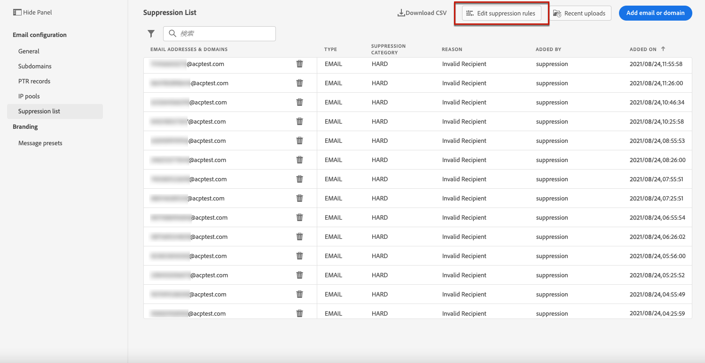
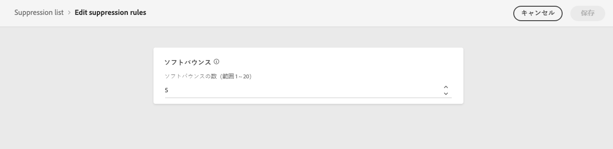

# 再試行 {#retries}

一時的な&#x200B;**ソフトバウンス**&#x200B;エラーが原因で電子メールメッセージが失敗した場合は、いくつかの再試行が実行されます。 エラーが 1 つ発生すると、エラーカウンターを 1 つ増やします。このカウンターがしきい値の制限に達すると、アドレスが抑制リストに追加されます。

>[!NOTE]
>
>エラーのタイプについて詳しくは、[配信エラーのタイプ](../suppression-list.md#delivery-failures)の節を参照してください。

デフォルトの設定では、しきい値はエラー5に設定されています。

* 同じ配信で、[再試行期間](#retry-duration)内で5回目にエラーが発生した場合、アドレスは抑制されます。

* 配信が異なり、2つのエラーが少なくとも24時間間隔で発生した場合、エラーカウンターは各エラーで増加し、アドレスも5回目の試行で抑制されます。

再試行後に配信が成功すると、そのアドレスのエラーカウンターは初期化されます。

デフォルト値の5がニーズに合わない場合は、次の手順に従ってエラーしきい値を変更できます。

1. **[!UICONTROL チャネル]** > **[!UICONTROL Eメール設定]** > **[!UICONTROL 抑制リスト]**&#x200B;に移動します。

1. 「**[!UICONTROL 抑制ルールを編集]**」ボタンを選択します。

   

1. 必要に応じて、連続するソフトバウンスの許可数を編集します。

   

   1 ～ 20の整数値を入力する必要があります。つまり、再試行の回数の最小値は1で、最大値は20です。

   >[!CAUTION]
   >
   >値が10を超えると、配信品質のレピュテーションの問題、ISPによるIPのスロットリングやブロックリストに加えるが発生する可能性があります。 [配信品質の詳細を説明します](../deliverability.md)

<!---->

<!--The minimum delay between retries and the maximum number of retries to be performed are based on how well an IP is performing, both historically and currently, at a given domain.-->

## 再試行期間 {#retry-duration}

**再試行期間**&#x200B;は、一時的なエラーまたはソフトバウンスが発生した配信のEメールメッセージを再試行する期間です。

デフォルトでは、メッセージが電子メールキューに追加されてから3.5日&#x200B;**（または** 84時間&#x200B;**）再試行が実行されます。**

ただし、不要になったときに再試行が実行されないようにするには、Eメールチャネルに適用する[メッセージプリセット](message-presets.md)を作成または編集する際に、必要に応じてこの設定を変更します。

例えば、パスワードのリセットに関連し、1日のみ有効なリンクを含むトランザクションEメールの再試行期間を24時間に設定できます。 同様に、真夜中のセールの場合は、再試行期間を6時間に設定する必要があります。

>[!NOTE]
>
>再試行期間は84時間を超えることはできません。 最小再試行期間は、マーケティングEメールの場合は6時間、トランザクションEメールの場合は10分です。

[この節](message-presets.md#create-message-preset)でメッセージプリセットを作成する際のEメールの再試行パラメーターの調整方法を説明します。

<!--After 3.5 days, any message in the retry queue will be removed from the queue and sent back as a bounce.-->

<!--Once a message has been in the retry queue for a maximum of 3.5 days and has failed to deliver, it will time out and its status will be updated to Failed??-->