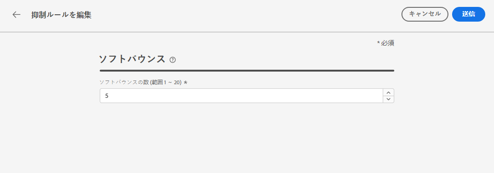

# 再試行 {#retries}

一時的な&#x200B;**ソフトバウンス**&#x200B;エラーが原因でメールメッセージの送信に失敗した場合は、再試行が数回実行されます。エラーが 1 つ発生すると、エラーカウンターを 1 つ増やします。このカウンターがしきい値の制限に達すると、アドレスが抑制リストに追加されます。

>[!NOTE]
>
>エラーのタイプについて詳しくは、[配信失敗のタイプ](../messages/suppression-list.md#delivery-failures)の節を参照してください。

デフォルト設定では、しきい値は 5 回のエラーに設定されています。

* 同じ配信で[再試行期間](#retry-duration)内に 5 回目のエラーが発生した場合、そのアドレスは抑制されます。

* 異なる配信で 2 つのエラーが 24 時間以上の間隔で発生した場合は、エラーが発生するたびにエラーカウンターが増加し、5 回目の試行失敗で、やはりアドレスが抑制されます。

再試行後に配信が成功すると、そのアドレスのエラーカウンターは再初期化されます。

デフォルト値の 5 がニーズに合わない場合は、次の手順に従ってエラーのしきい値を変更できます。

1. **[!UICONTROL チャネル]**／**[!UICONTROL メール設定]**／**[!UICONTROL 抑制リスト]**&#x200B;に移動します。

1. 「**[!UICONTROL 抑制ルールを編集]**」ボタンを選択します。

   

1. 必要に応じて、連続するソフトバウンスの許容数を編集します。

   

   1～20 の整数値を入力する必要があります。つまり、再試行の最小回数は 1 で、最大回数は 20 です。

   >[!CAUTION]
   >
   >値が 10 を超えると、配信品質の評価の問題や、IP スロットル、ISP によるブロックリストへの登録などにつながる可能性があります。 [配信品質の詳細](../messages/deliverability.md)

## 再試行期間 {#retry-duration}

**再試行期間**&#x200B;は、一時的なエラーまたはソフトバウンスが発生した配信のメールメッセージを再試行する期間です。

デフォルトでは、メッセージがメールキューに追加されてから **3.5 日**（**84 時間**）の間、再試行が実行されます。

ただし、不要になったときに再試行がそれ以上実行されないようにするために、メールチャネルに適用する[メッセージプリセット](message-presets.md)を作成または編集する際に、必要に応じてこの設定を変更できます。

例えば、1 日のみ有効なリンクを含むパスワードリセットに関するトランザクションメールの場合は、再試行期間を 24 時間に設定できます。同様に、真夜中のセールの場合は、再試行期間を 6 時間に設定するとよいでしょう。

>[!NOTE]
>
>再試行期間は 84 時間を超えることはできません。 再試行期間の下限は、マーケティングメールの場合は 6 時間、トランザクションメールの場合は 10 分です。

メッセージプリセットの作成時にメール再試行パラメーターを調整する方法については、[この節](message-presets.md#create-message-preset)を参照してください。

