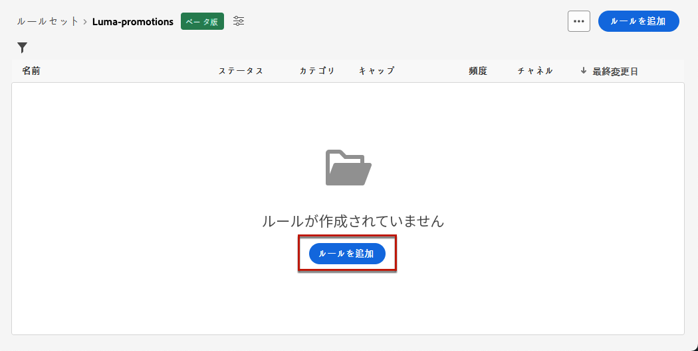

# ルールセットの操作 {#rule-sets}

>[!CONTEXTUALHELP]
>id="ajo_business_rules_rule_sets"
>title="ルールセット"
>abstract="ルールセットを使用して、様々なタイプのマーケティングコミュニケーションにフリークエンシーキャップを適用します。 例えば、顧客に送信する&#x200B;**プロモーション情報**&#x200B;の数を制限するルールセットを作成する一方で、顧客に送信する&#x200B;**ニュースレター**&#x200B;の数を制限する別のルールセットを作成できます。"

>[!AVAILABILITY]
>
>現在、ルールセットは、選択したユーザーのみがベータ版として使用できます。 ベータ版に含めるには、Adobeの担当者にお問い合わせください。

## ルールセットとは {#what}

ルールセットを使用すると、1 つまたは複数のチャネルをまたいでユーザーがメッセージを受信する回数を制限するグローバルビジネスルールに加えて、次のことができます **複数のルールをルールセットにまとめる** 選択したキャンペーンに適用します。 これにより、メッセージの受信頻度を通信のタイプに応じて制御する精度が向上します。

例えば、ルールセットを作成して、の数を制限できます **プロモーション情報** は、の数を制限するために顧客および別のルールセットに送信しました **ニュースレター** がを彼らに送信しました。 作成するキャンペーンのタイプに応じて、プロモーションの通信かニュースレターのルールセットのどちらかを適用するかを選択できます。

## グローバルルールセットとカスタムルールセット {#global-custom}

からルールセットに初めてアクセスする場合 **[!UICONTROL 管理]** > **[!UICONTROL ビジネスルール（ベータ版）]** メニューを選択すると、デフォルトのルールセットが事前に作成されてアクティブになります。 **グローバルなデフォルトのルールセット**.

このルールセットには、現在のビジネスルールの動作と同様に、ユーザーが 1 つまたは複数のチャネルにわたってメッセージを受信する頻度を制御するために適用できるグローバルルールが含まれています。 このルールセットで定義されたすべてのルールは、通信がジャーニーとキャンペーンのどちらから送信されたかに関わらず、選択されたすべてのチャネルに適用されます。 [ビジネスルールの操作方法を学ぶ](frequency-rules.md)

この「グローバルデフォルトルールセット」ルールセットに加えて、以下を作成できます **カスタムルール** キャンペーン内で送信されるメッセージの数を制限するために、任意のキャンペーンに適用できるセット。 [カスタムルールセットの作成方法を学ぶ](#create)

>[!IMPORTANT]
>
>現時点では、カスタムのルールセットをに適用できます **キャンペーン** のみ。 「グローバルデフォルトルールセット」ルールセットで定義されたルールのみが、ジャーニーとキャンペーンの通信の両方に適用されます。

## 最初のカスタムルールセットを作成 {#create-rule-set}

### ルールセットの作成 {#create}

ルールセットを作成するには、次の手順に従います。

>[!NOTE]
>
>最大 3 つのカスタムルールセットを作成できます。

1. **[!UICONTROL ルールセット]**&#x200B;のリストにアクセスし、「**[!UICONTROL ルールセットを作成]**」をクリックします。

   

1. ルールセット名を定義し、必要に応じて説明を追加して、「**[!UICONTROL 保存]**」をクリックします。

   

   >[!NOTE]
   >
   >ルールセット名は一意にする必要があります。

1. 次の操作が可能になりました [ルールの定義](#create-new-rule) このルールセットに追加します。

### ルールセットへのルールの追加 {#create-new-rule}

>[!CONTEXTUALHELP]
>id="ajo_rule_sets_category"
>title="メッセージルールカテゴリの選択"
>abstract="アクティブ化してメッセージに適用すると、選択したカテゴリに一致するすべての頻度ルールがこのメッセージに自動的に適用されます。現在、マーケティングカテゴリのみが使用可能です。"

>[!CONTEXTUALHELP]
>id="ajo_rule_sets_capping"
>title="ルールのキャッピングの設定"
>abstract="選択した時間枠内に顧客プロファイルに送信されるメッセージの最大数を指定します。フリークエンシーキャップは、選択したカレンダー期間に基づき、対応する時間枠の開始時にリセットされます。"

>[!CONTEXTUALHELP]
>id="ajo_rule_sets_channel"
>title="ルールを適用するチャネルの定義"
>abstract="少なくとも 1 つのチャネルを選択します。キャッピングは、チャネル間で合計カウントとして適用されます。"

>[!CONTEXTUALHELP]
>id="ajo_rule_sets_duration"
>title="メッセージルールカテゴリの選択"
>abstract="アクティブ化してメッセージに適用すると、選択したカテゴリに一致するすべての頻度ルールがこのメッセージに自動的に適用されます。現在、マーケティングカテゴリのみが使用可能です。"

ルールセットにルールを追加するには、次の手順に従います。

1. 作成したルールセットで、「**[!UICONTROL ルールを追加]**」をクリックします。

   

1. 一意のの定義 **ルール名**.

1. この **カテゴリ** フィールドは、ルールが適用されるメッセージのカテゴリを指定します。 現時点では、このフィールドは、 **[!UICONTROL Marketing]** カテゴリを使用できます。

1. から **[!UICONTROL 期間]** ドロップダウンリストで、キャッピングを毎月、毎週、毎日に適用するかどうかを選択します。 フリークエンシーキャップは、選択したカレンダーの期間に基づきます。対応する時間枠の開始時にリセットされます。

   

   各期間のカウンターの有効期限は次のとおりです。

   * **[!UICONTROL 毎月]**：フリークエンシーキャップは、その月の最終日の 23:59:59 UTC まで有効です。例えば、1 月の月次有効期限は 1/31 23:59:59 UTC です。

   * **[!UICONTROL 毎週]**：フリークエンシーキャップは、暦週が日曜日に始まるため、その週の土曜日 23:59:59 UTC まで有効です。有効期限は、ルールの作成に関係なく設定されます。例えば、木曜日にルールが作成された場合、このルールは土曜日の 23:59:59 まで有効です。

   * **[!UICONTROL 毎日]**：日別のフリークエンシーキャップは、その日の 23:59:59 UTC まで有効で、翌日の開始とともに 0 にリセットされます。

     >[!CAUTION]
     >
     >日別のフリークエンシーキャップの精度を確保するには、[ストリーミングセグメント化](https://experienceleague.adobe.com/docs/experience-platform/segmentation/ui/streaming-segmentation.html?lang=ja){target="_blank"}の使用が必須です。オーディエンスの評価方法について詳しくは、[この節](../audience/about-audiences.md#evaluation-method-in-journey-optimizer)を参照してください。

   通信が配信されると、プロファイルカウンターの値が更新されることに注意してください。 大量の通信を送信する場合は、スループットが高いと、通信の開始から数分または数時間後に受信者にメールが届く可能性があるので（同時に数百万の通信を送信する場合）、この点に注意してください。

   これは、受信者が 2 つの通信を近接して受信する場合に重要です。 受信者が通信を受信するのに十分な時間と、それに応じてカウンター値を更新できるように、通信の間隔を可能な限り 2 時間以上空けることをお勧めします。

1. ルールのキャッピングを設定します。これは、上記の選択に応じて、毎月、毎週または毎日、個々のユーザープロファイルに送信できるメッセージの最大数を意味します。

1. このルールに使用するチャネルを「**[!UICONTROL メール]**」、「**[!UICONTROL SMS]**」、「**[!UICONTROL プッシュ通知]**」または「**[!UICONTROL ダイレクトメール]**」から選択します。

   

   >[!NOTE]
   >
   >ルールを作成するためには、少なくとも 1 つのチャネルを選択する必要があります。

1. 選択したすべてのチャネルに対して合計数としてキャッピングを適用する場合は、複数のチャネルを選択します。

   例えば、キャップを 5 に設定し、メールチャネルと SMS チャネルの両方を選択します。プロファイルが既に 3 件のマーケティングメールと 5 件のマーケティング SMS を受信している場合、このプロファイルは、次に配信されるマーケティングメールまたは SMS の対象から除外されます。

1. 「**[!UICONTROL 保存]**」をクリックして、ルールの作成を確定します。メッセージが、**[!UICONTROL ドラフト]**&#x200B;ステータスでルールリストに追加されます。

   

1. 上記の手順を繰り返して、必要な数のルールをルールセットに追加します。

次に、メッセージに適用する前に、各ルールをアクティブ化する必要があります。[詳細情報](#activate-rule)

### ルールとルールセットのアクティブ化 {#activate-rule}

作成時、ルールは&#x200B;**[!UICONTROL ドラフト]**&#x200B;ステータスになり、まだメッセージには影響を与えません。ルールを有効にするには、ルールの横にある「**[!UICONTROL その他のアクション]**」ボタンをクリックし、「**[!UICONTROL アクティブ化]**」を選択します。

また、キャンペーン／ジャーニーでルールセットにアクセスし、メッセージに適用できるようにするには、ルールセットもアクティブ化する必要があります。

>[!NOTE]
>
>ルールまたはルールセットが完全にアクティブ化されるまでに、最大 10 分かかる場合があります。ルールを有効にするために、メッセージを変更したり、ジャーニーを再公開したりする必要はありません。

<!--Currently, once a rule set is activated, no more rules can be added to that rule set.-->

ルールまたはルールセットを非アクティブ化するには、目的の項目の横にある「**[!UICONTROL その他のアクション]**」ボタンをクリックし、「**[!UICONTROL 非アクティブ化]**」を選択します。

ステータスは&#x200B;**[!UICONTROL 非アクティブ]**&#x200B;に変わり、今後のメッセージの実行にはルールが適用されません。現在実行中のメッセージは影響を受けません。

>[!NOTE]
>
>ルールまたはルールセットを非アクティブ化しても、個々のプロファイルのカウントは影響を受けず、リセットされません。

## ルールセットへのアクセスと管理 {#access-rule-sets}

作成されたすべてのルールセットはに表示されます **[!UICONTROL 管理]** > **[!UICONTROL ビジネスルール（ベータ版）]** メニュー。 最終変更日順に並べ替えられています。

ルールセット名をクリックし、そのコンテンツを表示および編集します。そのルールセットに含まれるすべてのルールが一覧表示されます。 右上のコンテキストメニューでは、次のことが可能です。

* ルールセットの名前と説明を編集する
* ルールセットをアクティベートする – [詳細情報](#activate-rule)
* ルールセットを削除する

ルールセットに含まれるルールごとに、「**[!UICONTROL その他のアクション]**」ボタンを使用して次のことを行えます。

* ルールを編集する
* ルールをアクティベートする[詳細情報](#activate-rule)
* ルールを定義する

<!--### Permissions{#permissions-frequency-rules}

To access, create, edit or delete message frequency rules, you must have the **[!UICONTROL Manage frequency rules]** permission. 

Users with the **[!UICONTROL View frequency rules]** permission are able to view rules, but not to modify or delete them.

Learn more about permissions in [this section](../administration/high-low-permissions.md).-->

## メッセージへのルールセットの適用 {#apply-frequency-rule}

メッセージにビジネス・ルールを適用するには、次の手順に従います。

1. [キャンペーン](../campaigns/create-campaign.md)の作成時、ルールセットに定義したチャネルの 1 つを選択し、メッセージのコンテンツを編集します。

1. コンテンツ編集画面で、「**[!UICONTROL ビジネスルールを追加]**」ボタンをクリックします。

1. [作成したルールセット](#create-rule-set)を選択します。

   

   >[!NOTE]
   >
   >[アクティブ化](#activate-rule)したルールセットのみがリストに表示されます。

   <!--Messages where the category selected is **[!UICONTROL Transactional]** will not be evaluated against business rules.-->

1. キャンペーンをアクティブ化する前に、少なくとも 10 分後に実行をスケジュールしてください。

   これにより、選択したビジネスルールのプロファイルのカウンター値を入力するのに十分な時間を確保できます。 キャンペーンをすぐにアクティブ化すると、ルールセットカウンターの値が受信者のプロファイルに入力されず、カスタムルールセットのフリークエンシーキャッピングルールに対してメッセージがカウントされません。

   

1. [グローバルレポート](../reports/global-report.md)および[ライブレポート](../reports/live-report.md)では、配信から除外されたプロファイルの数を確認でき、配信から除外されたユーザーの理由として考えられる頻度ルールが一覧表示されます。

>[!NOTE]
>
>複数のルールを同じチャネルに適用できますが、下限に達すると、プロファイルは次の配信から除外されます。

<!--
## Example: combine several rules {#frequency-rule-example}

You can combine several message frequency rules, such as described in the example below.

1. [Create a rule](#create-new-rule) called *Overall Marketing Capping*:

   * Select all channels.
   * Set capping to 12 monthly.

   

1. To further restrict the number of marketing-based push notifications that a user is sent, create a second rule called *Push Marketing Cap*:

   * Select Push channel.
   * Set capping to 4 monthly.

   

1. Save and [activate](#activate-rule) the rule.

1. [Create a message](../building-journeys/journeys-message.md) for every channel you want to communicate through and select the **[!UICONTROL Marketing]** category for each message. [Learn how to apply a frequency rule](#apply-frequency-rule)

   

In this scenario, an individual profile:
* can receive up to 12 marketing messages per month;
* but will be excluded from marketing push notifications after they have received 4 push notifications.-->

プロファイルのフリークエンシーキャップに達すると、次の期間までカウンターをリセットする方法はないので、頻度ルールをテストする場合は、新しく作成した[テストプロファイル](../audience/creating-test-profiles.md)を使用することをお勧めします。ルールを非アクティブ化すると、上限を設定されたプロファイルがメッセージを受け取ることはできますが、カウンターの増分は削除されません。
