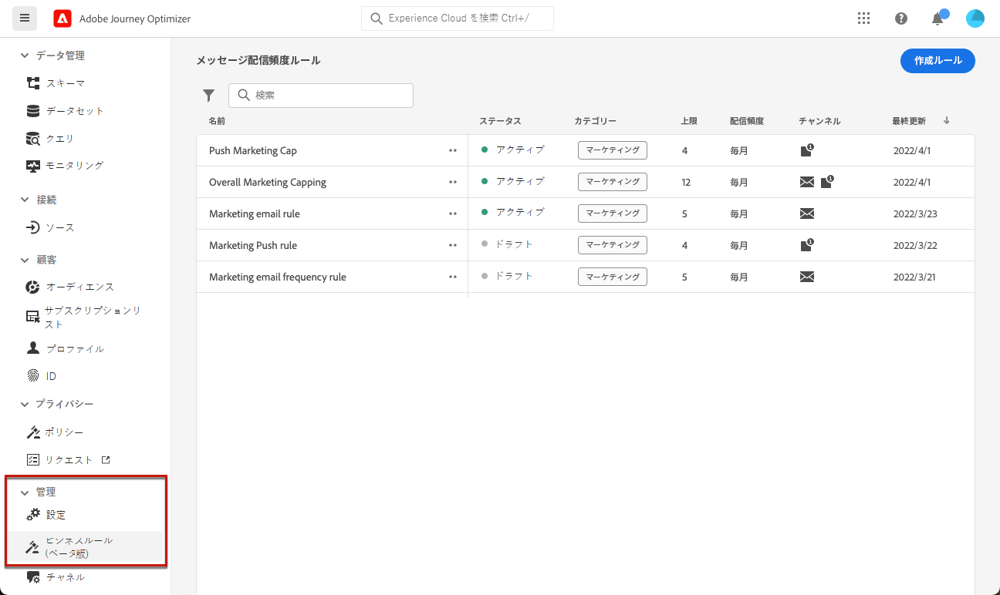
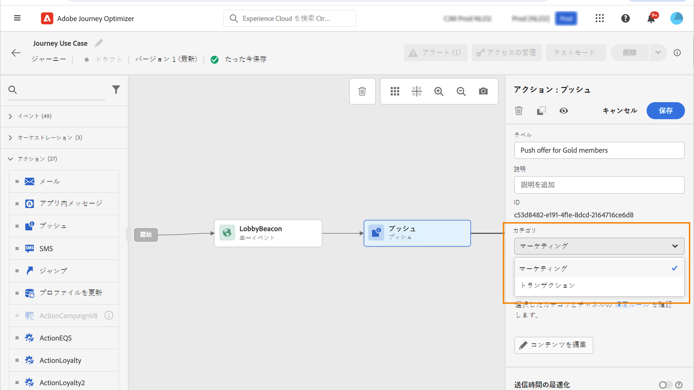

# ルールセットの操作 {#rule-sets}

>[!CONTEXTUALHELP]
>id="ajo_business_rules_rule_sets"
>title="ルールセット"
>abstract="ルール セットを使用して、様々な種類のアドビからのお知らせにフリークエンシーキャップを適用します。例えば、顧客に送信する&#x200B;**プロモーション情報**&#x200B;の数を制限するルールセットを作成する一方で、顧客に送信する&#x200B;**ニュースレター**&#x200B;の数を制限する別のルールセットを作成できます。"

>[!AVAILABILITY]
>
>ルールセットは現在、一部のユーザーのみを対象としたベータ版として提供されています。ベータ版に参加するには、アドビの担当者にお問い合わせください。

## ルールセットの基本を学ぶ {#gs}

### ルールセットとは {#what}

1 つまたは複数のチャネルでユーザーがメッセージを受け取る回数を制限するグローバルビジネスルールに加えて、ルールセットを使用して **複数のルールをルールセットにまとめて** 選択したキャンペーンに適用できます。 これにより、通信の種類に応じてユーザーがメッセージを受信する頻度をより細かく制御できるようになります。

例えば、顧客に送信する&#x200B;**プロモーション情報**&#x200B;の数を制限するルールセットを作成したり、顧客に送信する&#x200B;**ニュースレター**&#x200B;の数を制限する別のルールセットを作成したりできます。作成するキャンペーンの種類に応じて、プロモーション情報またはニュースレターのルールセットのいずれかを適用することを選択できます。

➡️ [この機能をビデオで確認](#video)

### グローバルおよびカスタムルールセット {#global-custom}

**[!UICONTROL 管理]**／**[!UICONTROL ビジネスルール（ベータ版）]**&#x200B;メニューから初めてルールセットにアクセスすると、デフォルトのルールセット（**グローバルデフォルトルールセット**）が事前に作成され、アクティブになります。

このルールセットには、現在のビジネスルールの動作と同様に、ユーザーが 1 つまたは複数のチャネルでメッセージを受信する頻度を制御するために適用できるグローバルルールが含まれています。このルールセットで定義されたすべてのルールは、コミュニケーションがジャーニーから送信されるかキャンペーンから送信されるかに関係なく、選択されたすべてのチャネルに適用されます。[ビジネルルールの操作方法を学ぶ](frequency-rules.md)

この「グローバルデフォルトルールセット」ルールセットに加えて、**カスタムルール**&#x200B;セットを作成すると、任意のキャンペーンに適用して、そのキャンペーン内で送信されるメッセージの数を制限できます。[カスタムルールセットの作成方法を学ぶ](#create)

>[!IMPORTANT]
>
>現時点で、カスタムルールセットは&#x200B;**キャンペーン**&#x200B;にのみ適用できます。「グローバルデフォルトルールセット」ルールセットで定義されたルールのみが、ジャーニーとキャンペーンのコミュニケーションの両方に適用されます。

### チャネルとジャーニーのキャッピングルール {#domain}

ルールセットを作成する際に、ルールセット内のルールが通信チャネルまたはジャーニーに固有のキャッピングルールを適用するかどうかを指定する必要があります。

そのためには、ルールセットの作成時にチャネルまたはジャーニードメインを選択します。 [ ルールセットの作成方法を学ぶ ]

* **チャネル** ドメイン：通信チャネルのキャッピングルールを適用します。 例えば、1 日に 1 件を超えるメールまたは SMS 通信を送信しないでください。
* **ジャーニー** ドメイン：ジャーニーにエントリキャッピングルールと同時実行キャッピングルールを適用します。 例えば、プロファイルを複数のジャーニーに同時に入力しないでください。

## 最初のカスタムルールセットの作成 {#create-rule-set}

### ルールセットを作成し、そのドメインを選択します {#create}

ルールセットを作成するには、次の手順に従います。

>[!NOTE]
>
>最大 3 つのカスタムルールセットを作成できます。

1. **[!UICONTROL ルールセット]**&#x200B;のリストにアクセスし、「**[!UICONTROL ルールセットを作成]**」をクリックします。

   

1. ルールセットに一意の名前を定義し、説明を追加します。

1. ルールセットのドメインを選択します。 ドメインを使用すると、通信チャネルまたはジャーニーに固有のキャッピングルールをルールセットに含めるかどうかを指定できます。

   * **チャネル**：通信チャネルのキャッピングルールを適用します。 例えば、1 日に 1 件を超えるメールまたは SMS 通信を送信しないでください。
   * **ジャーニー**: ジャーニーにエントリキャッピングルールと同時実行キャッピングルールを適用します。 例えば、プロファイルを複数のジャーニーに同時に入力しないでください。

   

1. 「**[!UICONTROL 保存]**」をクリックします。

1. これで、このルールセットに追加する[ルールを定義](#create-new-rule)できます。

### ルールセットへのルールの追加 {#create-new-rule}

>[!CONTEXTUALHELP]
>id="ajo_rule_sets_category"
>title="メッセージルールカテゴリの選択"
>abstract="アクティブ化してメッセージに適用すると、選択したカテゴリに一致するすべての頻度ルールがこのメッセージに自動的に適用されます。現在、マーケティングカテゴリのみが使用可能です。"

>[!CONTEXTUALHELP]
>id="ajo_rule_sets_capping"
>title="ルールのキャッピングの設定"
>abstract="選択した時間枠内に顧客プロファイルに送信されるメッセージの最大数を指定します。フリークエンシーキャップは、選択したカレンダー期間に基づき、対応する時間枠の開始時にリセットされます。"

>[!CONTEXTUALHELP]
>id="ajo_rule_sets_channel"
>title="ルールを適用するチャネルの定義"
>abstract="少なくとも 1 つのチャネルを選択します。キャッピングは、チャネル間で合計カウントとして適用されます。"

>[!CONTEXTUALHELP]
>id="ajo_rule_sets_duration"
>title="メッセージルールカテゴリの選択"
>abstract="アクティブ化してメッセージに適用すると、選択したカテゴリに一致するすべての頻度ルールがこのメッセージに自動的に適用されます。現在、マーケティングカテゴリのみが使用可能です。"

ルールセットにルールを追加するには、ルールセットにアクセスして、「**[!UICONTROL ルールを追加]**」をクリックします。

ルールに使用できるパラメーターは、作成時に選択したルールセットドメインによって異なります。

+++チャネルキャッピングルールの設定（**Channel** ドメイン）

1. ルールの一意の名前を定義します。

1. **カテゴリ**&#x200B;フィールドでは、ルールが適用されるメッセージのカテゴリを指定します。現時点では、**[!UICONTROL マーケティング]**&#x200B;カテゴリのみ使用できるので、このフィールドは読み取り専用です。

1. **[!UICONTROL 期間]**&#x200B;ドロップダウンリストから、キャッピングを毎月、毎週、毎日のいずれの頻度で適用するかを選択します。フリークエンシーキャップは、選択したカレンダーの期間に基づきます。対応する時間枠の開始時にリセットされます。

   

   各期間のカウンターの有効期限は次のとおりです。

   * **[!UICONTROL 毎月]**：フリークエンシーキャップは、その月の最終日の 23:59:59 UTC まで有効です。例えば、1 月の月次有効期限は 1/31 23:59:59 UTC です。

   * **[!UICONTROL 毎週]**：フリークエンシーキャップは、暦週が日曜日に始まるため、その週の土曜日 23:59:59 UTC まで有効です。有効期限は、ルールの作成に関係なく設定されます。例えば、木曜日にルールが作成された場合、このルールは土曜日の 23:59:59 まで有効です。

   * **[!UICONTROL 毎日]**：日別のフリークエンシーキャップは、その日の 23:59:59 UTC まで有効で、翌日の開始とともに 0 にリセットされます。

     >[!CAUTION]
     >
     >日別のフリークエンシーキャップの精度を確保するには、[ストリーミングセグメント化](https://experienceleague.adobe.com/docs/experience-platform/segmentation/ui/streaming-segmentation.html?lang=ja){target="_blank"}の使用が必須です。オーディエンスの評価方法について詳しくは、[この節](../audience/about-audiences.md#evaluation-method-in-journey-optimizer)を参照してください。

   通信が配信されると、プロファイルカウンターの値が更新されることに注意してください。大量の通信を送信する場合は、スループットに応じて、通信の開始から数分または数時間後に受信者にメールが届く可能性があるので（同時に数百万の通信を送信する場合）、この点に注意してください。

   これは、受信者が 2 つの通信を近接して受信する場合に重要です。受信者が通信を受信し、それに応じてカウンター値を更新できるように、通信の間隔を可能な限り 2 時間以上空けることをお勧めします。

1. ルールのキャッピングを設定します。これは、上記の選択に応じて、毎月、毎週または毎日、個々のユーザープロファイルに送信できるメッセージの最大数を意味します。

1. このルールに使用するチャネルを「**[!UICONTROL メール]**」、「**[!UICONTROL SMS]**」、「**[!UICONTROL プッシュ通知]**」または「**[!UICONTROL ダイレクトメール]**」から選択します。

   >[!NOTE]
   >
   >ルールを作成するためには、少なくとも 1 つのチャネルを選択する必要があります。

1. 選択したすべてのチャネルに対して合計数としてキャッピングを適用する場合は、複数のチャネルを選択します。

   例えば、キャップを 5 に設定し、メールチャネルと SMS チャネルの両方を選択します。プロファイルが既に 3 件のマーケティングメールと 5 件のマーケティング SMS を受信している場合、このプロファイルは、次に配信されるマーケティングメールまたは SMS の対象から除外されます。

+++

+++ジャーニーキャッピングルールの設定（**ジャーニー** ドメイン）

1. ルールの一意の名前を指定します。

1. **[!UICONTROL ルールタイプ]** ドロップダウンリストで、ルールのキャッピングのタイプを指定します。

   * **[!UICONTROL ジャーニーエントリの上限]**: プロファイルに対して指定された期間にジャーニーにエントリするエントリ数を制限します。
   * **[!UICONTROL ジャーニー同時実行性の上限]**：プロファイルを同時に登録できるジャーニーの数を制限します。

1. ジャーニーのキャッピングルールを設定する方法について詳しくは、[ジャーニーのキャッピングと判別 ](../test-approve/journey-capping.md) の節を参照してください。

+++

1. 「**[!UICONTROL 保存]**」をクリックして、ルールの作成を確定します。メッセージが、**[!UICONTROL ドラフト]**&#x200B;ステータスでルールリストに追加されます。

   

1. 上記の手順を繰り返して、必要な数のルールをルールセットに追加します。

次に、メッセージに適用する前に、各ルールをアクティブ化する必要があります。[詳細情報](#activate-rule)

### ルールとルールセットのアクティブ化 {#activate-rule}

作成時、ルールは&#x200B;**[!UICONTROL ドラフト]**&#x200B;ステータスになり、まだメッセージには影響を与えません。ルールを有効にするには、ルールの横にある「**[!UICONTROL その他のアクション]**」ボタンをクリックし、「**[!UICONTROL アクティブ化]**」を選択します。

また、キャンペーン／ジャーニーでルールセットにアクセスし、メッセージに適用できるようにするには、ルールセットもアクティブ化する必要があります。

>[!NOTE]
>
>ルールまたはルールセットが完全にアクティブ化されるまでに、最大 10 分かかる場合があります。ルールを有効にするために、メッセージを変更したり、ジャーニーを再公開したりする必要はありません。

<!--Currently, once a rule set is activated, no more rules can be added to that rule set.-->

ルールまたはルールセットを非アクティブ化するには、目的の項目の横にある「**[!UICONTROL その他のアクション]**」ボタンをクリックし、「**[!UICONTROL 非アクティブ化]**」を選択します。

ステータスは&#x200B;**[!UICONTROL 非アクティブ]**&#x200B;に変わり、今後のメッセージの実行にはルールが適用されません。現在実行中のメッセージは影響を受けません。

>[!NOTE]
>
>ルールまたはルールセットを非アクティブ化しても、個々のプロファイルのカウントは影響を受けず、リセットされません。

## ルールセットへのアクセスと管理 {#access-rule-sets}

作成されたすべてのルールセットは、**[!UICONTROL 管理]**／**[!UICONTROL ビジネスルール（ベータ版）]**&#x200B;メニューに表示されます。最終変更日順に並べ替えられています。

ルールセット名をクリックし、そのコンテンツを表示および編集します。そのルールセットに含まれるすべてのルールが一覧表示されます。右上のコンテキストメニューでは、次のことが可能です。

* ルールセットの名前と説明を編集する
* ルールセットをアクティベートする – [詳細情報](#activate-rule)
* ルールセットを削除する

ルールセットに含まれるルールごとに、「**[!UICONTROL その他のアクション]**」ボタンを使用して次のことを行えます。

* ルールを編集する
* ルールをアクティベートする[詳細情報](#activate-rule)
* ルールを定義する

<!--### Permissions{#permissions-frequency-rules}

To access, create, edit or delete message frequency rules, you must have the **[!UICONTROL Manage frequency rules]** permission. 

Users with the **[!UICONTROL View frequency rules]** permission are able to view rules, but not to modify or delete them.

Learn more about permissions in [this section](../administration/high-low-permissions.md).-->

## メッセージまたはジャーニーへのルールセットの適用 {#apply-frequency-rule}

ルールセットの作成時に選択したドメインに応じて、ルールセットをメッセージまたはジャーニーに適用できます。 詳しくは、以下のセクションを展開してください。

+++ メッセージにルールセットを適用する

1. [キャンペーン](../campaigns/create-campaign.md)の作成時、ルールセットに定義したチャネルの 1 つを選択し、メッセージのコンテンツを編集します。

1. コンテンツ編集画面で、「**[!UICONTROL ビジネスルールを追加]**」ボタンをクリックします。

1. [作成したルールセット](#create-rule-set)を選択します。

   

   >[!NOTE]
   >
   >[アクティブ化](#activate-rule)したルールセットのみがリストに表示されます。

   <!--Messages where the category selected is **[!UICONTROL Transactional]** will not be evaluated against business rules.-->

1. キャンペーンをアクティブ化する前に、実行は少なくとも 10 分後にスケジュールしてください。

   これにより、選択したビジネスルールのプロファイルのカウンター値を入力する十分な時間を確保できます。キャンペーンをすぐにアクティブ化すると、ルールセットカウンターの値が受信者のプロファイルに入力されず、メッセージがカスタムルール セットのフリークエンシーキャップルールにカウントされません。

   

1. 配信から除外されたプロファイルの数を [Customer Journey Analyticsレポート ](../reports/report-gs-cja.md) および [ ライブレポート ](../reports/live-report.md) で確認でき、配信から除外されたユーザーの理由として考えられる頻度ルールが一覧表示されます。

>[!NOTE]
>
>複数のルールを同じチャネルに適用できますが、下限に達すると、プロファイルは次の配信から除外されます。

<!--
## Example: combine several rules {#frequency-rule-example}

You can combine several message frequency rules, such as described in the example below.

1. [Create a rule](#create-new-rule) called *Overall Marketing Capping*:

   * Select all channels.
   * Set capping to 12 monthly.

   

1. To further restrict the number of marketing-based push notifications that a user is sent, create a second rule called *Push Marketing Cap*:

   * Select Push channel.
   * Set capping to 4 monthly.

   

1. Save and [activate](#activate-rule) the rule.

1. [Create a message](../building-journeys/journeys-message.md) for every channel you want to communicate through and select the **[!UICONTROL Marketing]** category for each message. [Learn how to apply a frequency rule](#apply-frequency-rule)

   

In this scenario, an individual profile:
* can receive up to 12 marketing messages per month;
* but will be excluded from marketing push notifications after they have received 4 push notifications.-->

プロファイルのフリークエンシーキャップに達すると、次の期間までカウンターをリセットする方法はないので、頻度ルールをテストする場合は、新しく作成した[テストプロファイル](../audience/creating-test-profiles.md)を使用することをお勧めします。ルールを非アクティブ化すると、上限を設定されたプロファイルがメッセージを受け取ることはできますが、カウンターの増分は削除されません。

+++

+++ ジャーニーへのルールセットの適用

キャッピングルールをジャーニーに適用するには、ジャーニーにアクセスしてプロパティを開きます。 **[!UICONTROL キャッピングルール]** ドロップダウンで、関連するルールセットを選択します。

>[!IMPORTANT]
>
>ジャーニーがすぐにアクティブ化された場合、システムが顧客の抑制を開始するまで最大 15 分かかる場合があります。 この可能性を防ぐために、少なくとも 15 分後にジャーニーを開始するようにスケジュールできます。

+++

## チュートリアルビデオ {#video}

>[!VIDEO](https://video.tv.adobe.com/v/3435531?quality=12)
