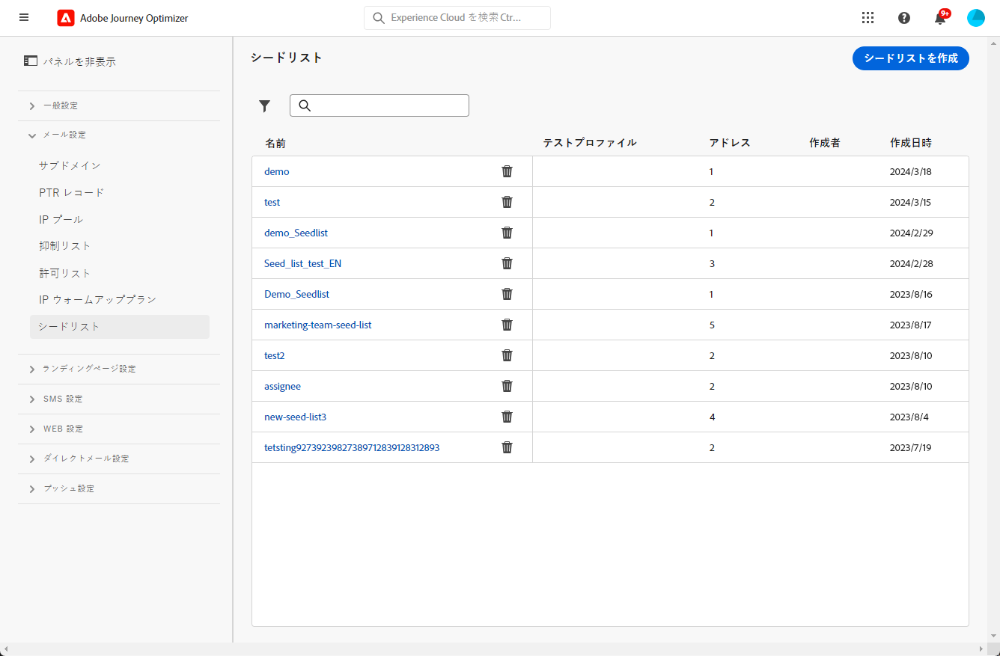

# シードリストの使用 {#seed-lists}

[!DNL Journey Optimizer] のシードリストを使用すると、配信に特定のシードアドレスを自動的に含めることができます。

>[!CAUTION]
>
>現在、この機能はメールチャネルにのみ適用されます。

シードアドレスは、定義されたターゲット条件に合わないターゲット受信者に使用されます。この方法により、配信範囲外の受信者も、他のターゲット受信者と同様に配信を受け取ることができます。

シードアドレスにはプロファイルの詳細が含まれていないので、実際のプロファイルでもテストプロファイルでもありません。これらは、システムに保存されている内部関係者に属する受信者のみです。これらは、特定のキャンペーンまたはジャーニーで選択すると、配信の実行時に含まれます。つまり、保証の目的で配信のコピーを受信することになります。

* 顧客と同時に同じ条件で配信を受信することで、シードリストを使用すると、送信されたメールのコピーを監視して、すべての表示形式、画像、リンクが正しいことを確認できるだけでなく、受信者に送信された実際のメッセージを追跡することもできます。

  例：

+++ マーケティングマネージャーの場合：

  すべてのチームメンバーが顧客と同時に送信済みメッセージのコピーを受信できるようにしたいと考えています。これにより、チームは、実行前の予定どおりに、期待されたレイアウト、アクティブな URL、正しいテキストと画像を使用してメッセージが送信されることを確認できます。

+++

+++ 製品所有者の場合：

  顧客に送信された実際のメッセージを追跡する必要があります。実際、チームやリーダーが一部のキャンペーンに興味を持っている可能性があり、配信時にメッセージのコピーを受信するためにアドホックで追加する必要があります。

+++

* シードリストを使用する別の理由に、メーリングリストの保護があります。メーリングリストにシードアドレスを挿入すると、メーリングリストに送信された配信をシードアドレスが受信できるので、第三者によってメーリングリストが使用されているかどうかを知ることができます。

>[!NOTE]
>
>多言語バリアントや実験バリアントなどのバリアントがサポートされています。各シードアドレスは、同じメッセージのすべてのバリアント（例：[コンテンツ実験](../content-management/get-started-experiment.md)から得られる様々なバージョン）のコピーを 1 つだけ受け取ります。条件付きコンテンツについては、別個のシードメールは送信されないことに注意してください。

## シードリストへのアクセス {#access-seed-lists}

作成済みのシードリストにアクセスするには、**[!UICONTROL 管理]**／**[!UICONTROL チャネル]**／**[!UICONTROL メール設定]**&#x200B;に移動し、「**[!UICONTROL シードリスト]**」を選択します。

<!--
>[!CAUTION]
>
>Permissions to view, export and manage the seed lists are restricted to [Journey Administrators](../administration/ootb-product-profiles.md#journey-administrator). Learn more on managing [!DNL Journey Optimizer] users' access rights in [this section](../administration/permissions-overview.md).-->

>[!CAUTION]
>
>シードリストを表示、編集、管理できるようにするには、**[!UICONTROL シードリストを管理]**&#x200B;権限が必要です。

シードリストは、名前で検索したり、リストを作成したユーザーや作成日に対してフィルタリングしたりできます。選択したら、リストの上部に表示されているフィルターをクリアできます。

エントリを完全に削除するには、「**[!UICONTROL 削除]**」ボタンを使用します。

>[!CAUTION]
>
>アクティブな[キャンペーン](../campaigns/review-activate-campaign.md)や[ジャーニー](../building-journeys/publishing-the-journey.md)で使用されているシードリストは削除できません。キャンペーン／ジャーニーを非アクティブ化するか、シードリストが選択されていない別の設定を使用するように編集する必要があります。[詳しくは、シードリストの使用を参照してください](#use-seed-list)

シードリスト名をクリックすると、編集できます。<!--Use the **[!UICONTROL Edit]** button to edit a seed list.-->

## シードリストの作成 {#create-seed-list}

>[!CONTEXTUALHELP]
>id="ajo_seed_list_details"
>title="シードリストの定義"
>abstract="シードリストを使用して、保証の目的で特定の内部アドレスを配信オーディエンスに自動的に追加します。シードリストを使用すると、送信されたメッセージのコピーを監視して、すべての表示要素が正しいことを確認し、メーリングリストを保護できます。現在、この機能はメールチャネルにのみ適用されます。"
>additional-url="https://experienceleague.adobe.com/docs/journey-optimizer/using/configuration/seed-lists.html?lang=ja#use-seed-list" text="シードリストとは"

>[!CONTEXTUALHELP]
>id="ajo_seed_addresses"
>title="シードリストへの入力"
>abstract="配信の実行時に含まれ、メッセージの正確なコピーを受信するアドレスを選択します。CSV ファイルを読み込むか、メールアドレスを手動で入力できます。"

シードリストを作成するには、次の手順に従います。

1. **[!UICONTROL 管理]**／**[!UICONTROL チャネル]**／**[!UICONTROL メール設定]**／**[!UICONTROL シードリスト]**&#x200B;メニューにアクセスします。

1. 「**[!UICONTROL シードリストを作成]**」ボタンを選択します。

   

1. 詳細を入力します。最初に、名前を追加します。

   

   >[!NOTE]
   >
   >名前は文字（A～Z）で始め、英数字または特殊文字（_、.、-）のみを使用してください。

1. チャネルを選択します。現在、メールチャネルのみが使用可能です。

1. テストプロファイルを選択します。シードアドレスにはプロファイルの詳細が含まれないので、このテストプロファイルは、シードアドレスに送信されるメッセージにパーソナライゼーションデータを表示する目的でのみ使用されます。

   >[!NOTE]
   >
   >一度に 1 つのテストプロファイルのみ選択できます。

1. 配信先のシードアドレスを追加します。CSV ファイルを読み込むか、メールアドレスを手動で入力できます。

   

   >[!NOTE]
   >
   >両方のオプションを組み合わせることができますが、シードリスト内のアドレスの総数は 50 を超えることはできません。

1. 「**[!UICONTROL 作成]**」をクリックして確定します。新しく作成されたシードリストが[シードリスト画面](#access-seed-lists)に表示されます。

## キャンペーンまたはジャーニーでのシードリストの使用 {#use-seed-list}

シードリストが作成されたので、任意のキャンペーンまたはジャーニーで使用して、対応するシードアドレスを配信に含めることができます。これを行うには、以下の手順に従います。

>[!CAUTION]
>
>シードアドレスに送信されたメッセージは、ジャーニーレポートやキャンペーンレポートに含まれません。

1. 設定を作成し、**[!UICONTROL メール]**&#x200B;チャネルを選択します。[詳細情報](../email/email-settings.md)

1. 目的のシードリストを[対応するセクション](../email/email-settings.md#seed-list)で選択します。

   >[!NOTE]
   >
   >一度に選択できるシードリストは 1 つのみです。

   

1. 設定を送信します。

1. [キャンペーン](../campaigns/create-campaign.md)または[ジャーニー](../building-journeys/journey-gs.md)を作成します。

1. **[!UICONTROL メール]**&#x200B;アクションを選択し、関連性のあるシードリストを含む[設定](channel-surfaces.md)を選択します。

   

1. [キャンペーン](../campaigns/review-activate-campaign.md)をアクティベートするか、[ジャーニー](../building-journeys/publishing-the-journey.md)を公開します。

これで、キャンペーンやジャーニーを通じてメールメッセージが顧客に送信されるたびに、選択したシードリストのメールアドレスも、同じ条件で同時に、ターゲット受信者と同じコンテンツで受信します。

>[!NOTE]
>
>繰り返しのジャーニーの場合、少なくとも 1 つのプロファイルがメールノードに到達していれば、ジャーニーの実行ごとにシードアドレスにメール配信が送信されます。
