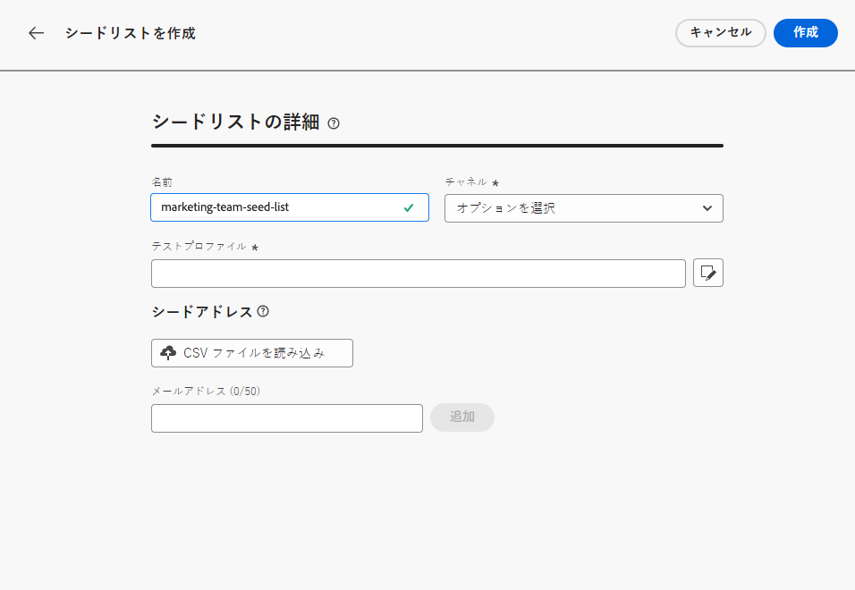
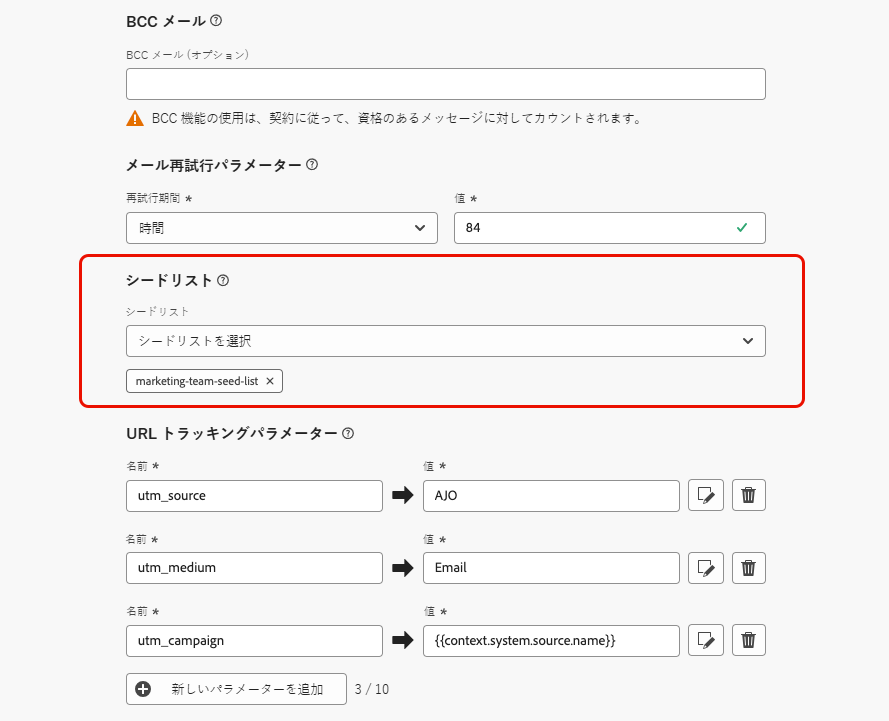

# シードリストを使用 {#seed-lists}

のシードリスト [!DNL Journey Optimizer] 配信に特定のシードアドレスを自動的に含めることができます。

>[!CAUTION]
>
>現在、この機能は E メールチャネルにのみ適用されます。

シードアドレスは、定義されたターゲット条件に合わない受信者を配信のターゲットにする場合に使用されます。これにより、配信スコープ外の受信者が他のターゲット受信者と同様に配信を受信することができます。

シードアドレスは、実際のプロファイルやテストプロファイルではありません。プロファイルの詳細が含まれていないからです。 これらは、システムに保存される内部の関係者に属する受信者のみです。 特定のキャンペーンまたはジャーニーで選択した場合、配信の実行時にそのキャンペーンが含まれます。つまり、確実な目的で配信のコピーが受け取られます。

* シードリストを使用すると、顧客と同じ条件で同時に配信を受信することで、送信された E メールのコピーを監視して、すべての表示形式、画像、リンクが正しいことを確認し、受信者に送信された実際のメッセージを追跡できます。

  以下に例を示します。

+++ マーケティングマネージャーの場合：

  チームメンバー全員に、送信済みメッセージのコピーを顧客と同時に受け取ってもらいたい。 これにより、チームは、実行前に予定されていたとおりに、期待されたレイアウト、アクティブな URL、正しいテキストおよび画像でメッセージが送信されるようにします。

+++

+++ 製品所有者の場合：

  顧客に送信された実際のメッセージを追跡する必要があります。 実際、チームやリーダーシップは、一部のキャンペーンに興味を持つ場合があり、配信時にメッセージのコピーを受け取るために、臨時に追加する必要があります。

+++

* シードリストを使用するもう 1 つの理由は、メーリングリスト保護です。 メーリングリストにシードアドレスを挿入すると、メーリングリストに送信された配信をシードアドレスが受信できるので、第三者によってメーリングリストが使用されているかどうかを知ることができます。

## シードリストへのアクセス {#access-seed-lists}

作成済みのシードリストにアクセスするには、に移動します。 **[!UICONTROL 管理]** > **[!UICONTROL チャネル]** > **[!UICONTROL 電子メール設定]**&#x200B;をクリックし、次を選択します。 **[!UICONTROL シードリスト]**.

<!--
>[!CAUTION]
>
>Permissions to view, export and manage the seed lists are restricted to [Journey Administrators](../administration/ootb-product-profiles.md#journey-administrator). Learn more on managing [!DNL Journey Optimizer] users' access rights in [this section](../administration/permissions-overview.md).-->

>[!CAUTION]
>
>シードリストを表示、編集、管理するには、 **[!UICONTROL シードリストを管理]** 権限。

シードリストは、名前で検索したり、リストを作成したユーザーや作成日に対してフィルターを適用したりできます。 選択したら、リストの上部に表示されているフィルターをクリアできます。

エントリを完全に削除するには、「**[!UICONTROL 削除]**」ボタンを使用します。

>[!CAUTION]
>
>アクティブな [campaign](../campaigns/review-activate-campaign.md) または [ジャーニー](../building-journeys/publishing-the-journey.md). キャンペーン/ジャーニーを非アクティブ化するか、選択したシードリストを持たない別のサーフェスを使用するように編集する必要があります。 [シードリストの使用に関する詳細](#use-seed-list)

シードリスト名をクリックすると、編集できます。 <!--Use the **[!UICONTROL Edit]** button to edit a seed list.-->

## シードリストの作成 {#create-seed-list}

>[!CONTEXTUALHELP]
>id="ajo_seed_list_details"
>title="シードリストの定義"
>abstract="シードリストを使用すると、特定の内部アドレスを配信オーディエンスに自動的に追加して、保証を目的とします。 シードリストを使用すると、送信されたメッセージのコピーを監視して、すべての表示要素が正しいことと、メーリングリストを保護できることを確認できます。 現在、この機能は E メールチャネルにのみ適用されます。"
>additional-url="https://experienceleague.adobe.com/docs/journey-optimizer/using/configuration/seed-lists.html#use-seed-list" text="シードリストとは"

>[!CONTEXTUALHELP]
>id="ajo_seed_addresses"
>title="シードリストに入力"
>abstract="配信の実行時に含めるアドレスを選択し、メッセージの正確なコピーを受け取ります。 CSV ファイルをインポートするか、電子メールアドレスを手動で入力できます。"

シードリストを作成するには、次の手順に従います。

1. 次にアクセス： **[!UICONTROL 管理]** > **[!UICONTROL チャネル]** > **[!UICONTROL 電子メール設定]** > **[!UICONTROL シードリスト]** メニュー。

1. を選択します。 **[!UICONTROL シードリストを作成]** 」ボタンをクリックします。

   

1. 詳細を入力します。 まず、名前を追加します。

   

   >[!NOTE]
   >
   >名前は、文字 (A ～ Z) で始まる必要があり、英数字または特殊文字 ( _, ., -) のみを含める必要があります。

1. チャネルを選択します。現在、E メールチャネルのみ使用できます。

1. テストプロファイルを選択します。シードアドレスにはプロファイルの詳細が含まれないので、このテストプロファイルは、シードアドレスに送信されるメッセージにパーソナライゼーションデータを表示する目的でのみ使用されます。

   >[!NOTE]
   >
   >一度に 1 つのテストプロファイルのみ選択できます。

1. 配信先のシードアドレスを追加します。 CSV ファイルをインポートするか、電子メールアドレスを手動で入力できます。

   

   >[!NOTE]
   >
   >両方のオプションを組み合わせることができますが、シードリスト内のアドレスの総数は 50 を超えることはできません。

1. クリック **[!UICONTROL 作成]** をクリックして確定します。 新しく作成されたシードリストが [シードリスト画面](#access-seed-lists).

## キャンペーンまたはジャーニーでのシードリストの使用 {#use-seed-list}

シードリストが作成されたので、任意のキャンペーンまたはジャーニーで使用して、対応するシードアドレスを配信に含めることができます。 これを行うには、以下の手順に従います。

>[!CAUTION]
>
>シードアドレスに送信されたメッセージは、レポートに含まれません。

1. サーフェスを作成し、 **[!UICONTROL 電子メール]** チャネル。 [詳細情報](../email/email-settings.md)

1. 選択したシードリストを [対応部](../email/email-settings.md#seed-list).

   >[!NOTE]
   >
   >一度に 1 つのシードリストのみ選択できます。

   

1. サーフェスをサブミットします。

1. の作成 [campaign](../campaigns/create-campaign.md) または [ジャーニー](../building-journeys/journey-gs.md).

1. を選択します。 **[!UICONTROL 電子メール]** アクションを選択し、 [表面](channel-surfaces.md) 関連するシードリストを含める。

   

1. のアクティブ化 [campaign](../campaigns/review-activate-campaign.md) または [ジャーニー](../building-journeys/publishing-the-journey.md).

これで、キャンペーンやジャーニーを通じて E メールメッセージが顧客に送信されるたびに、選択したシードリストの E メールアドレスも、同じ条件で同時に、ターゲット受信者と同じコンテンツで受信します。

>[!NOTE]
>
>ジャーニーの場合、E メール配信は、ジャーニーの初回実行時にのみシードアドレスに送信されます。

