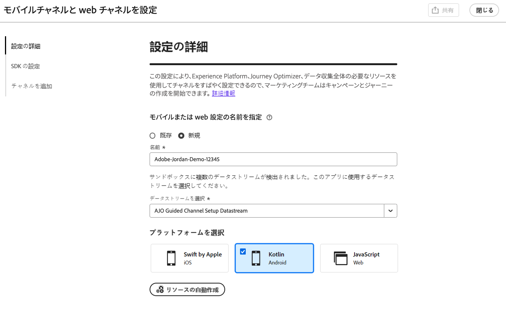
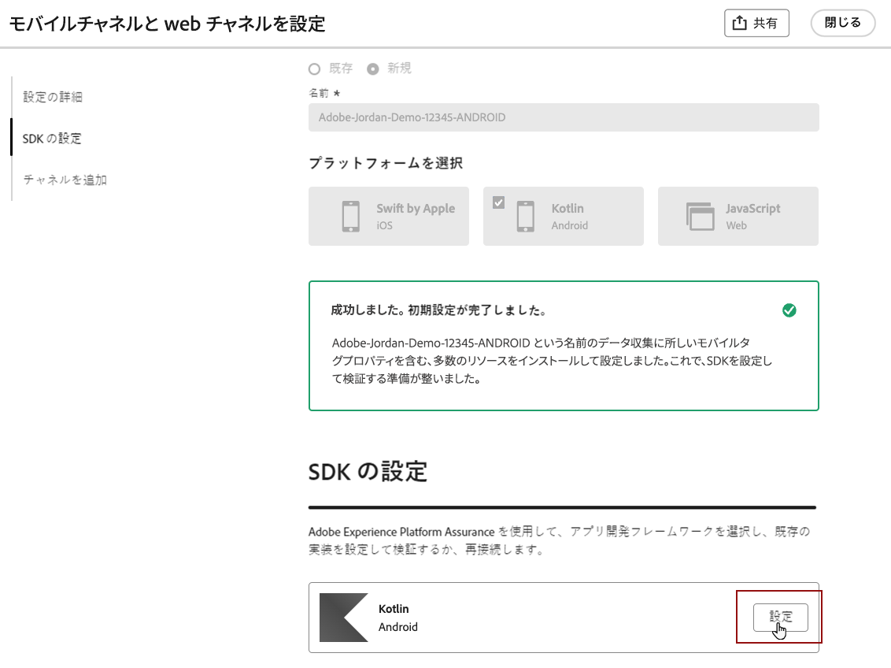
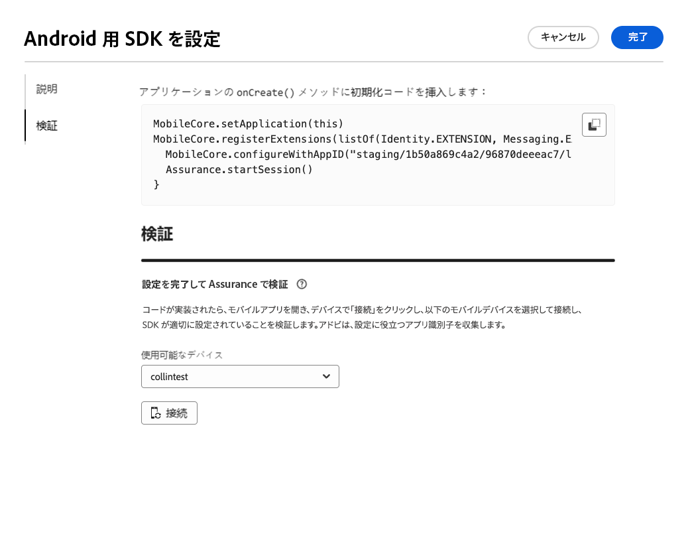
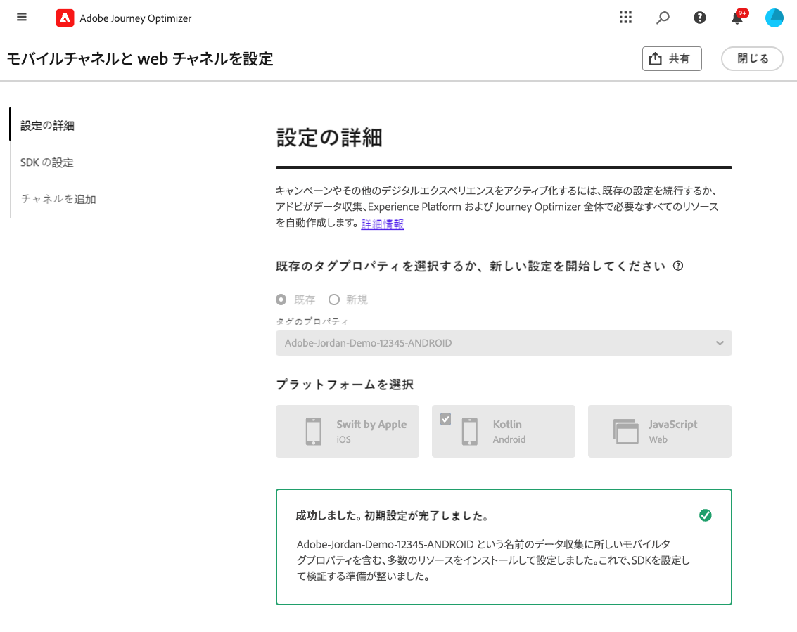

# Android モバイル設定のセットアップ {#set-mobile-android}

>[!IMPORTANT]
>
>互換性と最適なパフォーマンスを確保するには、必ず次の SDK バージョンを使用してください。
>
> * Core 3.1.0 以降
> * Messaging 3.1.0 以降

このAndroidの設定により、マーケティングチャネルのクイックコンフィギュレーションが合理化され、必要なすべてのリソースにExperience Platform、Journey Optimizerおよび Data Collection アプリ内で簡単にアクセスできるようになります。 これにより、マーケティングチームはキャンペーンとジャーニーの作成を迅速に開始できます。

## 新しいAndroid設定の作成 {#new-setup-android}

>[!CONTEXTUALHELP]
>id="ajo_mobile_web_setup_android_initialization_code"
>title="初期化コードの追加"
>abstract="TBC"

>[!CONTEXTUALHELP]
>id="ajo_mobile_web_setup_android_dependencies_add"
>title="依存関係の追加"
>abstract="アプリの Gradle ファイルを使用してプロジェクトにコア、アシュランス、Edge、Edge ID およびメッセージングのライブラリを追加する必要があります。"

>[!CONTEXTUALHELP]
>id="ajo_mobile_web_setup_android_dependencies_import"
>title="HTML の読み込み"
>abstract="アプリのアプリケーションクラスに、Mobile Core、Assurance、Edge、Edge Identity、Messaging のパッケージをインポートします。"
>additional-url="https://experienceleague.adobe.com/en/docs/platform-learn/implement-mobile-sdk/app-implementation/install-sdks#import-extensions" text="データ収集ドキュメントを参照してください。"

<!--
>[!CONTEXTUALHELP]
>id="ajo_mobile_web_setup_push_token_android"
>title="Retrieve the device token"
>abstract="TBC"

>[!CONTEXTUALHELP]
>id="ajo_mobile_web_setup_push_android_studio"
>title="Launch the application from Android Studio"
>abstract="TBC"
-->

1. Journey Optimizer ホームページで、「**[!UICONTROL モバイルと web チャネルの設定]** カードから **[!UICONTROL 開始]** をクリックします。

   

1. **[!UICONTROL 新規]** 設定を作成します。

   既存の設定がある場合は、選択するか、新しい設定を作成するかを選択できます。

   

1. 新しい設定の **[!UICONTROL 名前]** を入力し、**[!UICONTROL データストリーム]** を選択または作成します。 この **[!UICONTROL 名前]** は、自動作成されるすべてのリソースで使用されます。

1. 組織に複数のデータストリームがある場合は、既存のオプションから 1 つ選択してください。 データストリームがない場合は、データストリームが自動作成されます。

1. 設定するAndroid プラットフォームを選択し、「**[!UICONTROL リソースを自動作成]**」をクリックします。

   

1. 設定プロセスを効率化するために、開始に役立つ必要なリソースが自動的に作成されます。 これには、新しい **[!UICONTROL モバイルタグプロパティ]** の作成や、拡張機能のインストールが含まれます。

   自動生成されるすべてのリソースの包括的なリストを以下に示します。

+++ 作成されたリソース

   <table>
    <thead>
    <tr>
    <th><strong>ソリューション</strong></th>
    <th><strong>自動作成されたリソース</strong></th>
    </tr>
    </thead>
    <tbody>
    <tr>
    <td>
    
Journey Optimizer

    </td>
    <td>
    <ul>
    <li>チャネル設定</li>
    <li>プッシュ資格情報（モバイルプッシュメッセージのみ）</li>
    </ul>
    </td>
    </tr>
    <tr>
    <td>
    
タグ

    </td>
    <td>
    <ul>
    <li>モバイルタグプロパティ</li>
    <li>ルール</li>
    <li>データ要素</li>
    <li>ライブラリ</li>
    <li>環境（ステージング、実稼動、開発）</li>
    </ul>
    </td>
    </tr>
    <tr>
    <td>
    
タグ拡張機能

    </td>
    <td>
    <ul>
    <li>Adobe Experience Platform Edge Network</li>
    <li>Adobe Journey Optimizer</li>
    <li>AEP Assurance</li>
    <li>同意（デフォルトの同意ポリシーを有効にした場合）</li>
    <li>ID （デフォルトの ECID とデフォルトのステッチルール）</li>
    <li>Mobile Core</li>
    </ul>
    </td>
    </tr>
    <tr>
    <td>
    
Assurance

    </td>
    <td>
    
アシュランスセッション

    </td>
    </tr>
    <tr>
    <td>
    
データストリーム

    </td>
    <td>
    
サービスを使用したデータストリーム

    </td>
    </tr>
    <tr>
    <td>
    
Experience Platform

    </td>
    <td>
    <ul>
    <li>データセット</li>
    <li>スキーマ</li>
    </ul>
    </td>
    </tr>
    </tbody>
    </table>

+++

1. リソースの生成が完了したら、「**[!UICONTROL 設定]**」をクリックして SDK の設定を開始します。

   

1. ユーザーインターフェイスの説明に従って、まず依存関係を追加し読み込む必要があります。 [詳細情報](https://experienceleague.adobe.com/en/docs/platform-learn/implement-mobile-sdk/app-implementation/install-sdks)

1. 次のコードをコピーして、アプリケーションの onCreate （） メソッドに貼り付けます。

1. モバイルアプリケーションで SDK を直接検証するには、モバイルアプリケーションを開き、[Adobe保証 ](https://experienceleague.adobe.com/en/docs/experience-platform/assurance/home) へのアクセスを許可するだけです。 Assurance は、実装を徹底的にテストおよび検証し、すべてが正しく動作していることを確認できる強力なツールです。

   接続すると、デバイスが自動的に検出され、**[!UICONTROL 使用可能なデバイス]** ドロップダウンメニューに一覧表示されます。これにより、セットアップをシームレスにリアルタイムで監視し、トラブルシューティングできます。

   

1. **[!UICONTROL 接続]** をクリックします。

1. [ アプリ内 ](#inapp-channel) チャネルや [ プッシュ ](#push-channel) チャネルを設定できるようになりました。

1. 設定が完了したら、自動生成した **[!UICONTROL チャネル設定]** を、ジャーニーやキャンペーンの作成を担当するチームメンバーと共有します。

   **[!UICONTROL チャネル設定]** は、キャンペーンまたはジャーニーインターフェイスで参照する必要があり、設定とオーディエンスに対するターゲット設定されたジャーニーおよびキャンペーンの実行との間でシームレスなつながりを可能にします。

   

## 既存の設定の変更 {#reconnect}

設定を作成したら、いつでも簡単に再検討して、追加のチャネルを追加したり、ニーズに合わせてさらに調整を加えたりできます

1. Journey Optimizer ホームページで、「**[!UICONTROL モバイルと web チャネルの設定]** カードから **[!UICONTROL 開始]** をクリックします。

   

1. 「**[!UICONTROL 既存]**」を選択し、ドロップダウンから既存の **[!UICONTROL タグプロパティ]** を選択します。

   

1. 既存の設定にアクセスする場合は、Adobe保証に再接続する必要があります。 SDK 設定メニューから、「**[!UICONTROL 再接続]**」をクリックします。

1. **[!UICONTROL 利用可能なデバイス]** ドロップダウンからデバイスを選択し、**[!UICONTROL 接続]** をクリックします。

1. これで、必要に応じて設定を更新できます。

## アプリ内チャネルの設定 {#inapp-channel}

>[!CONTEXTUALHELP]
>id="ajo_mobile_web_setup_inapp_tag_property"
>title="タグプロパティの選択"
>abstract="TBC"

アプリ内チャネルでは、追加の設定は必要ありません。 設定が正確であることを確認するには、アシュランス機能を使用してテストメッセージを簡単に送信できます。 これにより、アプリ内メッセージを効果的に配信するためのシステムの準備状況に関するフィードバックが即座に提供されます。

それには、「**[!UICONTROL アプリ内メッセージを表示]**」をクリックします。

設定プロセスを効率化するために、開始に役立つ必要なリソースが自動的に作成されます。 これには、チャネル設定の作成が含まれます。

以前に設定した **[!UICONTROL チャネル設定]** を使用して、アプリ内メッセージを送信できるようになりました。 [ アプリ内メッセージの作成方法を学ぶ ](../in-app/create-in-app.md)

## プッシュチャネルの設定 {#push-channel}

>[!CONTEXTUALHELP]
>id="ajo_mobile_web_setup_push_token"
>title="デバイストークンの取得"
>abstract="デバイスのプッシュトークンがAdobe Experience Platform プロファイルと正しく同期されていることを確認するには、次のコードをアプリケーションに組み込む必要があります。 この統合は、最新の通信機能を維持し、シームレスなユーザーエクスペリエンスを確保するために不可欠です。"

>[!CONTEXTUALHELP]
>id="ajo_mobile_web_setup_push_xcode"
>title="Xcode からのアプリケーションの起動"
>abstract="TBC"

>[!CONTEXTUALHELP]
>id="ajo_mobile_web_push_certificate_fcm"
>title="プッシュ証明書の指定"
>abstract=".json 秘密鍵ファイルをドラッグ&amp;ドロップします。 このファイルには、アプリケーションとサーバー間の安全な統合および通信に必要な認証情報が含まれています。"

1. Mobile SDK を設定したら、プッシュ通知カードから「**[!UICONTROL 追加]**」をクリックします。

1. ユーザーインターフェイスの `FireBaseMessaging.getInstance.getToken ()` コールバック関数内に指定されたコードを挿入して、デバイストークンを取得します。

1. ユーザーインターフェイスに指定されたコードを `AndroidManifest.xml` ファイルに追加することで、メッセージングサービスを登録します。

1. .json 秘密鍵ファイルをドラッグ&amp;ドロップします。

1. 設定が正確であることを確認するには、アシュランス機能を使用してテストメッセージを簡単に送信できます。 これにより、プッシュ通知を効果的に配信するためのシステムの準備状況に関するフィードバックが直ちに得られます。

   これを行うには、「プッシュメッセージを送信 **[!UICONTROL をクリックす]** だけです。

設定プロセスを効率化するために、開始に役立つ必要なリソースが自動的に作成されます。 これには、**[!UICONTROL チャネル設定]** および **[!UICONTROL プッシュ秘密鍵証明書]** の作成が含まれます。

以前に設定した **[!UICONTROL チャネル設定]** を使用して、プッシュ通知を送信できるようになりました。 [ プッシュ通知を作成する方法を学ぶ ](../push/create-push.md)
