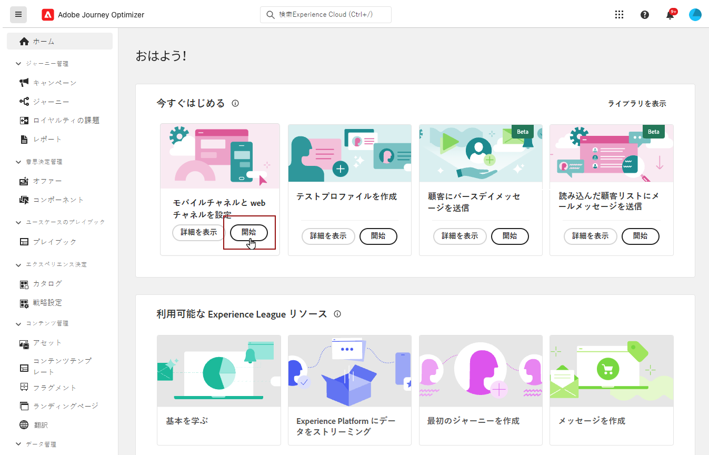

# iOS モバイル設定のセットアップ {#set-mobile-ios}

>[!IMPORTANT]
>
>互換性と最適なパフォーマンスを確保するには、必ず次の SDK バージョンを使用してください。
>
> * コア SDK:5.2.0 以降
> * Messaging SDK:5.1.1 以降

このiOSの設定により、マーケティングチャネルの迅速な設定が簡単になり、すべての重要なリソースがExperience Platform、Journey Optimizerおよび Data Collection アプリで容易に使用できるようになります。 これにより、マーケティングチームはキャンペーンとジャーニーの作成をすばやく開始できます。

## 新しいiOS設定の作成 {#new-setup-ios}

>[!CONTEXTUALHELP]
>id="ajo_mobile_web_setup_swift_dependencies_add"
>title="依存関係の追加"
>abstract="Xcode で、アシュランスパッケージを追加し、アプリでデータ収集とエクスペリエンスを検査、配達確認、シミュレートおよび検証します。 また、AEP メッセージを追加してプッシュ通知トークンとクリックスルーフィードバックをAdobe Experience Platformに送信することもできます。"
>additional-url="https://experienceleague.adobe.com/en/docs/platform-learn/implement-mobile-sdk/app-implementation/install-sdks#swift-package-manager" text="データ収集ドキュメントを参照してください。"

>[!CONTEXTUALHELP]
>id="ajo_mobile_web_setup_swift_initialization_code"
>title="初期化コードの追加"
>abstract="アプリを適切に初期化するには、指定された初期化コードを AppDelegate ファイルの **didFinishLaunchingWithOptions** メソッドに挿入します。 これにより、アプリの起動プロセス中の適切なタイミングで実行されます。"

>[!CONTEXTUALHELP]
>id="ajo_mobile_web_setup_swift_dependencies_import"
>title="HTML の読み込み"
>abstract="アプリケーションの **AppDelegate** クラスで、次の依存関係（AEPCore、AEPAssurrance、AEPEdge、AEPEdgeIdentity、AEPMessaging）を読み込みます。"
>additional-url="https://experienceleague.adobe.com/en/docs/platform-learn/implement-mobile-sdk/app-implementation/install-sdks#import-extensions" text="データ収集ドキュメントを参照してください。"

1. Journey Optimizer ホームページで、「**[!UICONTROL モバイルと web チャネルの設定]** カードから **[!UICONTROL 開始]** をクリックします。

   

1. **[!UICONTROL 新規]** 設定を作成します。

   既存の設定がある場合は、選択するか、新しい設定を作成するかを選択できます。

   

1. 新しい設定の **[!UICONTROL 名前]** を入力し、**[!UICONTROL データストリーム]** を選択または作成します。 この **[!UICONTROL 名前]** は、自動作成されるすべてのリソースで使用されます。

1. 組織に複数のデータストリームがある場合は、既存のオプションから 1 つ選択してください。 データストリームがない場合は、データストリームが自動作成されます。

1. iOS プラットフォームを選択し、「**[!UICONTROL リソースの自動作成]**」をクリックします。

   

1. 設定プロセスを効率化するために、開始に役立つ必要なリソースが自動的に作成されます。 これには、新しい **[!UICONTROL モバイルタグプロパティ]** の作成や、拡張機能のインストールが含まれます。

   自動生成されるすべてのリソースの包括的なリストを以下に示します。

+++ 作成されたリソース

   <table>
    <thead>
    <tr>
    <th><strong>ソリューション</strong></th>
    <th><strong>自動作成されたリソース</strong></th>
    </tr>
    </thead>
    <tbody>
    <tr>
    <td>
    <p>Journey Optimizer</p>
    </td>
    <td>
    <ul>
    <li>チャネル設定</li>
    <li>プッシュ資格情報（モバイルプッシュメッセージのみ）</li>
    </ul>
    </td>
    </tr>
    <tr>
    <td>
    <p>タグ</p>
    </td>
    <td>
    <ul>
    <li>モバイルタグプロパティ</li>
    <li>ルール</li>
    <li>データ要素</li>
    <li>ライブラリ</li>
    <li>環境（ステージング、実稼動、開発）</li>
    </ul>
    </td>
    </tr>
    <tr>
    <td>
    <p>タグ拡張機能</p>
    </td>
    <td>
    <ul>
    <li>Adobe Experience Platform Edge Network</li>
    <li>Adobe Journey Optimizer</li>
    <li>AEP Assurance</li>
    <li>同意（デフォルトの同意ポリシーを有効にした場合）</li>
    <li>ID （デフォルトの ECID とデフォルトのステッチルール）</li>
    <li>Mobile Core</li>
    </ul>
    </td>
    </tr>
    <tr>
    <td>
    <p>Assurance</p>
    </td>
    <td>
    <p>アシュランスセッション</p>
    </td>
    </tr>
    <tr>
    <td>
    <p>データストリーム</p>
    </td>
    <td>
    <p>サービスを使用したデータストリーム</p>
    </td>
    </tr>
    <tr>
    <td>
    <p>Experience Platform</p>
    </td>
    <td>
    <ul>
    <li>データセット</li>
    <li>スキーマ</li>
    </ul>
    </td>
    </tr>
    </tbody>
    </table>

+++

1. リソースの生成が完了したら、「**[!UICONTROL 設定]**」をクリックして SDK の設定を開始します。

   

1. ユーザーインターフェイスの説明に従って、まず依存関係を追加し読み込む必要があります。 [詳細情報](https://experienceleague.adobe.com/en/docs/platform-learn/implement-mobile-sdk/app-implementation/install-sdks)

1. 初期化コードをアプリケーションの `onCreate()` メソッドに挿入します。 このテストコードを使用すると、実稼動環境に移行する前に、Assurance に接続してアプリ設定を検証できます。

   {zoomable="yes"}

1. モバイルアプリケーションで SDK を直接検証するには、モバイルアプリケーションを開き、[Adobe保証 ](https://experienceleague.adobe.com/en/docs/experience-platform/assurance/home) へのアクセスを許可するだけです。 Assurance は、実装を徹底的にテストおよび検証し、すべてが正しく動作していることを確認できる強力なツールです。

   接続すると、デバイスが自動的に検出され、**[!UICONTROL 使用可能なデバイス]** ドロップダウンメニューに一覧表示されます。これにより、セットアップをシームレスにリアルタイムで監視し、トラブルシューティングできます。

   {zoomable="yes"}

1. **[!UICONTROL 接続]** をクリックします。

   {zoomable="yes"}

1. [ アプリ内 ](#inapp-channel) チャネルや [ プッシュ ](#push-channel) チャネルを設定できるようになりました。

1. 設定が完了したら、自動生成した **[!UICONTROL チャネル設定]** を、ジャーニーやキャンペーンの作成を担当するチームメンバーと共有します。

   **[!UICONTROL チャネル設定]** は、キャンペーンまたはジャーニーインターフェイスで参照する必要があり、設定とオーディエンスに対するターゲット設定されたジャーニーおよびキャンペーンの実行との間でシームレスなつながりを可能にします。

   {zoomable="yes"}

## 既存の設定の変更 {#reconnect}

設定を作成したら、いつでも簡単に再検討して、追加のチャネルを追加したり、ニーズに合わせてさらに調整を加えたりできます

1. Journey Optimizer ホームページで、「**[!UICONTROL モバイルと web チャネルの設定]** カードから **[!UICONTROL 開始]** をクリックします。

   

1. 「**[!UICONTROL 既存]**」を選択し、ドロップダウンから既存の **[!UICONTROL タグプロパティ]** を選択します。

   

1. 既存の設定にアクセスする場合は、Adobe保証に再接続する必要があります。 SDK 設定メニューから、「**[!UICONTROL 再接続]**」をクリックします。

   

1. **[!UICONTROL 利用可能なデバイス]** ドロップダウンからデバイスを選択し、**[!UICONTROL 接続]** をクリックします。

   {zoomable="yes"}

1. これで、必要に応じて設定を更新できます。

## アプリ内チャネルの設定 {#inapp-channel}

アプリ内チャネルでは、追加の設定は必要ありません。 設定が正確であることを確認するには、アシュランス機能を使用してテストメッセージを簡単に送信できます。 これにより、アプリ内メッセージを効果的に配信するためのシステムの準備状況に関するフィードバックが即座に提供されます。

それには、「**[!UICONTROL アプリ内メッセージを表示]**」をクリックします。

{zoomable="yes"}

設定プロセスを効率化するために、開始に役立つ必要なリソースが自動的に作成されます。 これには、チャネル設定の作成が含まれます。

以前に設定した **[!UICONTROL チャネル設定]** を使用して、アプリ内メッセージを送信できるようになりました。 [ アプリ内メッセージの作成方法を学ぶ ](../in-app/create-in-app.md)

## プッシュチャネルの設定 {#push-channel}

>[!CONTEXTUALHELP]
>id="ajo_mobile_web_setup_push_certificate"
>title="プッシュ証明書の指定"
>abstract=".p8 キーファイルには、安全なプッシュ通知のために、Apple サーバーでアプリを認証するために使用される秘密鍵が含まれています。 このキーは、開発者アカウントの証明書、識別子、プロファイル ページから取得できます。"

>[!CONTEXTUALHELP]
>id="ajo_mobile_web_setup_push_key_id"
>title="キー ID"
>abstract="キー ID は、p8 認証キーの作成時に割り当てられた 10 文字の文字列で、開発者アカウントの証明書、識別子、プロファイル ページの「**キー**」タブにあります。"

>[!CONTEXTUALHELP]
>id="ajo_mobile_web_setup_push_team_id"
>title="チーム ID"
>abstract="チーム ID は、チームを識別するために使用される文字列値で、開発者アカウントの **メンバーシップ** タブに配置できます。"

1. Mobile SDK を設定したら、プッシュ通知カードから「**[!UICONTROL 追加]**」をクリックします。

1. まず、`AppDelegate` の `didRegisterForRemoteNotificationsWithDeviceToken` メソッド内で次のコードを追加して、デバイスのプッシュトークンをAdobe Experience Platform プロファイルと同期します。

   ```
   MobileCore.setPushIdentifier(deviceToken)
   ```

1. .p8 Apple Push Notification Authentication Key ファイルをドラッグ＆ドロップします。このキーは、証明書、識別子、プロファイル ページから取得できます。

1. 次の情報を入力します。

   * キー ID: p8 認証キーの作成時に割り当てられた 10 文字の文字列。 これは、証明書、識別子、プロファイル ページの「キー」タブにあります。

   * チーム ID: 「メンバーシップ」タブの下にある文字列値。

   {zoomable="yes"}

1. 設定が正確であることを確認するには、アシュランス機能を使用してテストメッセージを簡単に送信できます。 これにより、プッシュ通知を効果的に配信するためのシステムの準備状況に関するフィードバックが直ちに得られます。

   これを行うには、「プッシュメッセージを送信 **[!UICONTROL をクリックす]** だけです。

   {zoomable="yes"}

設定プロセスを効率化するために、開始に役立つ必要なリソースが自動的に作成されます。 これには、**[!UICONTROL チャネル設定]** および **[!UICONTROL プッシュ秘密鍵証明書]** の作成が含まれます。

以前に設定した **[!UICONTROL チャネル設定]** を使用して、プッシュ通知を送信できるようになりました。 [ プッシュ通知を作成する方法を学ぶ ](../push/create-push.md)
