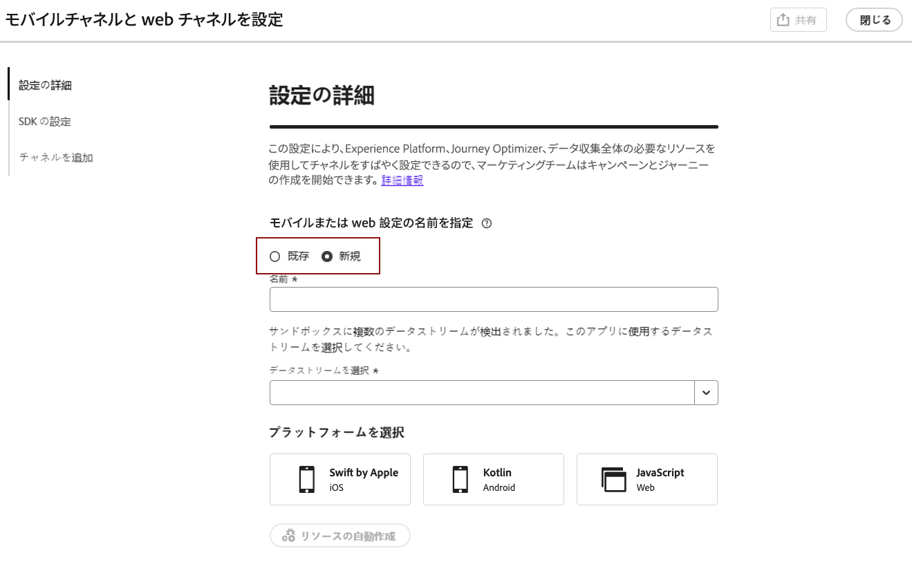
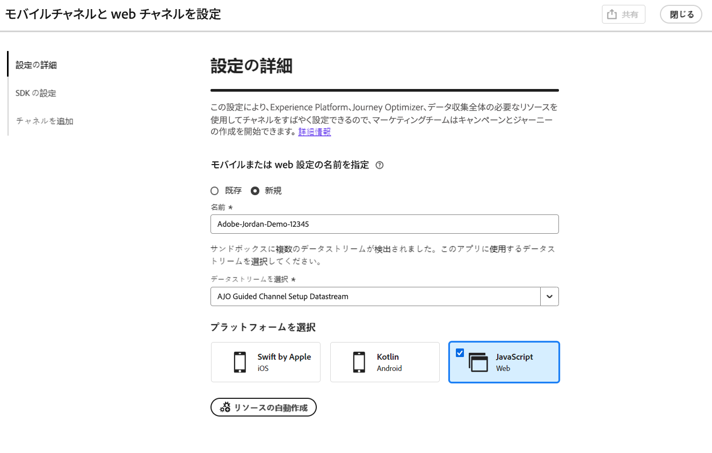
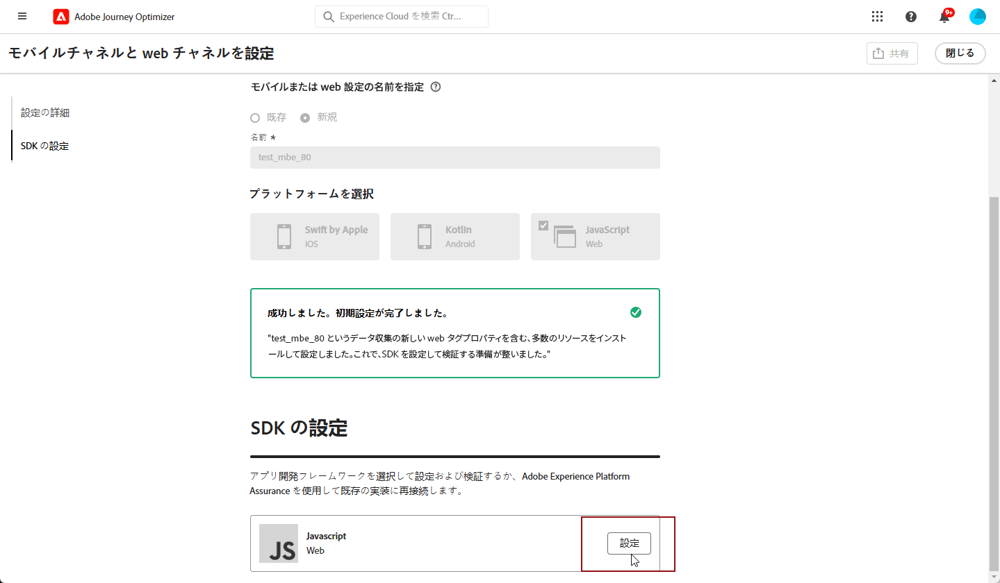
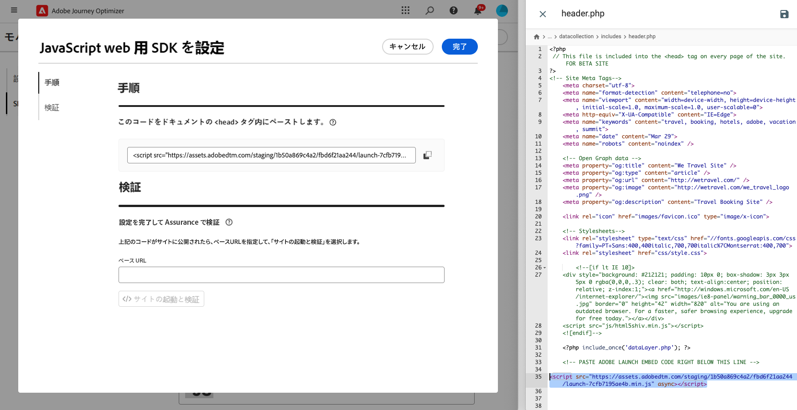
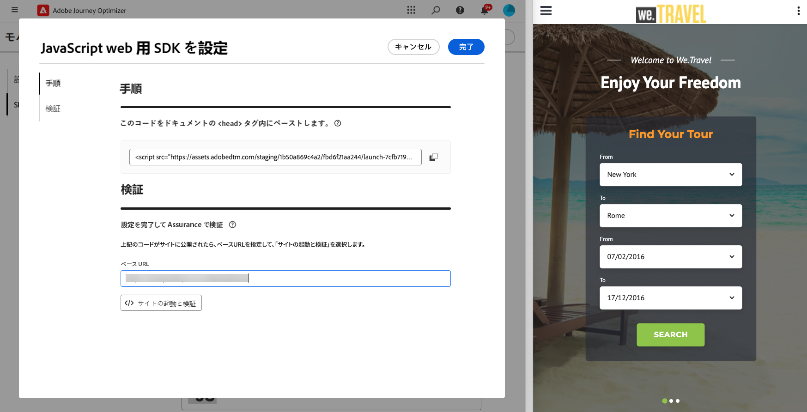
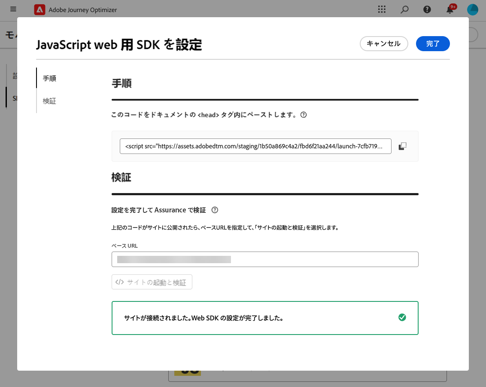
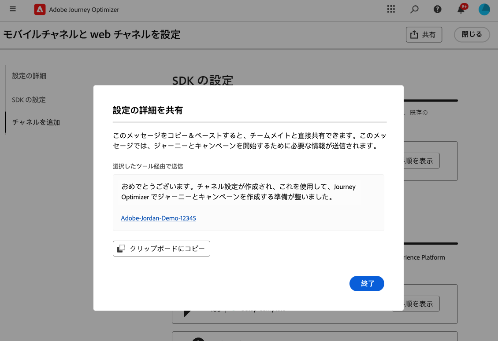
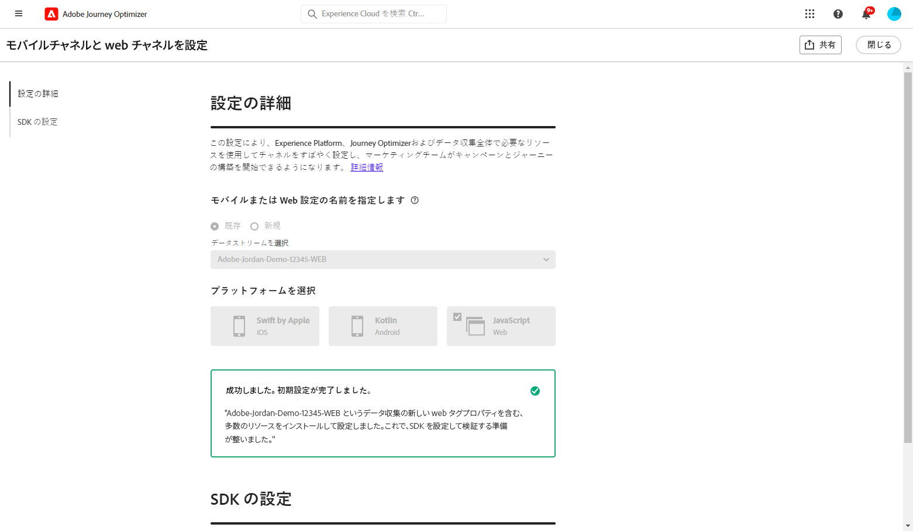

# Web 設定のセットアップ {#set-mobile-web}

>[!CONTEXTUALHELP]
>id="ajo_mobile_web_setup_javascript_code"
>title="JavaScript コード"
>abstract="`<head>` タグには、web ページのメインコンテンツの前に読み込まれる必須のメタデータとリソースが含まれています。 このセクションにコードを配置することで、コードが早い段階で適切に初期化および実行され、web ページの読み込みと機能が効率的になります。 `<head>` セクションにコードを追加すると、サイトの構造、パフォーマンス、および全体的なユーザーエクスペリエンスを向上させることができます。"

>[!CONTEXTUALHELP]
>id="ajo_mobile_web_setup_javascript_site"
>title="サイトの起動と検証"
>abstract="コードが正常に実装され、web サイトに公開されたら、ベース URL を指定します。 必要に応じて、後でこのページに戻って再検証し、設定が期待どおりに機能していることを確認できます。"

この設定により、マーケティングチャネルの迅速な設定が容易になり、必要なすべてのリソースがExperience Platform、Journey Optimizerおよびデータ収集ですぐに使用できるようになります。 これにより、マーケティングチームはキャンペーンとジャーニーの作成をすぐに開始できます。

## 新しい Web 設定の作成 {#new-setup}

1. Journey Optimizer ホームページで、「**[!UICONTROL モバイルと web チャネルの設定]** カードから **[!UICONTROL 開始]** をクリックします。

   

1. **[!UICONTROL 新規]** 設定を作成します。

   既存の設定がある場合は、選択するか、新しい設定を作成するかを選択できます。

   

1. 新しい設定の **[!UICONTROL 名前]** を入力し、**[!UICONTROL データストリーム]** を選択または作成します。 この **[!UICONTROL 名前]** は、自動作成されるすべてのリソースで使用されます。

1. 組織に複数のデータストリームがある場合は、既存のオプションから 1 つ選択してください。 データストリームがない場合は、データストリームが自動作成されます。

1. Web プラットフォームを選択し、「**[!UICONTROL リソースの自動作成]**」をクリックします。

   

1. 設定プロセスを効率化するために、開始に役立つ必要なリソースが自動的に作成されます。

   自動生成されるすべてのリソースの包括的なリストを以下に示します。

+++ 作成されたリソース

   <table>
    <thead>
    <tr>
    <th><strong>ソリューション</strong></th>
    <th><strong>自動作成されたリソース</strong></th>
    </tr>
    </thead>
    <tbody>
    <tr>
    </tr>
    <tr>
    <td>
    
タグ

    </td>
    <td>
    <ul>
    <li>モバイルタグプロパティ</li>
    <li>ルール</li>
    <li>データ要素</li>
    <li>ライブラリ</li>
    <li>環境（ステージング、実稼動、開発）</li>
    </ul>
    </td>
    </tr>
    <tr>
    <td>
    
タグ拡張機能

    </td>
    <td>
    <ul>
    <li>Adobe Experience Platform Edge Network</li>
    <li>Adobe Journey Optimizer</li>
    <li>AEP Assurance</li>
    <li>同意（デフォルトの同意ポリシーを有効にした場合）</li>
    <li>ID （デフォルトの ECID とデフォルトのステッチルール）</li>
    <li>Mobile Core</li>
    </ul>
    </td>
    </tr>
    <tr>
    <td>
    
Assurance

    </td>
    <td>
    
アシュランスセッション

    </td>
    </tr>
    <tr>
    <td>
    
データストリーム

    </td>
    <td>
    
サービスを使用したデータストリーム

    </td>
    </tr>
    <tr>
    <td>
    
Experience Platform

    </td>
    <td>
    <ul>
    <li>データセット</li>
    <li>スキーマ</li>
    </ul>
    </td>
    </tr>
    </tbody>
    </table>

+++

1. リソースの生成が完了したら、「**[!UICONTROL 設定]**」をクリックして SDK の設定を開始します。

   

1. 画面に表示されたコードをドキュメントの `<head>` タグに貼り付けます。

   {zoomable="yes"}

1. モバイルアプリケーションで SDK を直接検証するには、ベース URL を貼り付けるだけです。

   {zoomable="yes"}

1. 「**[!UICONTROL サイトを起動して検証]**」を選択して、サイトに接続します。

   {zoomable="yes"}

1. 設定が完了したら、自動生成した **[!UICONTROL モバイル web プロパティ]** を、ジャーニーやキャンペーンの作成を担当するチームメンバーと共有します。

   **[!UICONTROL モバイル web プロパティ]** は、キャンペーンまたはジャーニーインターフェイスで参照する必要があり、設定と、オーディエンスに対するターゲット設定されたジャーニーおよびキャンペーンの実行との間でシームレスなつながりを可能にします。

   

以前に設定した **[!UICONTROL モバイル web プロパティ]** を使用して web ページを作成できるようになりました。 [Web ページの作成方法を学ぶ ](../web/create-web.md)

## 既存の設定の変更 {#reconnect}

設定を作成したら、いつでも簡単に再検討して、追加のチャネルを追加したり、ニーズに合わせてさらに調整を加えたりできます

1. Journey Optimizer ホームページで、「**[!UICONTROL モバイルと web チャネルの設定]** カードから **[!UICONTROL 開始]** をクリックします。

   

1. 「**[!UICONTROL 既存]**」を選択し、ドロップダウンから既存の **[!UICONTROL タグプロパティ]** を選択します。

   

1. これで、必要に応じて設定を更新できます。
