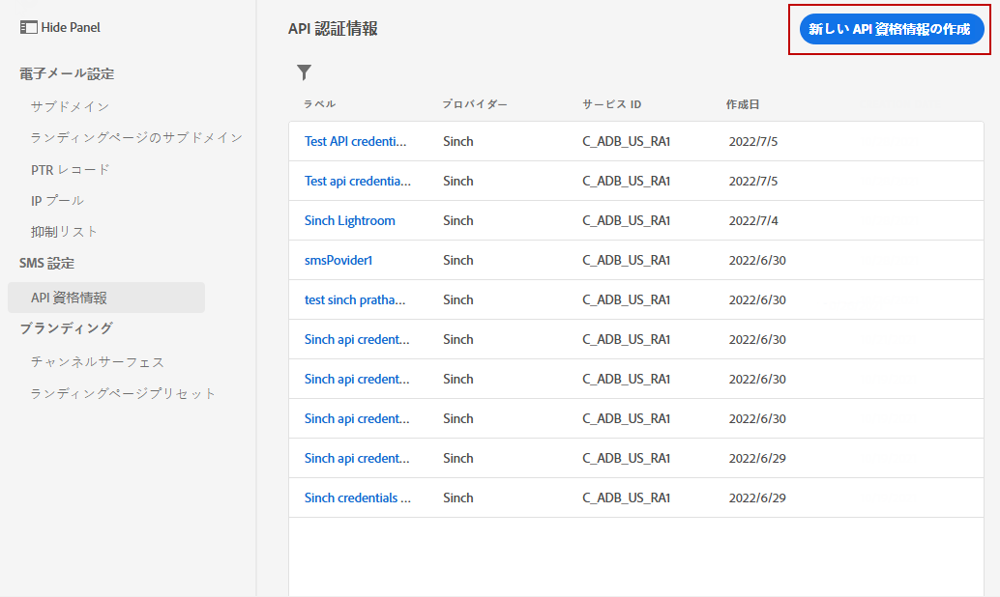
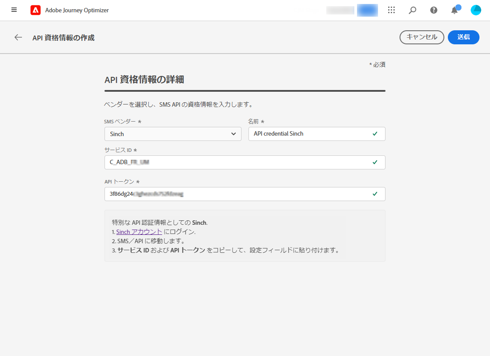
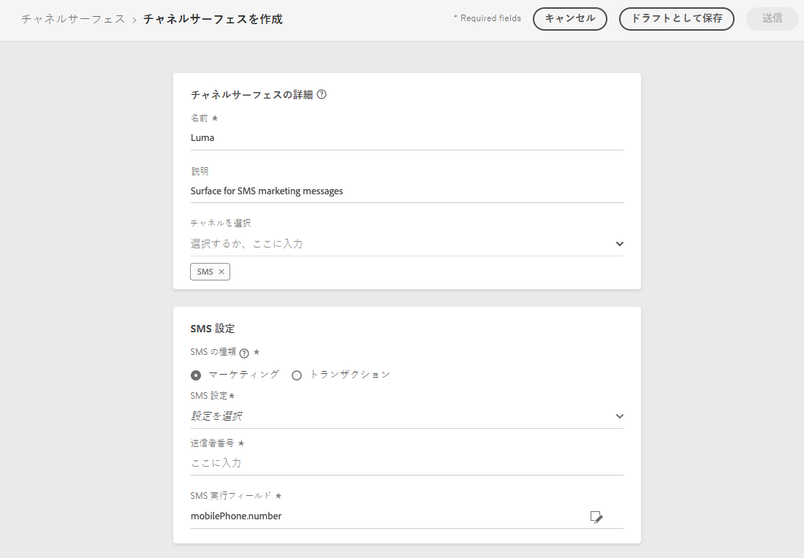
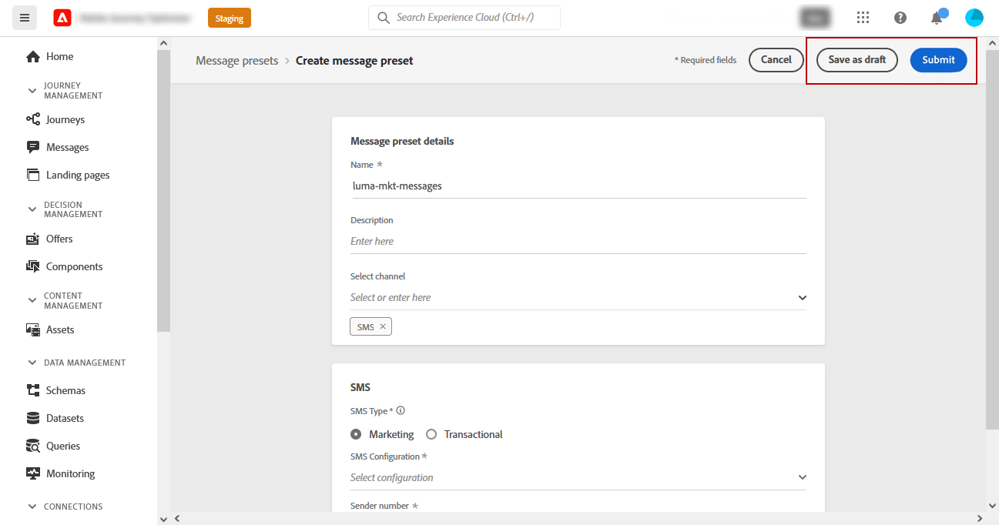

# SMS チャネルの設定 {#sms-configuration}

[!DNL Journey Optimizer] では、ジャーニーを作成し、ターゲットとなるオーディエンスにメッセージを送信できます。

SMS を送信する前に、インスタンスを設定します。Journey Optimizer と[プロバイダー設定を統合](#create-api)し、[SMS サーフェスを作成](#message-preset-sms)する必要があります（SMS プリセットなど）。これらの手順は、[Adobe Journey Optimizer システム管理者](../start/path/administrator.md)が実行する必要があります。

>[!IMPORTANT]
>
>Adobe Journey Optimizer は現在、Sinch や Twilio などのサードパーティプロバイダーと統合されており、そうしたプロバイダーは Adobe Journey Optimizer とは独立して SMS サービスを提供しています。SMS を設定する前に、Adobe Journey Optimizer と対象の SMS プロバイダー間の接続を確立できるようにするための API トークンとサービス ID を受け取るために、こうしたいずれかの SMS プロバイダーのアカウントを作成する必要があります。SMS サービスを使用した場合、該当する SMS プロバイダーが定める追加の利用条件に同意したとみなされます。Sinch と Twilio は、Adobe Journey Optimizer と統合することでユーザーが利用できるサードパーティ製品であるため、SMS サービスに関する問題や問い合わせについてサポートを受ける際は、Sinch または Twilio のユーザーが対象の SMS プロバイダーに問い合わせる必要があります。サードパーティ製品について、アドビは一切関係せず、責任も負いません。

## 新しい API 認証情報の作成 {#create-api}

>[!CONTEXTUALHELP]
>id="ajo_admin_sms_api_header"
>title="Journey Optimizer で SMS ベンダーを設定する"
>abstract="ベンダーを選択し、SMS API の認証情報を入力します。"

>[!CONTEXTUALHELP]
>id="ajo_admin_sms_api"
>title="Journey Optimizer で SMS ベンダーを設定する"
>abstract="ベンダーを選択し、SMS API の認証情報を入力します。"

<!--New contextual help content for September release: >abstract="Before sending SMS, you must integrate the provider settings with Journey Optimizer. Once done, you will need to create an SMS surface. These steps must be performed by an Adobe Journey Optimizer system administrator."
>additional-url="https://experienceleague.adobe.com/docs/journey-optimizer/using/configuration/configuration-message/sms-configuration.html#message-preset-sms" text="Create an SMS channel surface"-->

>[!CONTEXTUALHELP]
>id="ajo_admin_sms_configuration"
>title="SMS ベンダー設定の選択"
>abstract="SMS ベンダーに設定する API 認証情報を選択します。"

Journey Optimizer で SMS ベンダーを設定するには、次の手順に従います。

1. 「**[!UICONTROL 管理]**」／「**[!UICONTROL チャネル]**」／「**[!UICONTROL API 認証情報]**」メニューにアクセスし、「 **[!UICONTROL API 認証情報の作成]**」をクリックします。

   

1. 「**[!UICONTROL SMS ベンダー]**」を選択します。

   * [!DNL Sinch]。**[!UICONTROL サービス ID]** と **[!UICONTROL API トークン]**&#x200B;を検索するには、Sinch アカウントから SMS／API メニューにアクセスします。
   * [!DNL Twilio]。**[!UICONTROL サービス ID]** と **[!UICONTROL API トークン]**&#x200B;を検索するには、コンソールダッシュボードページのアカウント情報パネルにアクセスします。

1. API 認証情報の&#x200B;**[!UICONTROL 名前]**&#x200B;を入力します。

1. **[!UICONTROL サービス ID]** と **[!UICONTROL API トークン]**&#x200B;を入力します。

   

1. API 認証情報の設定が完了したら、「**[!UICONTROL 送信]**」をクリックします。

API 認証情報を作成して設定した後、SMS メッセージ用のチャネルサーフェス（メッセージプリセットなど）を作成する必要があります。

## SMS メッセージ用チャネルサーフェスの作成 {#message-preset-sms}

>[!CONTEXTUALHELP]
>id="ajo_admin_surface_sms_type"
>title="SMS カテゴリの定義"
>abstract="このサーフェスを使用する際に送信される SMS メッセージのタイプ（ユーザーの同意が必要なプロモーション SMS メッセージ用の「マーケティング」または、特定のコンテキストで購読解除済みのプロファイルにも送信できる非商用 SMS メッセージ用の「トランザクション」）を選択します。"
>additional-url="https://experienceleague.adobe.com/docs/journey-optimizer/using/messages/create-sms.html?lang=ja#sms-opt-in-out" text="マーケティング SMS メッセージのオプトアウト"

SMS チャネルを設定したら、**[!DNL Journey Optimizer]** から SMS メッセージを送信できるように、チャネルサーフェスを作成する必要があります。

チャネルサーフェスを作成するには、次の手順に従います。

1. **[!UICONTROL チャネル]**／**[!UICONTROL ブランディング]**／**[!UICONTROL チャネルサーフェス]**&#x200B;メニューにアクセスし、「**[!UICONTROL チャネルサーフェスを作成]**」をクリックします。

   

1. サーフェスの名前と説明（オプション）を入力し、SMS チャネルを選択します。

   

   >[!NOTE]
   >
   > 名前は、文字（A ～ Z）で始める必要があります。使用できるのは英数字のみです。アンダースコア（`_`）、ドット（`.`）、ハイフン（`-`）も使用できます。

1. **SMS** の設定を行います。

   

   * サーフェスを使用して送信する **[!UICONTROL SMS タイプ]**（**[!UICONTROL トランザクション]**&#x200B;または&#x200B;**[!UICONTROL マーケティング]**）を選択します。

   * **[!UICONTROL SMS 設定]**&#x200B;を選択し、サーフェスと関連付けます。

      SMS メッセージを送信する環境の設定方法については、[この節](#create-api)を参照してください。

   * コミュニケーションに使用する「**[!UICONTROL 送信者番号]**」を入力します。

   * 「**[!UICONTROL SMS 実行フィールド]**」を選択して、プロファイルの電話番号に関連付けられた「**[!UICONTROL プロファイル属性]**」を選択します。

1. すべてのパラメーターを設定したら、「**[!UICONTROL 送信]**」をクリックして確定します。なお、チャネルサーフェスをドラフトとして保存し、後で設定を再開することもできます。

   

1. チャネルサーフェスが作成されると、リストに「**[!UICONTROL 処理中]**」のステータスで表示されます。

   >[!NOTE]
   >
   >チェックが成功しなかった場合、考えられる失敗理由について詳しくは[この節](#monitor-channel-surfaces)を参照してください。

1. チェックが正常に完了すると、チャネルサーフェスのステータスが「**[!UICONTROL アクティブ]**」になります。メッセージの配信に使用する準備が整いました。

   

これで、Journey Optimizer で SMS メッセージを送信する準備が整いました。

**関連トピック**

* [SMS メッセージの作成](../messages/create-sms.md)
* [ジャーニーでのメッセージの追加](../building-journeys/journeys-message.md)
