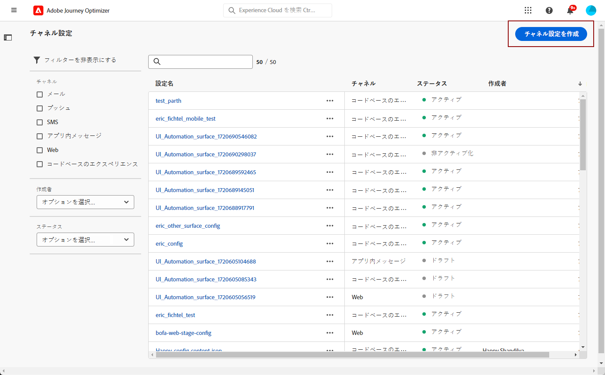

# SMS チャネルの設定 {#sms-configuration}

[!DNL Journey Optimizer] では、ジャーニーを作成し、ターゲットとなるオーディエンスにメッセージを送信できます。

>[!AVAILABILITY]
>
>SMS チャネルは現在、一連の組織でのみ使用できます（使用が制限されています）。 詳しくは、Adobe担当者にお問い合わせください。

## 新しい API 認証情報の作成 {#create-api}

Journey Optimizer で SMS ベンダーを設定するには、次の手順に従います。

1. 「**[!UICONTROL 管理]**」／「**[!UICONTROL チャネル]**」／「**[!UICONTROL API 認証情報]**」メニューにアクセスし、「 **[!UICONTROL API 認証情報の作成]**」をクリックします。

   

1. を選択します。 **[!UICONTROL SMS ベンダー]**:

   * [!DNL Sinch]。次を検索： **[!UICONTROL サービス ID]** および **[!UICONTROL API トークン]** Sinch アカウントから SMS / API メニューにアクセスします。
   * [!DNL Twilio]。次を検索： **[!UICONTROL サービス ID]** および **[!UICONTROL API トークン]**&#x200B;をクリックし、コンソールダッシュボードページの「アカウント情報」ペインにアクセスします。

1. API 認証情報の&#x200B;**[!UICONTROL 名前]**&#x200B;を入力します。

1. **[!UICONTROL サービス ID]** と **[!UICONTROL API トークン]**&#x200B;を入力します。

   

1. API 認証情報の設定が完了したら、「**[!UICONTROL 送信]**」をクリックします。

API 認証情報を作成して設定した後、SMS メッセージ用のメッセージプリセットを作成する必要があります。

## SMS メッセージ用メッセージプリセットの作成 {#message-preset-sms}

SMS チャネルを設定したら、**[!DNL Journey Optimizer]** から SMS メッセージを送信できるように、メッセージプリセットを作成する必要があります。

メッセージプリセットを作成するには、次の手順に従います。

1. **[!UICONTROL チャネル]**／**[!UICONTROL ブランディング]**／**[!UICONTROL メッセージプリセット]**&#x200B;メニューにアクセスし、「**[!UICONTROL メッセージプリセットを作成]**」をクリックします。

   

1. プリセットの名前と説明（オプション）を入力し、SMS チャネルを選択します。

   

   >[!NOTE]
   >
   > 名前は、文字（A ～ Z）で始める必要があります。使用できるのは英数字のみです。アンダースコア（`_`）、ドット（`.`）、ハイフン（`-`）も使用できます。

1. **SMS** の設定を行います。

   

   * プリセットを使用して送信する **[!UICONTROL SMS タイプ]**（**[!UICONTROL トランザクション]**&#x200B;または&#x200B;**[!UICONTROL マーケティング]**）を選択します。

   * **[!UICONTROL SMS 設定]**&#x200B;を選択し、プリセットと関連付けます。

      SMS メッセージを送信する環境の設定方法については、[この節](sms-configuration.md)を参照してください。

   * コミュニケーションに使用する「**[!UICONTROL 送信者番号]**」を入力します。

   * を選択します。 **[!UICONTROL SMS 実行フィールド]** をクリックし、 **[!UICONTROL プロファイル属性]** プロファイルの電話番号に関連付けられています。

1. すべてのパラメーターを設定したら、「**[!UICONTROL 送信]**」をクリックして確定します。なお、メッセージプリセットをドラフトとして保存し、後で設定を再開することもできます。

   

1. メッセージプリセットが作成されると、リストに「**[!UICONTROL 処理中]**」のステータスで表示されます。

   >[!NOTE]
   >
   >チェックが成功しなかった場合、考えられる失敗理由について詳しくは[この節](#monitor-message-presets)を参照してください。

1. チェックが正常に完了すると、メッセージプリセットのステータスが「**[!UICONTROL アクティブ]**」になります。メッセージの配信に使用する準備が整いました。

   

これで、Journey Optimizer で SMS メッセージを送信する準備が整いました。

**関連トピック**

* [SMS メッセージの作成](../messages/create-sms.md)
* [ジャーニーでのメッセージの追加](../building-journeys/journeys-message.md)
