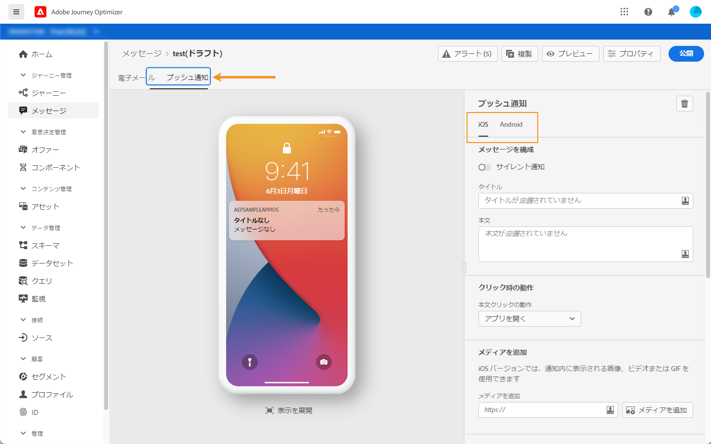

# プッシュ通知の設定{#create-push-notification}

プッシュ通知は、メッセージの作成時に設定され、「**[!UICONTROL プッシュ通知]**」タブに表示されます（「[メッセージの作成](create-message.md)」を参照）。

専用タブを使用して、iOSまたはAndroidオペレーティングシステム用にプッシュ通知コンテンツを設定できます。

## タイトルと本文

メッセージを作成するには、「**[!UICONTROL タイトル]**」フィールドと「**[!UICONTROL 本文]**」フィールドをクリックします。 式エディターを使用して、コンテンツとパーソナライゼーションデータを定義します。

パーソナライゼーションについて詳しくは、[この節](personalization/personalize.md)を参照してください。

中央のセクションでは、iOS端末とAndroid端末でのプッシュ通知の表示を視覚化します。

>[!NOTE]
>
>「**[!UICONTROL メッセージを構成]**」セクションは、**[!UICONTROL iOS]**&#x200B;タブと&#x200B;**[!UICONTROL Android]**&#x200B;タブの両方に共通です。 この節の変更は、両方のオペレーティングシステムに適用されます。

## クリック動作{#on-click-behavior}

受信者がプッシュ通知の本文をクリックした場合の動作を選択します。

* 「**[!UICONTROL アプリを開く]**」オプションを使用して、メッセージ&#x200B;**[!UICONTROL プリセット]**&#x200B;に関連付けられているアプリを開きます。
* 「**[!UICONTROL ディープリンク]**」オプションを使用して、受信者をアプリケーション内の特定のコンテンツにリダイレクトします。 関連するフィールドにディープリンクを入力します。
* **[!UICONTROL Web URL]**&#x200B;オプションを使用して、受信者を外部URLにリダイレクトします。 関連するフィールドにURLを入力します。

## サイレント通知の送信

サイレントプッシュ通知（バックグラウンド通知）は、アプリケーションに配信される非表示の命令です。 この変数は、例えば、新しいコンテンツが利用可能であることをアプリケーションに通知したり、バックグラウンドでダウンロードを開始したりする場合に使用します。

「**[!UICONTROL サイレント通知]**」オプションを選択して、アプリケーションにサイレントに通知します。この場合、通知はアプリケーションに直接転送される。 デバイスの画面に警告は表示されません。

**[!UICONTROL カスタムデータ]**&#x200B;セクションを使用して、キー/値のペアを追加します。

## 詳細オプション

**[!UICONTROL アドバンスオプション]**&#x200B;を設定します。 次のパラメーターを使用できます。

| パラメーター | 入手方法 | 説明 |
|---------|----------|---------|
| **[!UICONTROL 折りたたみ可能]** | iOS/Android | 折りたたみ可能なメッセージとは、新しいメッセージに置き換えられる可能性のあるメッセージです。 例えば、トピックに関する最新のニュースでユーザーを更新するアプリケーションです。 その場合、最新のメッセージのみが関連します。 一方、折りたたみが不可能なメッセージは、クライアントアプリにとってすべてのメッセージが重要であり、配信する必要があります。 |
| **[!UICONTROL カスタムサウンド]** | iOS/Android | 通知を受け取ったときに携帯端末が再生するサウンド。 サウンドは、アプリにバンドルする必要があります。 |
| **[!UICONTROL バッジ]** | iOS/Android | バッジは、新しい未読情報の数をアプリケーションアイコンに直接表示するために使用します。 バッジの値は、ユーザーがアプリケーションから新しいコンテンツを開くまたは読むとすぐに消えます。デバイスで通知を受け取ると、関連アプリのバッジ値を更新したり追加したりできます。 例えば、顧客の未読の記事の数を保存している場合、パーソナライズを利用して、各顧客に一意の未読の記事バッジ値を送信できます。パーソナライゼーションについては、[このセクション](personalization/personalize.md)を参照してください。 |
| **[!UICONTROL 通知グループ]** / | iOS | 通知グループをプッシュ通知に関連付けます。 iOS 12以降、通知グループを使用すると、メッセージスレッドと通知トピックをスレッドIDに統合できます。例えば、ブランドは1つのグループIDでマーケティング通知を送信し、1つ以上の異なるIDで、より多くの操作タイプの通知を保持することができます。 例えば、groupIDを設定できます。123 「spring collection of sweaters（セーターの新しい春のコレクションを調べる）」とgroupID:456 「お客様のパッケージは配信されました」通知グループこの例では、すべての配信通知がグループIDの下にバンドルされます。456. |
| **[!UICONTROL 通知チャネル]** | Android | プッシュ通知に通知チャネルを関連付けます。 Android 8.0（APIレベル26）以降では、表示するすべての通知をチャネルに割り当てる必要があります。詳しくは、[Android開発者ドキュメント](https://developer.android.com/guide/topics/ui/notifiers/notifications#ManageChannels)を参照してください。 |
| **[!UICONTROL コンテ追加ンツ利用可能フラグ]** | iOS | プッシュ通知を受け取るとすぐにアプリが起動され、つまりアプリがペイロードデータにアクセスできることを示す目的で、プッシュペイロード内のコンテンツ使用可能フラグを送信します。  これは、アプリがバックグラウンドで実行されていて、ユーザーの操作（プッシュ通知のタップなど）が不要な場合でも機能します。 ただし、アプリが実行されていない場合は適用されません。詳しくは、[Apple 開発者向けドキュメント](https://developer.apple.com/library/content/documentation/NetworkingInternet/Conceptual/RemoteNotificationsPG/CreatingtheNotificationPayload.html)を参照してください。 |
| **[!UICONTROL 可変追加内容フラグ]** | iOS | プッシュペイロードに可変コンテンツフラグを送信し、iOS SDKで提供されるNotification Service Application Extensionによってプッシュ通知コンテンツを変更できるようにします。 詳しくは、[Apple 開発者向けドキュメント](https://developer.apple.com/library/content/documentation/NetworkingInternet/Conceptual/RemoteNotificationsPG/ModifyingNotifications.html)を参照してください。 その後、モバイルアプリの拡張機能を利用して、データの復号化、通知の本文やタイトルテキストの変更、通知へのスレッド識別子の追加などを行う場合など、 [!DNL Journey Optimizer] 送信される着信プッシュ通知の内容や表示をさらに変更できます。 |
| **[!UICONTROL 通知の表示]** | Android | プッシュ通知の表示/非表示を定義します。 <b></b> privateを指定すると、すべてのロック画面に通知が表示されますが、機密情報や秘密情報は保護されたロック画面に隠します。<b></b> Publicは、すべてのロック画面に通知全体を表示します。<b></b> Secretwillは、セキュリティで保護されたロック画面に通知の一部を表示しません。詳しくは、[Android開発者向けドキュメント](https://developer.android.com/reference/android/app/Notification)を参照してください。 |
| **[!UICONTROL 通知の優先度]** | Android | プッシュ通知の重要度を低から最大に定義します。 これは、プッシュ通知が配信されたときに、どの程度「侵入的」な通知を行うかを決定します。 詳しくは、[Android開発者向けドキュメント](https://developer.android.com/guide/topics/ui/notifiers/notifications#importance)を参照してください |
| **[!UICONTROL 配信の優先順位]** | Android | プッシュ通知の優先度を高い値または通常の値に設定します。 メッセージの優先度について詳しくは、[Google 開発者向けドキュメント](https://firebase.google.com/docs/cloud-messaging/concept-options#setting-the-priority-of-a-message)を参照してください。 |

## カスタムデータ

**[!UICONTROL カスタムデータ]**&#x200B;セクションでは、モバイルアプリケーションの設定に応じて、ペイロードにカスタム変数を追加できます。 Adobe Experience Platformでのプッシュ通知とAdobeの起動でのプッシュ通知の設定方法について詳しくは、[このセクション](push-configuration.md)を参照してください。

