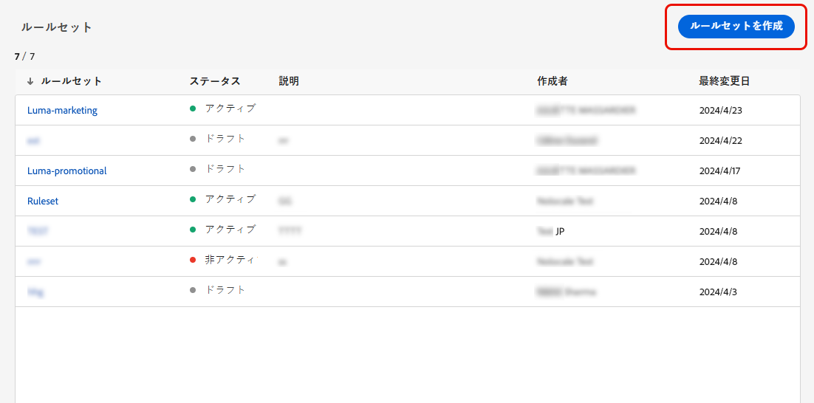
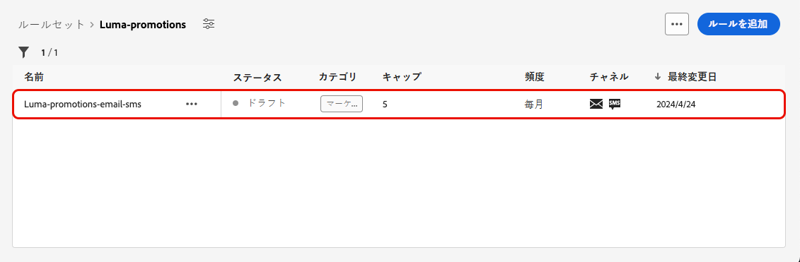

# チャネルと通信タイプによるフリークエンシーキャップ {#rule-sets}

**チャネル** ルールセットは、通信チャネルにキャッピングルールを適用します。 例えば、1 日に 1 件以上のメールまたは SMS 通信を送信できないようにします。

チャネルルールセットを活用すると、通信タイプごとにフリークエンシーキャップを設定して、類似のメッセージを持つ顧客の過負荷を防ぐことができます。 例えば、顧客に送信する&#x200B;**プロモーション情報**&#x200B;の数を制限するルールセットを作成したり、顧客に送信する&#x200B;**ニュースレター**&#x200B;の数を制限する別のルールセットを作成したりできます。作成するキャンペーンの種類に応じて、プロモーション情報またはニュースレターのルールセットのいずれかを適用することを選択できます。

## チャネルのキャッピングルールの作成

>[!CONTEXTUALHELP]
>id="ajo_rule_sets_channel"
>title="ルールを適用するチャネルの定義"
>abstract="少なくとも 1 つのチャネルを選択します。キャッピングは、チャネル間で合計カウントとして適用されます。"

チャネルルールセットを作成するには、次の手順に従います。

>[!NOTE]
>
>チャネルドメインのローカルルールセットは最大 3 つ、ジャーニードメインのローカルルールセットは最大 5 つ作成できます。

1. **[!UICONTROL ルールセット]**&#x200B;のリストにアクセスし、「**[!UICONTROL ルールセットを作成]**」をクリックします。

   

1. キャッピングルールを追加するルールセットを選択するか、新しいルールセットを作成します。

   * 既存のルールセットを使用するには、リストから選択します。チャネルキャッピングルールは、「channel」ドメインを持つルールセットにのみ追加できます。 この情報は、ルールセットリストの&#x200B;**[!UICONTROL ドメイン]**&#x200B;列で確認できます。

     

   * 新しいルールセット内にキャッピングルールを作成するには、「**[!UICONTROL ルールセットを作成]**」をクリックし、ルールセットの一意の名前を指定して、「**[!UICONTROL ルールセットのドメイン]**」ドロップダウンから「チャネル」を選択して、「**[!UICONTROL 保存]**」をクリックします。

     

1. ルールセット画面で「**[!UICONTROL ルールを追加]**」ボタンをクリックし、ルールの一意の名前を定義します。

1. **カテゴリ**&#x200B;フィールドでは、ルールが適用されるメッセージのカテゴリを指定します。現時点では、**[!UICONTROL マーケティング]**&#x200B;カテゴリのみ使用できるので、このフィールドは読み取り専用です。

   

1. **[!UICONTROL 期間]**&#x200B;ドロップダウンリストから、キャッピングを毎月、毎週、毎日のいずれの頻度で適用するかを選択します。フリークエンシーキャップは、選択したカレンダーの期間に基づきます。対応する時間枠の開始時にリセットされます。

   各期間のカウンターの有効期限は次のとおりです。

   * **[!UICONTROL 毎月]**：フリークエンシーキャップは、その月の最終日の 23:59:59 UTC まで有効です。例えば、1 月の月次有効期限は 1/31 23:59:59 UTC です。

   * **[!UICONTROL 毎週]**：フリークエンシーキャップは、暦週が日曜日に始まるので、その週の土曜日 23:59:59 UTC まで有効です。有効期限は、ルールが作成された日時に関係なく適用されます。例えば、木曜日にルールが作成された場合、このルールは土曜日の 23:59:59 まで有効です。

   * **[!UICONTROL 毎日]**：日別のフリークエンシーキャップは、その日の 23:59:59 UTC まで有効で、翌日の開始とともに 0 にリセットされます。

     >[!CAUTION]
     > 
     >毎日のフリークエンシーキャップルールの正確性を確保するには、キャンペーンまたはジャーニーを作成する際に、最も優先度の高い名前空間を選択します。名前空間の優先度について詳しくは、[ID サービスガイド](https://experienceleague.adobe.com/ja/docs/experience-platform/identity/features/identity-graph-linking-rules/namespace-priority){target="_blank"}を参照してください。

   通信が配信されると、プロファイルカウンターの値が更新されることに注意してください。大量の通信を送信する場合は、スループットに応じて、通信の開始から数分または数時間後に受信者にメールが届く可能性があるので（同時に数百万の通信を送信する場合）、この点に注意してください。

   これは、受信者が 2 つの通信を近接して受信する場合に重要です。受信者が通信を受信し、それに応じてカウンター値を更新できるように、通信の間隔を可能な限り 2 時間以上空けることをお勧めします。

1. ルールのキャッピングを設定します。これは、上記の選択に応じて、毎月、毎週または毎日、個々のユーザープロファイルに送信できるメッセージの最大数を意味します。

1. このルールに使用するチャネルを「**[!UICONTROL メール]**」、「**[!UICONTROL SMS]**」、「**[!UICONTROL プッシュ通知]**」または「**[!UICONTROL ダイレクトメール]**」から選択します。

1. 選択したすべてのチャネルに対して合計数としてキャッピングを適用する場合は、複数のチャネルを選択します。

   例えば、キャップを 5 に設定し、メールチャネルと SMS チャネルの両方を選択します。プロファイルが既に 3 件のマーケティングメールと 5 件のマーケティング SMS を受信している場合、このプロファイルは、次に配信されるマーケティングメールまたは SMS の対象から除外されます。

1. 「**[!UICONTROL 保存]**」をクリックして、ルールの作成を確定します。メッセージが、**[!UICONTROL ドラフト]**&#x200B;ステータスでルールリストに追加されます。

   

1. 上記の手順を繰り返して、必要な数のルールをルールセットに追加します。

1. キャッピングルールをメッセージに適用する準備ができたら、ルールセットと、そのルールが追加されたルールをアクティブにします。 [ ルールセットをアクティブ化する方法については、こちらを参照してください ](../conflict-prioritization/rule-sets.md#create)

## メッセージへのルールセットの適用 {#apply-frequency-rule}

メッセージにルールセットを適用するには、次の手順に従います。

1. ジャーニーまたはキャンペーンメッセージを作成する際は、ルールセットに定義したチャネルの 1 つを選択し、メッセージのコンテンツを編集します

1. コンテンツ編集画面で、「**[!UICONTROL ビジネスルールを追加]**」ボタンをクリックします。

1. 作成したルールセットを選択します。

   

   >[!NOTE]
   >
   >[アクティブ化](#activate-rule)したルールセットのみがリストに表示されます。

   <!--Messages where the category selected is **[!UICONTROL Transactional]** will not be evaluated against business rules.-->

1. ジャーニーまたはキャンペーンをアクティブ化する前に、少なくとも 20 分後に実行をスケジュールしてください。

   これにより、選択したビジネスルールのプロファイルのカウンター値を入力する十分な時間を確保できます。キャンペーンをすぐにアクティブ化すると、ルールセットカウンターの値が受信者のプロファイルに入力されず、メッセージがカスタムルール セットのフリークエンシーキャップルールにカウントされません。

   

1. [Customer Journey Analytics レポート](../reports/report-gs-cja.md)および[ライブレポート](../reports/live-report.md)では、配信から除外されたプロファイルの数を確認でき、配信から除外されたユーザーの理由として考えられる頻度ルールが一覧表示されます。

>[!NOTE]
>
>複数のルールを同じチャネルに適用できますが、下限に達すると、プロファイルは次の配信から除外されます。

プロファイルのフリークエンシーキャップに達すると、次の期間までカウンターをリセットする方法はないので、頻度ルールをテストする場合は、新しく作成した[テストプロファイル](../audience/creating-test-profiles.md)を使用することをお勧めします。ルールを非アクティブ化すると、上限を設定されたプロファイルがメッセージを受け取ることはできますが、カウンターの増分は削除されません。

<!--
## Example: combine several rules {#frequency-rule-example}

You can combine several message frequency rules, such as described in the example below.

1. [Create a rule](#create-new-rule) called *Overall Marketing Capping*:

   * Select all channels.
   * Set capping to 12 monthly.

   

1. To further restrict the number of marketing-based push notifications that a user is sent, create a second rule called *Push Marketing Cap*:

   * Select Push channel.
   * Set capping to 4 monthly.

   

1. Save and [activate](#activate-rule) the rule.

1. [Create a message](../building-journeys/journeys-message.md) for every channel you want to communicate through and select the **[!UICONTROL Marketing]** category for each message. [Learn how to apply a frequency rule](#apply-frequency-rule)

   

In this scenario, an individual profile:
* can receive up to 12 marketing messages per month;
* but will be excluded from marketing push notifications after they have received 4 push notifications.-->

## チュートリアルビデオ {#video}

>[!VIDEO](https://video.tv.adobe.com/v/3444727?quality=12&captions=jpn)
