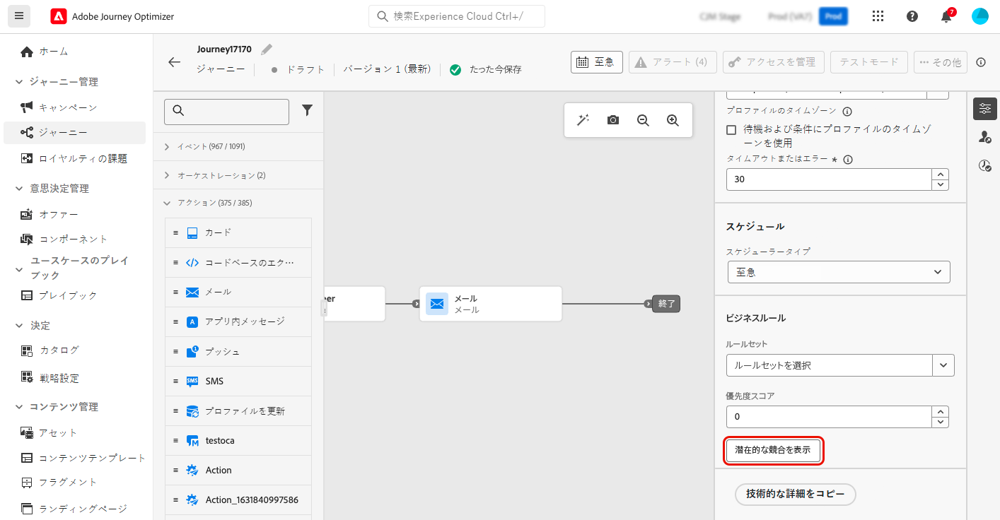

# ジャーニーとキャンペーンの潜在的な競合の検出 {#conflict}

Journey Optimizer でキャンペーンとジャーニーの量を増やすにつれて、マーケターは、過剰なマーケティングインタラクションで顧客を困らせていないかどうかをますます把握しづらくなります。そのため、キャンペーンやジャーニーが重複している場合にそれを簡単に特定して、顧客に飽きられてしまうリスクを軽減しながら、マーケティングコミュニケーションの適切なバランスを確実に取ることが不可欠です。

重複の可能性を監視する主な領域は次のとおりです。

* **タイムライン**（開始日と終了日）：同時に実行されているジャーニーが多すぎないか。
* **オーディエンス**：ジャーニーオーディエンスのうち、何パーセントのオーディエンスが他のジャーニーの一部にもなっているか。
* **チャネル**：同じ期間にスケジュールされている他のコミュニケーションはあるか。ある場合、それはいくつか。
* **キャッピングルールセット**：どのタイプのジャーニーがキャッピングの対象で、その中に重複があるか。
* **チャネル設定**：同じジャーニーまたはキャンペーンで使用されているチャネル設定を使用している他のジャーニーまたはキャンペーンで、ジャーニーまたはキャンペーンがエンドユーザーに表示されない原因となっている可能性があるものは存在するか。

➡️ [この機能をビデオで確認](#video)

## Journey Optimizer による競合の検出方法 {#detection}

ジャーニーとキャンペーンの競合の可能性を Journey Optimizer で特定する方法の概要を次に示します。

* **競合の特定範囲**：ライブまたはスケジュール済みキャンペーンおよびジャーニーの競合のみ表示されます。
* **単一ジャーニー**：選択したジャーニーが単一ジャーニーの場合、同じイベントで開始する他のジャーニーが表示されます。このイベントが、そのようなジャーニーをすべてトリガーするからです。
* **オーディエンスの選定およびオーディエンスを読み取り／ビジネスイベント**&#x200B;ジャーニー：選択したジャーニーがオーディエンスの選定ジャーニーまたはオーディエンスを読み取り／ビジネスイベントジャーニーの場合、オーディエンス間に重複がある可能性があるので、有効なオーディエンスを持つ、同じタイプの他のジャーニーがすべて表示されます。
* **キャンペーン**：すべてのキャンペーンはオーディエンスをターゲティングし、イベントの概念がないので、すべてのキャンペーンが、（オーディエンスを読み取りアクティビティで始まる）セグメントトリガージャーニーと競合する可能性があります。
* **ライブ／スケジュール済みキャンペーン**：ライブキャンペーンとスケジュール済みキャンペーンは、オーディエンスが重複する可能性があるので互いに競合する場合があります。任意のキャンペーンについて、すべてのライブキャンペーンまたはスケジュール済みキャンペーンが競合ビューアーに一覧表示されます。

## 特定のジャーニーまたはキャンペーンについて特定された競合の表示 {#view}

>[!CONTEXTUALHELP]
>id="ajo_campaigns_campaign_conflict"
>title="潜在的な競合の表示"
>abstract="他のキャンペーンと重複する可能性があるかどうかを常に確認します。競合は、ライブキャンペーンとスケジュール済みキャンペーンに対してのみ表示されます。ボタンは、**[!UICONTROL 開始日／終了日]**、**[!UICONTROL オーディエンス]**、**[!UICONTROL チャネル]**、**[!UICONTROL チャネル設定]**、**[!UICONTROL ルールセット]**&#x200B;のいずれかの設定を割り当てるとすぐに使用できます。"

>[!CONTEXTUALHELP]
>id="ajo_journey_conflict"
>title="潜在的な競合の表示"
>abstract="他のジャーニーと重複する可能性があるかどうかを常に確認します。競合は、ライブジャーニーとスケジュール済みジャーニーに対してのみ表示されます。ボタンは、**[!UICONTROL 開始日／終了日]**、**[!UICONTROL オーディエンス]**、**[!UICONTROL チャネル]**、**[!UICONTROL チャネル設定]**、**[!UICONTROL ルールセット]**&#x200B;のいずれかの設定を割り当てるとすぐに使用できます。"

Journey Optimizer では、ジャーニーやキャンペーンをオーサリングする際、他のジャーニーやキャンペーンと重複する可能性があるかどうかを常に確認できます。それには、次の手順に従います。

1. ジャーニーまたはキャンペーンのオーサリング時に、ジャーニープロパティまたはキャンペーンプロパティの「**[!UICONTROL 潜在的な競合を表示]**」ボタンをクリックします。

   

   >[!NOTE]
   >
   >「**[!UICONTROL 潜在的な競合を表示]**」ボタンは、「**[!UICONTROL 開始日 / 終了日]**」、「**[!UICONTROL オーディエンス]**」、「**[!UICONTROL チャネル]**」、「**[!UICONTROL チャネル設定]**」および「**[!UICONTROL ルールセット]**」の設定を割り当てると、すぐに選択できるようになります。これらの設定を割り当てた後は、必ず「**[!UICONTROL 保存]**」を選択してください。変更が保存されるまでは、ボタンを選択できないからです。

1. **[!UICONTROL 潜在的な競合]**&#x200B;ウィンドウが開き、現在のジャーニーまたはキャンペーンと重複しているすべての要素を視覚化できます。

   重複するジャーニーまたはキャンペーンをこの画面から直接開くには、そのジャーニーまたはキャンペーンの名前を選択します。

   

   >[!NOTE]
   >
   >キャッシュが実装されているので、新しく公開されたジャーニーとキャンペーンが競合ビューアーに表示されるまでに最大 3～7 分かかる場合があります。

潜在的な重複の検索をさらに絞り込むには、関連性の高いフィールドに基づいてキャンペーンとジャーニーのリストをフィルタリングします。それには、インベントリビューのフィルターアイコンを選択します。[詳しくは、フィルターの操作方法を参照してください。](../start/search-filter-categorize.md#filter-lists)

## 競合の解決 {#resolve}

潜在的な競合が特定された場合、競合を減らすヒントを次にいくつか示します。

* キャンペーンやジャーニーが重複しないように&#x200B;**開始日／終了日**&#x200B;を調整します。
* **オーディエンスのターゲティング**&#x200B;を絞り込んで、ジャーニー間の重複を最小限に抑えます。
* **頻度キャップ**&#x200B;を実装して、顧客が過剰なコミュニケーションを受信しないようにします。
* **アクティブなジャーニー**&#x200B;の数を減らして、顧客体験をより効果的に管理します。
* インバウンドアクションに&#x200B;**優先度**&#x200B;を設定して、最も重要なアクションが顧客に表示されるようにします。

これらの機能を活用することで、マーケティング活動の連携を確保し、コミュニケーション戦略の適切なバランスを保つことができます。

## チュートリアルビデオ {#video}

>[!VIDEO](https://video.tv.adobe.com/v/3435528?quality=12)
