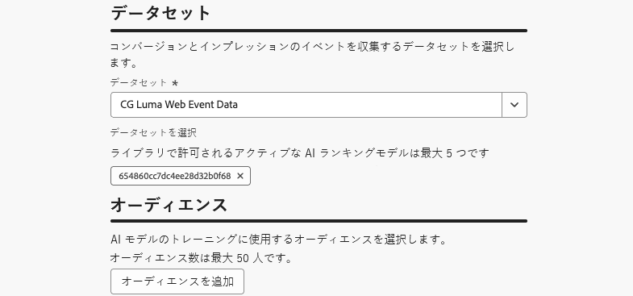

# AI モデルを使用してジャーニーをランク付けする {#journey-ai-models}

>[!AVAILABILITY]
>
>この機能は現在限定的です。 アクセス権を取得するには、アドビ担当者にお問い合わせください。

[!DNL Adobe Journey Optimizer]を使用すると、プロファイルがシステムで許可されている以上の条件を満たす場合に入力できるジャーニーを制御できます。 これには、[&#x200B; ルールセット &#x200B;](rule-sets.md)を使用して、ジャーニーのエントリまたは同時実行の上限を定義できます。 プロファイルがキャップが許可する以上のジャーニーの対象となる場合、各ジャーニーに割り当てられた優先度によって、選択されるジャーニーが決まります。

優先度を使用する代わりに、ランキング式で&#x200B;**AI モデル**&#x200B;を使用して、トレーニングされたモデル スコアに基づいてジャーニーを動的にランク付けすることもできます。

## AI モデルの作成 {#create-ai-model}

<!--
Do you need specific permissions to create AI models?
>[!CAUTION]
>
>To create, edit, or delete AI models, you must have the **Manage Ranking Strategies** permission. [Learn more](../administration/high-low-permissions.md#manage-ranking-strategies)
-->

ジャーニーランキング用のAI モデルを作成するには、次の手順に従います。

1. コンバージョンイベントが収集されるデータセットを作成します。[方法についてはこちらを参照](../experience-decisioning/data-collection/create-dataset.md)

1. 「**[!UICONTROL オーケストレーションランキング]**」セクションにアクセスし、「**[!UICONTROL AI モデル]**」タブを選択します。 以前に作成したAI モデルのリストが表示されます。

1. 「**[!UICONTROL AI モデルを作成]**」をクリックします。

1. 一意の名前を指定し、必要に応じてAI モデルの説明を指定します。

   {width="85%"}

   >[!NOTE]
   >
   >ランキング オブジェクトは、ランキング式が適用されるエンティティです。 デフォルトでは、ランキングオブジェクトは&#x200B;**[!UICONTROL ジャーニー]**&#x200B;に設定されています。

<!--
1. Select the type of AI model you want to create:

    * **[!UICONTROL Auto-optimization]** optimizes based on past performance. [Learn more](../experience-decisioning/ranking/auto-optimization-model.md)
    * **[!UICONTROL Personalized optimization]** optimizes and personalizes based on audiences and performance. [Learn more](../experience-decisioning/ranking/personalized-optimization-model.md)
-->

1. **[!UICONTROL 最適化指標]** セクションでは、デフォルトの[!DNL Customer Journey Analytics] [&#x200B; データビュー](https://experienceleague.adobe.com/ja/docs/analytics-platform/using/cja-dataviews/data-views){target="_blank"}のすべての指標がリストに表示されます。 モデルを最適化する指標を選択します。

   {width="70%"}

   [!DNL Journey Optimizer]は、**コンバージョン率**&#x200B;に基づいてランク付けされます（コンバージョン率= コンバージョンイベントの総数/ インプレッションイベントの総数）。 コンバージョン率は、次のように計算されます。

   * **インプレッションイベント** （表示されるアイテム）
   * **コンバージョンイベント** （クリックまたはコンバージョンにつながるアイテム）

   これらのイベントは、Web SDKまたはモバイル SDKを使用して自動的にキャプチャされます。 詳しくは、[Adobe Experience Platform Web SDK](https://experienceleague.adobe.com/docs/experience-platform/edge/home.html?lang=ja) 概要を参照してください。

1. コンバージョンイベントとインプレッションイベントが収集されるデータセットを選択します。このようなデータセットを作成する方法について詳しくは、[この節](../experience-decisioning/data-collection/create-dataset.md)を参照してください。

   コンバージョンイベントおよびインプレッションイベント用の{width="85%"}

   >[!CAUTION]
   >
   >「**[!UICONTROL エクスペリエンスイベント – 提案インタラクション]**」フィールドグループに関連付けられたスキーマから作成されたデータセットのみが、ドロップダウンリストに表示されます。 最大5つのデータセットを選択できます。

1. &#x200B;<!--If you are creating a **[!UICONTROL Personalized optimization]** AI model, -->AI モデルのトレーニングに使用するセグメントを選択します。

   >[!NOTE]
   >
   >最大 50 個のオーディエンスを選択できます。

1. AI モデルを保存して有効化します。

ランキング式を作成する際に、AI モデルを選択できるようになりました。

## ジャーニーをランク付けするために、数式でAI モデルを参照する {#reference-ai-model}

AI モデルを参照として設定してランキング式を作成し、その式をルールセットに割り当てて、ルールセットをジャーニーに適用できるようになりました。 これを行うには、以下の手順に従います。

1. ランキング式を作成します。 [詳細情報](journey-ranking-formulas.md#create-journey-ranking-formula)

1. 「**[!UICONTROL AI モデルを選択]**」ボタンを使用して、数式で使用するAI モデルを選択します。

   「AI モデルを選択」ボタンを使用して{width="80%"}

1. **[!UICONTROL 基準]** セクションのうち少なくとも1つのセクションで、条件を定義し、ランキング方法として&#x200B;**[!UICONTROL AI モデルスコア]**&#x200B;を選択します。 たとえば、ジャーニーに「プロモーション」タグが付いている場合、ランキングスコアはAI モデルスコアです。

   {width="60%"}

1. 「**[!UICONTROL 作成]**」をクリックして、ランキング式を完了します。

1. 次に、ルールセットを作成し、ランキング方法として作成した数式を選択します。 [詳細情報](journey-ranking-formulas.md#assign-formula-to-ruleset)

1. ジャーニーのキャッピングルールを作成し、ルールセットを保存します。

1. ルールセットを目的のジャーニーに適用して保存します。 [詳細情報](journey-ranking-formulas.md#assign-rule-set-to-journey)

   >[!NOTE]
   >
   >一度に1つのジャーニーに適用できるルールセットは1つだけです。

このルールセットを使用するすべてのジャーニーは、キャップが適用されたときに、選択したAI モデルを参照する数式でランク付けされます。
