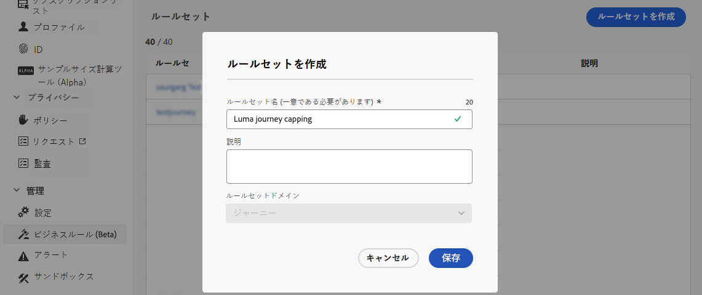
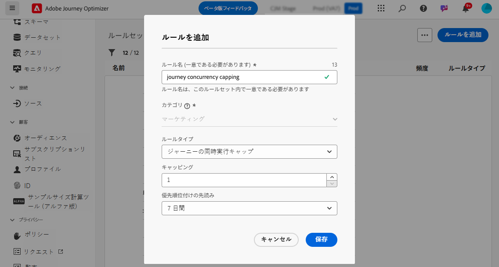
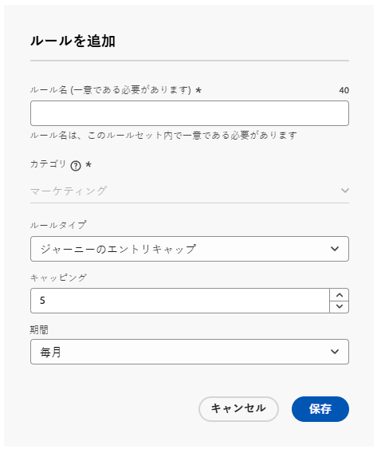
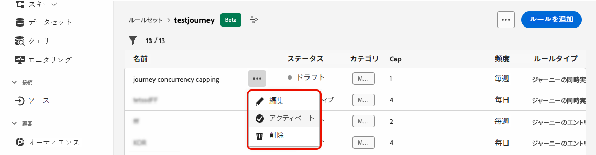
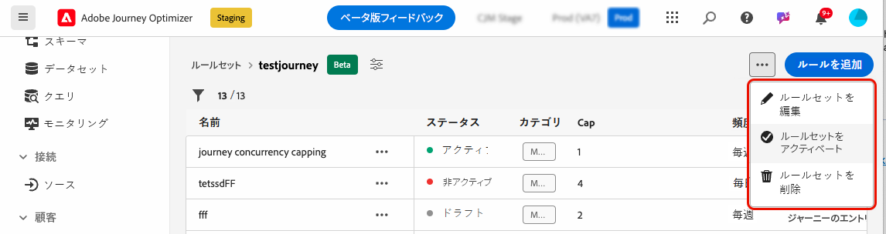
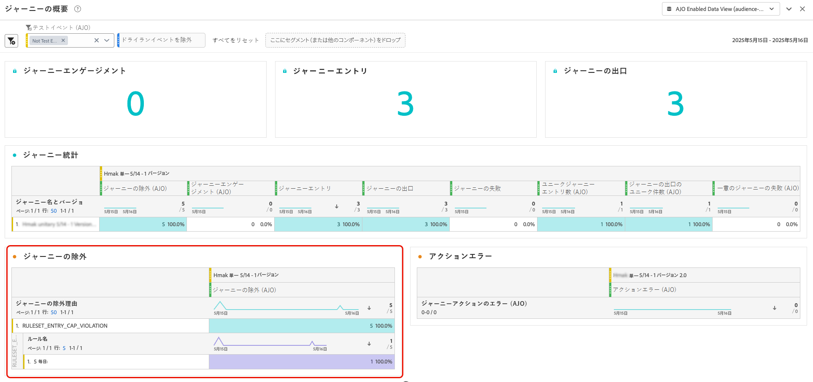

# ジャーニーのキャッピングと判別 {#journey-capping}

>[!AVAILABILITY]
>
>現在、一部のお客様のグループに対して、限定提供で競合および優先順位付け機能が提供されています。 これらの機能は、今後、より多くのユーザーに段階的にロールアウトされる予定です。これらの機能の待機リストに追加されることに興味がある場合は、アカウントチームにお問い合わせください。

ジャーニーのキャッピングは、プロファイルが登録できるジャーニーの数を制限し、過剰なコミュニケーションを防ぐのに役立ちます。Journey Optimizer では、次の 2 つのタイプのキャッピングルールを設定できます。

* **エントリキャッピング**&#x200B;では、プロファイルの特定の期間におけるジャーニーエントリの数を制限します。
* **同時実行キャッピング**&#x200B;では、プロファイルを同時に登録できるジャーニーの数を制限します。

どちらのタイプのジャーニーのキャッピングでも、優先度スコアを活用してエントリを判別します。

➡️ [この機能をビデオで確認](#video)

## ジャーニーのキャッピングルールの作成 {#create-rule}

>[!CONTEXTUALHELP]
>id="ajo_rule_set_concurrency_prioritization"
>title="優先順位付けの先読み"
>abstract=" ここで指定した期間内に、優先度の高いジャーニーがスケジュールされている場合、顧客はこのジャーニーにエントリできなくなります。ジャーニーを先着順でエントリさせる場合は、毎日の先行表示期間を選択し、その日の他のジャーニーの優先度スコアがそのジャーニーの優先度スコアよりも低くなるようにすることをお勧めします。また、ジャーニーに優先度スコア 100 を指定すると、ジャーニーへのエントリが確実になります。"

>[!CONTEXTUALHELP]
>id="ajo_rule_set_rule_type"
>title="ルールタイプ"
>abstract="ルールのキャッピングのタイプを指定します。**[!UICONTROL ジャーニーのエントリキャップ]**&#x200B;は、プロファイルの特定の期間におけるジャーニーへのエントリ数を制限し、**[!UICONTROL ジャーニーの同時実行キャップ]**&#x200B;は、プロファイルを同時に登録できるジャーニーの数を制限します。"

ジャーニーのキャッピングルールを作成するには、次の手順に従います。

1. **[!UICONTROL ビジネスルール（ベータ版）]**&#x200B;メニューに移動し、ルールセットインベントリにアクセスします。

1. キャッピングルールを追加するルールセットを選択するか、新しいルールセットを作成します。

   * 既存のルールセットを使用するには、リストから選択します。ジャーニーのキャッピングルールは、「ジャーニー」ドメインを持つルールセットにのみ追加できます。この情報は、ルールセットリストの&#x200B;**[!UICONTROL ドメイン]**&#x200B;列で確認できます。

     

   * 新しいルールセット内にキャッピングルールを作成するには、「**[!UICONTROL ルールセットを作成]**」をクリックし、ルールセットの一意の名前を指定して、**[!UICONTROL ルールセットドメイン]**&#x200B;ドロップダウンから「ジャーニー」を選択し、「**[!UICONTROL 保存]**」をクリックします。

     

1. ルールセット画面で、「**[!UICONTROL ルールを追加]**」ボタンをクリックし、必要に応じてルールを設定します。

   

   * ルールに一意の名前を指定します。

   * **[!UICONTROL ルールタイプ]**&#x200B;ドロップダウンリストで、ルールのキャッピングのタイプを指定します。

      * **[!UICONTROL ジャーニーのエントリキャップ]**：プロファイルの特定の期間におけるジャーニーへのエントリ数を制限します。
      * **[!UICONTROL ジャーニーの同時実行キャップ]**：プロファイルを同時に登録できるジャーニーの数を制限します。

   * 各タイプのキャッピングを設定する方法について詳しくは、以下の節を展開してください。

     +++ジャーニーのエントリキャッピングルールの設定

      1. 「**[!UICONTROL キャッピング]**」フィールドで、プロファイルが入力できるジャーニーの最大数を設定します。
      1. 「**[!UICONTROL 期間]**」フィールドで、考慮する期間を定義します。期間は UTC タイムゾーンに基づきます。例えば、日別のキャップは午前 0 時（UTC）にリセットされます。

     >[!AVAILABILITY]
     >
     >「毎日」の期間は、オンデマンドでのみ使用できます。 アクセス権を取得するには、Adobe担当者にお問い合わせください。

     この例では、プロファイルが 1 か月に「5」を超えるジャーニーにエントリできないように制限します。

     

     >[!NOTE]
     >
     >システムでは、この同じルールが適用される今後のスケジュール済みジャーニーの優先度を考慮します。
     >
     >この例では、マーケターが既に 4 つのジャーニーにエントリし、今月中に優先度の高い別のスケジュール済みジャーニーが予定されている場合、顧客は優先度の低いジャーニーにエントリできなくなります。

+++

     +++ジャーニーの同時実行キャッピングルールの設定

      1. 「**[!UICONTROL キャッピング]**」フィールドで、プロファイルが同時に登録できるジャーニーの最大数を設定します。

      1. 「**[!UICONTROL 優先順位付けの先読み]**」フィールドを使用して、選択した期間（1 日、7 日、30 日など）の優先度スコアに基づいてジャーニーエントリを判別します。これは、プロファイルが複数のジャーニーの対象となる場合に、より価値の高いジャーニーへのエントリを優先順位付けするのに役立ちます。

     この例では、同じルールセットを含む別のジャーニーに既に登録されているプロファイルがジャーニーにエントリできないように制限します。今後 7 日以内に別のジャーニーの優先度スコアがより高い場合、プロファイルはこのジャーニーにエントリしません。

     {width="50%" zommable="yes"}

+++

1. キャッピングルールをジャーニーに適用する準備が整ったら、名前の横にある省略記号ボタンをクリックしてアクティベートします。

   

1. 画面の右上隅にある「ルールを追加」ボタンの横にある省略記号ボタンをクリックして、ルールセット全体をアクティベートします。

   

## ジャーニーへのキャッピングルールの適用 {#apply-capping}

>[!CONTEXTUALHELP]
>id="ajo_journey_capping_rule"
>title="ジャーニーにルールセットを適用"
>abstract="ルールセットを適用して、フリークエンシーキャップルールに基づいて一部のオーディエンスに対するこのジャーニーを除外します。"

キャッピングルールをジャーニーに適用するには、ジャーニーにアクセスしてプロパティを開きます。**[!UICONTROL キャッピングルール]** ドロップダウンで、関連するルールセットを選択します。 ジャーニーをアクティベートすると、ルールセットで定義されたキャッピングルールが有効になります。

>[!IMPORTANT]
>
>ジャーニーがすぐにアクティベートされた場合、システムが顧客の抑制を開始するまで最大 15 分かかることがあります。これを防ぐには、少なくとも 15 分後にジャーニーを開始するようにスケジュールを設定できます。

ジャーニーがライブになったら、ジャーニーレポートをチェックインして、ルールセットがジャーニーからの除外（**[!UICONTROL ジャーニーの除外]** テーブル）につながっているかどうかを確認できます。 [ ジャーニーレポートの操作方法を学ぶ ](../reports/journey-global-report-cja.md)

## チュートリアルビデオ {#video}

>[!VIDEO](https://video.tv.adobe.com/v/3435530?quality=12)
