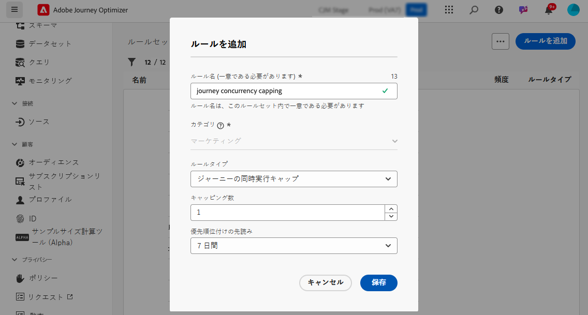
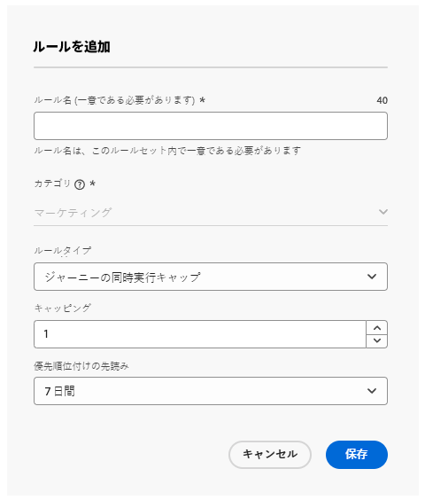
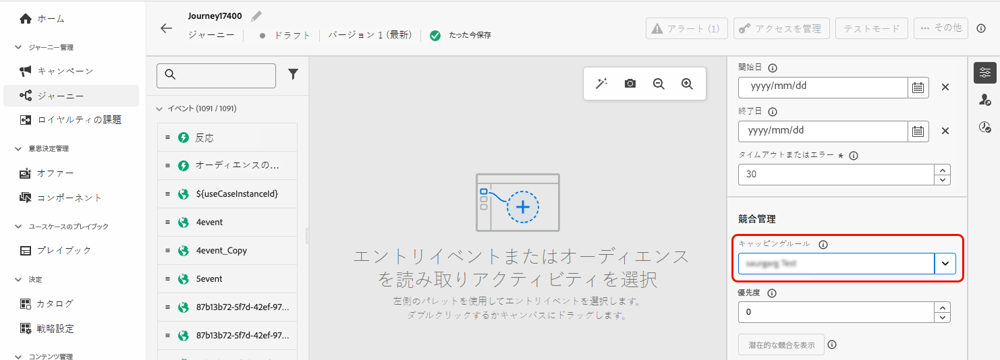

# ジャーニーのキャッピングと判別 {#journey-capping}

ジャーニーのキャッピングは、プロファイルが登録できるジャーニーの数を制限し、過剰なコミュニケーションを防ぐのに役立ちます。Journey Optimizer では、次の 2 つのタイプのキャッピングルールを設定できます。

* **エントリキャッピング**&#x200B;では、プロファイルの特定の期間におけるジャーニーエントリの数を制限します。
* **同時実行キャッピング**&#x200B;では、プロファイルを同時に登録できるジャーニーの数を制限します。

どちらのタイプのジャーニーのキャッピングでも、優先度スコアを活用してエントリを判別します。

➡️ [ビデオでこの機能を確認する](#video)

## ジャーニーのキャッピングルールの作成 {#create-rule}

>[!CONTEXTUALHELP]
>id="ajo_rule_set_concurrency_prioritization"
>title="優先順位付けの先読み"
>abstract=" ここで指定した期間内に、優先度の高いジャーニーがスケジュールされている場合、顧客はこのジャーニーにエントリできなくなります。ジャーニーを先着順でエントリさせる場合は、毎日の先行表示期間を選択し、その日の他のジャーニーの優先度スコアがそのジャーニーの優先度スコアよりも低くなるようにすることをお勧めします。また、ジャーニーに優先度スコア 100 を指定すると、ジャーニーへのエントリが確実になります。"

>[!CONTEXTUALHELP]
>id="ajo_rule_set_rule_type"
>title="ルールタイプ"
>abstract="ルールのキャッピングのタイプを指定します。**[!UICONTROL ジャーニーのエントリキャップ]**&#x200B;は、プロファイルの特定の期間におけるジャーニーへのエントリ数を制限し、**[!UICONTROL ジャーニーの同時実行キャップ]**&#x200B;は、プロファイルを同時に登録できるジャーニーの数を制限します。"

ジャーニーのキャッピングルールを作成するには、次の手順に従います。

1. **[!UICONTROL ビジネス・ルール]** メニューにナビゲートして、ルール・セットのインベントリにアクセスします。

1. キャッピングルールを追加するルールセットを選択するか、新しいルールセットを作成します。

   * 既存のルールセットを使用するには、リストから選択します。ジャーニーのキャッピングルールは、「ジャーニー」ドメインを持つルールセットにのみ追加できます。この情報は、ルールセットリストの&#x200B;**[!UICONTROL ドメイン]**&#x200B;列で確認できます。

     

   * 新しいルールセット内にキャッピングルールを作成するには、「**[!UICONTROL ルールセットを作成]**」をクリックし、ルールセットの一意の名前を指定して、**[!UICONTROL ルールセットドメイン]**&#x200B;ドロップダウンから「ジャーニー」を選択し、「**[!UICONTROL 保存]**」をクリックします。

     

1. ルールセット画面で「**[!UICONTROL ルールを追加]**」ボタンをクリックし、ルールに一意の名前を指定します。

1. **[!UICONTROL ルールタイプ]**&#x200B;ドロップダウンリストで、ルールのキャッピングのタイプを指定します。

   * **[!UICONTROL ジャーニーのエントリキャップ]**：プロファイルの特定の期間におけるジャーニーへのエントリ数を制限します。
   * **[!UICONTROL ジャーニーの同時実行キャップ]**：プロファイルを同時に登録できるジャーニーの数を制限します。

   

1. 各タイプのキャッピングを設定する方法について詳しくは、以下の節を展開してください。

   +++ジャーニーのエントリキャッピングルールの設定

   1. 「**[!UICONTROL キャッピング]**」フィールドで、プロファイルが入力できるジャーニーの最大数を設定します。
   1. 「**[!UICONTROL 期間]**」フィールドで、考慮する期間を定義します。期間は UTC タイムゾーンに基づきます。例えば、日別のキャップは午前 0 時（UTC）にリセットされます。

   この例では、プロファイルが 1 か月に「5」を超えるジャーニーにエントリできないように制限します。

   

   >[!NOTE]
   >
   >システムでは、この同じルールが適用される今後のスケジュール済みジャーニーの優先度を考慮します。
   >
   >この例では、マーケターが既に 4 つのジャーニーにエントリし、今月中に優先度の高い別のスケジュール済みジャーニーが予定されている場合、顧客は優先度の低いジャーニーにエントリできなくなります。

   +++

   +++ジャーニーの同時実行キャッピングルールの設定

   1. 「**[!UICONTROL キャッピング]**」フィールドで、プロファイルが同時に登録できるジャーニーの最大数を設定します。

   1. 「**[!UICONTROL 優先順位付けの先読み]**」フィールドを使用して、選択した期間（1 日、7 日、30 日など）の優先度スコアに基づいてジャーニーエントリを判別します。これは、プロファイルが複数のジャーニーの対象となる場合に、より価値の高いジャーニーへのエントリを優先順位付けするのに役立ちます。

   この例では、同じルールセットを含む別のジャーニーに既に登録されているプロファイルがジャーニーにエントリできないように制限します。今後 7 日以内に別のジャーニーの優先度スコアがより高い場合、プロファイルはこのジャーニーにエントリしません。

   {width="50%" zommable="yes"}

   +++

1. 上記の手順を繰り返して、必要な数のルールをルールセットに追加します。

1. キャッピングルールをジャーニーに適用する準備ができたら、ルールと、ルールが追加されたルールセットをアクティブにします。 [ ルールセットをアクティブ化する方法については、こちらを参照してください ](../conflict-prioritization/rule-sets.md#create)

## ジャーニーへのキャッピングルールの適用 {#apply-capping}

>[!CONTEXTUALHELP]
>id="ajo_journey_capping_rule"
>title="ジャーニーにルールセットを適用"
>abstract="ルールセットを適用して、フリークエンシーキャップルールに基づいて一部のオーディエンスに対するこのジャーニーを除外します。"

キャッピングルールをジャーニーに適用するには、ジャーニーにアクセスしてプロパティを開きます。**[!UICONTROL キャッピングルール]** ドロップダウンで、関連するルールセットを選択します。 ジャーニーをアクティベートすると、ルールセットで定義されたキャッピングルールが有効になります。

>[!NOTE]
>
>ジャーニーがすぐにアクティベートされた場合、システムが顧客の抑制を開始するまで最大 10 分かかることがあります。その結果、開始時間が 10 分未満のジャーニーを公開しようとすると、メッセージが表示されます。

## ルールセットの除外の監視 {#monitor}

ジャーニーがライブになったら、ジャーニーレポートをチェックインして、ルールセットがジャーニーからの除外（**[!UICONTROL ジャーニーの除外]** テーブル）につながっているかどうかを確認できます。 ジャーニーの除外テーブルには、除外の詳細な分類がルールセット別およびルール名別に含まれており、プロファイルが破棄された理由に関するインサイトが提供されます。 [ ジャーニーレポートの操作方法を学ぶ ](../reports/journey-global-report-cja.md)

さらに、Adobe Experience Platform **クエリサービス** を利用して、特定のジャーニーにプロファイルがエントリしなかった原因となったルールを特定するクエリを作成することもできます。 クエリの例については、[ この節 ](../reports/query-examples.md#common-queries) を参照してください。

## チュートリアルビデオ {#video}

>[!VIDEO](https://video.tv.adobe.com/v/3447613?quality=12&captions=jpn)
