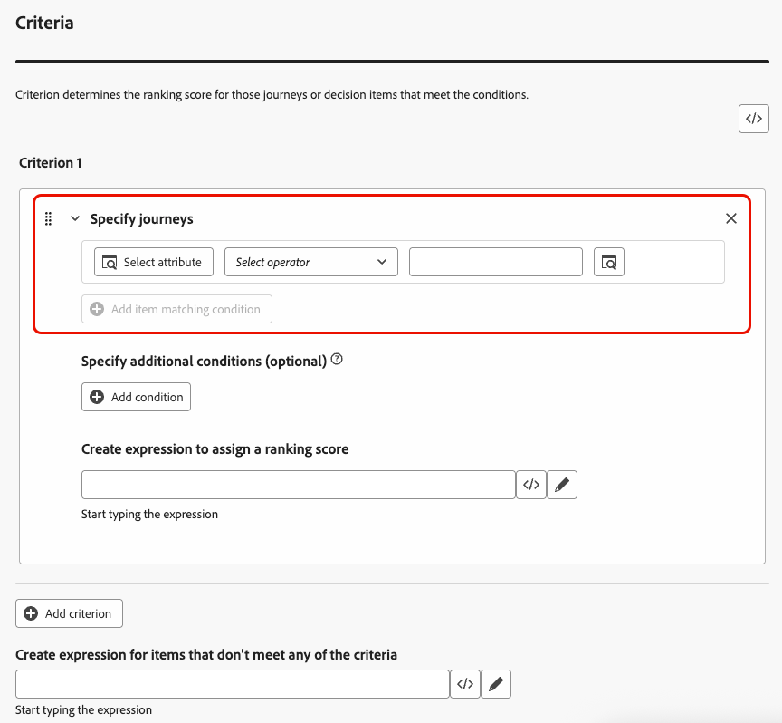
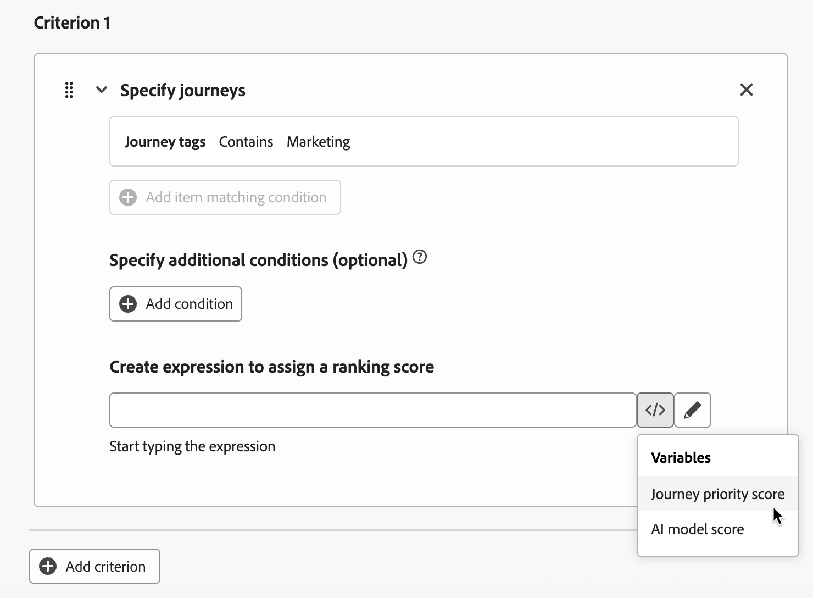
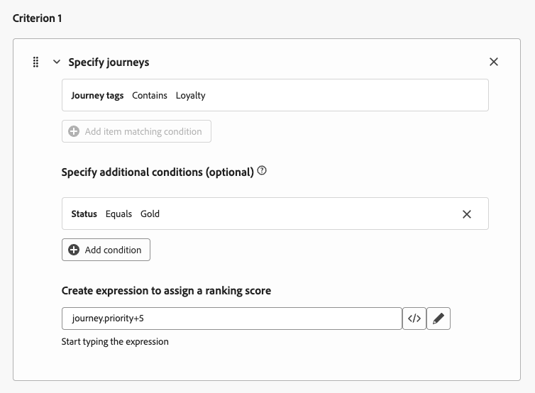
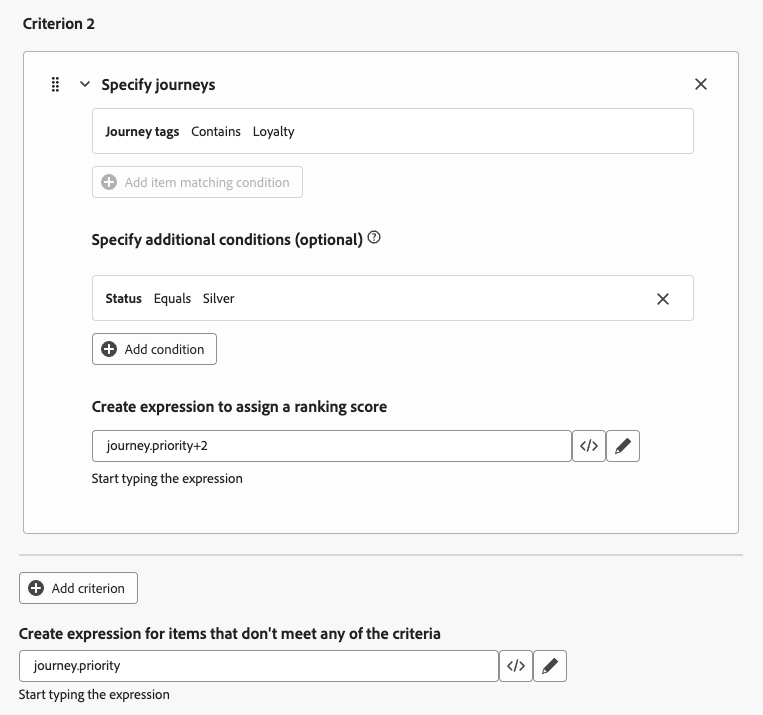
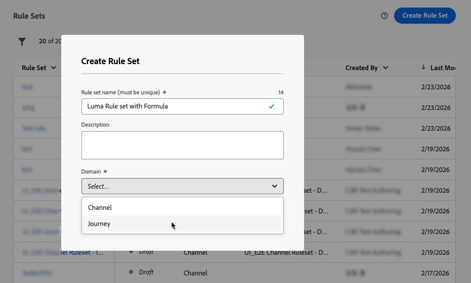

# ジャーニーのランク付けに数式を使用 {#journey-ranking-formulas}

>[!AVAILABILITY]
>
>この機能は現在、限定提供（LA）になっています。 アクセス権を取得するには、アドビ担当者にお問い合わせください。

[!DNL Adobe Journey Optimizer] れは、プロファイルがシステムで許可されている量以上の対象として認定されたときに、そのプロファイルが入力できるジャーニーを制御するのに役立ちます。 これを行うには、[ ルールセット ](rule-sets.md) を使用して、ジャーニーのエントリまたは同時実行に対するキャップを定義します。 プロファイルが上限を超えるジャーニーに対して適格な場合、各ジャーニーに割り当てられる優先度によって、選択されるジャーニーが決まります。

優先度を使用する代わりに、**ランキング式** を使用して、ジャーニー属性、プロファイル属性または AI モデルスコアに基づいてジャーニーのランキングを動的に調整することもできます。

数式を使用すると、静的な優先度よりも高い柔軟性が得られます。 例えば、ゴールドロイヤルティメンバーのジャーニーを強化できます。

<!--
>[!NOTE]
>
>Journey ranking formulas follow the same guardrails as decisioning ranking formulas (nesting depth, rule string size). [Learn more about Decisioning guardrails & limitations](../experience-decisioning/decisioning-guardrails.md#ranking-formulas).-->

## ランキング式の作成 {#create-journey-ranking-formula}

ジャーニーのランキング式を作成するには、次の手順に従います。

1. 「**[!UICONTROL オーケストレーションランキング]**」セクションにアクセスし、「**[!UICONTROL ランキング式]**」タブを選択します。 以前に作成した式のリストが表示されます。

1. 「**[!UICONTROL 数式を作成]**」をクリックします。

1. 数式名を指定し、必要に応じて説明を追加します。

   {width="80%"}

   >[!NOTE]
   >
   >ランキングオブジェクトは、ランキング式が適用されるエンティティです。 デフォルトでは、ランキングオブジェクトは **[!UICONTROL ジャーニー]** に設定されています。

   <!--
    Selecting a formula entity specifies which type of item—such as journeys or other entities—the ranking formula will apply to. This determines the context in which the formula operates, allowing you to define rules that influence how those items are ranked.-->

1. オプションで、「**[!UICONTROL AI モデルを選択]**」をクリックして、ランキング式を作成するための参照として使用するモデルを設定します。[詳細情報](journey-ai-models.md)

<!--
    >[!NOTE]
    >
    >[Personalized optimization models](../experience-decisioning/ranking/personalized-optimization-model.md) using continuous metrics are not supported with the AI formula builder.

    Every time you refer to a model score when defining your formula below, the AI model that you selected will be used. [Learn more on AI models](../experience-decisioning/ranking/ai-models.md)-->

1. 「**[!UICONTROL 条件 1]**」セクションで、次の操作を実行して、ランキングスコアを適用するジャーニーを指定します。

   * [ ジャーニー属性 ](../building-journeys/journey-properties.md) （ジャーニー名、タグ、優先度、その他のジャーニープロパティなど）を選択します。
   * 論理演算子を選択します。
   * 一致条件を追加 – 値を入力/選択するか、プロファイル属性を選択できます。

   {width="70%"}

1. オプションで、追加の要素を指定して、条件が true になる一致条件を絞り込むことができます。

   {width="70%"}

   例えば、*ジャーニータグ* などの *基準 1* に *ロイヤルティ* を含めるように定義したとします。 さらに、*ロイヤルティステータス* が *ゴールド* に等しい場合、*条件 1* が true であるなど、別の条件を追加できます。

1. 上記で定義した条件を満たすジャーニーにランキングスコアを割り当てる式を作成します。 次のいずれかを参照できます。
   * 変数：
      * ジャーニーの優先度。これは、（ジャーニーの作成 [ 時にジャーニーに割り当てられる手動の値 ](../building-journeys/journey-gs.md)
      * 上記でオプションで選択した AI モデルのスコア
   * 属性：
      * 外部で派生した傾向スコアなど、プロファイルに存在する可能性のある属性。
      * ジャーニー属性。
   * 自由な形式で割り当てることができる静的な値。
   * 上記のすべての組み合わせ。

   {width="70%"}

1. 「**[!UICONTROL 条件を追加]**」をクリックし、必要な回数に応じて 1 つ以上の条件を追加します。ロジックは次のとおりです。
   * 特定の決定項目に対して最初の条件が true である場合、その条件は次の条件よりも優先されます。
   * 最初の条件が true でない場合、決定エンジンは 2 番目の条件に進み、それ以降も同様に処理されます。

1. 最後のフィールドですべての条件を定義したら、上記の条件を満たさないすべてのジャーニーに割り当てる式を作成できます。

   {width="70%"}

1. 「**[!UICONTROL 作成]**」をクリックして、ランキング式を完成させます。

この式をリストから選択して詳細を表示し、編集または削除できるようになりました。 その後、ルールセットを設定するときに使用できます。 [詳細情報](#assign-formula-to-ruleset)

### ランキング式の例 {#journey-ranking-formula-example}

次の例をご覧ください。

+++例 1：ジャーニータグに基づくジャーニーの優先度または AI スコアの使用

{width="60%"}

ジャーニーに「マーケティング」タグがある場合、ランキングスコアがジャーニーの優先度になります。

{width="60%"}

ジャーニーに「プロモ」タグがある場合、ランキングスコアは AI モデルスコアです。

+++

+++例 2：プロファイルステータス別のロイヤルティジャーニーのブースト

{width="60%"}

ジャーニーに「ロイヤルティ」タグがあり、プロファイルのロイヤルティステータスがゴールドの場合、使用されるランキングスコアは、ジャーニーの優先度に 5 を加えたスコアになります。

{width="60%"}

ジャーニーに「ロイヤルティ」タグがあり、プロファイルのロイヤルティステータスがシルバーの場合、ランキングスコアは、ジャーニーの優先度に 2 を加えた値になります。

上記の条件がいずれも満たされない場合、使用されるランキングスコアはジャーニーの優先度です。

+++

### コードエディターの使用 {#journey-ranking-formula-code-editor}

ランキング式を **PQL 構文**&#x200B;で表すには、画面の右上にある専用ボタンを使用してコードエディターに切り替えます。PQL 構文の使用方法について詳しくは、[関連するドキュメント](https://experienceleague.adobe.com/docs/experience-platform/segmentation/pql/overview.html?lang=ja)を参照してください。

>[!CAUTION]
>
>このアクションは、この式のデフォルトのビルダー表示に戻るのを防ぎます。

その後、ジャーニー属性、プロファイル属性、静的な値を活用してランキング式を作成できます。

<!--The code editor is similar to the one used in Decisioning ranking formulas. [Learn more](../experience-decisioning/ranking/ranking-formulas.md#ranking-code-editor)-->

## ルール・セットへの式の割当て {#assign-formula-to-ruleset}

ジャーニーのランク付けに数式を使用するには、その数式をルールセットに割り当てる必要があります。

>[!NOTE]
>
>数式は、個々のジャーニーではなく、ルールセットレベルで割り当てられます。

1. **[!UICONTROL ビジネスルール]** メニューから、ジャーニーの判別に使用するルールセットを作成します。 [詳細情報](rule-sets.md#Create)

1. 必ず **[!UICONTROL ジャーニー]** ドメインを選択してください。

   {width="60%"}

1. ルールセットのプロパティで、**[!UICONTROL ランキング方法]** を（デフォルトの **[!UICONTROL 優先度]** ではなく **[!UICONTROL 式]** に設定します。

1. ドロップダウンリストから、作成したランキング式を選択します。

   {width="60%"}

1. ルールセットに追加するジャーニーキャッピングルールを作成します。 [詳細情報](journey-capping.md#create-rule)

1. ルールセットを保存します。

これで、式がルールセットに割り当てられます。 その後、そのルールセットをジャーニーに適用できます。

## ジャーニーへのルールセットの適用 {#assign-rule-set-to-journey}

ジャーニーにルールセットを割り当てるには、次の手順に従います。

1. ルールセットを割り当てるジャーニーを作成するか、開きます。 [詳しくは、ジャーニーの作成方法を参照してください。](../building-journeys/journey-gs.md)

1. ジャーニーのプロパティで、ドロップダウンリストからルールセットを選択します。  [方法についてはこちらを参照してください](journey-capping.md#apply-capping)。

   >[!NOTE]
   >
   >ジャーニーに一度に適用できるルールセットは 1 つだけです。

1. ジャーニーを保存します。

このルールセットを使用するすべてのジャーニーは、キャップが適用されると、選択した式でランク付けされます。

ルールセットとランキング式のパフォーマンスを監視するには、概要レポートの [ジャーニーのキャッピングと競合 ](../reports/channel-report-cja.md#rule-sets) の節を参照してください。

<!--
## Reporting {#reporting}

Reporting for journey arbitration helps you understand how rule sets and ranking formulas perform:

* **Exclusions** – Whether journeys were excluded from users and which rule set (and reason) prevented entry.
* **Rule set performance** – For each rule set, metrics such as journey enters, journey exclusions, journey engagement, and other optimization metrics.
* **Cross-journey view** – Time-based view of profiles across journeys (e.g. journey enters, failures, exclusions) to see the impact of capping and ranking.

Use these reports to validate that your formulas and caps are behaving as intended and to tune ranking logic over time.-->
