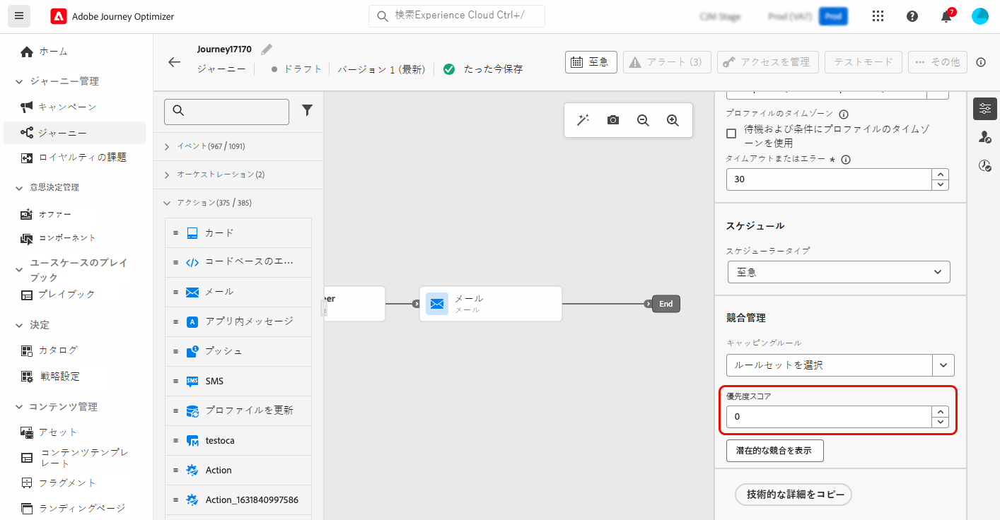

# 優先度スコアの割り当て {#priority}

Journey Optimizer を使用すると、ジャーニーの&#x200B;**[!UICONTROL アクション]**&#x200B;アクティビティ内のジャーニー、キャンペーンまたはインバウンドチャネルアクションに優先度スコアを割り当てることができます。

制限（フリークエンシーキャップなど）が課せられている場合、ジャーニー、キャンペーンまたはアクションの優先順位を付けるために優先度が不可欠です。

顧客が多数のジャーニー、キャンペーンまたはコミュニケーションの対象となり、エントリおよび受信するコンテンツを選択的にする場合は、このフィールドを利用する必要があります。

## ジャーニーとキャンペーンへの優先度スコアの割り当て {#priority-journey-campaign}

>[!CONTEXTUALHELP]
>id="ajo_campaigns_campaign_priority"
>title="優先度"
>abstract="キャンペーンに優先度スコアを割り当てます。フリークエンシーキャップなどの制限が課せられている場合、キャンペーンの優先順位を付けるために優先度が不可欠です。 数値（0～100）を入力します。数値が大きいほど優先度が高くなります。2 つのキャンペーンの優先度スコアが同じ場合、最初にアクティベートされたキャンペーンが表示されます。"

>[!CONTEXTUALHELP]
>id="ajo_journey_priority"
>title="優先度"
>abstract="ジャーニーに優先度スコアを割り当てます。フリークエンシーキャップなどの制限が課せられている場合、ジャーニーの優先順位を付けるために優先度が不可欠です。 数値（0～100）を入力します。数値が大きいほど優先度が高くなります。2 つのジャーニーの優先度スコアが同じ場合、最初にアクティベーションされたジャーニーが表示されます。"

➡️ [この機能をビデオで確認](#video)

優先度スコアの割り当ては、web、モバイル、アプリ内などのインバウンド通信ではきわめて重要です。同じチャネル設定（web ページの上部にあるバナーなど）を使用している複数のキャンペーンがある場合、1 つのキャンペーンからのコンテンツのみが表示される可能性があるので、これが問題となる可能性があります。優先度スコアには、受信者が複数のキャンペーンの対象となる場合に、どのキャンペーンが表示されるべきかの優先順位を挿入します。

>[!NOTE]
>
>キャンペーンでは、優先度スコアは web、アプリ内、コードベースのインバウンドチャネルでのみ使用できます。

ジャーニーまたはキャンペーンに優先度スコアを割り当てるには、ジャーニープロパティまたはキャンペーンプロパティにある「**[!UICONTROL 優先度スコア]**」フィールドに数値（0～100）を入力します。数値が大きいほど優先度が高くなります。

このキャンペーンをオーサリングしていて、このキャンペーンのコンテンツが必ず表示されるようにするには、100 のスコアを付けます。

>[!IMPORTANT]
>
>2 つのジャーニーまたはキャンペーンの優先度スコアが同じ場合、システムにはタイブレークメカニズムがありません。競合を避けるために、優先度スコアが一意であることを確認します。

## インバウンドアクションへの優先度スコアの割り当て {#priority-action}

>[!CONTEXTUALHELP]
>id="ajo_journey_action_priority"
>title="優先度"
>abstract="ジャーニーアクションに優先度スコアを割り当てます。同じチャネル設定を使用するジャーニーアクションまたはキャンペーンが複数ある場合、インバウンドアクションの優先順位を付けるために優先度が不可欠です。 数値（0～100）を入力します。数値が大きいほど優先度が高くなります。デフォルトでは、アクションの優先度スコアは、ジャーニーの全体的な優先度スコアから継承されます。"

また、Journey Optimizer を使用すると、[アクション](../building-journeys/journey-action.md)アクティビティ内のインバウンドチャネルアクションに優先度スコアを割り当てることもできます。

これにより、同じチャネル設定を使用するジャーニーアクションまたはキャンペーンが複数ある場合、インバウンドアクションの優先順位を付けることができます。

>[!NOTE]
>
>**[!UICONTROL アクション]**&#x200B;アクティビティでは、優先度スコアは web、アプリ内、コードベースのインバウンドチャネルでのみ使用できます。

「**[!UICONTROL 競合管理]**」セクションでは、「**[!UICONTROL ジャーニーの優先度を使用]**」オプションがデフォルトで選択され、アクションの優先度スコアは、ジャーニーの全体的な優先度スコアから継承されます。

**[!UICONTROL アクション]**&#x200B;アクティビティで定義されたインバウンドアクションに優先度スコアを割り当てるには、「**[!UICONTROL ジャーニーの優先度を使用]**」オプションを選択解除し、「**[!UICONTROL 優先度]**」フィールドに数値（0～100）を入力します。数値が大きいほど優先度が高くなります。

{width=70%}

## チュートリアルビデオ {#video}

>[!VIDEO](https://video.tv.adobe.com/v/3435529?quality=12)
