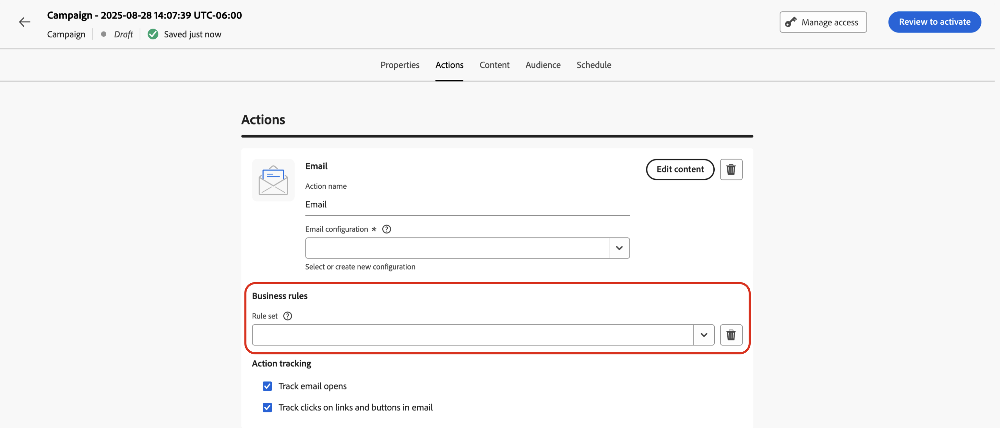

# クワイエットアワーの設定 {#quiet-hours}

## クワイエットアワーとは

**クワイエットアワー**&#x200B;では、**メール**、**SMS**、**プッシュ**、**WhatsApp** の各チャネルについて、時間ベースの除外を定義できます。これにより、特定の期間中にメッセージが送信されなくなり、顧客の環境設定やコンプライアンス要件を適用できます。

クワイエットアワーは、キャンペーンやジャーニー内の個々のアクションに割り当てて、正確な制御を行うことができる&#x200B;**ルールセット**&#x200B;を通じて適用できます。

これらのプロセスを効率化して、カスタマーエクスペリエンスを向上させ、時間を節約し、コミュニケーションルールのコンプライアンスを確保できます。

* **顧客を目覚めさせない** - *適切な顧客、適切なチャネル、適切な時間*&#x200B;は、多くのマーケターの合言葉であるので、タイミングがカスタマージャーニーの重要な部分であることは明らかです。クワイエットアワーを設定することで、ブランドは連絡先がメッセージを受信するタイミングをより適切に制御し、連絡先がメッセージに対してアクションを実行する可能性が最も高いタイミングにメッセージを受信できます。
* **利便性** - ジャーニーやキャンペーン全体を停止することなく、オーディエンスがメッセージを受信するのを防ぐ必要がある場合に、キャンペーンやジャーニーをまたいで通信を簡単に傍受します。
* **時間の節約** - カスタム式を使用して複数の条件ノードを追加する代わりに、**時間ベースのルール**&#x200B;を作成して、除外を 1 か所で管理します。\
  <!--* **Extra Safeguard** - Benefit from an extra safeguard in case audience criteria or time-window configurations were incorrectly set, ensuring individuals are still excluded when they should be.-->

>[!AVAILABILITY]
>
>クワイエットアワールールは現在、一連の組織でのみ使用できます（限定提供）。待機リストに追加するには、アドビ担当者にお問い合わせください。

➡️ [この機能について詳しくは、ビデオを参照してください](#video)。

## ガードレールと制限

* **サポートされているチャネル** - メール、SMS、プッシュ、WhatsApp。
  <!--* **Custom actions** – For custom actions, only quiet hours rules are enforced. If a rule set also includes other rules (e.g., frequency capping), those rules are ignored.-->
* **生成の遅延** - クワイエットアワールールの更新が、既にそのルールを使用しているチャネルアクションに適用されるまでに最大 12 時間かかる場合があります。
  <!--* **Pre-suppression window** – The system begins suppressing communications 30 minutes before quiet hours start, ensuring that no messages are delivered once the quiet period begins.-->
* **大量の通信による待ち時間** - 大量の通信が行われる場合、システムがクワイエットアワーの抑制の適用を正常に開始するまでに追加の時間がかかることがあります。

## クワイエットアワールールの作成

クワイエットアワーを設定するには、カスタムルールセット内にルールを作成します。次の手順に従います。

1. **[!UICONTROL ビジネスルール]**&#x200B;に移動し、ルールセットインベントリにアクセスします。

1. 既存のカスタムルールセットを選択するか、新しいルールセットを作成します。

   +++既存のルールセットにクワイエットアワールールを作成

   在庫からルールセットを選択します。クワイエットアワールールは、「チャネル」ドメインを持つルールセットにのみ追加できます。この情報は、**[!UICONTROL ドメイン]**&#x200B;列で確認できます。

   

   +++

   +++新しいルールセットにクワイエットアワールールを作成

   「**[!UICONTROL ルールセットを作成]**」をクリックし、一意の名前を入力して、**[!UICONTROL ルールセットドメイン]**&#x200B;ドロップダウンから「チャネル」を選択します。

   

   +++

   >[!NOTE]
   >
   >クワイエットアワーは、**カスタムルールセット**&#x200B;でのみ定義できます。グローバルルールセットは、クワイエットアワー設定をサポートしていません。

1. ルールセット画面で、「**[!UICONTROL ルールを追加]**」をクリックし、ルールに一意の名前を指定します。

1. 「**カテゴリ**」フィールドでは、ルールが適用されるメッセージのカテゴリを指定します。現時点では、このフィールドは読み取り専用で、デフォルトで&#x200B;**[!UICONTROL マーケティング]**&#x200B;に指定されています。

1. **[!UICONTROL ルールタイプ]**&#x200B;ドロップダウンで、「**[!UICONTROL クワイエットアワー]**」を選択します。

   

1. 「**[!UICONTROL 日付と時刻]**」セクションで、クワイエットアワーを適用するタイミングを定義します。

   1. 使用する&#x200B;**[!UICONTROL タイムゾーン]**&#x200B;を選択します。

      * **[!UICONTROL UTC／GMT]** - 個々のタイムゾーンに関係なく、オーディエンス内のすべての受信者に標準の GMT 時間ウィンドウを適用します。
      * **[!UICONTROL 受信者のローカルタイムゾーンを使用]** - 各プロファイルのタイムゾーンフィールドを使用します。 [ジャーニーでのタイムゾーン管理の詳細情報](../building-journeys/timezone-management.md#timezone-from-profiles)

        >[!IMPORTANT]
        >
        >プロファイルにタイムゾーン値がない場合、そのプロファイルではクワイエットアワーは適用されません。

   1. クワイエットアワーを適用する期間を指定します。

      * **[!UICONTROL 毎週]** - 特定の曜日と時間スロットを選択します。また、ルールを&#x200B;**[!UICONTROL 終日]**&#x200B;適用することもできます（このオプションは連続 3 日間までのみ使用できます）。

        

      * **[!UICONTROL カスタム日付]** - カレンダーの特定の日付と時間スロットを選択します。また、ルールを&#x200B;**[!UICONTROL 終日]**&#x200B;適用することもできます（このオプションは連続 3 日間までのみ使用できます）。

        

   1. 「**[!UICONTROL その他の日付を追加]**」ボタンをクリックすると、最大 5 つの個別の期間を追加できます。

      

1. 「**[!UICONTROL クワイエットアワー中の処理アクション]**」セクションで、選択した期間中のメッセージの処理方法を選択します。

   

   * **[!UICONTROL キューメッセージ]** - 一時停止状態でない限り、メッセージはクワイエットアワーの完了時に送信されます。

     >[!NOTE]
     >
     >このオプションは、ジャーニーアクションでのみ使用できます。キャンペーンアクションに適用した場合、「**[!UICONTROL メッセージを破棄]**」オプションを選択した場合と同じように動作します。

   * **[!UICONTROL メッセージを破棄]** - メッセージは送信されません。メッセージを含むジャーニーまたはキャンペーンを送信のキャンセルで終了する場合は、「**[!UICONTROL ジャーニーまたはキャンペーンを破棄して終了]**」を選択します。

## ジャーニーとキャンペーンへのクワイエットアワーの適用 {#apply}

ルールを保存し、ルールセットをアクティブ化すると、ジャーニーとキャンペーンのアクションに適用できます。サポートされているチャネル - **メール、SMS、プッシュ、WhatsApp**。詳しくは、以下のタブを参照してください。

>[!BEGINTABS]

>[!TAB ジャーニーでのクワイエットアワーチャネルアクションの適用]

1. ジャーニーを開き、[チャネルアクション](../building-journeys/journeys-message.md)を選択して、メッセージのコンテンツを編集します。
1. 「**[!UICONTROL ビジネスルールを追加]**」ボタンをクリックし、クワイエットアワールールを含むルールセットを選択します。

   

   >[!NOTE]
   >
   >[アクティブ化](#activate-rule)したルールセットのみがリストに表示されます。

1. ジャーニーをアクティブ化します。

>[!TAB キャンペーンアクションへのクワイエットアワーの適用]

1. キャンペーンを編集し、「**[!UICONTROL アクション]**」タブにアクセスします。
1. 「**[!UICONTROL ビジネスルール]**」セクションで、クワイエットアワールールを含むルールセットを選択します。

   

   >[!NOTE]
   >
   >[アクティブ化](#activate-rule)したルールセットのみがリストに表示されます。

1. キャンペーンをアクティブ化します。

>[!ENDTABS]

## 次の手順

ジャーニーまたはキャンペーンをアクティブ化および実行すると、[Customer Journey Analytics レポート](../reports/report-gs-cja.md)および[ライブレポート](../reports/live-report.md)では、配信から除外されたプロファイルの数を確認でき、配信から除外されたユーザーの理由として考えられるクワイエットアワールールが一覧表示されます。

<!--

>[!TAB Apply Quiet hours to custom actions]

1. Open your journey and add or select a custom action in the canvas.

1. In the **[!UICONTROL Business rules]** section, select the rule set containing the Quiet hours rule.

   

   >[!NOTE]
   >
   >Only [activated](#activate-rule) rule sets display in the list.

1. Activate your journey.

-->

## チュートリアルビデオ {#video}

Adobe Journey Optimizer でのクワイエットアワー機能の使用方法について説明します。

>[!VIDEO](https://video.tv.adobe.com/v/3475851?quality=12)
