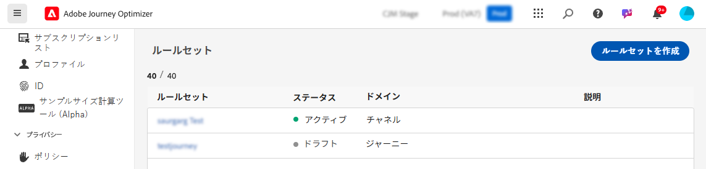
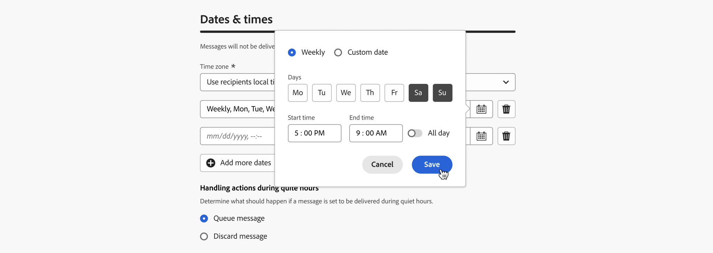

# クワイエットアワーを設定 {#quiet-hours}

## 非表示時間とは

**無表示時間** では、**メール**、**SMS**、**プッシュ**、**WhatsApp** の各チャネルに対して、時間ベースの除外を定義できます。 これにより、特定の期間中にメッセージが送信されないようにし、顧客の好みやコンプライアンスの要件を尊重するのに役立ちます。

**ルールセット** を使用して待ち時間を適用できます。このルールセットはキャンペーンやジャーニーの個々のアクションに割り当てられるので、正確に制御できます。

これらのプロセスを合理化することで、顧客体験を向上させ、時間を節約し、コミュニケーションルールへのコンプライアンスを確保できます。

* **顧客を目覚めさせない** - *適切な顧客、適切なチャネル、適切な時間* は、多くのマーケターのマントラであるため、タイミングがカスタマージャーニーの重要な部分であることは理にかなっています。 通知の停止時間ルールを設定することで、ブランドは連絡先がメッセージを受信するタイミングをより詳細に制御し、メッセージに対してアクションを実行する可能性が高いタイミングで連絡先がメッセージを取得できるようにします。
* **利便性** - ジャーニーまたはキャンペーン全体を停止しなくても、オーディエンスがメッセージを受信できないようにする必要がある場合は、キャンペーンおよびジャーニー全体で通信を簡単に傍受できます。
* **時間節約** - カスタム式を使用して複数の条件ノードを追加する代わりに **時間ベースのルール** を作成して、除外を 1 か所で管理します。\
  <!--* **Extra Safeguard** - Benefit from an extra safeguard in case audience criteria or time-window configurations were incorrectly set, ensuring individuals are still excluded when they should be.-->

>[!AVAILABILITY]
>
>非表示時間ルールは現在、一連の組織でのみ使用できます（使用制限あり）。 キャンセル待ちに追加するには、Adobeの担当者にお問い合わせください。

➡️ [この機能について詳しくは、ビデオを参照してください](#video)。

## ガードレールと制限事項

* **サポートされているチャネル** - メール、SMS、プッシュ、WhatsApp。
  <!--* **Custom actions** – For custom actions, only quiet hours rules are enforced. If a rule set also includes other rules (e.g., frequency capping), those rules are ignored.-->
* **伝播遅延** – 非表示時間ルールの更新は、そのルールを既に使用しているチャネルアクションに適用されるまでに最大 12 時間かかる場合があります。
  <!--* **Pre-suppression window** – The system begins suppressing communications 30 minutes before quiet hours start, ensuring that no messages are delivered once the quiet period begins.-->
* **大量の待ち時間** – 大量の通信が発生する場合、システムが静かな時間の抑制の適用を正常に開始するまでに、さらに時間がかかる場合があります。

## 非表示時間ルールの作成

非表示時間を設定するには、カスタムルールセット内にルールを作成します。 次の手順に従います。

1. **[!UICONTROL ビジネス・ルール]** にナビゲートして、ルール・セットのインベントリにアクセスします。

1. 既存のカスタム ルール セットを選択するか、新しいカスタム ルール セットを作成してください：

   +++既存のルール セットに非表示時間ルールを作成する

   在庫からルールセットを選択します。 非表示時間ルールは、「channel」ドメインを持つルールセットにのみ追加できます。 この情報は、「**[!UICONTROL ドメイン]**」列で確認できます。

   

   +++

   +++新しいルール セットに非表示時間ルールを作成する

   **[!UICONTROL ルールセットを作成]** をクリックし、一意の名前を入力して、**[!UICONTROL ルールセットドメイン]** ドロップダウンから「チャネル」を選択します。

   

   +++

   >[!NOTE]
   >
   >非表示時間は、**カスタムルールセット** でのみ定義できます。 グローバルルールセットは quiet hours 設定をサポートしていません。

1. ルールセット画面で、「**[!UICONTROL ルールを追加]**」をクリックし、ルールに一意の名前を指定します。

1. **カテゴリ**&#x200B;フィールドでは、ルールが適用されるメッセージのカテゴリを指定します。現時点では、このフィールドは読み取り専用で、デフォルトは **[!UICONTROL マーケティング]** になっています。

1. **[!UICONTROL ルールタイプ]** ドロップダウンで「**[!UICONTROL 待ち時間]**」を選択します。

   

1. 「**[!UICONTROL 日付と時刻]**」セクションで、通知のない時間を適用するタイミングを定義します。

   1. 使用する **[!UICONTROL タイムゾーン]** を選択：

      * **[!UICONTROL UTC/GMT]** – 個々のタイムゾーンに関係なく、オーディエンス内のすべての受信者に標準の GMT タイムウィンドウを適用します。
      * **[!UICONTROL 受信者ローカルタイムゾーンを使用]** – 各プロファイルのタイムゾーンフィールドを使用します。 [&#x200B; ジャーニーでのタイムゾーン管理の詳細情報 &#x200B;](../building-journeys/timezone-management.md#timezone-from-profiles)

        >[!IMPORTANT]
        >
        >プロファイルにタイムゾーン値がない場合、そのプロファイルには非表示時間は適用されません。

   1. 非表示時間を適用する期間を指定してください。

      * **[!UICONTROL 毎週]** – 特定の曜日とタイムスロットを選択します。 また、ルール **[!UICONTROL 終日]** を適用することもできます（このオプションは 3 日連続でのみ使用できます）。

        

      * **[!UICONTROL カスタム日付]** - カレンダーおよびタイムスロットで特定の日付を選択します。 また、ルール **[!UICONTROL 終日]** を適用することもできます（このオプションは 3 日連続でのみ使用できます）。

        

   1. 「**[!UICONTROL さらに日付を追加]**」ボタンをクリックして、最大 5 つの期間を個別に追加できます。

      

1. 「**[!UICONTROL 処理が停止している時間帯のアクション]** セクションでは、選択した期間のメッセージの処理方法を選択します。

   

   * **[!UICONTROL キューメッセージ]** - メッセージは、一時停止状態でない限り、処理の少ない時間帯の完了時に送信されます。

     >[!NOTE]
     >
     >このオプションは、ジャーニーアクションでのみ使用できます。 キャンペーンアクションに適用した場合、「**[!UICONTROL メッセージの破棄]**」オプションを選択した場合と同じように動作します。

   * **[!UICONTROL メッセージの破棄]** - メッセージは送信されません。 メッセージを含むジャーニーまたはキャンペーンを、送信のキャンセルで終了する場合は、「**[!UICONTROL ジャーニーまたはキャンペーンを破棄して終了]**」を選択します。

## ジャーニーとキャンペーンへの待ち時間の適用 {#apply}

ルールを保存し、ルールセットをアクティブ化すると、ジャーニーとキャンペーンのアクションに適用できます。 サポートされているチャネル：**メール、SMS、プッシュ、WhatsApp**。 詳しくは、以下のタブを参照してください。

>[!BEGINTABS]

>[!TAB  ジャーニーでの待ち時間チャネルアクションの適用 ]

1. ジャーニーを開き、[&#x200B; チャネルアクション &#x200B;](../building-journeys/journeys-message.md) を選択し、メッセージのコンテンツを編集します。
1. 「**[!UICONTROL ビジネス・ルールの追加]**」ボタンをクリックし、非表示時間ルールを含むルール・セットを選択します。

   

   >[!NOTE]
   >
   >[アクティブ化](#activate-rule)したルールセットのみがリストに表示されます。

1. ジャーニーを有効化します。

>[!TAB  キャンペーンアクションへの待ち時間の適用 ]

1. キャンペーンを編集し、「**[!UICONTROL アクション]** タブにアクセスします。
1. 「**[!UICONTROL ビジネス・ルール]**」セクションで、無表示時間ルールを含むルール・セットを選択します。

   

   >[!NOTE]
   >
   >[アクティブ化](#activate-rule)したルールセットのみがリストに表示されます。

1. キャンペーンをアクティブ化します。

>[!ENDTABS]

## 次の手順

ジャーニーまたはキャンペーンがアクティブ化されて実行されると、[Customer Journey Analytics レポートおよび &#x200B;](../reports/report-gs-cja.md) ライブレポート [&#x200B; で、コミュニケーションから除外されたプロファイルの数を確認できます。このレポートでは、配信から除外されたユーザーの理由として考えられる非表示時間ルールが一覧表示されます &#x200B;](../reports/live-report.md)。

<!--

>[!TAB Apply Quiet hours to custom actions]

1. Open your journey and add or select a custom action in the canvas.

1. In the **[!UICONTROL Business rules]** section, select the rule set containing the Quiet hours rule.

   

   >[!NOTE]
   >
   >Only [activated](#activate-rule) rule sets display in the list.

1. Activate your journey.

-->

## チュートリアルビデオ {#video}

Adobe Journey Optimizerの無休時間数機能の使用方法を説明します。

>[!VIDEO](https://video.tv.adobe.com/v/3475853?captions=jpn&quality=12)
