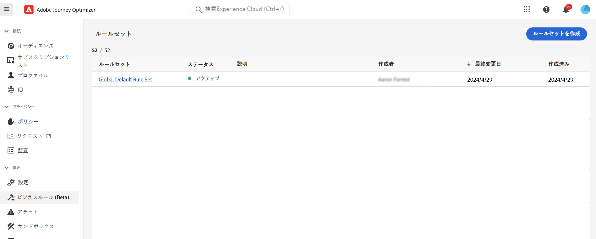
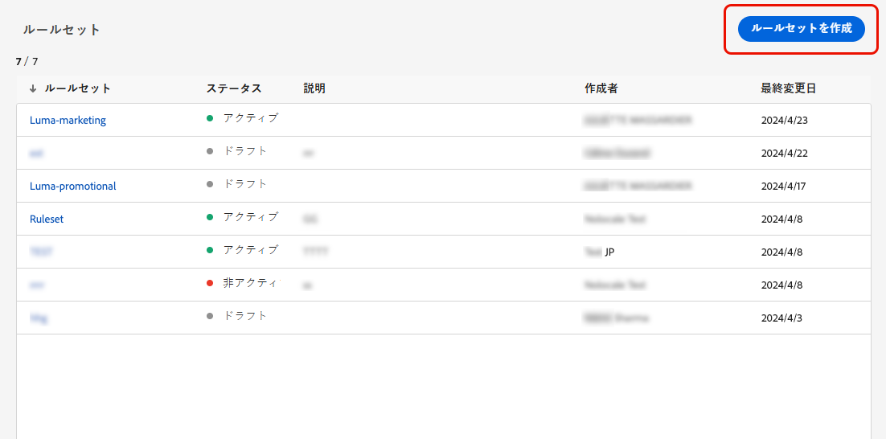
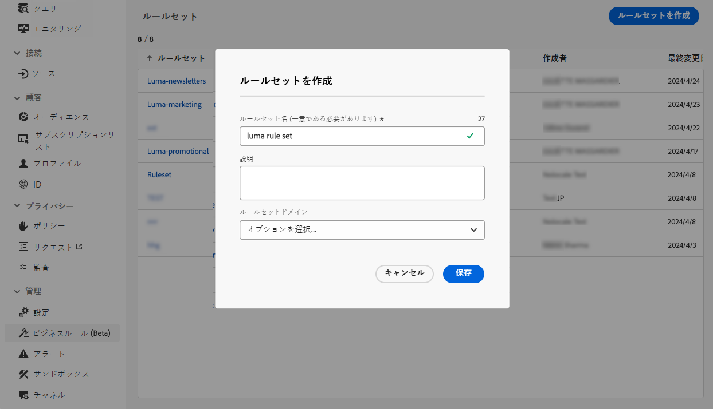
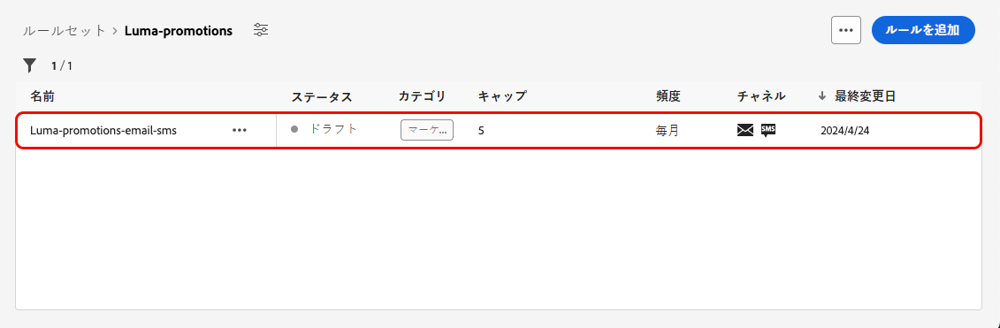
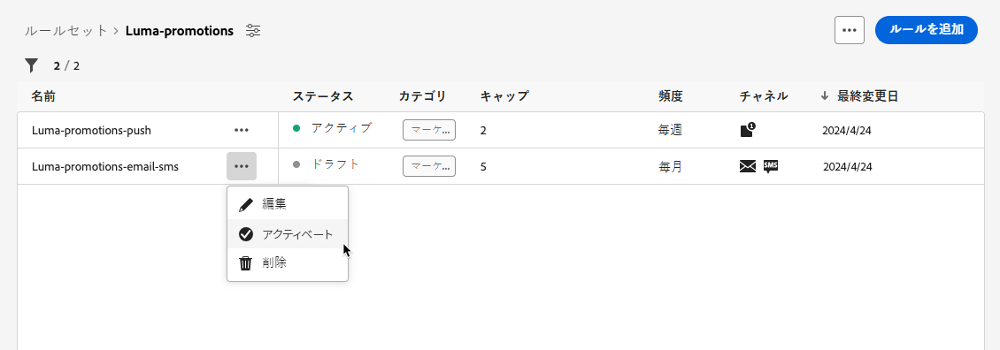
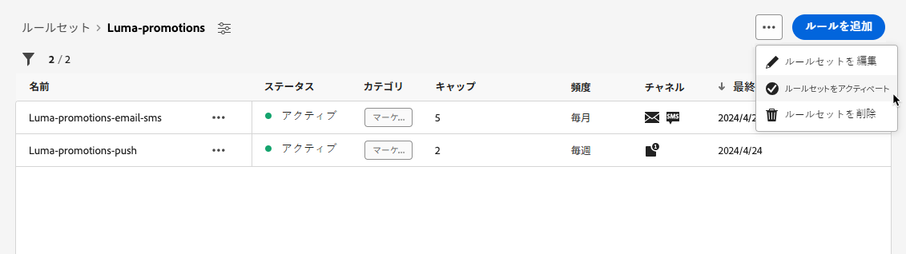
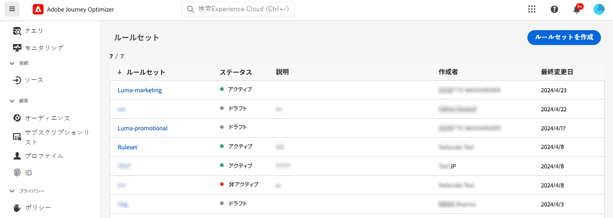
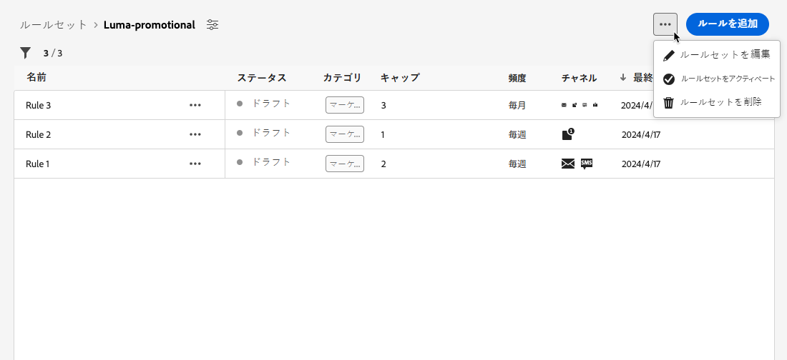
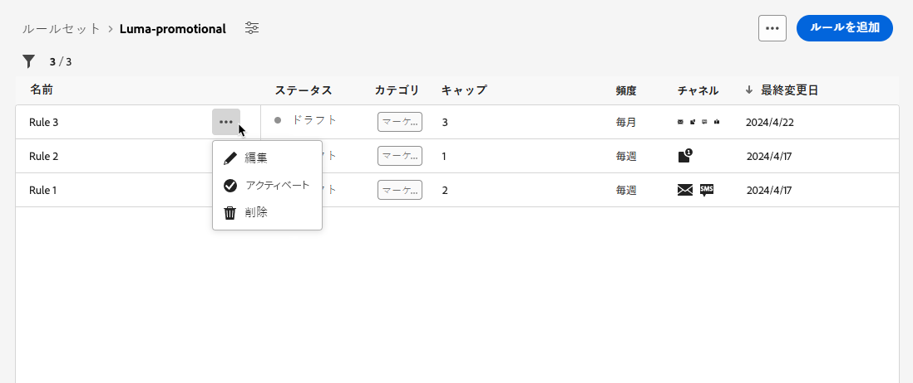
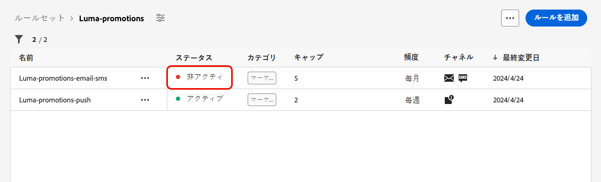

# ルールセットの操作 {#rule-sets}

>[!CONTEXTUALHELP]
>id="ajo_business_rules_rule_sets"
>title="ルールセット"
>abstract="ルールセットを使用して、様々なタイプのマーケティングコミュニケーションにフリークエンシーキャップまたは無表示時間ルールを適用します。 また、フリークエンシーキャップルールに基づいて、オーディエンスの一部に対してジャーニーを除外するルールセットを作成することもできます。"

## ルールセットの基本を学ぶ {#gs}

### ルールセットとは {#what}

ルールセットを使用すると、**複数のルールをルールセットにグループ化**&#x200B;し、選択したジャーニーとキャンペーンに適用できます。これによって、特定の時間枠内に顧客がジャーニーにエントリできる頻度やジャーニーの数、またはコミュニケーションのタイプに応じてユーザーがメッセージを受信する頻度をより細かく制御できるようになります。

次の 2 つのタイプのルールセットを作成できます。

* **チャネル** ルールセットは、通信チャネルにルールを適用します。 次の設定を行うことができます。

   * **フリークエンシーキャッピングルール** - *1 日に 1 件を超えるメールまたは SMS 通信を送信しないでください。*
   * **非表示時間のルール** （利用制限あり） – *午前 8 時～午後 9 時の時間枠外にメールメッセージを送信しないでください。*

* **ジャーニー**&#x200B;ルールセットは、ジャーニーにエントリキャップルールと同時実行キャップルールを適用します。例えば、複数のジャーニーにプロファイルを同時にエントリしないようにします。

➡️ [この機能をビデオで確認](#video)

### 権限 {#permissions-frequency-rules}

ビジネスルールを操作するには、次の権限が必要です。

* **[!UICONTROL 頻度ルールを表示]**：ビジネスルールにアクセスして表示します。
* **[!UICONTROL 頻度ルールの管理]**：ビジネスルールを作成、編集または削除します。

権限について詳しくは、[この節](../administration/high-low-permissions.md)を参照してください。

### グローバルおよびカスタムルールセット {#global-custom}

**[!UICONTROL 管理]**／**[!UICONTROL ビジネスルール]**&#x200B;メニューから初めてルールセットにアクセスすると、デフォルトのルールセット（**グローバルデフォルトルールセット**）が事前に作成され、アクティブになります。

このルールセットには、ユーザーが 1 つ以上のチャネルでメッセージを受信する頻度を制御するのに適用できる、グローバルルールが含まれています。このルールセットで定義されたすべてのルールは、コミュニケーションがジャーニーから送信されるかキャンペーンから送信されるかに関係なく、選択されたすべてのチャネルに適用されます。

この「グローバルデフォルトルールセット」ルールセットに加えて、任意のジャーニーまたはキャンペーンに適用できる&#x200B;**ルールセット**&#x200B;を作成すると、特定のキャップルールを適用できます。[カスタムルールセットの作成方法を学ぶ](#create)

## ルールセットの作成とアクティブ化 {#Create}

>[!CONTEXTUALHELP]
>id="ajo_rule_set_domain"
>title="ルールセットドメイン"
>abstract="ルールセットを作成する際は、ルールセット内のルールが通信チャネルまたはジャーニーに固有のキャップルールを適用するかどうかを指定する必要があります。"

>[!CONTEXTUALHELP]
>id="ajo_rule_sets_category"
>title="メッセージルールカテゴリの選択"
>abstract="アクティブ化してメッセージに適用すると、選択したカテゴリに一致するすべての頻度ルールがこのメッセージに自動的に適用されます。現在、マーケティングカテゴリのみが使用可能です。"

<!--NOT USED?
[!CONTEXTUALHELP]
>id="ajo_rule_sets_capping"
>title="Set the capping for your rule"
>abstract="Specify the maximum number of messages sent to a customer profile within the chosen time frame. The frequency cap will be based on the selected calendar period and will be reset at the beginning of the corresponding time frame."-->

>[!CONTEXTUALHELP]
>id="ajo_rule_type"
>title="ルールタイプ"
>abstract="チャネルルールセットに必要なルールタイプを選択します。**フリークエンシーキャップ**&#x200B;タイプを使用して、通信チャネルにキャッピングルールを適用します。例えば、1 日に 1 件以上のメールまたは SMS 通信を送信できないようにします。**クワイエットアワー**（限定提供）を選択して、時間ベースの除外を定義し、特定の期間にメッセージが送信されないようにします。"

>[!CONTEXTUALHELP]
>id="ajo_rule_sets_duration"
>title="メッセージルールカテゴリの選択"
>abstract="アクティブ化してメッセージに適用すると、選択したカテゴリに一致するすべての頻度ルールがこのメッセージに自動的に適用されます。現在、マーケティングカテゴリのみが使用可能です。"

>[!CONTEXTUALHELP]
>id="ajo_rule_set_rule_capping"
>title="ルールのキャップ"
>abstract="ルールのキャップを設定します。ルールセットドメインと「ルールタイプ」フィールドでの選択に応じて、このフィールドでは、プロファイルに送信できるメッセージの最大数や、プロファイルが同時に入力または登録できるジャーニーの最大数を定義できます。"

>[!CONTEXTUALHELP]
>id="ajo_journey_business_rules"
>title="ルールセット"
>abstract="カスタムアクションに適用するルールセットを選択します。"

ルールセットを作成するには、次の手順に従います。

>[!NOTE]
>
>各チャネルドメインおよびジャーニードメインに対して、最大 10 個のアクティブなローカルルールセットを作成できます。

1. **[!UICONTROL ルールセット]**&#x200B;のリストにアクセスし、「**[!UICONTROL ルールセットを作成]**」をクリックします。

   

1. ルールセットに一意の名前を定義し、説明を追加します。

1. ルールセットのドメインを選択し、「**[!UICONTROL 保存]**」をクリックします。

   * **チャネル** ドメイン：通信チャネルにキャッピングルールまたは無音の時間ルールを適用します。
   * **ジャーニー**&#x200B;ドメイン：ジャーニーにエントリキャップルールと同時実行キャップルールを適用します。

   

1. このルールセットに追加するルールを定義します。これを行うには、ルールセットにアクセスし、「**[!UICONTROL ルールを追加]**」をクリックします。

1. ニーズに合わせてルールパラメーターを設定します。ルールに使用できるパラメーターは、作成時に選択したルールセットドメインによって異なります。

   ジャーニーとチャネルルールの設定方法について詳しくは、次の節を参照してください。

   * [ジャーニーのキャップ](../conflict-prioritization/journey-capping.md)
   * [チャネルと通信タイプによるフリークエンシーキャップ](../conflict-prioritization/channel-capping.md)
   * [&#x200B; 待ち時間 &#x200B;](../conflict-prioritization/quiet-hours.md) （限定提供）

1. 「**[!UICONTROL 保存]**」をクリックして、ルールの作成を確定します。メッセージが、**[!UICONTROL ドラフト]**&#x200B;ステータスでルールリストに追加されます。

   

1. 上記の手順を繰り返して、必要な数のルールをルールセットに追加します。

1. 作成時、ルールは&#x200B;**[!UICONTROL ドラフト]**&#x200B;ステータスになり、まだメッセージには影響を与えません。ルールを有効にするには、ルールの横にある「**[!UICONTROL その他のアクション]**」ボタンをクリックし、「**[!UICONTROL アクティブ化]**」を選択します。

   

1. ルールセットをアクティブ化して、ジャーニーとメッセージに適用できるようにします。

   

   >[!NOTE]
   >
   >ルールまたはルールセットが完全にアクティブ化されるまでに、最大 10 分かかる場合があります。ルールを有効にするために、メッセージを変更したり、ジャーニーを再公開したりする必要はありません。

<!--Currently, once a rule set is activated, no more rules can be added to that rule set.-->

1. ルールセットの作成時に選択したドメインに応じて、ルールセットをメッセージまたはジャーニーに適用できます。

   ルールセットを適用する方法について詳しくは、次の節を参照してください。

   * [ジャーニーにルールセットを適用する](../conflict-prioritization/journey-capping.md#apply-capping)
   * [ジャーニーとキャンペーンのアクションへのキャッピングルールの適用](../conflict-prioritization/channel-capping.md#apply)
   * [ジャーニーとキャンペーンへの通知のない時間ルールの適用](../conflict-prioritization/quiet-hours.md#apply)

## ルールセットへのアクセスと管理 {#access-rule-sets}

作成されたすべてのルールセットは、**[!UICONTROL 管理]**／**[!UICONTROL ビジネスルール]**&#x200B;メニューに表示されます。最終変更日順に並べ替えられています。

ルールセット名をクリックし、そのコンテンツを表示および編集します。そのルールセットに含まれるすべてのルールが一覧表示されます。右上のコンテキストメニューを使用すると、ルールセットの名前と説明を編集、アクティブ化、削除できます。

ルールセットに含まれるルールごとに、「**[!UICONTROL その他のアクション]**」ボタンを使用すると、ルールを編集、アクティブ化および削除できます。

ルールまたはルールセットを非アクティブ化するには、目的の項目の横にある「**[!UICONTROL その他のアクション]**」ボタンをクリックし、「**[!UICONTROL 非アクティブ化]**」を選択します。

ステータスは&#x200B;**[!UICONTROL 非アクティブ]**&#x200B;に変わり、今後のメッセージの実行にはルールが適用されません。現在実行中のメッセージは影響を受けません。

>[!NOTE]
>
>ルールまたはルールセットを非アクティブ化しても、個々のプロファイルのカウントは影響を受けず、リセットされません。

## チュートリアルビデオ {#video}

>[!VIDEO](https://video.tv.adobe.com/v/3444727?captions=jpn&quality=12)
