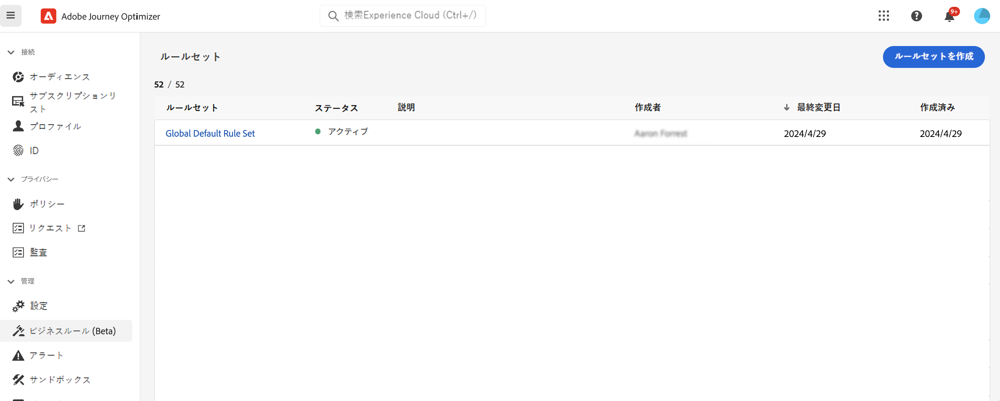
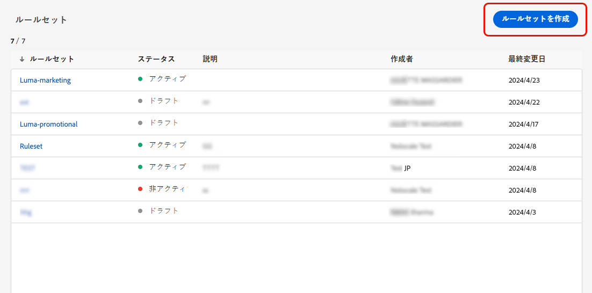
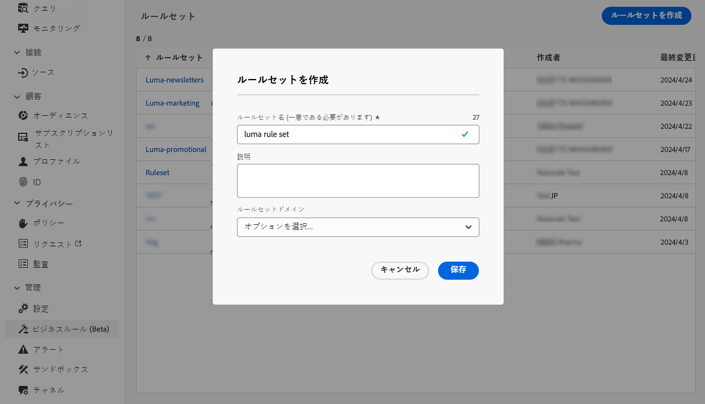
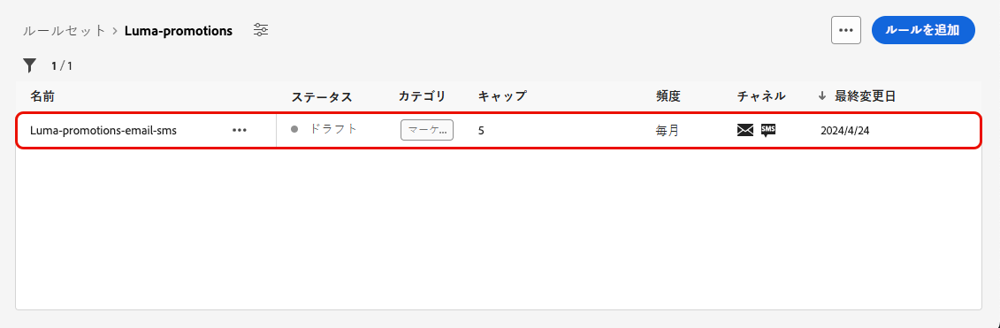
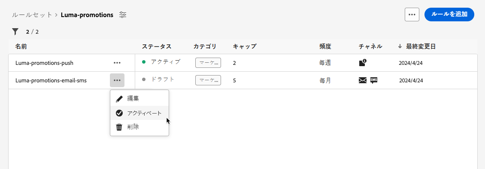
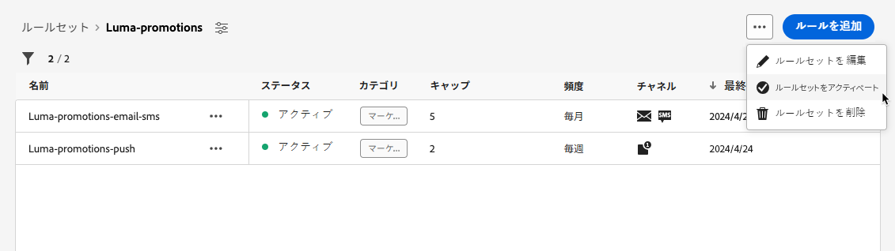
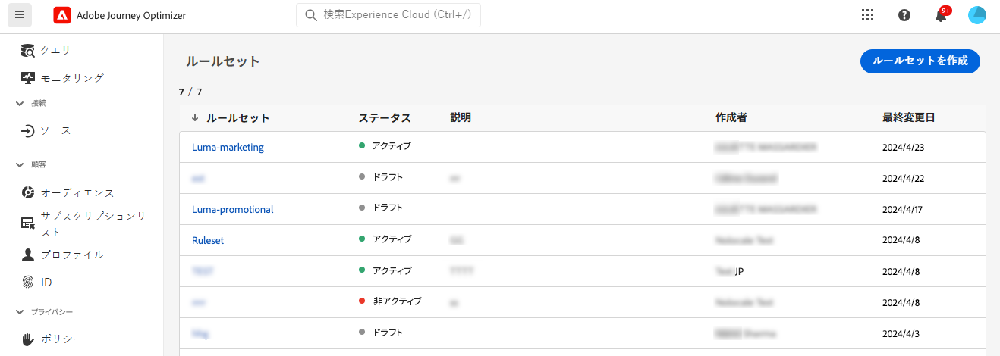
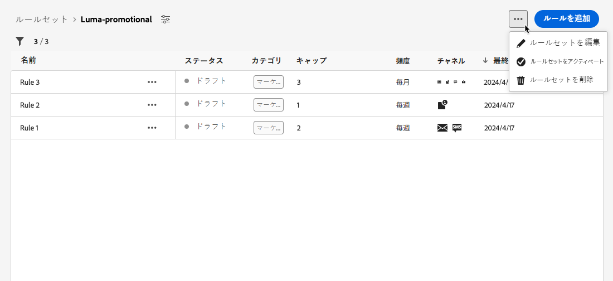
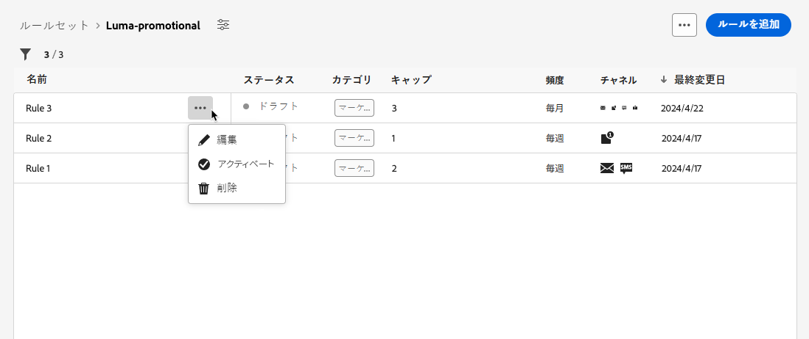
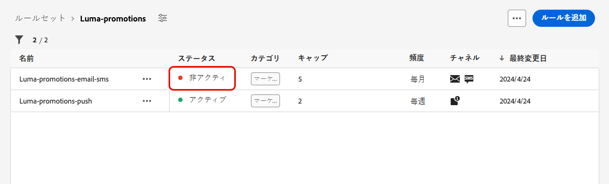

# ルールセットの操作 {#rule-sets}

>[!CONTEXTUALHELP]
>id="ajo_business_rules_rule_sets"
>title="ルールセット"
>abstract="ルールセットを使用して、頻度の上限またはサイレントアワーのルールをさまざまなタイプのマーケティングコミュニケーションに適用します。 また、頻度の上限ルールに基づいて、オーディエンスの一部にジャーニーを除外するルールセットを作成することもできます。"

## ルールセットの基本を学ぶ {#gs}

### ルールセットとは？ {#what}

ルールセットを使用すると、複数のルールを&#x200B;**グループ化してルールセット**&#x200B;し、選択したジャーニーやキャンペーンに適用できます。 これにより、顧客が特定の時間枠内に参加する頻度とジャーニーの数を制限したり、コミュニケーションの種類に応じてメッセージを受信する頻度を制御したりするための詳細な制御が提供されます。

2種類のルールセットを作成できます。

* **チャネル**&#x200B;のルール セットは、通信チャネルにルールを適用します。 これらを使用すると、次の項目を設定できます。

   * **配信頻度の上限ルール** - *1日に1つ以上の電子メール、SMS、プッシュ通知、ダイレクトメール、WhatsApp通信を送信しないでください。*
   * **サイレントアワーのルール** - *午前8時から午後9時の時間枠の外にメールメッセージを送信しない*

* **ジャーニー** ルール セットは、ジャーニーにエントリと同時実行の上限ルールを適用します。 例えば、プロファイルを複数のジャーニーに同時に入力しないでください。

➡️ [この機能をビデオで見つける](#video)

### 権限 {#permissions-frequency-rules}

ビジネスルールを操作するには、次の権限が必要です。

* **[!UICONTROL 頻度ルールの表示]**: ビジネス ルールにアクセスして表示します。
* **[!UICONTROL 頻度ルールの管理]**: ビジネス ルールを作成、編集、削除します。

権限について詳しくは、[このセクション &#x200B;](../administration/high-low-permissions.md)を参照してください。

### グローバルおよびカスタムのルールセット {#global-custom}

**[!UICONTROL 管理]** > **[!UICONTROL ビジネスルール]** メニューから初めてルールセットにアクセスする場合、デフォルトのルールセットが事前に作成され、アクティブになります。**グローバルなデフォルトのルールセット**。

このルールセットには、ユーザーが1つまたは複数のチャネルでメッセージを受信する頻度を制御するために適用できるグローバルルールが含まれています。 このルールセットで定義されたすべてのルールは、ジャーニーから送信されるか、キャンペーンから送信されるかを問わず、選択したすべてのチャネルに適用されます。

この「グローバル デフォルト ルール セット」ルールセットに加えて、任意のジャーニーまたはキャンペーンに適用して特定のキャッピングルールを適用できる&#x200B;**ルールセット**&#x200B;を作成できます。 [&#x200B; カスタムルールセットの作成方法を学ぶ](#create)

## ルールセットの作成とアクティベート {#Create}

>[!CONTEXTUALHELP]
>id="ajo_rule_set_domain"
>title="ルールセットドメイン"
>abstract="ルールセットを作成する場合、ルールセット内のルールが、コミュニケーションチャネルまたはジャーニーに固有のキャッピングルールを適用するかどうかを指定する必要があります。"

>[!CONTEXTUALHELP]
>id="ajo_rule_sets_category"
>title="メッセージルールのカテゴリを選択"
>abstract="アクティブ化してメッセージに適用すると、選択したカテゴリに一致するすべての頻度ルールがこのメッセージに自動的に適用されます。 現在は、マーケティングカテゴリのみが使用可能です。"

<!--
NOT USED?
[!CONTEXTUALHELP]
>id="ajo_rule_sets_capping"
>title="Set the capping for your rule"
>abstract="Specify the maximum number of messages sent to a customer profile within the chosen time frame. The frequency cap will be based on the selected calendar period and will be reset at the beginning of the corresponding time frame."
-->

>[!CONTEXTUALHELP]
>id="ajo_rule_type"
>title="ルールタイプ"
>abstract="チャネルルールセットに希望するルールタイプを選択します。**頻度キャッピングルール** タイプを使用して、通信チャネルにキャッピングルールを適用します。 例えば、1日に1つ以上の電子メールまたはSMS通信を送信しないでください。 **サイレットアワー**&#x200B;を選択して、時間ベースの除外を定義し、特定の期間にメッセージが送信されないようにします。"

>[!CONTEXTUALHELP]
>id="ajo_rule_sets_duration"
>title="メッセージルールのカテゴリを選択"
>abstract="アクティブ化してメッセージに適用すると、選択したカテゴリに一致するすべての頻度ルールがこのメッセージに自動的に適用されます。 現在は、マーケティングカテゴリのみが使用可能です。"

>[!CONTEXTUALHELP]
>id="ajo_rule_set_rule_capping"
>title="ルールの上限"
>abstract="ルールの上限を設定します。 ルールセットドメインと「ルールタイプ」フィールドの選択に応じて、このフィールドは、プロファイルに送信できるメッセージの最大数、またはプロファイルが同時に入力または登録できるジャーニーの最大数を定義できます。"

>[!CONTEXTUALHELP]
>id="ajo_journey_business_rules"
>title="ルールセット"
>abstract="カスタムアクションに適用するルールセットを選択します。"

ルールセットを作成するには、次の手順に従います。

>[!NOTE]
>
>チャネルドメインには最大10個、ジャーニードメインには10個のルールセットを作成でき、合計20個のルールセットを作成できます。

1. **[!UICONTROL ルールセット]** リストにアクセスし、**[!UICONTROL ルールセットの作成]**&#x200B;をクリックします。

   

1. ルールセットの一意の名前を定義し、説明を追加します。

1. ルールセットのドメインを選択し、**[!UICONTROL 保存]**&#x200B;をクリックします。

   * **チャネル** ドメイン：通信チャネルにキャッピングルールまたはサイレントアワーのルールを適用します。
   * **ジャーニー** ドメイン：ジャーニーにエントリと同時実行の上限ルールを適用します。

   

1. このルールセットに追加するルールを定義します。 これを行うには、ルールセットにアクセスし、**[!UICONTROL ルールを追加]**&#x200B;をクリックします。

1. ニーズに合わせてルールパラメーターを設定します。 ルールで使用できるパラメーターは、作成時に選択したルールセットドメインによって異なります。

   ジャーニールールとチャネルルールの設定方法について詳しくは、次の節を参照してください。

   * [ジャーニーの上限](../conflict-prioritization/journey-capping.md)
   * [チャネルと通信タイプ別の頻度の上限](../conflict-prioritization/channel-capping.md)
   * [サイレントアワー](../conflict-prioritization/quiet-hours.md)

1. 「**[!UICONTROL 保存]**」をクリックして、ルール作成を確定します。 メッセージがルールセットに追加され、**[!UICONTROL ドラフト]**&#x200B;のステータスが表示されます。

   

1. 上記の手順を繰り返して、必要な数のルールをルールセットに追加します。

1. 作成されたルールは、**[!UICONTROL ドラフト]**&#x200B;のステータスを持ち、まだメッセージに影響を与えていません。 有効にするには、ルールの横にある&#x200B;**[!UICONTROL その他のアクション]** ボタンをクリックし、**[!UICONTROL アクティブ化]**&#x200B;を選択します。

   

1. ルールセットをアクティベートして、ジャーニーとメッセージに適用できるようにします。

   

   >[!NOTE]
   >
   >ルールまたはルールセットが完全にアクティブ化されるまでに、最大10分かかる場合があります。 ルールを有効にするために、メッセージを変更したり、ジャーニーを再公開したりする必要はありません。

<!--Currently, once a rule set is activated, no more rules can be added to that rule set.-->

1. ルールセットの作成時に選択したドメインに応じて、メッセージまたはジャーニーにルールセットを適用できます。

   ルールセットの適用方法について詳しくは、次の節を参照してください。

   * [ジャーニーへのルールセットの適用](../conflict-prioritization/journey-capping.md#apply-capping)
   * [キャッピングルールをジャーニーおよびキャンペーンアクションに適用する](../conflict-prioritization/channel-capping.md#apply-frequency-rule)
   * [ジャーニーとキャンペーンにサイレントアワーのルールを適用する](../conflict-prioritization/quiet-hours.md#apply)

## ルールセットへのアクセスと管理 {#access-rule-sets}

作成されたすべてのルールセットは、**[!UICONTROL 管理]** > **[!UICONTROL ビジネスルール]** メニューに表示されます。 これらは、最終変更日で並べ替えられます。

ルールセット名をクリックして、そのコンテンツを表示および編集します。 そのルールセットに含まれるすべてのルールが一覧表示されます。 右上のコンテキストメニューでは、ルールセットの名前と説明を編集し、アクティブ化して削除できます。

ルール セット内の各ルールに対して、**[!UICONTROL その他のアクション]** ボタンを使用すると、ルールを編集し、アクティブ化して削除できます。

ルールまたはルールセットを非アクティブ化するには、目的の項目の横にある&#x200B;**[!UICONTROL その他のアクション]** ボタンをクリックし、**[!UICONTROL 非アクティブ化]**&#x200B;を選択します。

ステータスは&#x200B;**[!UICONTROL 非アクティブ]**&#x200B;に変更され、このルールは今後のメッセージ実行には適用されません。 現在実行中のメッセージは影響を受けません。

>[!NOTE]
>
>ルールまたはルールセットを非アクティブ化しても、個々のプロファイルのカウントには影響しません。

## チュートリアルビデオ {#video}

>[!VIDEO](https://video.tv.adobe.com/v/3435531?quality=12)
