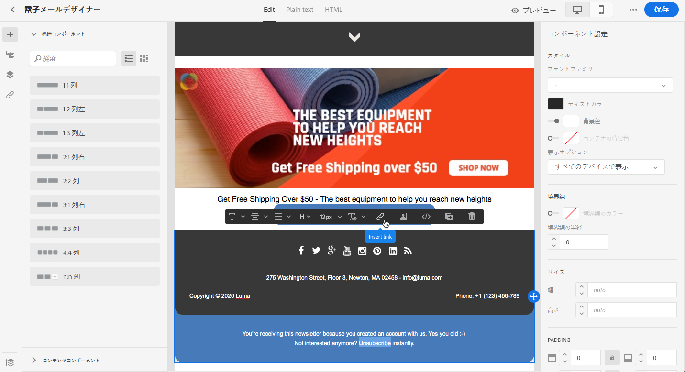
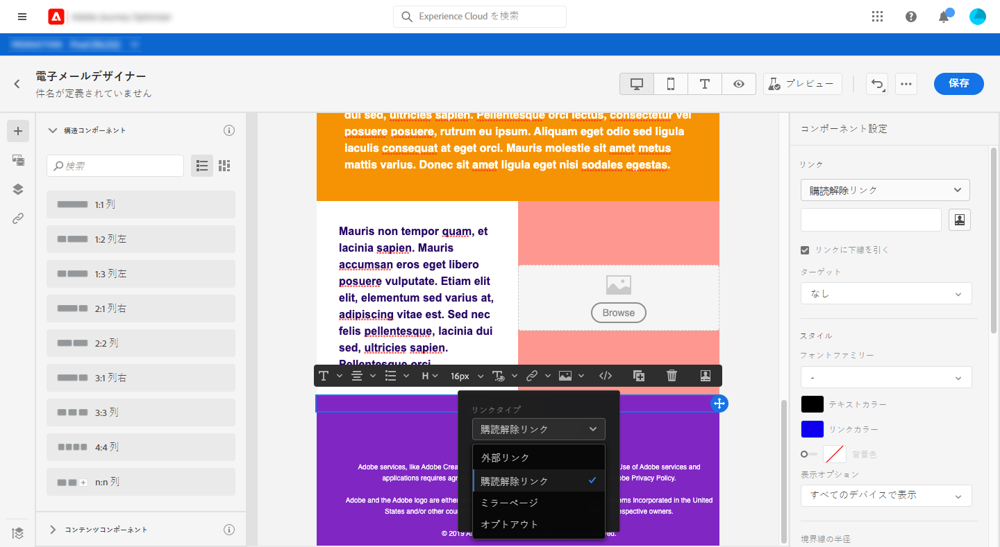
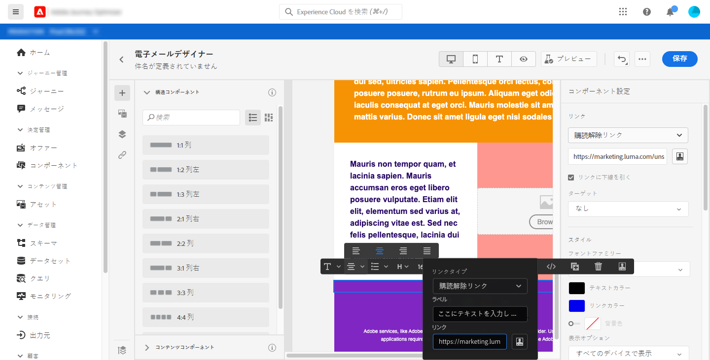
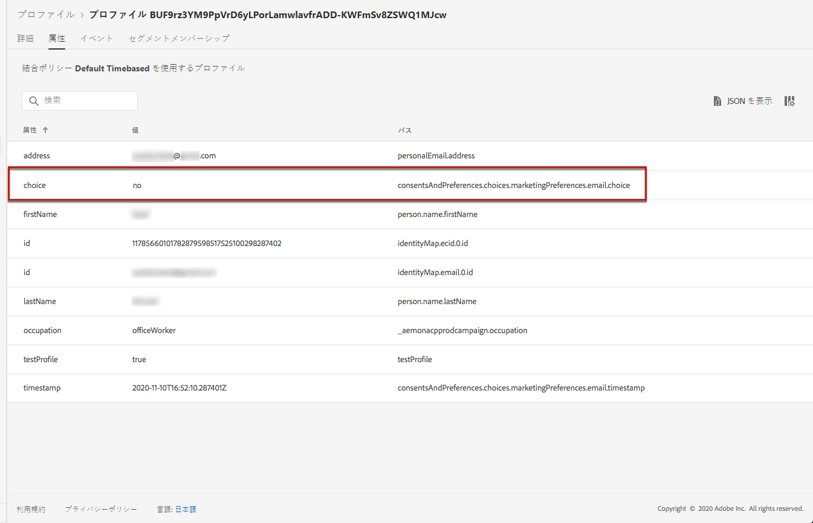

# オプトアウトの管理 {#consent}

[!DNL Journey Optimizer]を使用すると、通信に対する受信者の同意を追跡でき、受信者の好みや購読を管理して受信者がブランドとどのように関わりたいと思っているかを理解できます。<!--Their preferences and subscriptions are handled through Consent management.-->

GDPR などの規制では、データサブジェクトからの情報を使用するには、特定の要件を満たす必要があると規定されています。また、データサブジェクトは、いつでも同意を変更できる必要があります。

**なぜそれが重要なのでしょうか？**

* これらの規制に準拠できないと、ブランドに法規制上のリスクが生じます。
* この機能を使用すると、未承諾の通信を受信者に送信して、メッセージがスパムと見なされたり、ブランドの評判が損なわれたりする危険性を避けることができます。

プライバシーの管理と適用される法規制について詳しくは、[Experience Platformドキュメント](https://experienceleague.adobe.com/docs/experience-platform/privacy/home.html?lang=ja)を参照してください。

<!--* Recipients should be able to opt-in/opt-out from receiving electronic communication through one or more channel
* Recipients expect the brand to offer preference centre capability that controls how brand should engage with them (example: channel of communication, invasive and non-invasive tracking etc). This helps to fulfil regulatory obligations and also facilitates quality engagement with recipient. 
* The third category is the capability to offer subscription to recipients (newsletter, etc)-->

## オプトアウト管理 {#opt-out-management}

ブランドからの通信を登録解除する機能を受信者に提供することは、法的要件の 1 つです。該当する法律について詳しくは、[Experience Platformドキュメント](https://experienceleague.adobe.com/docs/experience-platform/privacy/regulations/overview.html?lang=ja#regulations)を参照してください。

したがって、受信者に送信されるすべての メールに、**登録解除リンク**&#x200B;を必ず含める必要があります。
* 受信者がこのリンクをクリックすると、オプトアウトを確認するボタンを含んだランディングページが表示されます。
* オプトアウトボタンをクリックすると、Adobe I/O が呼び出され、プロファイルデータにこの情報が反映されます。[この詳細を説明します](#consent-service-api)。

登録解除リンクを追加するには、次の手順に従います。

1. 登録解除ランディングページを作成します。
1. ランディングページを任意のサードパーティ製システムでホストします。
1. [!DNL Journey Optimizer] で[メッセージを作成](../../help/using/create-message.md)します。

   <!--The link to your landing page should contain a static URL and the profile ID.-->

1. コンテンツ内のテキストを選択し、コンテキストツールバーを使用してリンクを挿入します。

   

1. **[!UICONTROL リンクタイプ]**&#x200B;ドロップダウンリストから「**[!UICONTROL 登録解除リンク]**」を選択します。

   

1. **[!UICONTROL 登録解除ページの URL]**&#x200B;フレームに、ランディングページへのリンクをコピーします。

   

1. 「**[!UICONTROL 保存]**」をクリックします。

1. コンテンツを保存し、[メッセージを公開](../../help/using/publish-manage-message.md)します。

   >[!NOTE]
   >
   >サードパーティランディングページの URL には、Adobe I/O を呼び出してプロファイルの環境設定を更新するための 3 つのパラメーターが含まれています。詳しくは、[この節](#consent-service-api)を参照してください。

1. [ジャーニー](building-journeys/journey.md)を通じて、ランディングページへのリンクを含んだメッセージを送信します。

1. メッセージを受け取った受信者が登録解除リンクをクリックすると、ランディングページが表示されます。

   

1. 受信者がランディングページ内のオプトアウトボタン（ここでは「**登録解除**」ボタン）をクリックすると、[Adobe I/O 呼び出し](#opt-out-api)を通じてプロファイルデータが更新されます。

   その後、オプトアウトした受信者は、オプトアウトが成功したことを示す確認メッセージ画面にリダイレクトされます。

   

   その結果、購読を再度登録しない限り、このユーザーはブランドから連絡を受けることはありません。

対応するプロファイルの選択が更新されたことを確認するには、Experience Platform に移動し、ID 名前空間と対応する ID 値を選択してプロファイルにアクセスします。詳しくは、[Experience Platform ドキュメント](https://experienceleague.adobe.com/docs/experience-platform/catalog/datasets/user-guide.html?lang=ja#getting-started)を参照してください。



「**[!UICONTROL 属性]**」タブで、**[!UICONTROL choice]** の値が **[!UICONTROL no]** に変更されたことを確認できます。

<!--The opt-out URL is resolved upon each recipient receiving the message. It is then personalized with the relevant encrypted parameters (profile ID, profile name, journey ID, sandbox ID, and message execution ID).-->

## オプトアウト API 呼び出し {#opt-out-api}

受信者が登録解除リンクをクリックしてオプトアウトすると、Adobe I/O API <!--Consent service API to capture the encrypted data and-->が呼び出され、対応するプロファイルの環境設定が更新されます。

Adobe I/O のこの POST 呼び出しは次のとおりです。

エンドポイント：cjm.adobe.io/imp/consent/preferences

クエリパラメーター：
* **params**：暗号化されたペイロードが格納されています
* **sig**：署名 <!--which signature?-->
* **pid**：暗号化されたプロファイル ID

これらのパラメーターは、受信者に送信される登録解除リンク（特定の受信者のサードパーティランディングページを開く URL など）から入手できます。


<!--QUESTION: How do you get the URL built for each recipient? Do you have to wait until each targeted recipient receives the unsubscribe link or can you deduce it in advance? Is it done automatically upon the API call or do you have to do something manually for each profile? In other words will the LP automatically include the 3 parameters or do you have to insert something manually? Still not completely clear-->

ヘッダー要件：
* x-api-key
* x-gw-ims-org-id
* x-sandbox-name
* 認証（技術アカウントからのユーザートークン） <!--How do you find this information? And other header elements?-->

リクエスト本文：

```
{
   "marketing": [
       {
            "type": "email",           
            "choice": "no",          
            "scope": "channel"       
        }
    ],
 
}
```

<!--The Consent service /-->[!DNL Journey Optimizer] will <!--decrypt and-->use these parameters to update the corresponding profile's choice. <!--and provide an answer back to the landing page.-->

## ヘッダーのリンクの購読解除 {#unsubscribe-email}

受信者のEメールクライアントがEメールヘッダーに購読解除リンクを表示できる場合、[!DNL Journey Optimizer]と共に送信されるEメールには自動的にこのリンクが含まれます。

例えば、購読解除リンクはGmailでは次のように表示されます。


Eメールクライアントに応じて、ヘッダーから登録解除リンクをクリックすると、次のいずれかの影響を受けます。

* 対応するプロファイルが直ちにオプトアウトされ、この選択内容がExperience Platformで更新されます。 詳しくは、[Experience Platform ドキュメント](https://experienceleague.adobe.com/docs/experience-platform/profile/ui/user-guide.html?lang=en#getting-started)を参照してください。

* これは、Eメールコンテンツから購読解除リンクをクリックするのと同じ効果があります。受信者は、オプトアウトを確認するボタンを含むランディングページにリダイレクトされます。 オプトアウト管理について詳しくは、[この節](#opt-out-management)を参照してください。

## プッシュのオプトアウト管理 {#push-opt-out-management}

プッシュの受信者は、自分のデバイスから登録を解除できます。

例えば、アプリのダウンロード時や使用時に、通知の停止を選択できます。同様に、モバイルオペレーティングシステムから通知設定を変更することもできます。
