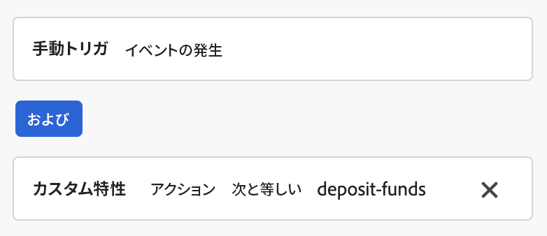
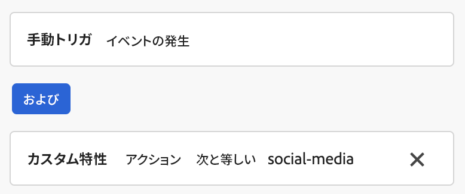
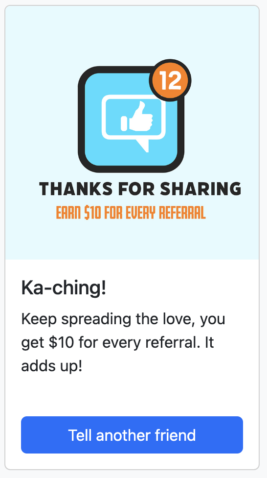

# Web SDK でのコンテンツカードのサポートの設定 {#content-card-configuration-sdk}

>[!AVAILABILITY]
>
>コンテンツカードは現在、一連の組織でのみ使用できます（使用制限あり）。 アクセスするには、アドビ担当者にお問い合わせください。

このサンプルでは、Adobe Experience Platformを使用してAdobe Journey Optimizer（AJO）からコンテンツカードを取得する方法を示します。 [Adobe Experience Platform Web SDK](https://experienceleague.adobe.com/en/docs/experience-platform/web-sdk/home) を利用すると、パーソナライゼーションコンテンツが取得され、完全にクライアントサイドでレンダリングされます。

ページの初回読み込み時に、ページにはデフォルトの状態が表示されます。 ただし、「入金 **またはソーシャルメディアで共有** ボタンを操作すると **追加のコンテンツカードが表示されます**。 これらのカードはクライアントサイドの条件によってトリガーされ、特定のアクションが実行された場合にのみ表示されます。


## サンプルの実行 {#run-sample}

前提条件：node と npm をインストールする必要があります。 [ このドキュメントを参照してください ](https://docs.npmjs.com/downloading-and-installing-node-js-and-npm)

1. HTTPS 用のローカル SSL 証明書を設定します。 これらのサンプルでは、HTTPS 経由でコンテンツを提供するために、ローカルに署名された SSL 証明書が必要です。

   1. コンピューターに `mkcert` をインストールします。

   1. インストール後、`mkcert -install` を実行して `mkcert root` 証明書をインストールします。

1. ローカルマシンにリポジトリのクローンを作成します。

1. ターミナルを開き、サンプルのフォルダーに移動します。

1. `npm install` を実行して、必要な依存関係をインストールします。

1. `npm start` を実行してアプリケーションを起動します。

1. Web ブラウザーを開き、`https://localhost` に移動します。

## 仕組み {#setup}

1. サンプルフォルダーの `.env` ファイルの設定を使用して、ページに [Web SDK](https://experienceleague.adobe.com/en/docs/experience-platform/web-sdk/home) を含めて設定します。

   ```
   <script src="https://cdn1.adoberesources.net/alloy/2.18.0/alloy.min.js" async></script>
   alloy("configure", {
       defaultConsent: "in",
       edgeDomain: "{{edgeDomain}}",
       edgeConfigId: "{{edgeConfigId}}",
       orgId:"{{orgId}}",
       debugEnabled: false,
       personalizationStorageEnabled: true,
       thirdPartyCookiesEnabled: false
   });
   ```

1. `sendEvent` コマンドを使用して、パーソナライズされたコンテンツを取得します。

   ```
   alloy("sendEvent", {
       renderDecisions: true,
       personalization: {
           surfaces: ["web://alloy-samples.adobe.com/#content-cards-sample"],
       },
   });
   ```

1. `subscribeRulesetItems` コマンドを使用して、特定のサーフェスのコンテンツカードをサブスクライブします。 ルールセットが評価されるたびに、コールバックで結果オブジェクトを処理します。このコールバックには、コンテンツカードデータを含む `propositions` が含まれます。

   ```
   const contentCardManager = createContentCardManager("content-cards");
   
   alloy("subscribeRulesetItems", {
       surfaces: ["web://alloy-samples.adobe.com/#content-cards-sample"],
       schemas: ["https://ns.adobe.com/personalization/message/content-card"],
       callback: (result, collectEvent) => {
           const { propositions = [] } = result;
           contentCardManager.refresh(propositions, collectEvent);
       },
   });
   ```

1. コンテンツカードのレンダリングを管理し、`script.js` にある `contentCardsManager` オブジェクトを使用して `interact` および `display` イベントを送信します。 受信した提案からコンテンツカードを抽出、並べ替え、処理します。

   ```
   const createContentCard = (proposition, item) => {
       const { data = {}, id } = item;
       const {
           content = {},
           meta = {},
           publishedDate,
           qualifiedDate,
           displayedDate,
       } = data;
   
       return {
           id,
           ...content,
           meta,
           qualifiedDate,
           displayedDate,
           publishedDate,
           getProposition: () => proposition,
       };
   };
   
   const extractContentCards = (propositions) =>
       propositions
           .reduce((allItems, proposition) => {
           const { items = [] } = proposition;
   
           return [
               ...allItems,
               ...items.map((item) => createContentCard(proposition, item)),
           ];
       }, [])
       .sort(
           (a, b) =>
               b.qualifiedDate - a.qualifiedDate || b.publishedDate - a.publishedDate
       );
   
   const contentCards = extractContentCards(propositions);
   ```

1. キャンペーンごとに定義された詳細に基づいてコンテンツカードをレンダリングします。 各カードには、`title`、`body`、`imageUrl` およびその他のカスタムデータ値が含まれます。

   ```
   const renderContentCards = () => {
       const contentCardsContainer = document.getElementById(containerElementId);
       contentCardsContainer.addEventListener("click", handleContentCardClick);
   
       let contents = "";
   
       contentCards.forEach((card) => {
           const { id, title, body, imageUrl, meta = {} } = card;
           const { buttonLabel = "" } = meta;
   
           contents += `
               <div class="col">
                   <div data-id="${id}" class="card h-100">
                       
                       <div class="card-body d-flex flex-column">
                           <h5 class="card-title">${title}</h5>
                           <p class="card-text">${body}</p>
                           <a href="#" class="mt-auto btn btn-primary">${buttonLabel}</a>
                       </div>
                   </div>
                </div>
            `;
       });
   
       contentCardsContainer.innerHTML = contents;
       collectEvent(
           "display",
           contentCards.map((card) => card.getProposition())
        );
   };
   ```

1. `subscribeRulesetItems` コールバックが呼び出されると、`collectEvent` という便利な関数も提供されます。 この関数は、Experience Edge イベントを送信して、インタラクション、ディスプレイ、その他のユーザーアクションをトラッキングするために使用されます。 この例では、コンテンツカードがクリックされた際に collectEvent が追跡します。 さらに、コンテンツカードのボタンがクリックされると、キャンペーンで指定された `actionUrl` にブラウザーが移動します。

   ```
   const handleContentCardClick = (evt) => {
       const cardEl = evt.target.closest(".card");
   
       if (!cardEl) {
           return;
       }
   
       const isAnchor = evt.target.nodeName === "A";
       const card = contentCards.find((card) => card.id === cardEl.dataset.id);
   
       if (!card) {
           return;
       }
   
       collectEvent("interact", [card.getProposition()]);
   
       if (isAnchor) {
           evt.preventDefault();
           evt.stopImmediatePropagation();
           const { actionUrl } = card;
           if (actionUrl && actionUrl.length > 0) {
               window.location.href = actionUrl;
           }
       }
   };
   ```

## 主な所見 {#key-observations}

### personalizationStorageEnabled

`configure` コマンドで `personalizationStorageEnabled` オプションを `true` に設定します。 これにより、以前に認定されたコンテンツカードが確実に保存され、ユーザーセッションをまたいで引き続き表示されます。

### トリガー

コンテンツカードは、クライアントサイドで評価されるカスタムトリガーをサポートします。 トリガーのルールが満たされると、追加のコンテンツカードが表示されます。 このサンプルでは、4 つの異なるキャンペーン（コンテンツカードごとに 1 つ）を使用し、すべて同じサーフェスを共有します：`web://alloy-samples.adobe.com/#content-cards-sample`。 次の表に、各キャンペーンのトリガールールとその達成方法の概要を示します。

<table>
    <tr>
        <th>トリガールール</th>
        <th>カード</th>
        <th>トリガー規則を満たす方法</th>
    </tr>
    <tr>
        <td>なし</td>
        <td></td>
        <td>sendEvent コマンド。 満たすクライアントサイドのルールがありません。</td>
    </tr>
    <tr>
        <td>なし</td>
        <td></td>
        <td>sendEvent コマンド。 満たすクライアントサイドのルールがありません。</td>
    </tr>
    <tr>
        <td></td>
        <td></td>
        <td></td>
    </tr>
    <tr>
        <td></td>
        <td></td>
        <td></td>
    </tr>
</table>

「資金を入金」および「ソーシャルメディアで共有」ボタンをクリックすると、`evaluateRulesets` コマンドがトリガーされます。 各ボタンは、キャンペーンごとに定義されたルールを満たすために関連する `decisionContext` を指定します。

```
document.getElementById("action-button-1").addEventListener("click", () => {
    alloy("evaluateRulesets", {
        renderDecisions: true,
        personalization: {
            decisionContext: {
                action: "deposit-funds",
            },
        },
    });
});

document.getElementById("action-button-2").addEventListener("click", () => {
    alloy("evaluateRulesets", {
        renderDecisions: true,
        personalization: {
            decisionContext: {
                action: "social-media",
            },
        },
    });
});
```
