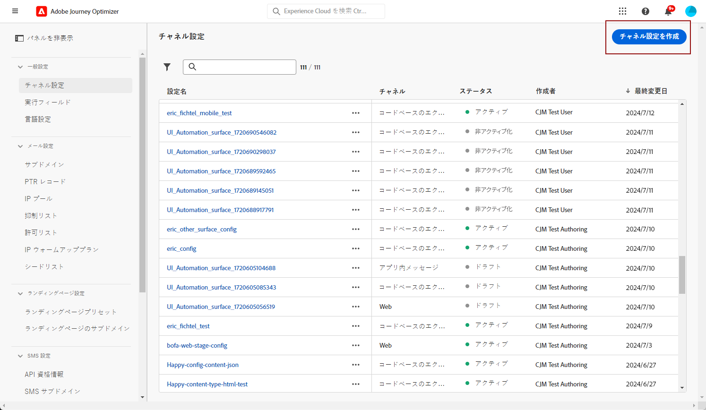
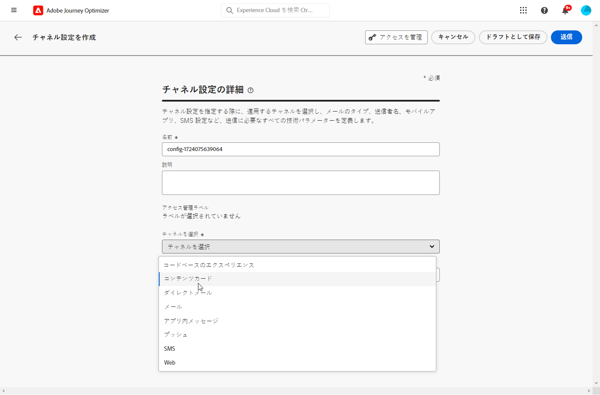
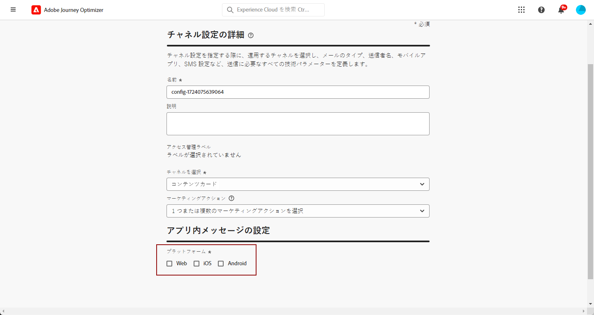

# コンテンツカードの設定 {#content-card-configuration}

## 設定とは {#surface-definition}

**コンテンツカードエクスペリエンス設定** は、ユーザーまたはシステムインタラクション用に設計された任意のエンティティで、**URI** によって一意に識別されます。

つまり、サーフェスは、存在するエンティティ（タッチポイント）を持つ任意のレベルの階層のコンテナと見なすことができます。

* Web ページ、モバイルアプリ、デスクトップアプリ、大規模なエンティティ内の特定のコンテンツの場所（`div` など）、非標準の表示パターン（キオスクやデスクトップアプリバナーなど）があります。

* また、非表示または抽象された表示を目的として、コンテンツ コンテナの特定の部分に拡張することもできます（サービスに配信される JSON BLOB など）。

* また、様々なクライアントサーフェス定義に一致するワイルドカードサーフェスにすることもできます（例えば、web サイトの各ページのヒーロー画像の場所を web://mydomain.com/*#hero_image のようなサーフェス URI に変換できます）。

基本的に、サーフェス URI は複数のセクションで構成されます。

1. **タイプ**：web、mobileapp、atm、kiosk、tvcd、service など。
1. **プロパティ**：ページ URL またはアプリバンドル
1. **コンテナ**：ページ／アプリアクティビティ上の場所

次の表に、様々なデバイスのサーフェス URI 定義の例を示します。

**Web およびモバイル**

| タイプ | URI | 説明 |
| --------- | ----------- | ------- | 
| Web | `web://domain.com/path/page.html#element` | 特定のドメインの特定のページ内の個々の要素を表します。要素は、次の例のようなラベル（hero_banner、top_nav、menu、footer など）にすることができます。 |
| iOS アプリ | `mobileapp://com.vendor.bundle/activity#element` | ボタンや他のビュー要素など、ネイティブアプリアクティビティ内の特定の要素を表します。 |
| Android アプリ | `mobileapp://com.vendor.bundle/#element` | ネイティブアプリ内の特定の要素を表します。 |

**その他のデバイスタイプ**

| タイプ | URI | 説明 |
| --------- | ----------- | ------- | 
| Desktop | `desktop://com.vendor.bundle/#element` | ボタン、メニュー、ヒーローバナーなど、アプリケーション内の特定の要素を表します。 |
| TV アプリ | `tvcd://com.vendor.bundle/#element` | スマート TV または TV 接続デバイスアプリ内の特定の要素（バンドル ID）を表します。 |
| サービス | `service://servicename/#element` | サーバーサイドのプロセスまたは他の手動エンティティを表します。 |
| キオスク | `kiosk://location/screen#element` | 容易に追加できる、潜在的な追加サーフェスタイプの例。 |
| ATM | `atm://location/screen#element` | 容易に追加できる、潜在的な追加サーフェスタイプの例。 |

**ワイルドカードサーフェス**

| タイプ | URI | 説明 |
| --------- | ----------- | ------- | 
| ワイルドカード web | `wildcard:web://domain.com/*#element` | ワイルドカードサーフェス - 特定のドメインの下の各ページの個々の要素を表します。 |
| ワイルドカード web | `wildcard:web://*domain.com/*#element` | ワイルドカードサーフェス - 「domain.com」で終わるすべてのドメインの各ページの個々の要素を表します。 |

## コンテンツカード設定の作成 {#create-config}

1. **[!UICONTROL チャネル]**/**[!UICONTROL ブランディング]**/**[!UICONTROL チャネル設定]** メニューにアクセスし、「**[!UICONTROL チャネル設定を作成]**」をクリックします。

   

1. 設定の名前と説明（オプション）を入力します。

   >[!NOTE]
   >
   > 名前は、文字（A ～ Z）で始める必要があります。使用できるのは英数字のみです。アンダースコア（`_`）、ドット（`.`）、ハイフン（`-`）も使用できます。

1. 設定にカスタムまたはコアのデータ使用ラベルを割り当てるには、「**[!UICONTROL アクセスを管理]**」を選択します。[オブジェクトレベルのアクセス制御（OLAC）について詳しくは、こちらを参照してください](../administration/object-based-access.md)。

1. **[!UICONTROL コンテンツカード]** チャネルを選択します。

   

1. この設定を使用してメッセージに同意ポリシーを関連付けるには、**[!UICONTROL マーケティングアクション]**&#x200B;を選択します。顧客の環境設定に従うために、そのマーケティングアクションに関連付けられているすべての同意ポリシーが活用されます。[詳細情報](../action/consent.md#surface-marketing-actions)

1. コンテンツカードエクスペリエンスを適用するプラットフォームを選択します。

   

1. Web の場合：

   * 単一ページにのみ変更を適用するには、**[!UICONTROL ページ URL]** を指定します。

   * または、**[!UICONTROL ページ一致ルール]**&#x200B;を作成して、指定したルールに一致する複数の URL をターゲットにします。例えば、すべてのページでヒーローバナーを更新したり、すべての製品ページに表示するトップ画像を追加したりするなど、web サイト全体に変更を普遍的に適用するのに使用できます。[詳細情報](../web/web-configuration.md)

1. iOS および Android の場合：

   * **[!UICONTROL アプリ ID]**、**[!UICONTROL アプリ内の場所またはパス]**、**[!UICONTROL プレビュー URL]** を入力または選択します。

1. 変更を送信します。

コンテンツカードエクスペリエンスを作成する際に、設定を選択できるようになりました。

