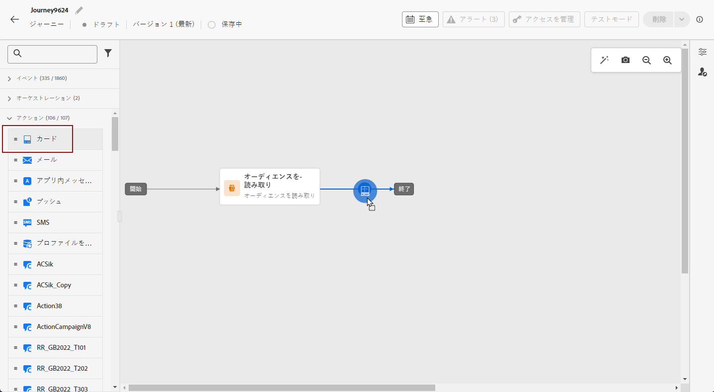
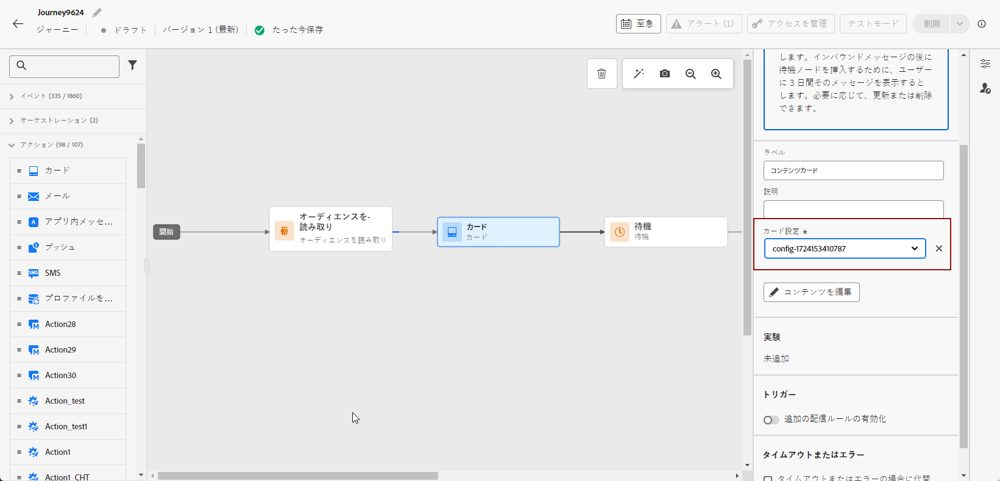
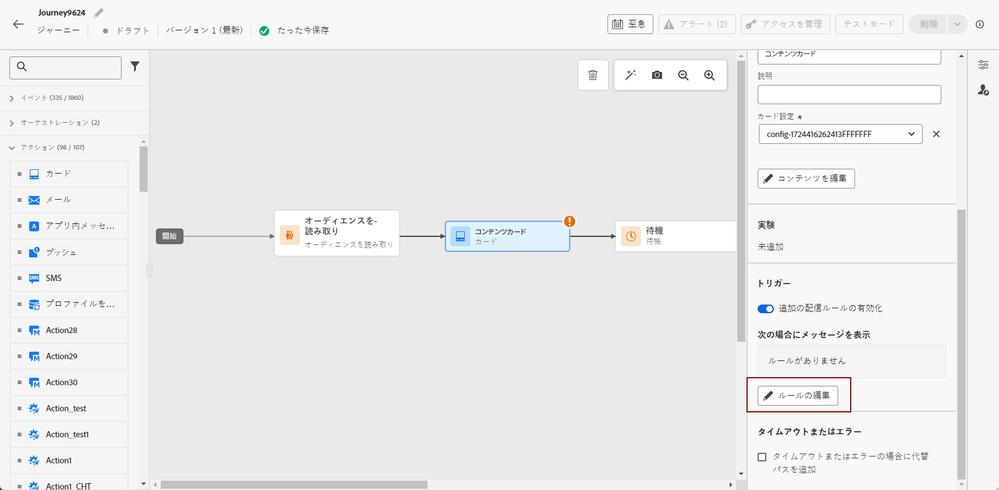
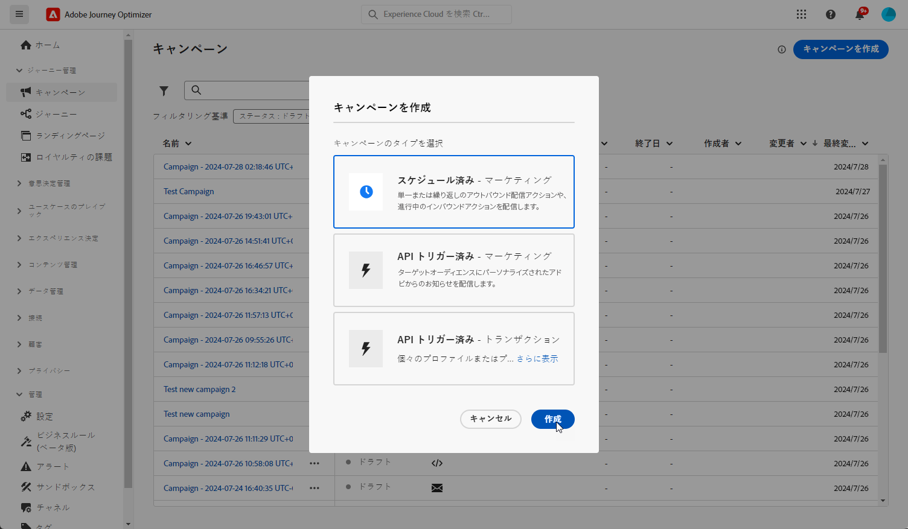
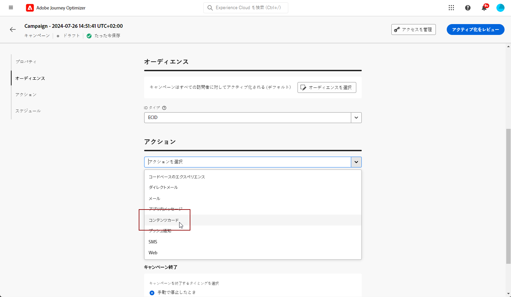
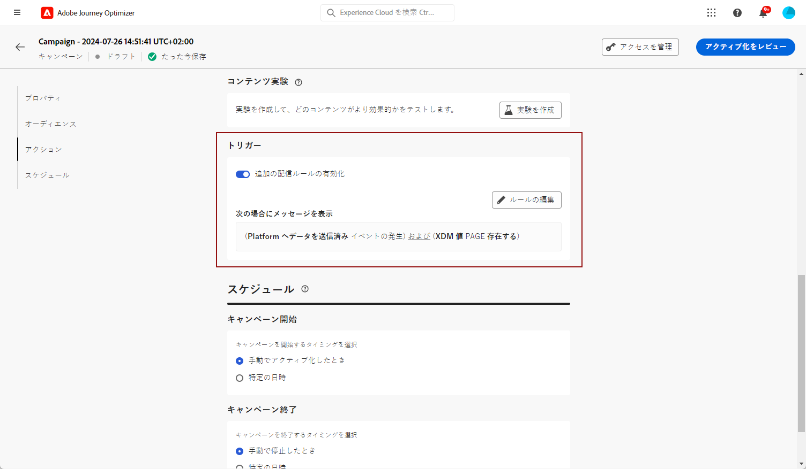
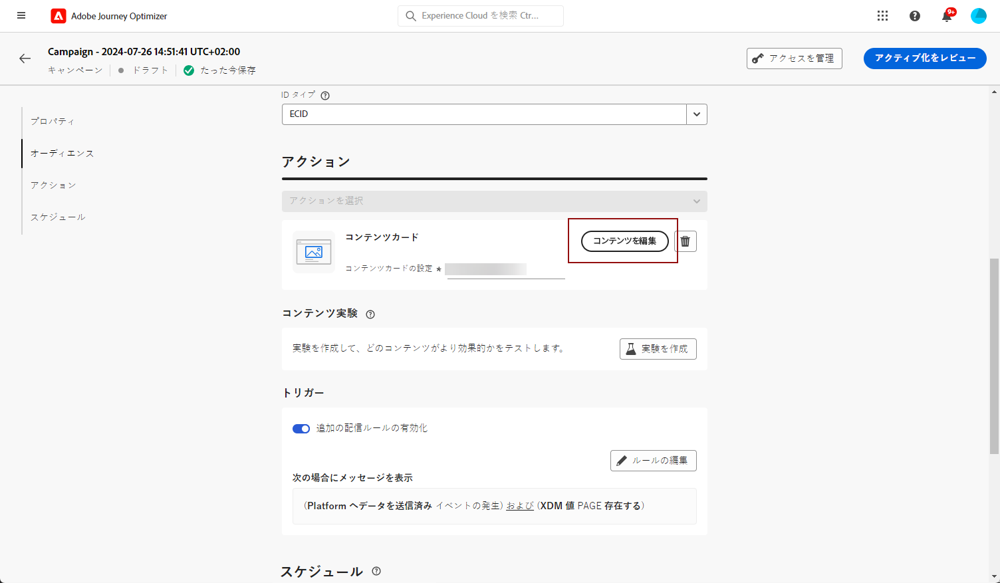

# コンテンツカードの作成 {#create-content-card}

>[!BEGINTABS]

>[!TAB ジャーニーへのコンテンツカードの追加]

コンテンツカードをジャーニーに追加するには、次の手順に従います。

1. ジャーニーを開き、パレットの「**[!UICONTROL アクション]**」セクションから&#x200B;**[!UICONTROL カード]**&#x200B;アクティビティをドラッグ＆ドロップします。

   

1. メッセージの&#x200B;**[!UICONTROL ラベル]**&#x200B;と&#x200B;**[!UICONTROL 説明]**&#x200B;を入力します。

1. 使用する[コンテンツカード設定](content-card-configuration.md)を選択します。

   

1. これで、「**[!UICONTROL コンテンツを編集]**」ボタンでコンテンツのデザインを開始できます。[詳細情報](design-content-card.md)

1. 「**[!UICONTROL 追加の配信ルールを有効にする]**」オプションを有効にします。次に、「**[!UICONTROL ルールを編集]**」で、メッセージをトリガーするイベントと条件を選択します。ルールビルダーを使用すると、条件と値を指定して、条件が満たされた場合に一連のアクションをトリガーできます。

   

   1. 「**[!UICONTROL 条件を追加]**」をクリックしてイベントを選択します。

      +++使用可能なイベントについてはこちらを参照してください。

      | パッケージ | トリガー | 定義 |
      |---|---|---|
      | Platform にデータを送信 | Platform にデータを送信済み | モバイルアプリがエッジエクスペリエンスイベントを発行してデータを Adobe Experience Platform に送信するとトリガーされます。通常、API は AEP Edge 拡張機能から [sendEvent](https://developer.adobe.com/client-sdks/documentation/edge-network/api-reference/#sendevent) を呼び出します。 |
      | コアトラッキング | アクションを追跡 | モバイルコード API [trackAction](https://developer.adobe.com/client-sdks/documentation/mobile-core/api-reference/#trackaction) で提供される従来の機能を呼び出すとトリガーされます。 |
      | コアトラッキング | 状態を追跡 | モバイルコード API [trackState](https://developer.adobe.com/client-sdks/documentation/mobile-core/api-reference/#trackstate) で提供される従来の機能を呼び出すとトリガーされます。 |
      | コアトラッキング | PII を収集 | モバイルコード API [collectPII](https://developer.adobe.com/client-sdks/documentation/mobile-core/api-reference/#collectpii) で提供される従来の機能を呼び出すとトリガーされます。 |
      | アプリケーションライフサイクル | アプリケーションの起動 | 実行のたびに（クラッシュおよびインストールを含む）トリガーされます。また、ライフサイクルセッションのタイムアウトを超えた場合に、SignatureInfo オブジェクトのバックグラウンドからの再開時にもトリガーされます。 |
      | アプリケーションライフサイクル | アプリケーションのインストール | インストール後または再インストール後の最初の実行時にトリガーされます。 |
      | アプリケーションライフサイクル | アプリケーションの更新 | アップグレード後またはバージョン番号の変更時の最初の実行時にトリガーされます。 |
      | アプリケーションライフサイクル | アプリケーションのクローズ | アプリケーションをクローズするとトリガーされます。 |
      | アプリケーションライフサイクル | アプリケーションのクラッシュ | アプリケーションが終了前にバックグラウンドにならなかった場合にトリガーされます。このイベントは、アプリケーションがクラッシュした後の起動時に送信されます。Adobe Mobile クラッシュレポートには、キャッチできないグローバルな例外ハンドラーは実装されていません。 |

+++

   1. **[!UICONTROL トリガー]**&#x200B;をさらに追加してルールをさらに拡張する場合は、**[!UICONTROL または]**&#x200B;条件を選択します。

   1. **[!UICONTROL 特性]**&#x200B;を追加してルールを微調整する場合は、**[!UICONTROL および]**&#x200B;条件を選択します。

      +++使用可能な特性についてはこちらを参照。

      | パッケージ | 特性 | 定義 |
      |---|---|---|
      | デバイス情報 | 通信事業者名 | リストに含まれる通信事業者名のいずれかに一致するとトリガーされます。 |
      | デバイス情報 | デバイス名 | デバイス名のいずれかに一致するとトリガーされます。 |
      | デバイス情報 | ロケール | リストに含まれる言語のいずれかに一致するとトリガーされます。 |
      | デバイス情報 | OS バージョン | 指定された OS バージョンのいずれかに一致するとトリガーされます。 |
      | デバイス情報 | 以前の OS バージョン | 指定された以前の OS バージョンのいずれかに一致するとトリガーされます。 |
      | デバイス情報 | 実行モード | 実行モードがアプリケーションまたは拡張機能の場合にトリガーされます。 |
      | アプリケーションライフサイクル | アプリ ID | 指定されたアプリ ID に一致するとトリガーされます。 |
      | アプリケーションライフサイクル | 曜日 | 指定された曜日に一致するとトリガーされます。 |
      | アプリケーションライフサイクル | 初回使用以降の日数 | 初回使用以降の指定された日数に一致するとトリガーされます。 |
      | アプリケーションライフサイクル | 前回使用以降の日数 | 前回使用以降の指定された日数に一致するとトリガーされます。 |
      | アプリケーションライフサイクル | アップグレード以降の日数 | 前回のアップグレード以降の指定された日数に一致するとトリガーされます。 |
      | アプリケーションライフサイクル | インストール日 | 指定されたインストール日に一致するとトリガーされます。 |
      | アプリケーションライフサイクル | 起動回数 | 指定された起動回数に一致するとトリガーされます。 |
      | アプリケーションライフサイクル | 時刻 | 指定された時刻に一致するとトリガーされます。 |

+++

   1. 「**[!UICONTROL グループを作成]**」をクリックして、トリガーをグループ化します。

1. 必要に応じて、追加のアクションまたはイベントをドラッグ＆ドロップして、ジャーニーフローを完了します。[詳細情報](../building-journeys/about-journey-activities.md)

1. コンテンツカードの準備が整ったら、設定を完了し、ジャーニーを公開してアクティブ化します。

ジャーニーの設定方法について詳しくは、[このページ](../building-journeys/journey-gs.md)を参照してください。

>[!TAB キャンペーンへのコンテンツカードの追加]

キャンペーンを通じてコンテンツカードの作成を開始するには、次の手順に従います。

1. キャンペーンの作成. [詳細情報](../campaigns/create-campaign.md)

1. 実施するキャンペーンのタイプを選択します。

   * **[!UICONTROL Scheduled - Marketing]**：キャンペーンをすぐに実行するか、指定日に実行します。スケジュール済みキャンペーンは、**マーケティング**&#x200B;メッセージを送信することを目的としています。ユーザーインターフェイスから設定および実行します。

   * **[!UICONTROL API トリガー - マーケティング／トランザクション]**：API 呼び出しを使用してキャンペーンを実行します。API トリガーキャンペーンは、**マーケティング**&#x200B;メッセージまたは&#x200B;**トランザクション**&#x200B;メッセージのいずれか、つまり、個人が実行したアクション（パスワードのリセット、買い物かごの購入など）に続いて送信されるメッセージを送信することを目的としています。[API を使用してキャンペーンをトリガーする方法についてはこちらを参照してください](../campaigns/api-triggered-campaigns.md)

   

1. 「**[!UICONTROL プロパティ]**」セクションで、キャンペーンの名前と説明を指定します。

1. 「**オーディエンス**」セクションで、「**[!UICONTROL オーディエンスを選択]**」ボタンをクリックして、使用可能な Adobe Experience Platform オーディエンスのリストを表示します。[詳しくは、オーディエンスを参照してください](../audience/about-audiences.md)

1. 「**[!UICONTROL ID 名前空間]**」フィールドで、選択したセグメントから個人を識別するために使用する名前空間を選択します。[詳しくは、名前空間を参照してください](../event/about-creating.md#select-the-namespace)

1. **[!UICONTROL コンテンツカード]**&#x200B;アクションを選択します。

   

1. 新しい[コンテンツカード設定](content-card-configuration.md)を選択または作成します。

1. メッセージのコンテンツをテストするには、「**[!UICONTROL 実験を作成]**」をクリックします。これにより、サンプル母集団に対して配信の複数の変数をテストし、ターゲットオーディエンスに最も大きな影響を与える処理を判断できます。[詳しくは、コンテンツ実験を参照してください](../content-management/content-experiment.md)。

1. 追加のトリガーが必要な場合は、**[!UICONTROL 追加の配信ルールを有効にする]**&#x200B;切替スイッチを使用します。追加の配信ルールは必要ありません。

   「**[!UICONTROL トリガーを編集]**」をクリックして、メッセージ配信のイベントと条件を選択します。ルールビルダーを使用すると、条件と値を指定して、条件が満たされた場合にアクションをトリガーできます。

   

1. キャンペーンを特定の日付にスケジュールすることや、定期的に繰り返すように設定することができます。[詳細情報](../campaigns/create-campaign.md#schedule)

1. これで、「**[!UICONTROL コンテンツを編集]**」でコンテンツのデザインを開始できます。[詳細情報](design-content-card.md)

   

>[!ENDTABS]
