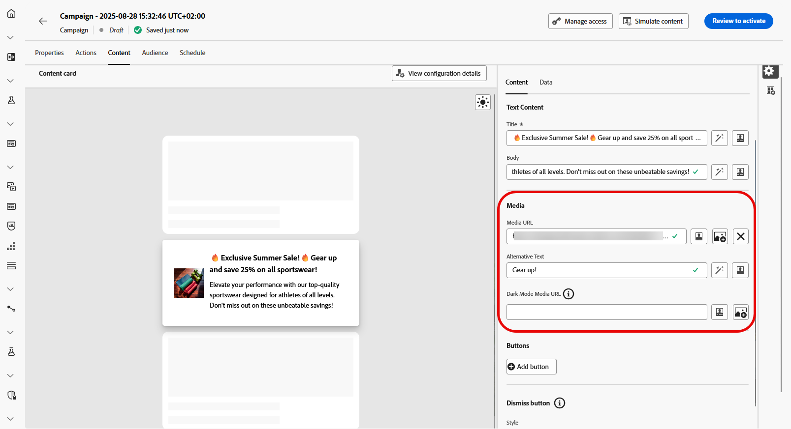

# コンテンツカードのコンテンツのデザイン {#design-content-card}

カードのオーサリング構造は、マーケターに基本入力を提供するフォームベースのオーサリングエクスペリエンスを提供します。この入力は開発者がレンダリングするために使用できます。

コンテンツを定義し、パーソナライズしたら、レビューしてアクティブ化できます。 設定したスケジュールに従ってキャンペーンが送信されます。 詳しくは、[このページ](../campaigns/review-activate-campaign.md)を参照してください。

## 「コンテンツ」タブ {#content-tab}

「**[!UICONTROL コンテンツ]**」タブから、コンテンツカードのコンテンツと「**[!UICONTROL 閉じる]**」ボタンのデザインの両方を定義して、コンテンツカードをカスタマイズできます。 さらに、このタブからメディアを使用してコンテンツを拡張したり、アクションボタンを直接追加したりできます。

### 「閉じる」ボタン {#close-button}

**[!UICONTROL 閉じる]** ボタンの **[!UICONTROL スタイル]** を選択して、外観をカスタマイズします。

次のスタイルから選択できます。

* **[!UICONTROL なし]**
* **[!UICONTROL シンプル]**
* **[!UICONTROL 円]**

### コンテンツ {#title-body}

メッセージを作成するには、「**[!UICONTROL タイトル]**」フィールドと「**[!UICONTROL 本文]** フィールドにテキストを入力します。

メッセージをさらにカスタマイズする場合は、「**[!UICONTROL Personalization]**」アイコンを使用して、パーソナライズされた要素を追加します。 パーソナライズ機能の使用方法について詳しくは、[ この節 ](../personalization/personalize.md) を参照してください。

<!--
+++More options with advanced formatting

If the **[!UICONTROL Advanced formatting mode]** is switched on, you can choose for your **[!UICONTROL Header]** and **[!UICONTROL Body]**:

* the **[!UICONTROL Font]**
* the **[!UICONTROL Pt size]**
* the **[!UICONTROL Font Color]**
* the **[!UICONTROL Alignment]**
+++
-->

### メディア {#add-media}

**[!UICONTROL メディア]** フィールドを使用すると、メディアを追加してコンテンツカードを強化し、エンドユーザーにとってプレゼンテーションをより魅力的にすることができます。

メディアを含めるには、使用するメディアの URL を入力するか、「**[!UICONTROL Assetsを選択]**」アイコンをクリックして、Assets ライブラリに保存されているアセットから選択します。 [アセット管理の詳細情報](../content-management/assets.md)。

<!--
+++More options with advanced formatting

If the **[!UICONTROL Advanced formatting mode]** is switched on, you can add an **[!UICONTROL Alternative text]** for screen reading applications and another asset in the **[!UICONTROL Dark Mode Media URL]** field.

+++
-->

### ボタン {#add-buttons}

ユーザーがコンテンツカードを操作するためのボタンを追加します。

1. **[!UICONTROL 追加ボタン]** をクリックして、新しいアクションボタンを作成します。

1. ボタン **[!UICONTROL タイトル]** フィールドを編集して、ボタンに表示するラベルを指定します。

1. **[!UICONTROL インタラクトイベント]** を選択して、ユーザーがボタンをクリックまたは操作したときにトリガーされるアクションを定義します。

1. 「**[!UICONTROL ターゲット]**」フィールドに、ユーザーがボタンを操作した後に向けられる web URL またはディープリンクを入力します。

<!--
+++More options with advanced formatting

If the **[!UICONTROL Advanced formatting mode]** is switched on, you can choose for your **[!UICONTROL Buttons]**:

* the **[!UICONTROL Font]**
* the **[!UICONTROL Pt size]**
* the **[!UICONTROL Font Color]**
* the **[!UICONTROL Alignment]**

+++
-->

### クリック時の動作

「**[!UICONTROL ターゲット URL]**」フィールドに、コンテンツカードとのやり取りの後でユーザーを目的の宛先に誘導する web URL またはディープリンクを入力します。 これは、外部 web サイト、アプリ内の特定のページ、またはユーザーのインタラクションに基づいてユーザーを誘導するその他の場所です。

## 「データ」タブ

## カスタムデータ {#custom-data}

「**[!UICONTROL カスタムデータ]**」セクションで、「**[!UICONTROL キーと値のペアを追加]**」をクリックして、ペイロードにカスタム変数を含めます。 これらのキーと値のペアを使用すると、特定の設定に応じて、追加のデータを渡すことができます。 これにより、パーソナライズされたコンテンツ、動的コンテンツ、トラッキング情報または設定に関連するその他のデータを追加できます。
