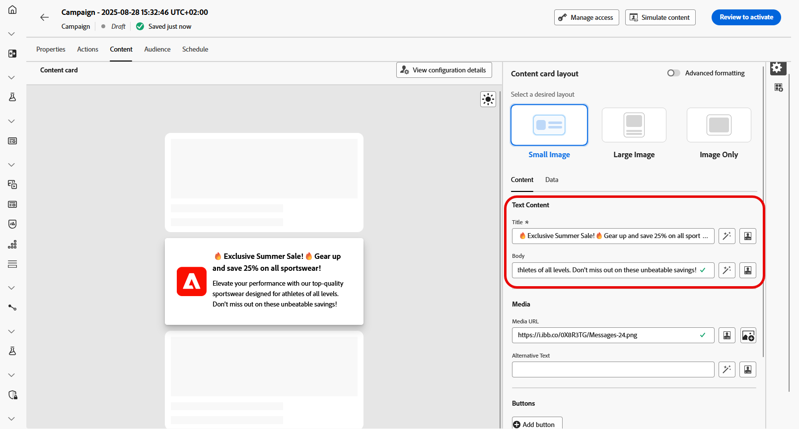

# コンテンツカードコンテンツのデザイン {#design-content-card}

カードのオーサリング構造は、開発者がレンダリングできる基本的な入力をマーケターに提供する、フォームベースのオーサリングエクスペリエンスを提供します。

コンテンツを定義し、パーソナライズしたら、レビューしてアクティブ化できます。設定したスケジュールに従ってキャンペーンが送信されます。[詳しくは、このページを参照してください](../campaigns/review-activate-campaign.md)。

## コンテンツカードのレイアウト

「**[!UICONTROL コンテンツカードのレイアウト]**」のセクションで、メッセージ要件に応じて、3 つの画像レイアウトオプションのいずれかを選択します。

* **[!UICONTROL 小さい画像]**：テキストと共にコンパクトな画像を表示します。ビジュアルよりもコンテンツを優先するメッセージに最適です。

  [iOS &#x200B;](https://developer.adobe.com/client-sdks/edge/adobe-journey-optimizer/content-card-ui/iOS/templates/smallimage-template/) および [Android](https://developer.adobe.com/client-sdks/edge/adobe-journey-optimizer/content-card-ui/Android/public-classes/state/smallimagecarduistate/) でのレイアウトについて詳しくは、Adobe 開発者用ドキュメントを参照してください。

* **[!UICONTROL 大きい画像]**：テキストの上部または横に目立つ画像を配置し、メッセージでビジュアルに焦点を当てます。

  [iOS](https://developer.adobe.com/client-sdks/edge/adobe-journey-optimizer/content-card-ui/iOS/templates/largeimage-template/) および [Android](https://developer.adobe.com/client-sdks/edge/adobe-journey-optimizer/content-card-ui/Android/public-classes/state/largeimagecarduistate/) でのレイアウトについて詳しくは、Adobe 開発者用ドキュメントを参照してください。

* **[!UICONTROL 画像のみ]**：テキストを伴わない画像を表示します。ビジュアル主導のメッセージやスタンドアロン画像に最適です。

  [iOS](https://developer.adobe.com/client-sdks/edge/adobe-journey-optimizer/content-card-ui/iOS/templates/imageonly-template/) および [Android](https://developer.adobe.com/client-sdks/edge/adobe-journey-optimizer/content-card-ui/Android/public-classes/state/imageonlycarduistate/) でのレイアウトについて詳しくは、Adobe 開発者用ドキュメントを参照してください。

## 「コンテンツ」タブ {#content-tab}

「**[!UICONTROL コンテンツ]**」タブから直接、コンテンツを定義してメディアやアクションボタンを追加することで、コンテンツカードをカスタマイズできます。

### テキストコンテンツ {#title-body}

メッセージを作成するには、「**[!UICONTROL タイトル]**」フィールドと「**[!UICONTROL 本文]**」フィールドにテキストを入力します。

メッセージをさらにカスタマイズする場合は、**[!UICONTROL パーソナリゼーション]**&#x200B;アイコンを使用して、パーソナライズされた要素を追加します。パーソナリゼーション機能の使用方法について詳しくは、[この節](../personalization/personalize.md)を参照してください。

### メディア {#add-media}

「**[!UICONTROL メディア]**」フィールドを使用すると、メディアを追加してコンテンツカードを強化し、エンドユーザーにとってプレゼンテーションをより魅力的にすることができます。

メディアを含めるには、使用するメディアの URL を入力するか、**[!UICONTROL アセットを選択]**&#x200B;アイコンをクリックして、アセットライブラリに保存されているアセットから選択します。[アセット管理の詳細情報](../integrations/assets.md)。

+++詳細フォーマットを使用したその他のオプション

「**[!UICONTROL 詳細フォーマットモード]**」がオンになっている場合は、画面読み取りアプリケーション用の&#x200B;**[!UICONTROL 代替テキスト]**&#x200B;と別のアセットを「**[!UICONTROL ダークモードメディア URL]**」フィールドに追加できます。

+++

### ボタン {#add-buttons}

ユーザーがコンテンツカードを操作するボタンを追加します。

1. **[!UICONTROL 「追加」ボタン]**&#x200B;をクリックして、新しいアクションボタンを作成します。

1. ボタンの「**[!UICONTROL タイトル]**」フィールドを編集して、ボタンに表示するラベルを指定します。

1. 「**[!UICONTROL インタラクトイベント]**」を選択して、ユーザーがボタンをクリックまたは操作したときにトリガーされるアクションを定義します。

1. 「**[!UICONTROL ターゲット]**」フィールドに、ユーザーがボタンを操作した後に遷移する web URL またはディープリンクを入力します。

<!--
+++More options with advanced formatting

If the **[!UICONTROL Advanced formatting mode]** is switched on, you can choose for your **[!UICONTROL Buttons]**:

* the **[!UICONTROL Font]**
* the **[!UICONTROL Pt size]**
* the **[!UICONTROL Font Color]**
* the **[!UICONTROL Alignment]**

+++
-->

### 「閉じる」ボタン {#close-button}

**[!UICONTROL 「閉じる」ボタン]**&#x200B;の「**[!UICONTROL スタイル]**」を選択して、表示方法をカスタマイズします。

選択できるスタイルは次のとおりです。

* **[!UICONTROL なし]**
* **[!UICONTROL シンプル]**
* **[!UICONTROL 円]**

<!--
+++More options with advanced formatting

If the **[!UICONTROL Advanced formatting mode]** is switched on, you can choose for your **[!UICONTROL Header]** and **[!UICONTROL Body]**:

* the **[!UICONTROL Font]**
* the **[!UICONTROL Pt size]**
* the **[!UICONTROL Font Color]**
* the **[!UICONTROL Alignment]**
+++
-->

### クリック時の動作

「**[!UICONTROL ターゲット URL]**」フィールドに、コンテンツカードとのやり取りの後でユーザーを目的の宛先に誘導する web URL またはディープリンクを入力します。これは、外部 web サイト、アプリ内の特定のページ、またはユーザーのインタラクションに基づいてユーザーを誘導するその他の場所です。

## 「データ」タブ

## カスタムデータ {#custom-data}

**[!UICONTROL カスタムデータ]**&#x200B;セクションで、「**[!UICONTROL キーと値のペアを追加]**」をクリックして、ペイロードにカスタム変数を含めます。これらのキーと値のペアを使用すると、特定の設定に応じて、追加のデータを渡すことができます。これにより、パーソナライズされたコンテンツ、動的コンテンツ、トラッキング情報または設定に関連するその他のデータを追加できます。
