# 電子メールデザイナーのコンテンツ用コンポーネントを使用する {#content-components}

>[!CONTEXTUALHELP]
>id="ac_content_components"
>title="コンテンツコンポーネントについて"
>abstract="コンテンツコンポーネントは、メールのレイアウト作成に使用できる空のコンテンツプレースホルダーです。"

メールコンテンツを一から作成する際は、**[!UICONTROL コンテンツコンポーネント]**を使用すると、メールに配置して使用できる空の Raw コンポーネントで、メールをさらにパーソナライズできます。
メールのレイアウトを定義する**[!UICONTROL 構造コンポーネント]**&#x200B;内には、必要な数だけ&#x200B;**[!UICONTROL コンテンツコンポーネント]**&#x200B;を追加できます。

## ボタン {#buttons}

**[!UICONTROL ボタン]**&#x200B;コンポーネントを使用すると、メールに複数のボタンを挿入し、メールのオーディエンスを別のページにリダイレクトできます。

1. 「**[!UICONTROL コンテンツコンポーネント]**」から、「**[!UICONTROL ボタン]**」を「**[!UICONTROL 構造コンポーネント]**」にドラッグ＆ドロップします。

   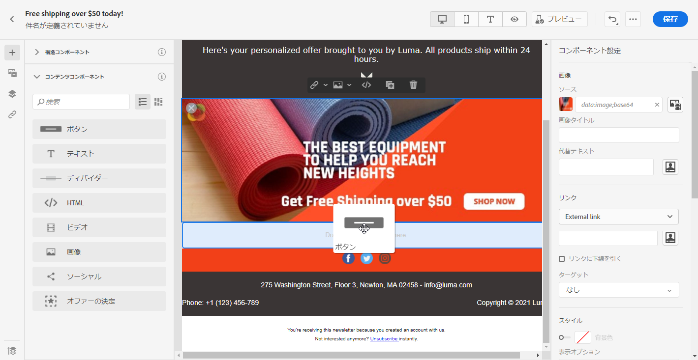

1. 新しく追加したボタンをクリックして、テキストをパーソナライズし、E メールデザイナーの右側のウィンドウにある「**[!UICONTROL コンポーネント設定]**」にアクセスできるようにします。

   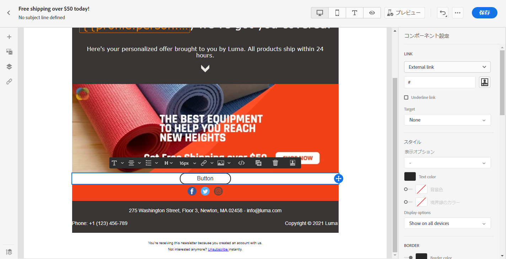

1. 「**[!UICONTROL コンポーネント設定]**」の「**[!UICONTROL リンク]**」フィールドで、ボタンをクリックしたときにオーディエンスをリダイレクトする先の URL を追加します。

1. **[!UICONTROL ターゲット]**&#x200B;ドロップダウンで、オーディエンスのリダイレクト方法を選択します。

   * **[!UICONTROL なし]**：クリックしたフレームと同じフレームでリンクを開きます（デフォルト）。
   * **[!UICONTROL 空白]**：リンクを新しいウィンドウまたは新しいタブで開きます。
   * **[!UICONTROL セルフ]**：クリックしたフレームと同じフレームでリンクを開きます。
   * **[!UICONTROL 親]**：親フレームでリンクを開きます。
   * **[!UICONTROL トップ]**：ウィンドウ全体でリンクを開きます。

   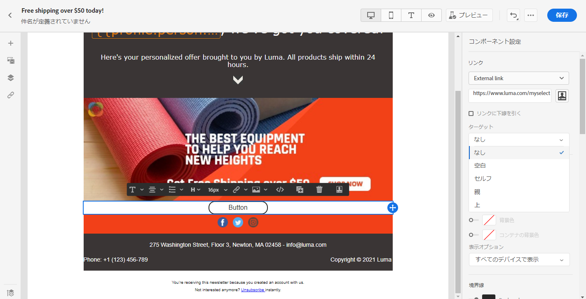

1. ボタンをさらにパーソナライズするには、**[!UICONTROL スタイル]**、**[!UICONTROL マージン]**、**[!UICONTROL ボーダー]**&#x200B;などを変更します。

## テキスト {#text}

**[!UICONTROL テキスト]**&#x200B;コンポーネントを使用すると、メールにテキストを挿入できます。「**[!UICONTROL コンポーネント設定]**」で、テキストの色、スタイル、サイズを調整できます。

1. 「**[!UICONTROL コンテンツコンポーネント]**」で、「**[!UICONTROL テキスト]**」を「**[!UICONTROL 構造コンポーネント]**」にドラッグ＆ドロップします。

   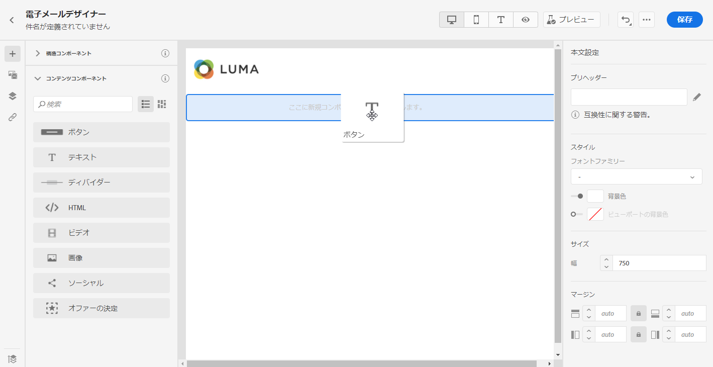

1. 新しく追加したコンポーネントをクリックして、テキストをパーソナライズし、E メールデザイナーの右側のウィンドウにある「**[!UICONTROL コンポーネント設定]**」にアクセスできるようにします。

1. ツールバーで次のオプションを使用して、テキストを変更します。

   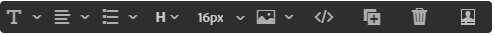

   * **[!UICONTROL テキストスタイルの変更]**：テキストに太字、斜体、下線、取り消し線を適用します。
   * **配置の変更**：テキストの行揃えを左揃え、右揃え、中央揃えまたは両端揃えから選択します。
   * **[!UICONTROL リストの作成]**：テキストに箇条書きまたは番号リストを追加します。
   * **[!UICONTROL 見出しの設定]**：テキストに最大 6 つのレベルの見出しを追加します。
   * **フォントサイズ**：テキストのフォントサイズをピクセル単位で選択します。
   * **[!UICONTROL 画像の編集]**：テキストコンポーネントに画像またはアセットを追加します。[アセット管理の詳細情報](assets-essentials.md)。
   * **[!UICONTROL ソースコードの表示]**：テキストのソースコードを表示します。変更はできません。
   * **[!UICONTROL 複製]**：テキストコンポーネントのコピーを追加します。
   * **[!UICONTROL 削除]**：選択したテキストコンポーネントをメールから削除します。
   * **[!UICONTROL パーソナライズの追加]**：パーソナライゼーションフィールドを追加し、プロファイルデータを使用してコンテンツをカスタマイズできます。[コンテンツのパーソナライゼーションの詳細情報](personalization/personalize.md)。

1. ユーザーエクスペリエンスを向上させるために、パーソナライゼーションフィールドを追加し、オーディエンスをターゲットに設定できます。詳しくは、この[節](personalization/personalize.md)を参照してください。

1. **[!UICONTROL コンポーネント設定]**&#x200B;を使用すると、**[!UICONTROL テキストの色]**、**[!UICONTROL フォントファミリ]**、**[!UICONTROL サイズ]**&#x200B;を調整できます。

   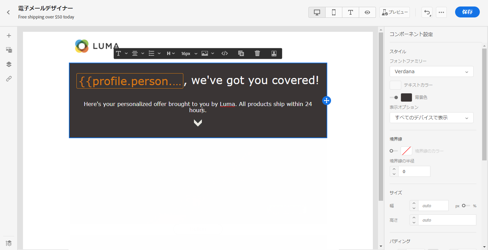

## ディバイダー {#divider}

**[!UICONTROL ディバイダー]**コンポーネントを使用すると、分割線を挿入してメールのレイアウトと内容を整理できます。
**[!UICONTROL コンポーネント設定]**&#x200B;で、区切り線の色、スタイル、およびサイズを選択できます。

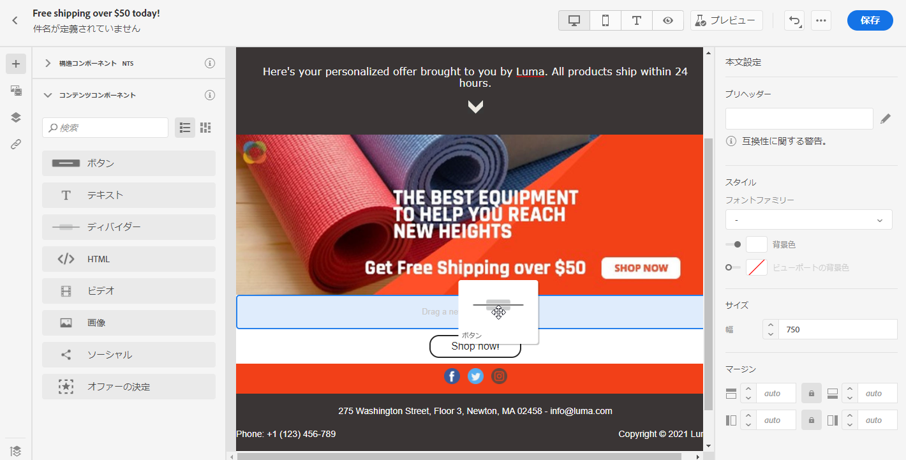

## HTML {#HTML}

**[!UICONTROL HTML]** を使用すると、既存の HTML の別の部分をコピーして貼り付けることができます。これにより、無料のモジュール型 HTML コンポーネントを作成できます。

外部のコンテンツを簡単に E メールデザイナーに準拠させるには、一からメッセージを作成し、既存のメールのコンテンツをコンポーネントにコピーすることをお勧めします。

1. 「**[!UICONTROL コンテンツコンポーネント]**&#x200B;で、「**[!UICONTROL HTML]**」を「**[!UICONTROL 構造コンポーネント]**」にドラッグ＆ドロップします。

   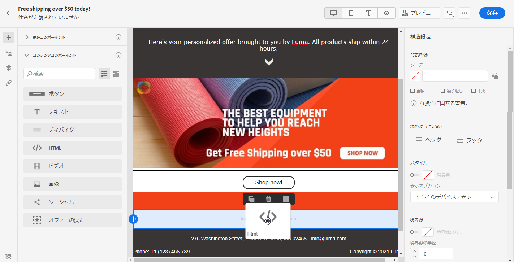

1. 新しく追加したコンポーネントをクリックし、**[!UICONTROL ソースコードを表示]**&#x200B;して HTML を追加します。

   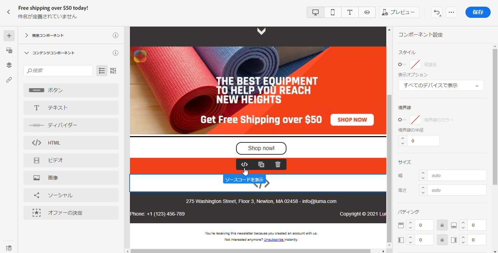

1. 追加する HTML コードをメールにコピー＆ペーストし、「**[!UICONTROL 保存]**」をクリックします。

1. HTML をさらにパーソナライズするには、**[!UICONTROL スタイル]**、**[!UICONTROL マージン]**、**[!UICONTROL ボーダー]**&#x200B;を変更したり、オーディエンスを別の内容にリダイレクトするリンクを追加したりします。

## 画像 {#image}

**[!UICONTROL 画像]**&#x200B;コンポーネントを使用すると、コンピューターからメールに画像ファイルを挿入できます。

1. **[!UICONTROL 内容コンポーネント]**&#x200B;で、**[!UICONTROL 画像]**&#x200B;を&#x200B;**[!UICONTROL 構造コンポーネント]**&#x200B;にドラッグ＆ドロップします。

   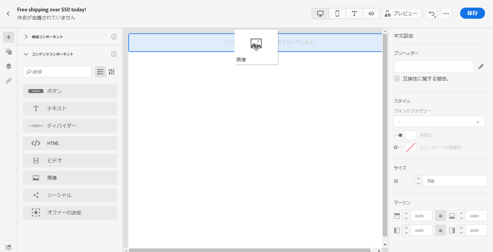

1. 「**[!UICONTROL 参照]**」をクリックして、アセットから画像ファイルを選択します。

   [!DNL Assets Essentials] について詳しくは、[Adobe Experience Manager Assets Essentials のドキュメント](https://experienceleague.adobe.com/docs/experience-manager-assets-essentials/help/introduction.html?lang=ja){target=&quot;_blank&quot;}を参照してください。

1. 新しく追加したコンポーネントをクリックして&#x200B;**[!UICONTROL コンテンツコンポーネント]**&#x200B;の設定を開始し、E メールデザイナーの右側ウィンドウにある「**[!UICONTROL コンポーネント設定]**」にアクセスできるようにします。

1. 画像プロパティを設定します。

   * 「**[!UICONTROL 画像タイトル]** 」で、画像のタイトルを定義します。
   * **[!UICONTROL 代替テキスト]**&#x200B;を使用すると、画像にリンクするキャプションを定義できます。これは alt HTML 属性に対応します。

   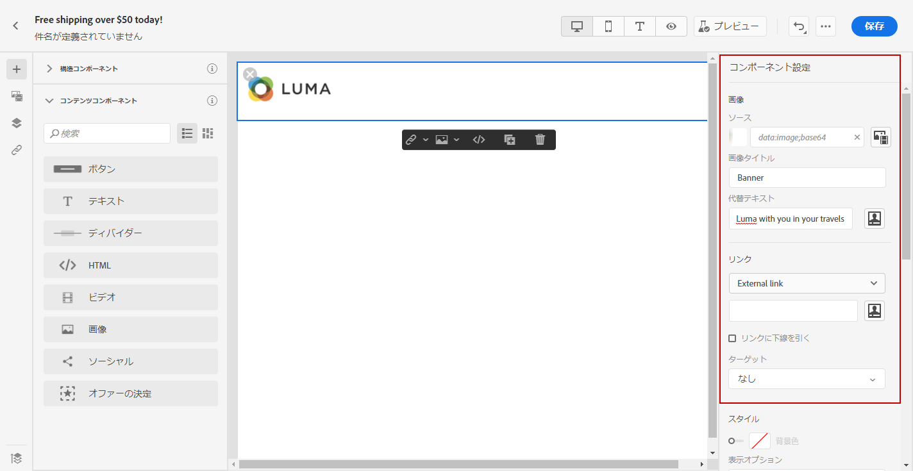

1. 画像をさらにパーソナライズするには、**[!UICONTROL スタイル]**、**[!UICONTROL マージン]**、**[!UICONTROL ボーダー]**&#x200B;を変更したり、オーディエンスを別のコンテンツにリダイレクトするリンクを追加したりします。

## ビデオ {#Video}

>[!CONTEXTUALHELP]
>id="ac_edition_video"
>title="ビデオ設定"
>abstract="このコンポーネントを使用すると、メールにビデオを挿入できます。ビデオが機能しないメールクライアントもあります。フォールバック画像を設定することをお勧めします。"
>additional-url="https://www.emailonacid.com/blog/article/email-development/a_how_to_guide_to_embedding_html5_video_in_email/" text="追加情報"

**[!UICONTROL ビデオ]**&#x200B;コンポーネントを使用すると、メールに URL リンクでビデオを挿入できます。

1. **[!UICONTROL コンテンツコンポーネント]**&#x200B;で、**[!UICONTROL ビデオ]**&#x200B;を&#x200B;**[!UICONTROL 構造コンポーネント]**&#x200B;にドラッグ＆ドロップします。

   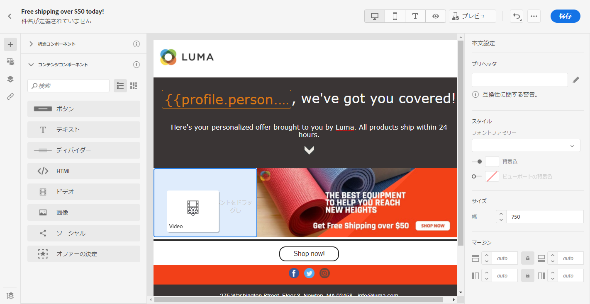

1. 新しく追加したコンポーネントをクリックして&#x200B;**[!UICONTROL コンテンツコンポーネント]**&#x200B;の設定を開始し、E メールデザイナーの右側ウィンドウにある「**[!UICONTROL コンポーネント設定]**」にアクセスできるようにします。

1. **[!UICONTROL コンポーネント設定]**&#x200B;の「**[!UICONTROL ビデオリンク]**」フィールドに、ビデオの URLを 追加します。

   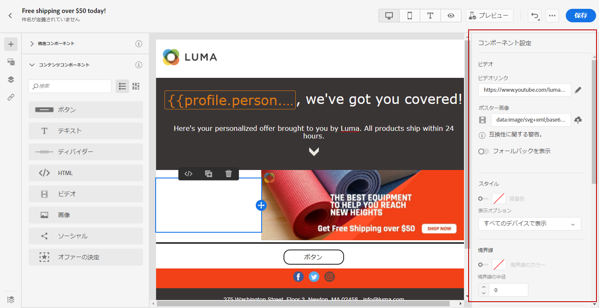

1. ビデオに&#x200B;**[!UICONTROL ポスター画像]**&#x200B;を追加すると、オーディエンスが再生ボタンをクリックするまで表示する画像を指定できます。

1. 画像をさらにパーソナライズするには、**[!UICONTROL スタイル]**、**[!UICONTROL マージン]**、**[!UICONTROL ボーダー]**&#x200B;などを変更します。

## ソーシャル {#social}

**[!UICONTROL ソーシャル]**&#x200B;コンポーネントを使用すると、メールにソーシャルメディアページへのリンクを挿入できます。

1. 「**[!UICONTROL コンテンツコンポーネント]**」で、「**[!UICONTROL ソーシャル]**」を「**[!UICONTROL 構造コンポーネント]**」にドラッグ＆ドロップします。

   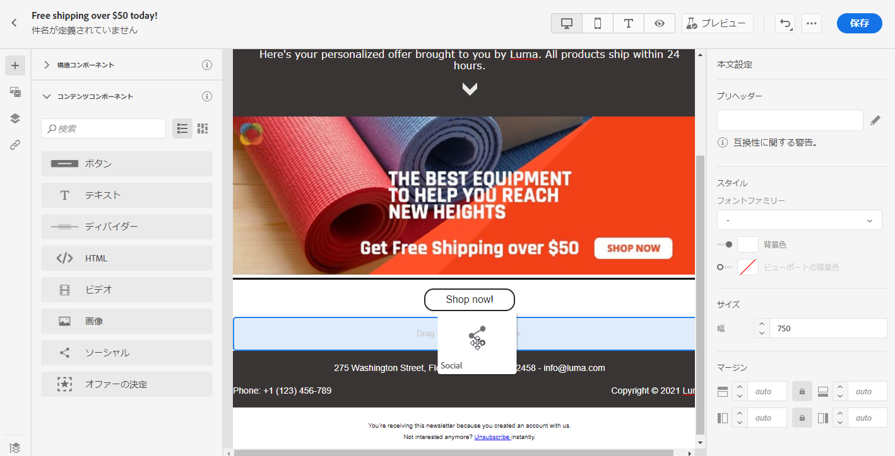

1. 新しく追加したコンポーネントをクリックして&#x200B;**[!UICONTROL コンテンツコンポーネント]**&#x200B;の設定を開始し、E メールデザイナーの右側ウィンドウにある「**[!UICONTROL コンポーネント設定]**」にアクセスできるようにします。

1. 「**[!UICONTROL コンポーネント設定]**」の「**[!UICONTROL ソーシャル]**」フィールドで、追加または削除するソーシャルメディアを選択します。

   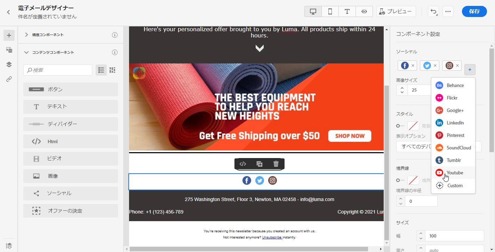

1. 「**[!UICONTROL 画像のサイズ]**」フィールドで、アイコンのサイズを選択します。

1. 各ソーシャルメディアアイコンをクリックし、オーディエンスをリダイレクトする先の **[!UICONTROL URL]** を設定します。

   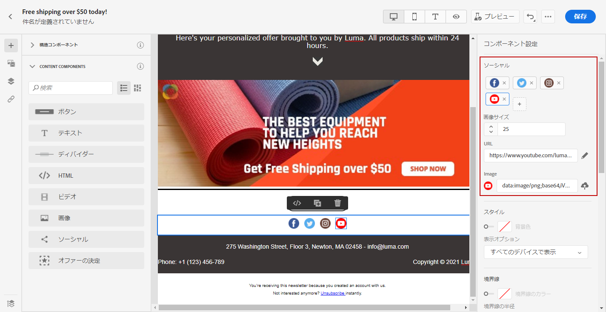

1. 必要に応じて、「**[!UICONTROL 画像]**」フィールドで各ソーシャルメディアのアイコンを変更することもできます。

1. ソーシャルメディアのアイコンをさらにパーソナライズするには、**[!UICONTROL スタイル]**、**[!UICONTROL マージン]**、**[!UICONTROL ボーダー]**&#x200B;を変更します。

## オファーの決定 {#offer-decision}

**[!UICONTROL Offer Decisioning]** コンポーネントを使用すると、メッセージに決定（旧称：オファーアクティビティ）を挿入できます。決定は、決定管理を活用して、顧客に提供する最適なオファーを選択します。

関連トピック：

* [決定管理の概要](offers/get-started/starting-offer-decisioning.md)。
* [パーソナライズされたオファーをメッセージに追加](deliver-personalized-offers.md)。
