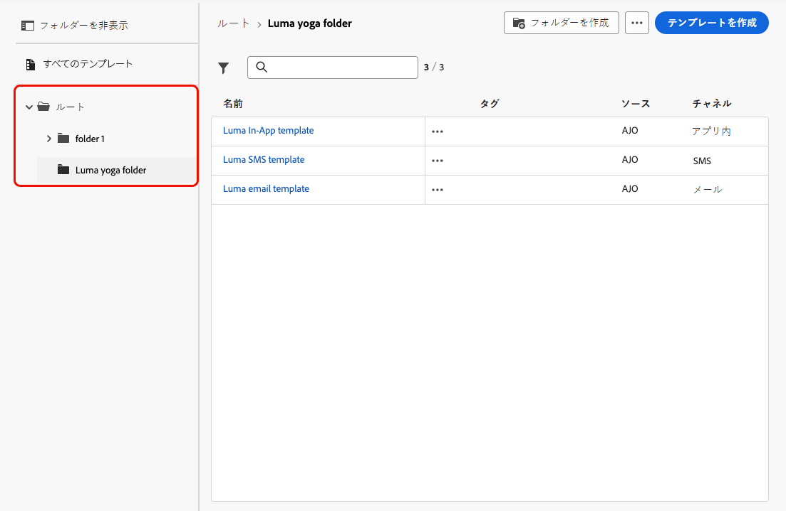
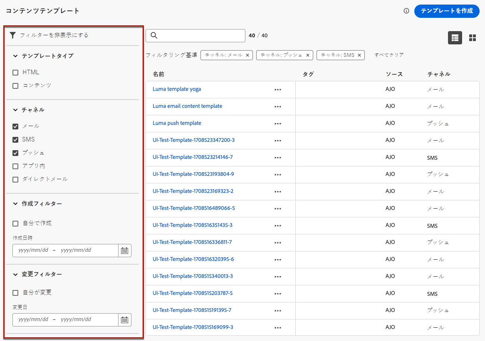
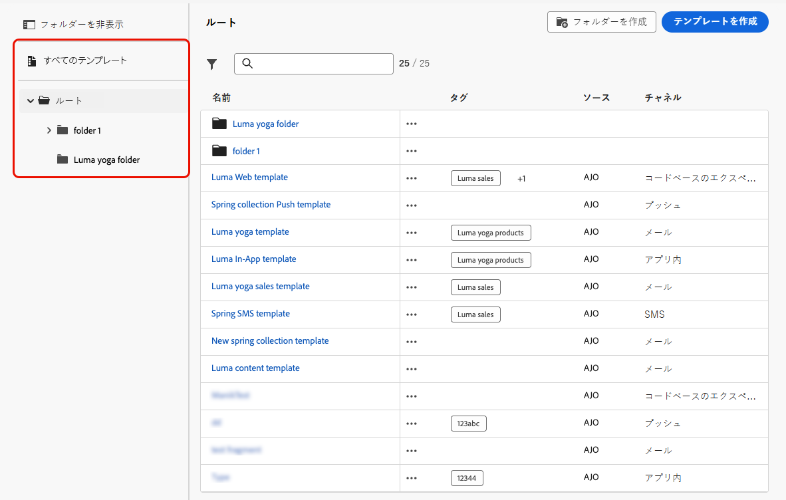
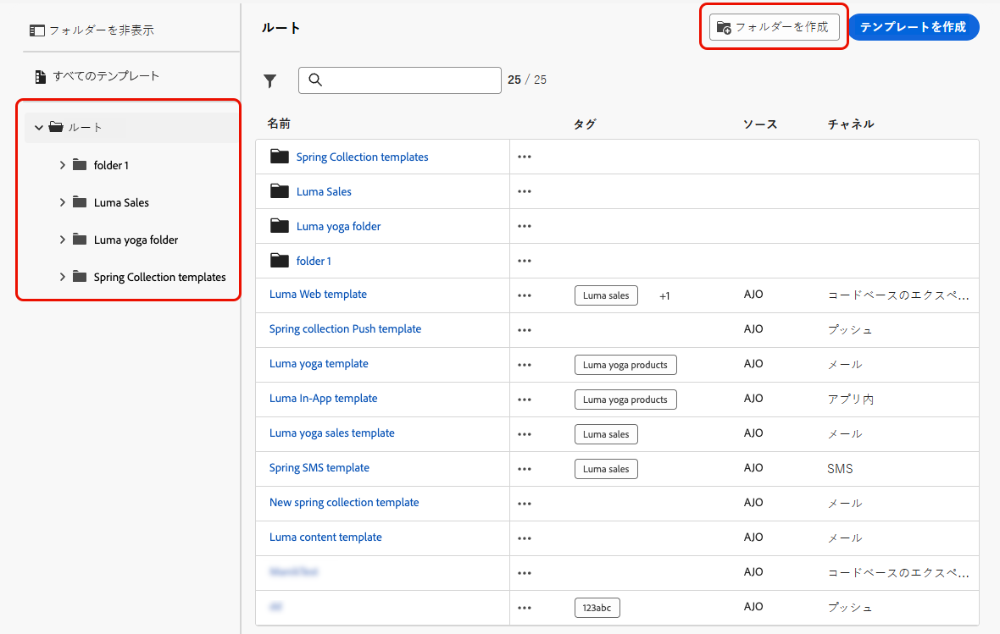
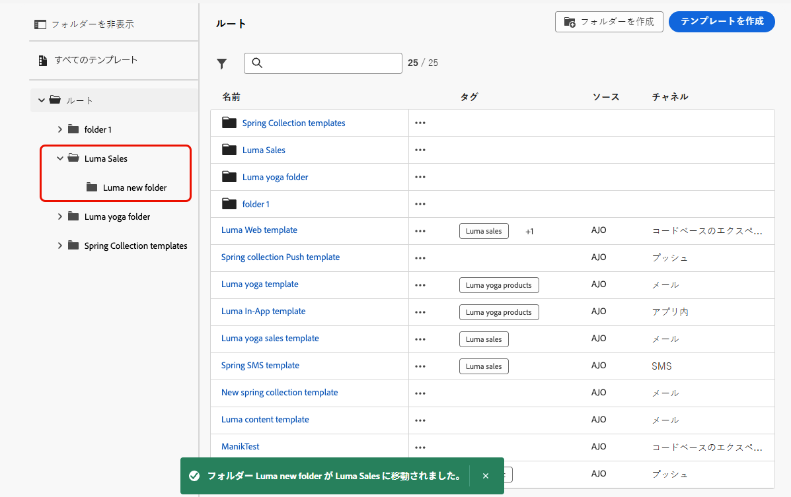
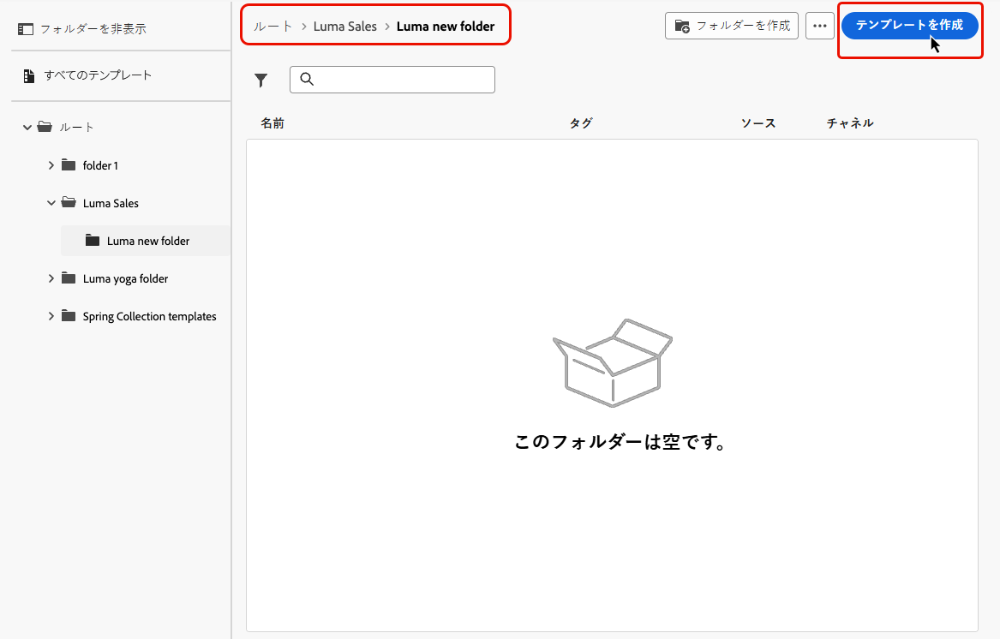
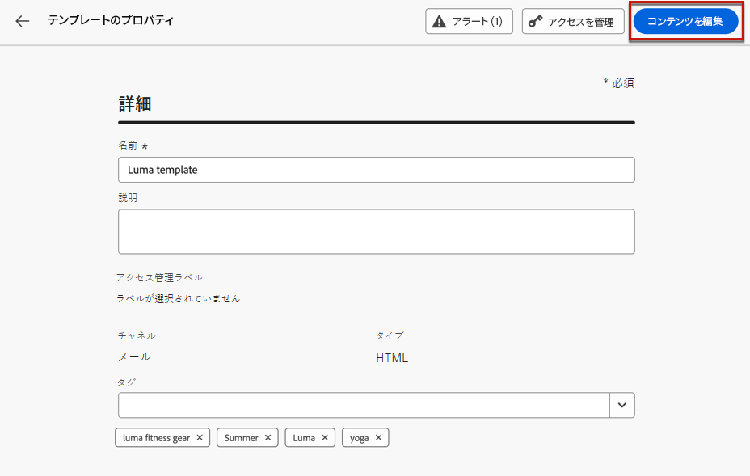
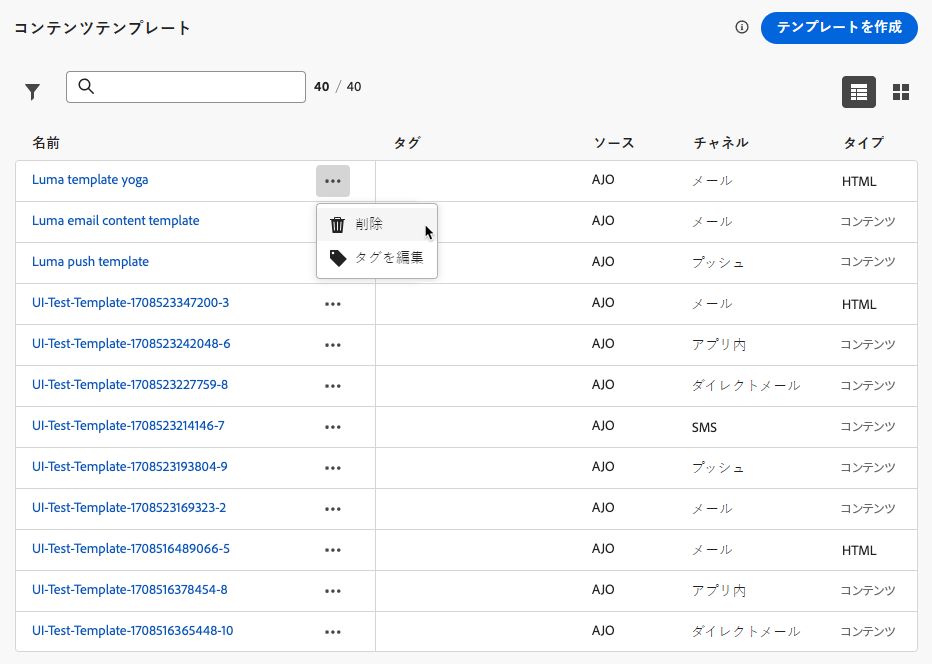
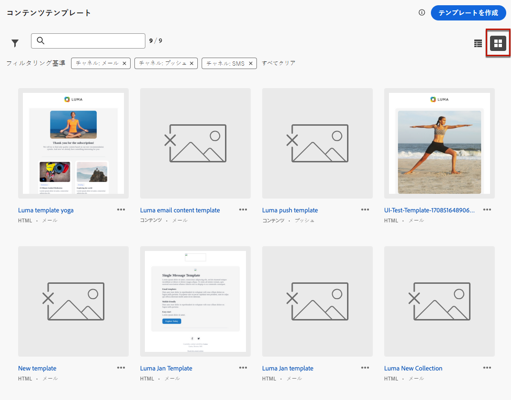

# コンテンツテンプレートへのアクセスと管理 {#access-manage-templates}

## コンテンツテンプレートへのアクセス {#access}

コンテンツテンプレートリストにアクセスするには、左のメニューで&#x200B;**[!UICONTROL コンテンツ管理]**／**[!UICONTROL コンテンツテンプレート]**&#x200B;を選択します。

現在のサンドボックスで（「**[!UICONTROL テンプレートとして保存]**」オプションを使ったジャーニーやキャンペーンまたは&#x200B;**[!UICONTROL コンテンツテンプレート]**&#x200B;メニューから）作成されたすべてのテンプレートが表示されます。[詳しくは、テンプレートの作成方法を参照してください](#create-content-templates)

左側のパネルを使用すると、コンテンツテンプレートをフォルダーに整理できます。 デフォルトでは、すべてのテンプレートが表示されます。 フォルダーを選択すると、選択したフォルダーに含まれるテンプレートとフォルダーのみが表示されます。 [詳細情報](#folders)

>[!NOTE]
>
>コンテンツテンプレートフォルダーは一連の組織（使用制限あり）でのみ使用でき、より多くのユーザーに徐々にロールアウトされます。

特定の項目を検索するには、検索フィールドに名前を入力します。 [ フォルダー ](#folders) を選択すると、そのフォルダーの第 1 レベルの階層にあるすべてのコンテンツテンプレートまたはフォルダーに検索が適用され <!--(not nested items)--> す。

コンテンツテンプレートの並べ替え基準を次に示します。
* タイプ
* チャネル
* 作成日または変更日
* タグ - [ タグの詳細 ](../start/search-filter-categorize.md#tags)

また、自分が作成または変更した項目のみを表示するように選択することもできます。

## フォルダーを使用したコンテンツテンプレートの管理 {#folders}

>[!AVAILABILITY]
>
>コンテンツテンプレートフォルダーは一連の組織（使用制限あり）でのみ使用でき、より多くのユーザーに徐々にロールアウトされます。

コンテンツテンプレートを簡単に移動するために、フォルダーを使用して、より効果的に構造化された階層に整理できます。 これにより、組織のニーズに応じて項目を分類および管理できます。

1. 「**[!UICONTROL すべてのコンテンツテンプレート]**」ボタンをクリックすると、フォルダーのグループ化を行わずに以前に作成したすべての項目が表示されます。

1. **[!UICONTROL ルート]** フォルダーをクリックすると、作成されたすべてのフォルダーが表示されます。

   >[!NOTE]
   >
   >フォルダーをまだ作成していない場合は、すべてのコンテンツテンプレートが表示されます。

1. **[!UICONTROL ルート]** フォルダー内の任意のフォルダーをクリックして、そのコンテンツを表示します。

1. **[!UICONTROL ルート]** フォルダーまたはその他のフォルダーをクリックすると、「**[!DNL Create folder]**」ボタンが表示されます。 選択します。

   

1. 新しいフォルダーの名前を入力し、「**[!UICONTROL 保存]**」をクリックします。 新しいフォルダーは、「ルート ]**フォルダー内のコンテンツテンプレートリストの上部、または現在選択されているフォルダー内に表示されます**[!UICONTROL 。

1. **[!UICONTROL その他のアクション]** ボタンをクリックして、フォルダーの名前を変更または削除できます。

   

1. **[!UICONTROL その他のアクション]** ボタンを使用して、コンテンツテンプレートを別の既存のフォルダーに移動することもできます。

   

1. これで、作成したフォルダーに移動できます。 ここで [ 作成 ](create-content-templates.md) した新しいコンテンツテンプレートはそれぞれ、現在のフォルダーに保存されます。

   

## コンテンツテンプレートの編集と削除 {#edit}

* テンプレートコンテンツを編集するには、リストから目的の項目をクリックし、必要な変更を行います。また、テンプレート名の横にある編集ボタンをクリックして、コンテンツテンプレートのプロパティを編集することもできます。

  

* テンプレートを削除するには、目的のテンプレートの横にある「**[!UICONTROL その他のアクション]**」ボタンを選択し、「**[!UICONTROL 削除]**」を選択します。

  

>[!NOTE]
>
>テンプレートを編集または削除しても、このテンプレートを使用して作成されたコンテンツを含むキャンペーンやジャーニーは影響を受けません。

## [!BADGE 限定提供]{type=Informative} テンプレートをサムネイルとして表示 {#template-thumbnails}

各テンプレートをサムネールとして表示するには、**[!UICONTROL グリッド表示]**&#x200B;モードを選択します。

>[!AVAILABILITY]
>
この機能は、少数の顧客向けに限定提供（LA）でリリースされています。

>[!NOTE]
>
現在、適切なサムネイルは HTML タイプの email コンテンツテンプレートに対してのみ生成できます。

コンテンツを更新する際、変更がサムネイルに反映されるまでに数秒待つ必要がある場合があります。

## 別のサンドボックスへのコンテンツテンプレートの書き出し {#export}

Journey Optimizer では、1 つのサンドボックスから別のサンドボックスにコンテンツテンプレートをコピーできます。例えば、ステージサンドボックス環境から実稼動サンドボックスにテンプレートをコピーできます。

コピープロセスは、ソースサンドボックスとターゲットサンドボックス間の&#x200B;**パッケージの書き出しおよび読み込み**&#x200B;を介して実行されます。オブジェクトを書き出してターゲットサンドボックスに読み込む方法について詳しくは、[別のサンドボックスへのオブジェクトのコピー](../configuration/copy-objects-to-sandbox.md)の節を参照してください。
