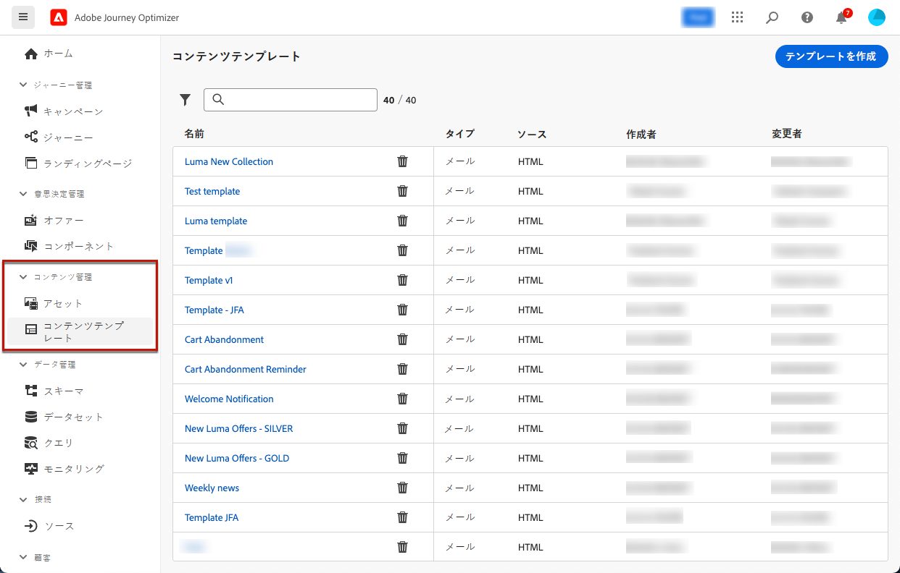
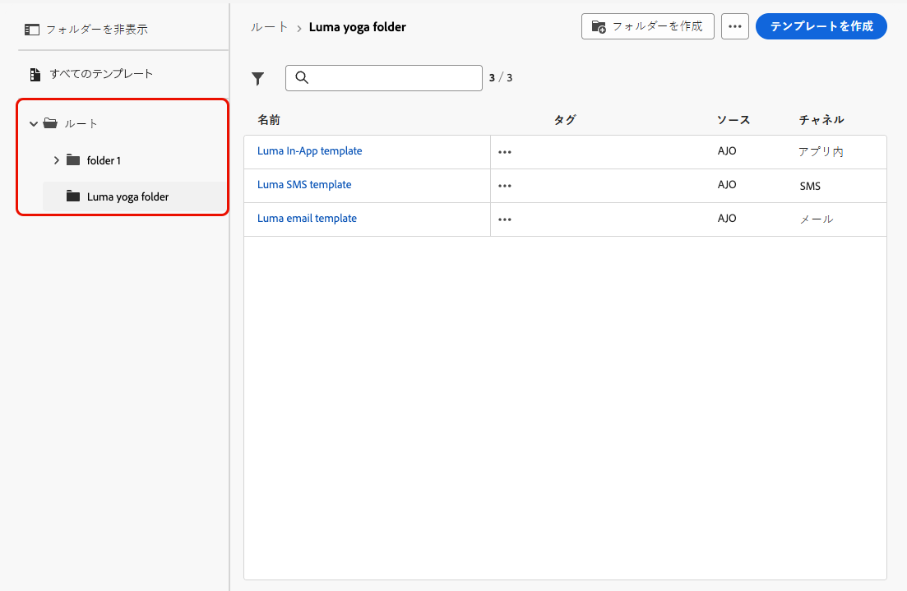
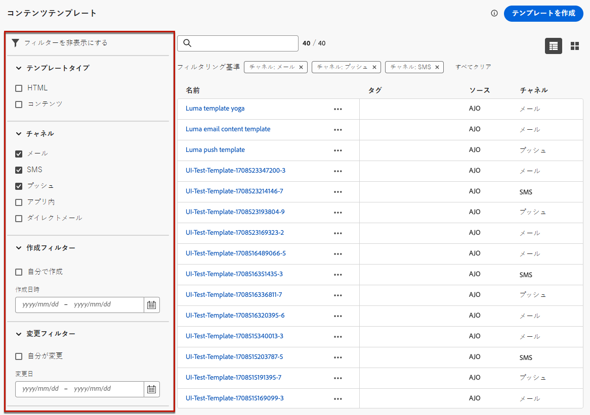
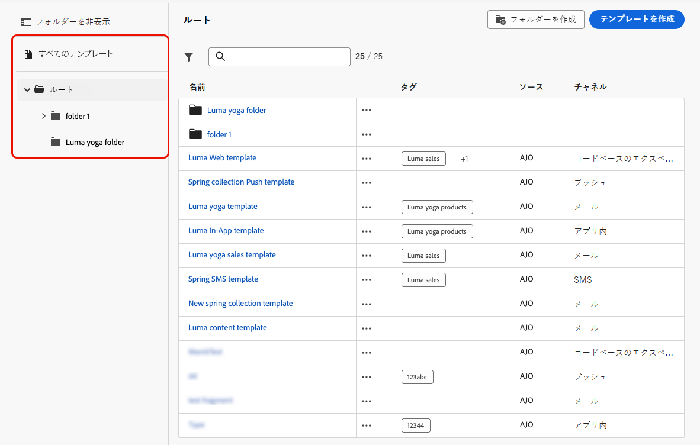
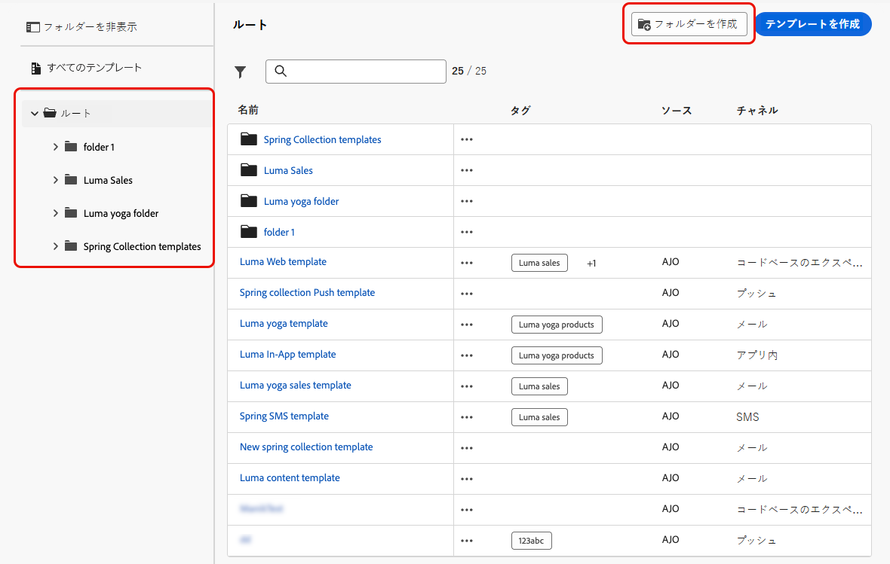
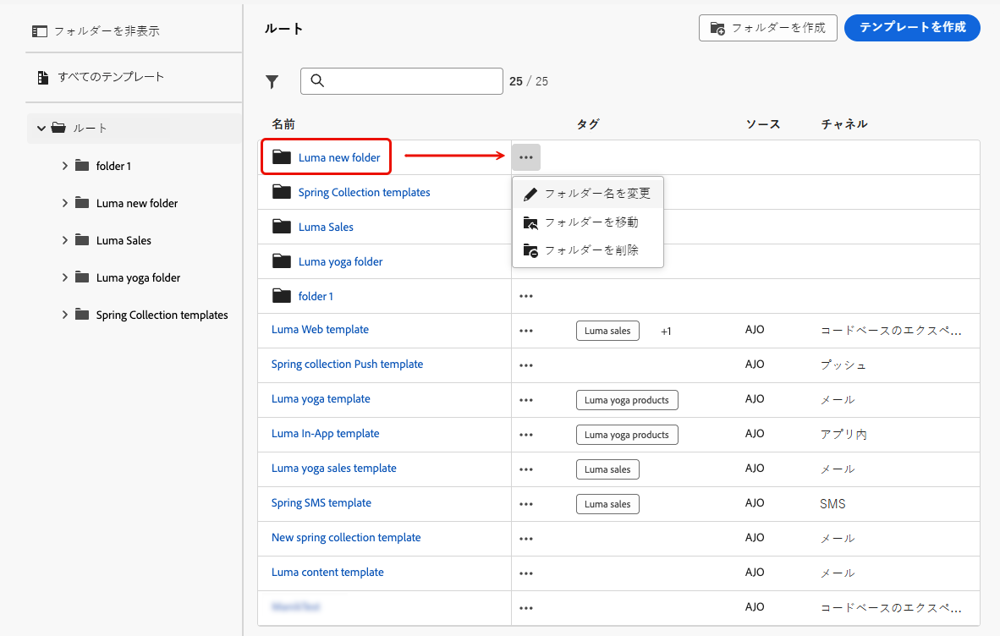
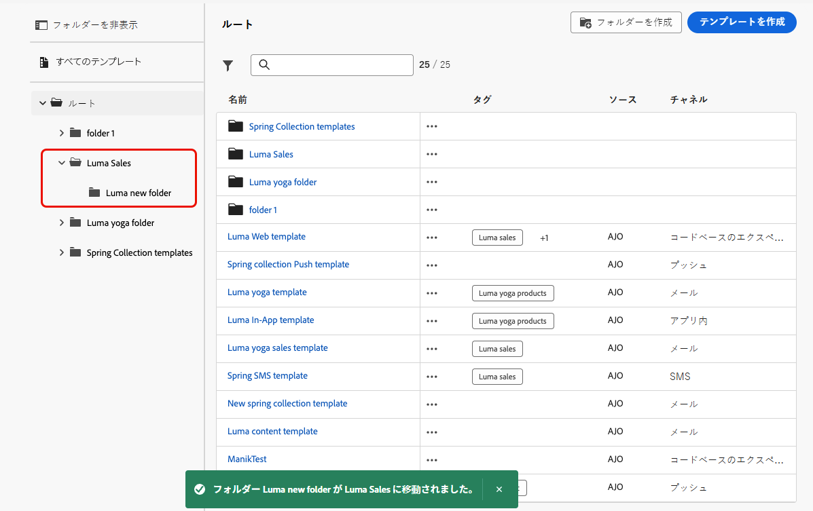
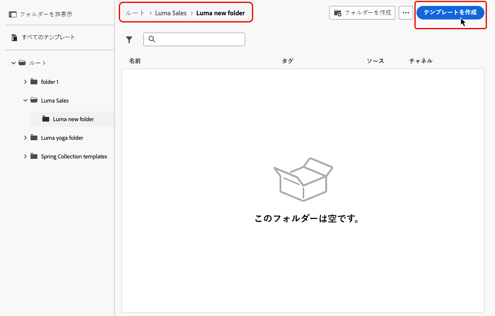
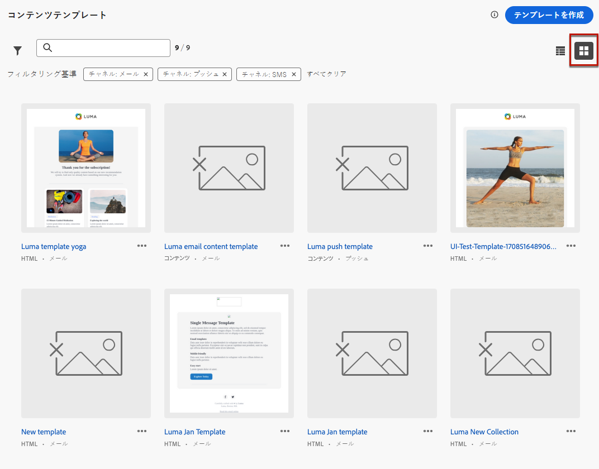

# コンテンツテンプレートへのアクセスと管理 {#access-manage-templates}

>[!BEGINSHADEBOX]

**このページで：** Adobe Journey Optimizerのサンドボックス間で、コンテンツテンプレートにアクセス、検索、フォルダーに整理、編集、削除、エクスポートする方法について説明します。

>[!ENDSHADEBOX]

## 前提条件 {#prerequisites}

コンテンツテンプレートにアクセスして管理するには、次の点を確認します。

* **コンテンツテンプレート権限** – 役割には、**[!UICONTROL コンテンツテンプレートの管理]**&#x200B;権限（**コンテンツ管理** リソースの下）を含める必要があります。 このオプションがないと、**コンテンツテンプレート** メニューは左側のナビゲーションに表示されません。 [権限の管理方法について](../administration/permissions.md)
* **サンドボックススコープ** — コンテンツテンプレートはサンドボックス固有です。 あるサンドボックスで作成されたテンプレートは、別のサンドボックスでは使用できません。 テンプレートを検索する前に、正しいサンドボックスに入っていることを確認します。
* **HTML テンプレート（非推奨）** - 2025年3月以降、HTML タイプのコンテンツテンプレートは非推奨になります。 既存のHTML テンプレートは引き続きアクセスできますが、新しいテンプレートは作成できません。

## コンテンツテンプレートへのアクセス {#access}

コンテンツテンプレートリストにアクセスするには、左のメニューで&#x200B;**[!UICONTROL コンテンツ管理]**／**[!UICONTROL コンテンツテンプレート]**&#x200B;を選択します。

現在のサンドボックスで（「**[!UICONTROL テンプレートとして保存]**」オプションを使用したジャーニーやキャンペーンから、または&#x200B;**[!UICONTROL コンテンツテンプレート]**&#x200B;メニューから）作成したすべてのテンプレートが表示されます。 [詳しくは、テンプレートの作成方法を参照してください。](#create-content-templates)

左側のパネルでは、コンテンツテンプレートをフォルダーに整理できます。 デフォルトでは、すべてのテンプレートが表示されます。 フォルダーを選択すると、選択したフォルダーに含まれるテンプレートとフォルダーのみが表示されます。 [詳細情報](#folders)

特定の項目を検索するには、検索フィールドに名前を入力します。 [フォルダー](#folders)を選択すると、このフォルダーの階層の最初のレベルにあるすべてのコンテンツテンプレートまたはフォルダーに検索が適用されます<!--(not nested items)-->。

コンテンツテンプレートの並べ替え基準を次に示します。

* タイプ
* チャネル
* 作成日または変更日
* タグ - [詳しくは、タグを参照してください](../start/search-filter-categorize.md#tags)

また、自分が作成または変更した項目のみを表示するように選択することもできます。

>[!NOTE]
>
>2025年3月以降、HTML タイプのコンテンツテンプレートは非推奨（廃止予定）です。 [!DNL Journey Optimizer] で以前に作成した既存の HTML コンテンツテンプレートには引き続きアクセスできます。

## フォルダーを使用したコンテンツテンプレートの管理 {#folders}

コンテンツテンプレートを簡単に移動するには、フォルダーを使用して、テンプレートをより効果的に構造化された階層に整理します。 これにより、組織のニーズに応じて項目を分類および管理できます。

1. 「**[!UICONTROL すべてのコンテンツテンプレート]**」ボタンをクリックして、フォルダーのグループ化を使用せずに、以前に作成したすべての項目を表示します。

1. **[!UICONTROL ルート]**&#x200B;フォルダーをクリックして、作成したすべてのフォルダーを表示します。

   >[!NOTE]
   >
   >フォルダーをまだ作成していない場合は、すべてのコンテンツテンプレートが表示されます。

1. **[!UICONTROL ルート]**&#x200B;フォルダー内の任意のフォルダーをクリックして、そのコンテンツを表示します。

1. **[!UICONTROL ルート]**&#x200B;フォルダーまたは他のフォルダーをクリックすると、「**[!DNL Create folder]**」ボタンが表示されます。 これを選択します。

   

1. 新しいフォルダーの名前を入力し、「**[!UICONTROL 保存]**」をクリックします。 新しいフォルダーは、**[!UICONTROL ルート]**&#x200B;フォルダー内や、現在選択されているフォルダー内のコンテンツテンプレートリストの上部に表示されます。

1. 「**[!UICONTROL その他のアクション]**」ボタンをクリックして、フォルダーの名前を変更または削除できます。

   

1. 「**[!UICONTROL その他のアクション]**」ボタンを使用すると、コンテンツテンプレートを別の既存のフォルダーに移動することもできます。

   

1. 先ほど作成したフォルダーに移動します。 ここから[作成](create-content-templates.md)した新しいコンテンツテンプレートはそれぞれ現在のフォルダーに保存されます。

   

## コンテンツテンプレートの編集と削除 {#edit}

各テンプレートの横にある&#x200B;**[!UICONTROL その他のアクション]** ボタンから、次のショートカットとアクションにアクセスできます。

* **[!UICONTROL 詳細を編集]** — テンプレート名、説明、タグを編集します。
* **[!UICONTROL コンテンツをシミュレート]** — テンプレートコンテンツをプレビューしてテストします。
* **[!UICONTROL 削除]** — テンプレートを削除します。

メールテンプレートの場合、次の追加ショートカットを使用できます。

* **[!UICONTROL 件名を編集]** – 電子メールの件名をすばやく更新します。
* **[!UICONTROL メール本文を編集]** — メールデザイナーを開いて、テンプレートコンテンツを変更します。
* **[!UICONTROL プルーフを表示]** – 電子メールテンプレートのプルーフを表示します。
* **[!UICONTROL プルーフを送信]** – 指定された受信者にテンプレートのプルーフを送信します。
* **[!UICONTROL スパムレポート]** — スパムフィルターに対してテンプレートを分析します。
* **[!UICONTROL メールのレンダリング]** – 様々なメールクライアントでのメールのレンダリング方法をプレビューします。

テンプレートの完全なコンテンツを編集するには、リストから目的の項目をクリックし、目的の変更を行います。 また、テンプレート名の横にある編集ボタンをクリックして、コンテンツテンプレートのプロパティを編集することもできます。

    ![] （assets/content-template-edit.png） 

>[!NOTE]
>
>テンプレートを編集または削除しても、このテンプレートを使用して作成されたコンテンツを含むキャンペーンやジャーニーは影響を受けません。

## 一括アクション {#bulk-actions-templates}

一度に複数のテンプレートを選択し、すべてのテンプレートに一括操作を適用できます。 利用可能な操作には、アイテムのパッケージへの追加、アイテムのフォルダーへの移動、タグの編集、アクセスの管理、アーカイブなどがあります。 [一括アクションの詳細→](../start/search-filter-categorize.md#bulk-actions)

ほとんどの列見出しをクリックしてテンプレートリストを並べ替えたり、必要なデータに合わせて列見出しをドラッグして列のサイズを変更したりすることもできます。

## [!BADGE 使用制限]{type=Informative}は、テンプレートをサムネールとして表示します {#template-thumbnails}

各テンプレートをサムネールとして表示するには、**[!UICONTROL グリッド表示]**&#x200B;モードを選択します。

>[!AVAILABILITY]
>
>この機能は、少数の顧客向けに限定提供（LA）でリリースされています。

>[!NOTE]
>
>適切なサムネールは、HTML タイプのメールコンテンツテンプレートに対してのみ生成できます。

コンテンツを更新する場合、変更がサムネールに反映されるまでに数秒待ちます。

## トラブルシューティング {#troubleshooting}

+++左側のナビゲーションにコンテンツテンプレート メニューが表示されない

役割に&#x200B;**コンテンツテンプレートの管理**&#x200B;権限がありません。 管理者に、**コンテンツテンプレートの管理**&#x200B;権限を持つ&#x200B;**コンテンツ管理** リソースを役割に追加するように依頼します。 [詳細情報](../administration/permissions.md)

+++

+++作成したテンプレートがリストに表示されない

正しいサンドボックスに入っていることを確認します。テンプレートはサンドボックス固有です。 また、左側のペインでフォルダーが選択されているかどうかも確認します。フォルダーを選択すると、そのフォルダー内のテンプレートのみが表示されます。 フォルダーに関係なくすべてのテンプレートを表示するには、**[!UICONTROL すべてのコンテンツテンプレート]**&#x200B;をクリックします。

+++

+++テンプレートを編集しましたが、キャンペーンやジャーニーのコンテンツが更新されませんでした

テンプレートを編集または削除しても、テンプレートを使用して構築されたキャンペーンやジャーニーは、過去にさかのぼって更新されません。 コンテンツは使用時にコピーされます。 既存のコンテンツを更新するには、キャンペーンまたはジャーニーを直接編集します。

+++

## 別のサンドボックスへのコンテンツテンプレートのエクスポート {#export}

Journey Optimizer では、1 つのサンドボックスから別のサンドボックスにコンテンツテンプレートをコピーできます。 例えば、ステージサンドボックス環境から本番稼働用サンドボックスにテンプレートをコピーできます。

コピープロセスは、ソースサンドボックスとターゲットサンドボックス間の&#x200B;**パッケージのエクスポートおよびインポート**&#x200B;を介して実行されます。 オブジェクトをエクスポートしてターゲットサンドボックスにインポートする方法について詳しくは、[別のサンドボックスへのオブジェクトのコピー](../configuration/copy-objects-to-sandbox.md)の節を参照してください。

