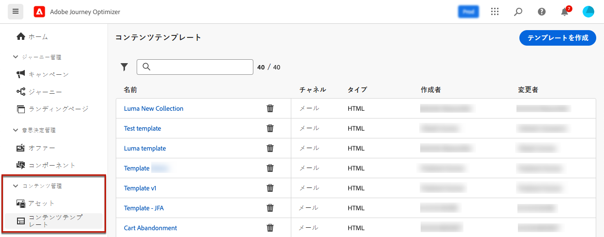
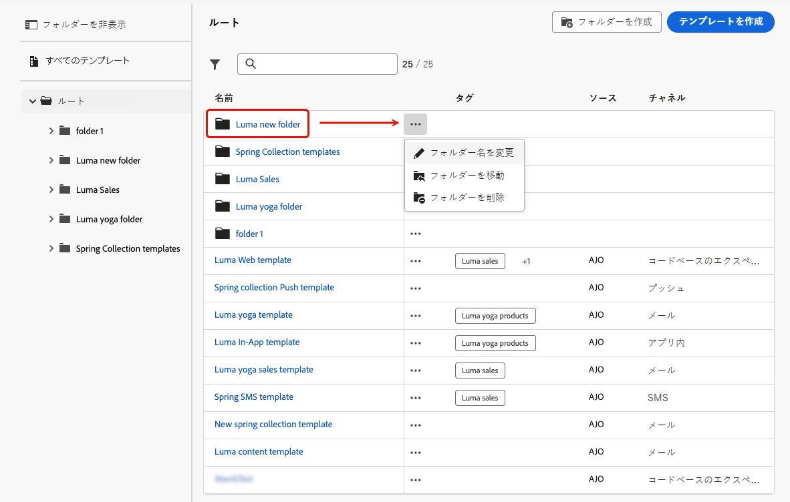

# コンテンツテンプレートへのアクセスと管理 {#access-manage-templates}

## コンテンツテンプレートへのアクセス {#access}

コンテンツテンプレートリストにアクセスするには、左のメニューで&#x200B;**[!UICONTROL コンテンツ管理]**／**[!UICONTROL コンテンツテンプレート]**&#x200B;を選択します。

現在のサンドボックスで（「**[!UICONTROL テンプレートとして保存]**」オプションを使ったジャーニーやキャンペーンまたは&#x200B;**[!UICONTROL コンテンツテンプレート]**&#x200B;メニューから）作成されたすべてのテンプレートが表示されます。[詳しくは、テンプレートの作成方法を参照してください](#create-content-templates)

左側のパネルでは、コンテンツテンプレートをフォルダーに整理できます。デフォルトでは、すべてのテンプレートが表示されます。フォルダーを選択すると、選択したフォルダーに含まれるテンプレートとフォルダーのみが表示されます。[詳細情報](#folders)

特定の項目を検索するには、検索フィールドに名前を入力します。[フォルダー](#folders)を選択すると、このフォルダーの階層の最初のレベルにあるすべてのコンテンツテンプレートまたはフォルダーに検索が適用されます<!--(not nested items)-->。

コンテンツテンプレートの並べ替え基準を次に示します。
* タイプ
* チャネル
* 作成日または変更日
* タグ - [詳しくは、タグを参照してください](../start/search-filter-categorize.md#tags)

また、自分が作成または変更した項目のみを表示するように選択することもできます。

>[!NOTE]
>
>2025年3月以降、HTML タイプのコンテンツテンプレートは非推奨（廃止予定）になりました。[!DNL Journey Optimizer] で以前に作成した既存の HTML コンテンツテンプレートには引き続きアクセスできます。

## フォルダーを使用したコンテンツテンプレートの管理 {#folders}

コンテンツテンプレートを簡単に移動するには、フォルダーを使用してフラグメントをより効果的に構造化された階層に整理します。これにより、組織のニーズに応じて項目を分類および管理できます。

1. 「**[!UICONTROL すべてのコンテンツテンプレート]**」ボタンをクリックして、フォルダーのグループ化を使用せずに、以前に作成したすべての項目を表示します。

1. **[!UICONTROL ルート]**&#x200B;フォルダーをクリックして、作成したすべてのフォルダーを表示します。

   >[!NOTE]
   >
   >フォルダーをまだ作成していない場合は、すべてのコンテンツテンプレートが表示されます。

1. **[!UICONTROL ルート]**&#x200B;フォルダー内の任意のフォルダーをクリックして、そのコンテンツを表示します。

1. **[!UICONTROL ルート]**&#x200B;フォルダーまたは他のフォルダーをクリックすると、「**[!DNL Create folder]**」ボタンが表示されます。これを選択します。

   

1. 新しいフォルダーの名前を入力し、「**[!UICONTROL 保存]**」をクリックします。新しいフォルダーは、**[!UICONTROL ルート]**&#x200B;フォルダー内や、現在選択されているフォルダー内のコンテンツテンプレートリストの上部に表示されます。

1. 「**[!UICONTROL その他のアクション]**」ボタンをクリックして、フォルダーの名前を変更または削除できます。

   

1. 「**[!UICONTROL その他のアクション]**」ボタンを使用すると、コンテンツテンプレートを別の既存のフォルダーに移動することもできます。

   

1. これで、作成したフォルダーに移動できます。ここから[作成](create-content-templates.md)した新しいコンテンツテンプレートはそれぞれ現在のフォルダーに保存されます。

   

## コンテンツテンプレートの編集と削除 {#edit}

* テンプレートコンテンツを編集するには、リストから目的の項目をクリックし、必要な変更を行います。また、テンプレート名の横にある編集ボタンをクリックして、コンテンツテンプレートのプロパティを編集することもできます。

  

* テンプレートを削除するには、目的のテンプレートの横にある「**[!UICONTROL その他のアクション]**」ボタンを選択し、「**[!UICONTROL 削除]**」を選択します。

  

>[!NOTE]
>
>テンプレートを編集または削除しても、このテンプレートを使用して作成されたコンテンツを含むキャンペーンやジャーニーは影響を受けません。

## [!BADGE 限定提供]{type=Informative} テンプレートをサムネイルとして表示 {#template-thumbnails}

各テンプレートをサムネールとして表示するには、**[!UICONTROL グリッド表示]**&#x200B;モードを選択します。

>[!AVAILABILITY]
>
>この機能は、少数の顧客向けに限定提供（LA）でリリースされています。

>[!NOTE]
>
>現在、適切なサムネールは HTML タイプのメールコンテンツテンプレートに対してのみ生成できます。

コンテンツを更新する際、変更がサムネイルに反映されるまでに数秒待つ必要がある場合があります。

## 別のサンドボックスへのコンテンツテンプレートの書き出し {#export}

Journey Optimizer では、1 つのサンドボックスから別のサンドボックスにコンテンツテンプレートをコピーできます。例えば、ステージサンドボックス環境から実稼動サンドボックスにテンプレートをコピーできます。

コピープロセスは、ソースサンドボックスとターゲットサンドボックス間の&#x200B;**パッケージの書き出しおよび読み込み**&#x200B;を介して実行されます。オブジェクトを書き出してターゲットサンドボックスに読み込む方法について詳しくは、[別のサンドボックスへのオブジェクトのコピー](../configuration/copy-objects-to-sandbox.md)の節を参照してください。
