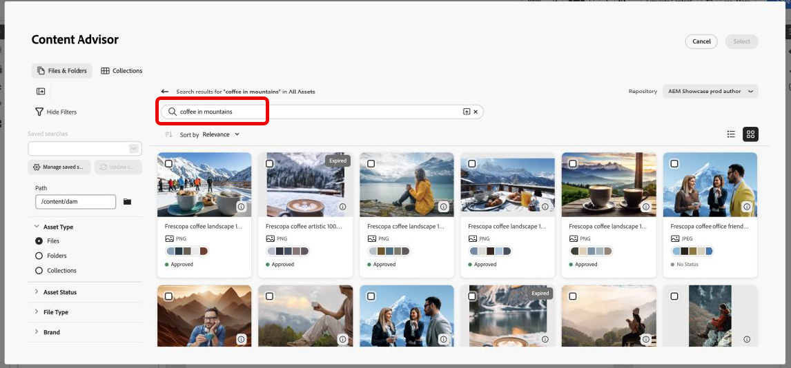
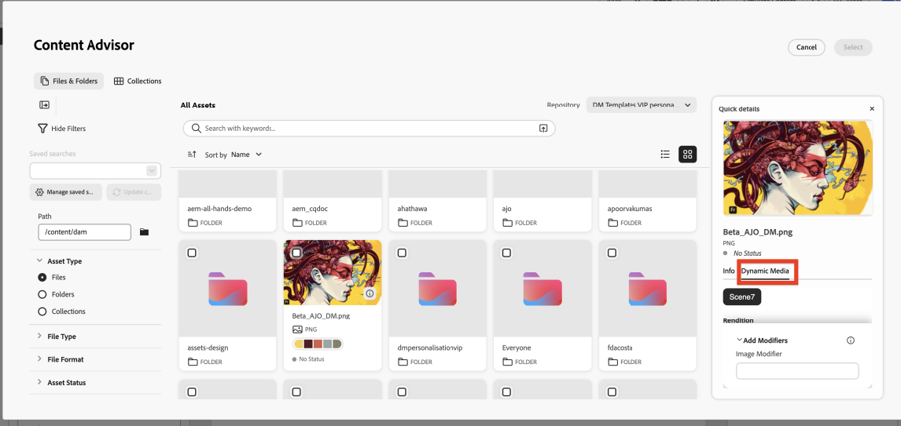
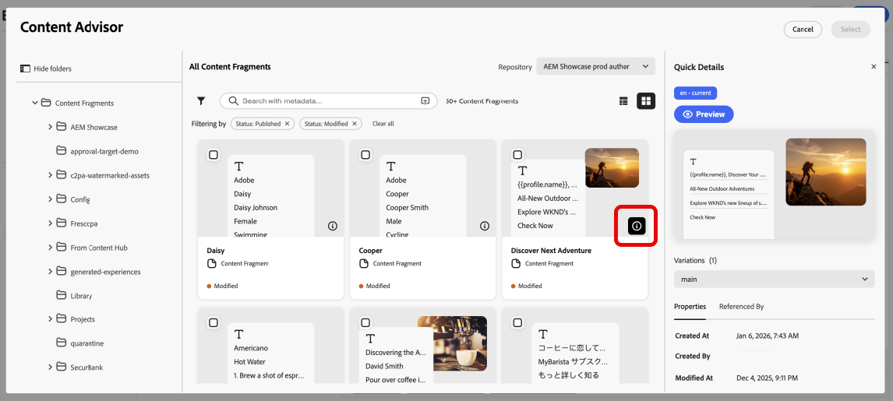

# Adobe Experience Manager コンテンツアドバイザーの操作 {#aem-content-advisor}

>[!AVAILABILITY]
>
>Adobe Experience Manager コンテンツアドバイザーは、チャネルオーサリングワークフローでのみ使用できます。

Adobe Experience Manager コンテンツアドバイザーは、確定的な検出を、統一されたサーフェスからの標準化された意図的な検出に置き換えます。 AI を活用して、Journey Optimizer オーサリングワークフロー内でAssetsとコンテンツフラグメントを統合的に検出できるため、マーケターの生産性とキャンペーンの効率性が向上します。

## 使用可能な機能

### Assets用 {#asset-features}

Adobe Experience Manager コンテンツアドバイザには、次のアセット機能があります。

* &#x200B;
  +++ AI セマンティック検索

  正確なキーワードやファイル名の代わりに自然言語を使用して、アセットを検索します。 必要なものをプレーンランゲージで記述します。例えば、「coffee in the mountains」と記述すると、AI は、テキストの一致だけでなく、意味とコンテンツに基づいて文脈的に関連性の高いアセットを見つけます。

  {zoomable="yes"}

  +++

* &#x200B;
  +++ 最近の検索履歴

  最近の検索にアクセスすると、キーワードとコンテキストをすばやく再利用できます。 これにより、類似のキャンペーンを操作する場合や、以前の検索を絞り込む必要がある場合に時間を節約できます。

  {zoomable="yes"}

  +++ 

* &#x200B;
  +++ 概要をアップロード

  マーケティング概要ドキュメントをアップロードして、キャンペーンコンテキストに合致するアセットを自動的に表示します。 AI がユーザーの概要を分析し、ドキュメントに記載されている内容と要件に基づいて関連するアセットを提案します。

  {zoomable="yes"}

  +++

* &#x200B;
  +++ アセット情報パネル

  **情報** アイコンを使用して、任意のアセットの詳細なメタデータとプロパティを表示します。 これには、アセットのサイズ、ファイルサイズ、作成日、タグのほか、十分な情報に基づいた意思決定を行うのに役立つその他の関連情報が含まれます。

  {zoomable="yes"}

  +++

* &#x200B;
  +++ Dynamic Media パネル

  リポジトリの設定に基づいた、動的レンディション、スマート切り抜き、その場での変更へのアクセス。

  {zoomable="yes"}

  Dynamic Media パネルを使用すると、動的レンディション、スマート切り抜き、その場での変更などにアクセスできます。 パネル内で修飾子を直接入力して、カスタムレンディションを作成できます。

  **対象**

  Dynamic Media を使用できるかどうかは、リポジトリの設定に応じて異なります。

   * **Scene7**：公開済みのアセットで使用できます（ビデオとPDFを除く）。 [&#x200B; 詳しくは、Dynamic Media の Scene7 修飾子を参照してください &#x200B;](https://experienceleague.adobe.com/docs/dynamic-media-developer-resources/image-serving-api/image-serving-api/http-protocol-reference/command-reference/r-is-http-modifiers.html){target="_blank"}

   * **OpenAPI**：承認済みアセット（ビデオを除く）で使用可能です。 [OpenAPI 修飾子を持つ Dynamic Media の詳細情報 &#x200B;](https://experienceleague.adobe.com/docs/experience-manager-cloud-service/content/assets/dynamicmedia/image-profiles.html?lang=ja){target="_blank"}

   * **Scene7 と OpenAPI の両方**：両方の設定が存在し、アセットが条件を満たしている場合に使用できます。

  **スタック選択**

  表示されるボタンは、リポジトリ設定によって異なります。

   * **Scene7 ボタンのみ**：リポジトリには Scene7 設定があり、アセットが Dynamic Media に公開されます。
   * **OpenAPI ボタンのみ**：リポジトリに OpenAPI 設定があり、アセットが承認されている。
   * **両方のボタン**：リポジトリーとアセットの両方が設定され、アセットが公開および承認されます。
  +++

### コンテンツフラグメント用 {#content-fragment-features}

Adobe Experience Manager コンテンツアドバイザには、次のコンテンツフラグメント機能が用意されています。

* &#x200B;
  +++ テンプレートビューリスト 

  サムネール表示とテーブル表示を切り替えて、ワークフローに最適な形式でコンテンツフラグメントを参照します。 サムネール表示では視覚的なコンテキストが提供され、テーブル表示では詳細情報が構造化された形式で表示されます。

  {zoomable="yes"}

  +++

* &#x200B;
  +++ 情報パネル 

  **[!UICONTROL 情報]** アイコンをクリックして右側のパネルを開くと、フラグメントバリエーション、プロパティ、「参照元 **[!UICONTROL の詳細が表示]** れます。 **[!UICONTROL 参照元]** セクションには、フラグメントが使用されているすべてのAdobe Experience Manager エンティティと、これらの参照をAdobe Experience Managerに直接表示するリンクが表示されます。

  {zoomable="yes"}

  +++

* &#x200B;
  +++ Adobe Experience Managerで開く

  タイトルの横にあるアイコンを使用して、コンテンツフラグメントをAdobe Experience Managerですばやく直接開いて、編集します。 このシームレスな統合により、コンテキストを失うことなくJourney OptimizerとAdobe Experience Managerを切り替えることができます。

  {zoomable="yes"}

  +++

* &#x200B;
  +++ JSON プレビュー

  整理されたクリーンな表形式でコンテンツフラグメントの JSON 構造をプレビューします。 これにより、キャンペーンで使用する前にフラグメントのデータ構造を理解し、コンテンツを検証することができます。

  {zoomable="yes"}

  +++

## Adobe Experience Manager コンテンツアドバイザーへのアクセス {#access}

Journey OptimizerでAdobe Experience Manager コンテンツアドバイザーにアクセスするには、次の手順に従います。

1. Adobe Journey Optimizerでキャンペーンを作成し、チャネルアクション（メールなど）を追加します。

1. **[!UICONTROL コンテンツを編集]**/**[!UICONTROL メール本文を編集]** をクリックして、コンテンツエディターを開きます。

1. HTMLまたはテキスト コンポーネントをメールコンテンツにドラッグ&amp;ドロップします。

1. コンポーネントにポインタを合わせて、「**[!UICONTROL ソースコードを表示]**」（HTML コンポーネントの場合）または「**[!UICONTROL Personalizationを追加]**」（テキストコンポーネントの場合）をクリックします。

1. Personalization エディターで、コンテンツのエントリポイントを選択します。

   * アセットを追加するには、**[!UICONTROL Assetsをクリックし]**&#x200B;**[!UICONTROL アセットセレクターを開く]** をクリックします。

     {zoomable="yes"}

   * Adobe Experience Manager コンテンツフラグメントを追加するには、**[!UICONTROL AEM コンテンツフラグメントをクリックし]**&#x200B;**[!UICONTROL AEM CF セレクターを開く]** をクリックします。

     {zoomable="yes"}

1. Adobe Experience Manager リポジトリを選択します。

   {zoomable="yes"}

1. 使用するアセットまたはコンテンツフラグメントを参照して選択し、コンテンツに挿入します。

