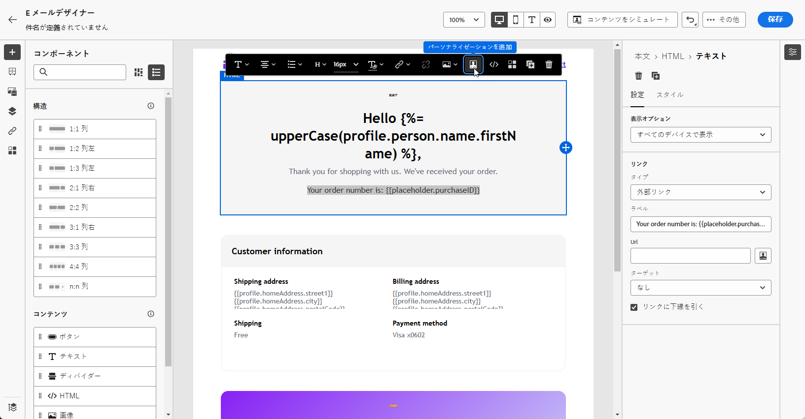
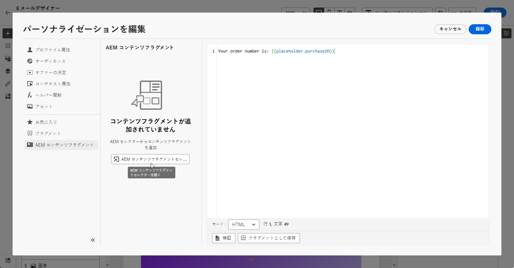
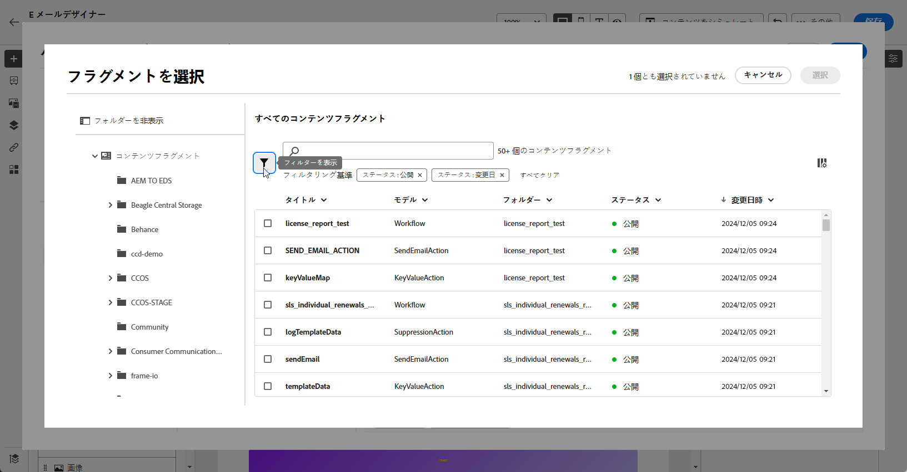
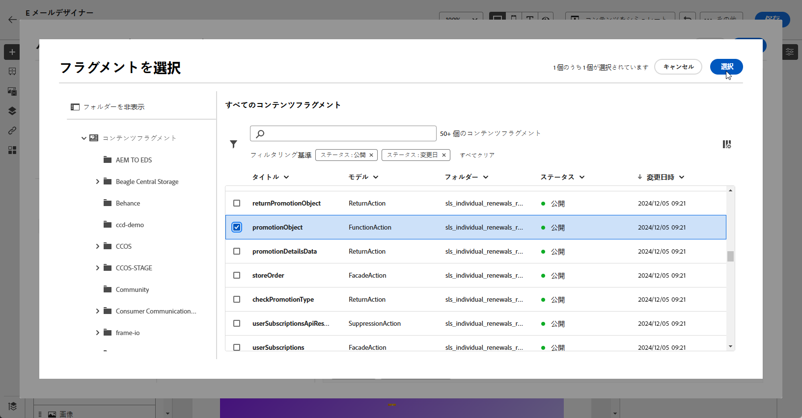
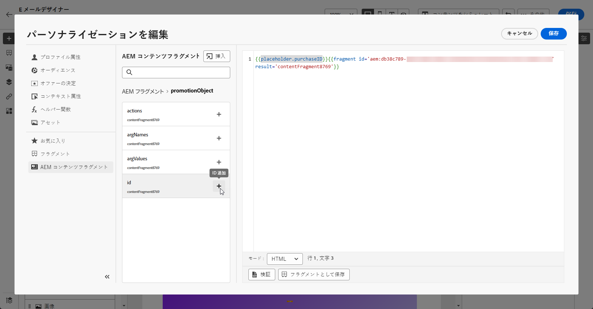

# Adobe Experience Manager コンテンツフラグメント {#aem-fragments}

Adobe Experience Manager を Adobe Journey Optimizer と統合することで、AEM コンテンツフラグメントを Journey Optimizer のメールコンテンツにシームレスに組み込めるようになりました。この合理化された接続により、AEM コンテンツへのアクセスと活用のプロセスが簡略化され、パーソナライズされた動的なキャンペーンやジャーニーの作成が可能になります。

AEM コンテンツフラグメントについて詳しくは、[Experience Manager ドキュメント ](https://experienceleague.adobe.com/ja/docs/experience-manager-cloud-service/content/sites/authoring/fragments/content-fragments)を参照してください。

## 制限事項 {#limitations}

* メールチャネルにのみ使用できます。

* 各サンドボックスは 1 つのインスタンスに制限されているので、現在、接続先の AEM インスタンスを切り替えることができません。

* メールでの誤ったエラーのリスクを減らすために、コンテンツフラグメントを公開するアクセス権を持つユーザー数を制限することをお勧めします。

* 多言語コンテンツの場合、手動フローのみがサポートされます。

* 現在、バリアントはサポートされていません。

* Journey Optimizer 専用のタグを作成する必要があります。

+++ Journey Optimizer タグの作成方法を学ぶ

   1. **Experience Manager** 環境にアクセスします。

   1. **ツール**&#x200B;メニューから「**一般**」タブに移動し、「**タグ付け**」を選択します。

   1. 「**新しいタグを作成**」をクリックします。

   1. ID が次の構文 `ajo-enabled:{AJO-OrgId}/{AJO-SandboxName}` に従っていることを確認します。

   1. 「**作成**」をクリックします。

  これで、この Journey Optimizer タグをコンテンツフラグメントに割り当てることができます。
+++

## AEM コンテンツフラグメントの追加 {#aem-add}

[AEM コンテンツフラグメント](https://experienceleague.adobe.com/ja/docs/experience-manager-cloud-service/content/sites/authoring/fragments/content-fragments)を作成およびパーソナライズした後、それを Journey Optimizer キャンペーンまたはジャーニーに読み込めるようになりました。

1. メールのアクションを使用して[キャンペーン](../email/create-email.md)または[ジャーニー](../email/create-email.md)を作成したら、E メールデザイナーにアクセスしてメールのコンテンツを設定します。[詳細情報](../email/get-started-email-design.md)

1. テキストブロック内または件名行をクリックし、コンテキストツールバーから「**[!UICONTROL パーソナライゼーションを追加]**」を選択します。

   

1. 左側のペインの **[!UICONTROL AEM コンテンツフラグメント]**&#x200B;メニューで、「**[!UICONTROL AEM CF セレクターを開く]**」をクリックします。

   

1. 使用可能なリストから&#x200B;**[!UICONTROL コンテンツフラグメント]**&#x200B;を選択して、Journey Optimizer コンテンツに読み込みます。

1. 「**[!UICONTROL フィルターを表示]**」をクリックして、コンテンツフラグメントリストを微調整します。

   デフォルトでは、コンテンツフラグメントフィルターは、承認済みのコンテンツのみを表示するようにプリセットされています。

   

1. **[!UICONTROL コンテンツフラグメント]**&#x200B;を選択したら、「**[!UICONTROL 選択]**」をクリックして開きます。

   

1. **[!UICONTROL コンテンツフラグメント]** から目的のフィールドを選択して、コンテンツに追加します。 コンテンツを追加するか、その値をコピーできます。

   値のコピーを選択した場合、**[!UICONTROL コンテンツフラグメント]** に対するそれ以降の更新は、キャンペーンやジャーニーには反映されません。

   

1. 「**[!UICONTROL 保存]**」をクリックして、プレビューでメッセージを確認します。メッセージのコンテンツをテストして確認するには、[この節](preview.md)を参照してください。

テストを実行してコンテンツを検証したら、[キャンペーン](../campaigns/review-activate-campaign.md)または[ジャーニー](../building-journeys/publishing-the-journey.md)を使用してメールをオーディエンスに送信できます。
