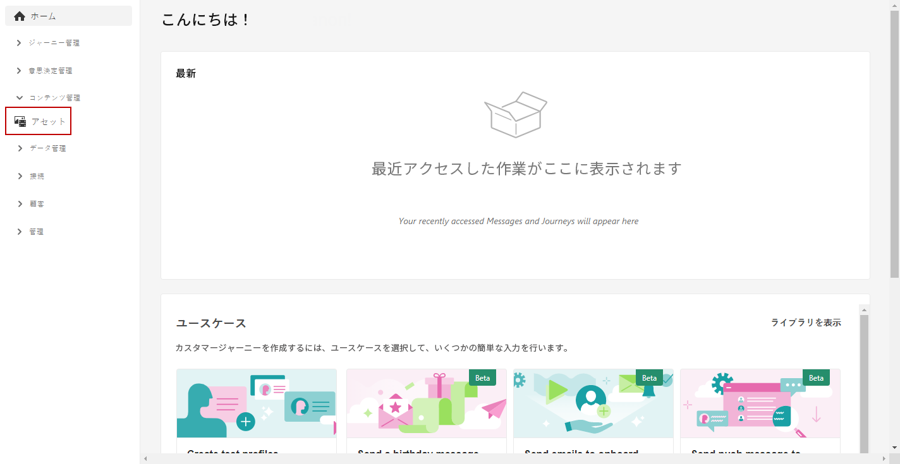
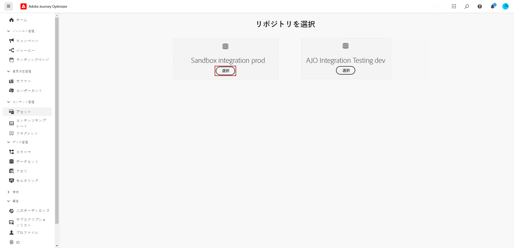
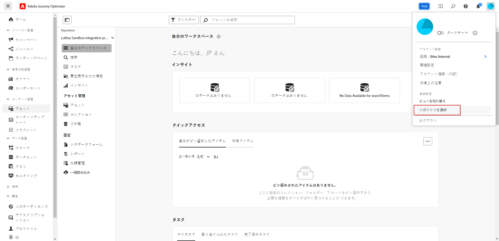
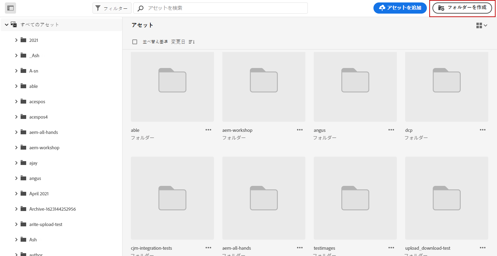
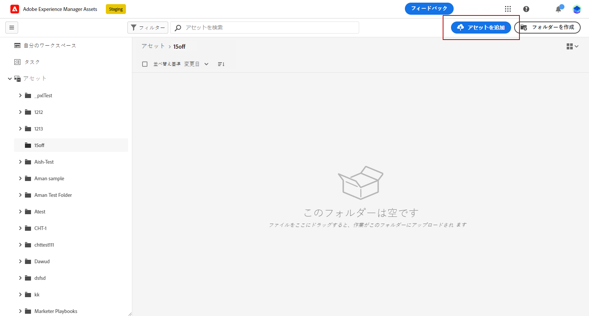
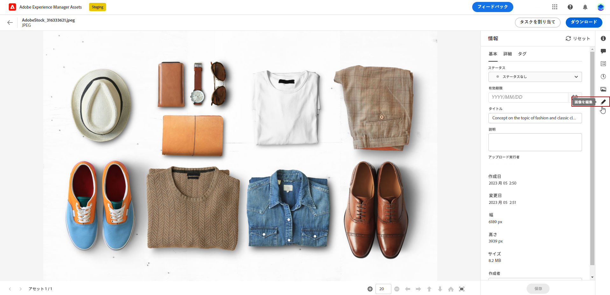
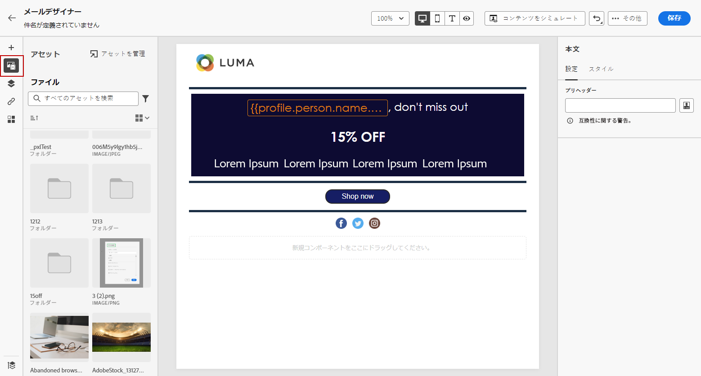
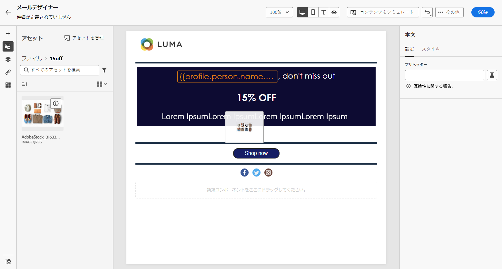
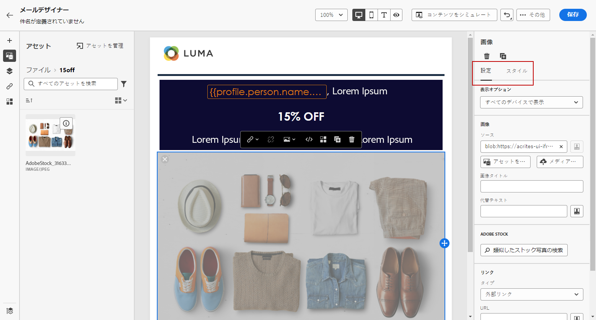

# [!DNL Experience Manager Assets] を使用したアセットの作成と管理{#experience-manager-assets}

## [!DNL Experience Manager Assets] の基本を学ぶ {#get-started-assets}

**[!DNL Adobe Experience Manager Assets]** を使用してマーケティングワークフローとクリエイティブワークフローを統合します。とネイティブに統合されている **[!DNL Adobe Journey Optimizer]**，アクセス **[!DNL Assets Essentials]** または **[!DNL Assets as a Cloud Service]** デジタルアセットを保存、管理、検出および配布する。 メッセージの入力に使用できる、アセットの一元的なリポジトリを提供します。

**[!DNL Adobe Experience Manager Assets]** は、クリエイティブシステムを拡張し、エクスペリエンス配信用にデジタルアセットを統合する、2 つの協調アセットワークスペースと集中アセットワークスペースを提供します。

* **[!DNL Assets as a Cloud Service]**:Adobe Experience Manager Assets as a Cloud Serviceは、使いやすいクラウドソリューションを提供し、Digital Asset Management とDynamic Mediaの効率的な運用を実現します。 人工知能や機械学習などの高度な機能をシームレスに組み込みます。

  詳しくは、[Adobe Experience Manager as a Cloud Serviceドキュメント](https://experienceleague.adobe.com/docs/experience-manager-cloud-service/content/assets/overview.html)を参照してください。

* **[!DNL Assets Essentials]**:Experience Manager Assets Essentials は、統合されたアセット管理およびコラボレーション用の、Assetsas a Cloud Serviceの軽量ソリューションです。 最新のシンプルなインターフェイスを使用すると、クリエイティブチームやマーケティングチームは、デジタルアセットを容易に保存、検出および配布できます。

  詳しくは、[Adobe Experience Manager Assets Essentials のドキュメント](https://experienceleague.adobe.com/docs/experience-manager-assets-essentials/help/introduction.html?lang=ja){target="_blank"}を参照してください。

契約に応じて、 **[!DNL Adobe Experience Manager Assets Essentials]** または **[!DNL Adobe Experience Manager Assets as a Cloud Service]** は、から直接アクセスできます。 **[!DNL Adobe Journey Optimizer]** 左のメニューから **[!UICONTROL Assets]** 」セクションに入力します。 また、[メールのコンテンツをデザイン](../email/get-started-email-design.md)する際に、アセットやフォルダーにアクセスすることもできます。

## 前提条件{#assets-prerequisites}

>[!BEGINTABS]

>[!TAB Adobe Experience Manager Assets Essentials]

 [!DNL Adobe Experience Manager Assets Essentials] を使用する前に、ユーザーを **Assets Essentials コンシューマーユーザー**&#x200B;または **Assets Essentials ユーザー**&#x200B;製品プロファイルに追加する必要があります。詳しくは、[Assets Essentials のドキュメント](https://experienceleague.adobe.com/docs/experience-manager-assets-essentials/help/get-started-admins/deploy-administer.html?lang=ja#add-user-groups){target="_blank"}を参照してください。

>[!NOTE]
>2022年1月6日（PT）より前に入手した Journey Optimizer 製品の場合、組織に **[!DNL Adobe Experience Manager Assets Essentials]** をデプロイする必要があります。詳しくは、[Assets Essentials のデプロイ](https://experienceleague.adobe.com/docs/experience-manager-assets-essentials/help/deploy-administer.html?lang=ja){target="_blank"}の節をご覧ください。

>[!TAB Adobe Experience Manager Assets as a Cloud Service]

使用する前に **[!DNL Adobe Experience Manager Assets as a Cloud Service]**&#x200B;の場合は、ユーザーを AssetsCloud Serviceに追加する必要があります。 詳しくは、 [Adobe Experience Manager Assetsas a Cloud Service](https://experienceleague.adobe.com/docs/experience-manager-cloud-service/content/security/ims-support.html?lang=ja).

>[!ENDTABS]

## アセットのアップロードと挿入{#add-asset}

ファイルのインポート先 **[!DNL Assets Essentials]** または **[!DNL Assets as a Cloud Service]**&#x200B;を参照する場合、まず保存先のフォルダーを参照または作成する必要があります。 その後、メールコンテンツに挿入できます。

1. 送信者 [!DNL Adobe Journey Optimizer] ホームページで、 **[!UICONTROL Assets]** 」タブをクリックします。 **[!UICONTROL コンテンツ管理]** アクセスするメニュー **[!DNL Assets Essentials]** または **[!DNL Assets as a Cloud Service]**.

   

1. Journey Optimizer でアセットのリポジトリを選択します。次のいずれかを選択できます。 **[!DNL Assets Essentials]** または **[!DNL Assets as a Cloud Service]** リポジトリ（このソリューションを所有している場合）

   

+++ アセットリポジトリを切り替える方法を説明します。

   アセットリポジトリを変更するには、右上のアカウントアイコンを選択し、「**[!UICONTROL リポジトリを選択]**」をクリックします。

   

+++

1. 中央のセクションまたはツリービューでフォルダーをダブルクリックして開きます。

   また、「**[!UICONTROL フォルダーを作成]**」をクリックして新しいフォルダーを作成することもできます。

   

1. 選択または作成したフォルダーで、「**[!UICONTROL アセットを追加]**」をクリックして、新しいアセットをフォルダーにアップロードします。

   

1. **[!UICONTROL ファイルをアップロード]**&#x200B;画面で「**[!UICONTROL 参照]**」をクリックして、**[!UICONTROL ファイルを参照]**&#x200B;するか&#x200B;**[!UICONTROL フォルダーを参照]**&#x200B;するかを選択します。

1. アップロードするファイルを選択します。完了したら、「**[!UICONTROL アップロード]**」をクリックします。アセットの管理方法について詳しくは、この[ページ](https://experienceleague.adobe.com/docs/experience-manager-assets-essentials/help/manage-organize.html?lang=ja)を参照してください。

1. Adobe Photoshop Express でアセットをさらに編集するには、アセットをダブルクリックします。次に、右側のメニューから、「**[!UICONTROL 編集モード]**」アイコンを選択します。[詳細情報](https://experienceleague.adobe.com/docs/experience-manager-assets-essentials/help/edit-images.html?lang=ja){target="_blank"}。

   

1. [!DNL Adobe Journey Optimizer] で、E メールデザイナーの左パネルにある「**[!UICONTROL AEM Asset ピッカー]**」を選択します。

   

1. 以前に作成した **[!UICONTROL Assets]** フォルダーを選択します。検索バーで、アセットやフォルダーを検索することもできます。

1. アセットをメールコンテンツにドラッグ＆ドロップします。

   

1. 「**[!UICONTROL 設定]**」タブと「**[!UICONTROL スタイル]**」を使用して、外部リンクやテキストを追加するなど、アセットをさらにカスタマイズすることができます。詳しくは、[コンポーネント設定](../email/content-components.md)を参照してください。

   

   <!--
    After adding your asset to your email, use the **[!UICONTROL Find similar Stock photos]** option to locate Stock photos that match the content, color, and composition of your image. [Learn more about Adobe Stock](stock.md).

    Note that this option is available for licensed/unlicensed Stock images and images from your Assets folder. 

    
    -->

## [!DNL Adobe Experience Manager Assets] に関する FAQ {#faq-assets}

+++ Journey Optimizer内でバンドルされたAssets Essentialsリポジトリを引き続き使用できますか？

でプロビジョニングされている場合 **[!DNL Adobe Experience Manager Assets as a Cloud Service]**、次の両方にアクセスできます： **[!DNL Adobe Experience Manager Assets Essentials]** および **[!DNL Adobe Experience Manager Assets as a Cloud Service]** リポジトリ（ユーザーが適切な権限を持っている場合） これらのリポジトリは別々で、同期されていません。 Journey Optimizerのユーザーは、ステージング、開発など、使用権限のある他の環境を含め、これらの両方のリポジトリを確認でき、リポジトリセレクターを使用してシームレスに切り替えることができます。

+++

+++ アセットの管理方法 Assets の変更はJourney Optimizerにas a Cloud Service的に反映されますか。

**[!DNL Adobe Experience Manager Assets as a Cloud Service]** と同様にJourney Optimizerと統合 **[!DNL Adobe Experience Manager Assets Essentials]**. アセットに変更を加えると、バイナリコピーが生成されます。 なお、更新は **[!DNL Assets as a Cloud Service]** 有効な電子メールキャンペーンに自動的に反映しないでください。 アセットと継続中の電子メールキャンペーンとの同期を確実におこなうには、変更を電子メールデザイナーで手動で再選択する必要があります。

+++

+++ Journey Optimizerでの E メールの作成中にDynamic Media URL を使用することはできますか？

はい、Journey Optimizer E メールオーサリング内でDynamic Media URL を使用できます。 アセットセレクターから選択するのではなく、URL を貼り付けるだけです。

+++

+++ Journey Optimizerのユーザーは、Journey OptimizerインターフェイスからAdobe Experience Manager Assetsas a Cloud Serviceリポジトリに変更を加えることはできますか？

Journey Optimizerユーザーが権限を持っている限り **[!DNL Adobe Experience Manager Assets as a Cloud Service]** 標準ユーザーで、リポジトリに対する編集権限を持っている場合、ユーザーは **[!DNL Adobe Experience Manager Assets as a Cloud Service]** リポジトリ。

+++
