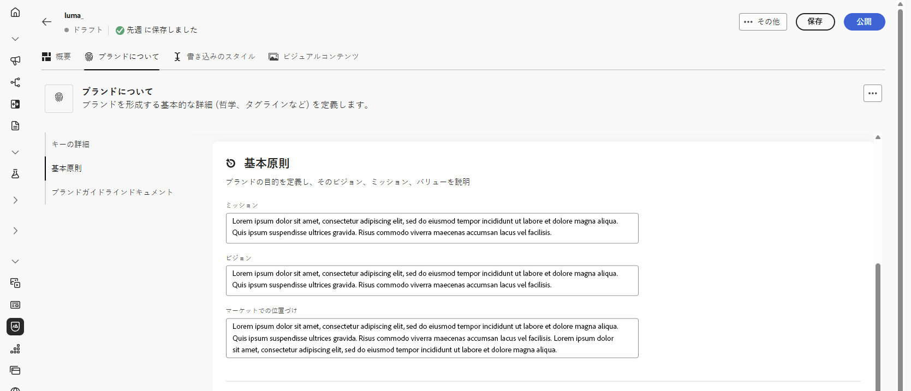
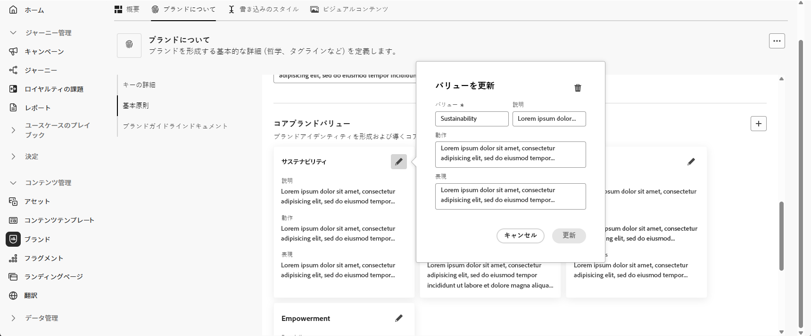
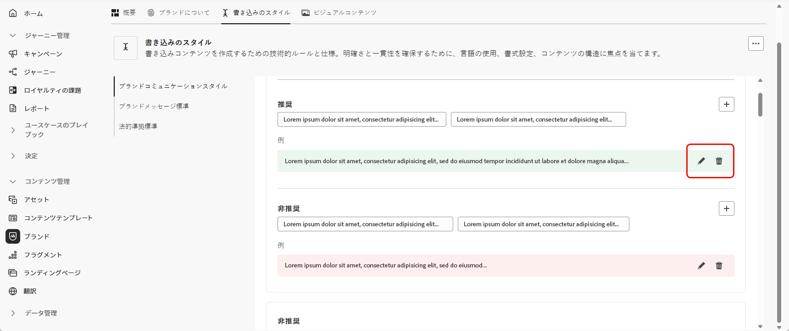

# ブランドのパーソナライズ {#brands-personalize}

## ブランドについて {#about-brand}

「**[!UICONTROL ブランドについて]**」タブを使用して、ブランドの目的、パーソナリティ、タグライン、その他の定義属性を説明し、ブランドのコアアイデンティティを確立します。

1. まず、**[!UICONTROL キーの詳細]**&#x200B;カテゴリにブランドの基本情報を入力します。

   * **[!UICONTROL ブランドキット名]**：ブランドキット名を入力します。

   * **[!UICONTROL 使用するタイミング]**：このブランドキットを適用するシナリオまたはコンテキストを指定します。

   * **[!UICONTROL ブランド名]**：ブランドの正式な名前を入力します。

   * **[!UICONTROL ブランドの説明]**：このブランドが表すものの概要について説明します。

   * **[!UICONTROL デフォルトのタグライン]**：ブランドに関連付けられたプライマリタグラインを追加します。

     

1. **[!UICONTROL 基本原則]**&#x200B;カテゴリで、ブランドのコアとなる方向性と哲学を明確にします。

   * **[!UICONTROL ミッション]**：ブランドの目的について詳しく説明します。

   * **[!UICONTROL ビジョン]**：長期目標または実現したい将来像について説明します。

   * **[!UICONTROL マーケットでの位置づけ]**：ブランドがマーケットでどのように位置づけられているかについて説明します。

     

1. **[!UICONTROL コアブランドバリュー]**&#x200B;カテゴリから、をクリックしてブランドのコアバリューを追加し、詳細を入力します。

   * **[!UICONTROL バリュー]**：コアブランドバリューに名前を付けます。

   * **[!UICONTROL 説明]**：このバリューがブランドにもたらす意味について説明します。

   * **[!UICONTROL 行動]**：このバリューを実際に反映する行動や態度について説明します。

   * **[!UICONTROL 表現]**：このバリューを実際のブランディングで表現する方法の例を示します。

     

1. 必要に応じて、アイコンをクリックして、コアブランドバリューの 1 つを更新または削除します。

   

これで、ブランドをさらにパーソナライズしたり、[ブランドを公開](brands.md#create-brand-kit)したりすることができます。

## 書き込みのスタイル {#writing-style}

>[!CONTEXTUALHELP]
>id="ajo_brand_writing_style"
>title="書き込みのスタイル一致スコア"
>abstract="書き込みのスタイルの節では、明確で一貫性のあるコンテンツを確保するために、言語、書式設定、構造の標準を定義します。一致スコアは高から低までの評価が付けられ、コンテンツがこれらのガイドラインに準拠している程度を示し、改善が必要な領域をハイライト表示します。"

**[!UICONTROL 書き込みのスタイル]**&#x200B;の節では、コンテンツの書き込みの標準について説明し、すべての資料にわたって明瞭性、一貫性、整合性を維持するために、言語、書式設定、構造をどのように使用するかについて詳しく説明します。

+++ 使用可能なカテゴリと例

<table>
  <thead>
    <tr>
      <th>カテゴリ</th>
      <th>サブカテゴリ</th>
      <th>ガイドラインの例</th>
      <th>除外の例</th>
    </tr>
  </thead>
  <tbody>
    <tr>
      <td rowspan="4">コンテンツ作成標準</td>
      <td>ブランドメッセージ標準</td>
      <td>革新性と顧客第一のメッセージをハイライト表示する。</td>
      <td>製品の機能を過度に約束しない。</td>
    </tr>
    <tr>
      <td>タグラインの使用</td>
      <td>すべてのデジタルマーケティングアセットのロゴの下にタグラインを配置する。</td>
      <td>タグラインを変更または翻訳しない。</td>
    </tr>
    <tr>
      <td>コアメッセージ</td>
      <td>生産性の向上など、主要なメリットを強調する。</td>
      <td>無関係なバリューの提案を使用しない。</td>
    </tr>
    <tr>
      <td>命名標準</td>
      <td>「ProScheduler」などのシンプルでわかりやすい名前を使用する。</td>
      <td>複雑な用語や特殊文字を使用しない。</td>
    </tr>
    <tr>
      <td rowspan="5">ブランドコミュニケーションスタイル</td>
      <td>ブランドパーソナリティ特性</td>
      <td>わかりやすくて、親しみやすい。</td>
      <td>弱気な印象を与えない。</td>
    </tr>
    <tr>
      <td>書き込みの技術</td>
      <td>文章を短く、効果的なものにする。</td>
      <td>過度に専門用語を使用しない。</td>
    </tr>
    <tr>
      <td>状況に合ったトーン</td>
      <td>危機管理コミュニケーションではプロフェッショナルなトーンを維持する。</td>
      <td>サポートコミュニケーションで軽視しない。</td>
    </tr>
    <tr>
      <td>単語選択ガイドライン</td>
      <td>「革新的」や「スマート」などの単語を使用する。</td>
      <td>「安い」や「ハック」などの単語を使用しない。</td>
    </tr>
    <tr>
      <td>言語標準</td>
      <td>米国英語の慣例に従う。</td>
      <td>英国と米国のスペルを混在させない。</td>
    </tr>
    <tr>
      <td rowspan="3">法的準拠標準</td>
      <td>商標記号標準</td>
      <td>常に ™ または ® 記号を使用する。</td>
      <td>必要な場合は法的記号を省略しない。</td>
    </tr>
    <tr>
      <td>著作権標準</td>
      <td>マーケティング資料に著作権通知を含める。</td>
      <td>権限がない場合は、サードパーティのコンテンツを使用しない。</td>
    </tr>
    <tr>
      <td>免責事項標準</td>
      <td>デジタルアセットに免責事項を読みやすく表示する。</td>
      <td>免責事項を非表示の領域に配置しない。</td>
    </tr>
</table>

+++

 

**[!UICONTROL 書き込みのスタイル]**&#x200B;をパーソナライズするには：

1. 「**[!UICONTROL 書き込みのスタイル]**」タブで、 をクリックし、ガイドライン、例外または除外を追加します。

1. ガイドライン、例外または除外を入力します。また、**[!UICONTROL 例]**&#x200B;を含めることで、適用方法をより明確に示すことができます。

   

1. ガイドライン、例外または除外の&#x200B;**使用コンテキスト**&#x200B;を指定します。

   * **[!UICONTROL チャネルタイプ]**：このガイドライン、例外または除外を適用する場所を選択します。例えば、特定の書き込みスタイルをメール、モバイル、プリントまたは他の通信チャネルにのみ表示する場合があります。

   * **[!UICONTROL 要素タイプ]**：ルールが適用されるコンテンツ要素を指定します。これには、見出し、ボタン、リンクまたはコンテンツ内の他のコンポーネントなどの要素が含まれる場合があります。

     

1. ガイドライン、例外または除外を設定したら、「**[!UICONTROL 追加]**」をクリックします。

1. 必要に応じて、更新または削除するガイドラインや除外の 1 つを選択します。

1. をクリックして例を編集するか、 アイコンをクリックして例を削除します。

   

これで、ブランドをさらにパーソナライズしたり、[ブランドを公開](#create-brand-kit)したりすることができます。

## ビジュアルコンテンツ {#visual-content}

>[!CONTEXTUALHELP]
>id="ajo_brand_imagery"
>title="ビジュアルコンテンツ一致スコア"
>abstract="ビジュアルコンテンツ一致スコアは、コンテンツが設定済みのブランドガイドラインに一致している程度を示します。高から低までのスコアが付けられ、一目で一致を評価するのに役立ちます。様々なカテゴリを探索して、改善が必要な領域を特定し、ブランドに即していない可能性がある要素を特定します。"

**[!UICONTROL ビジュアルコンテンツ]**&#x200B;の節では、画像とデザインの標準を定義し、統一された一貫性のあるブランドの外観を維持するために必要な仕様について詳しく説明します。

+++ 使用可能なカテゴリと例

<table>
  <thead>
    <tr>
      <th>カテゴリ</th>
      <th>ガイドラインの例</th>
      <th>除外の例</th>
    </tr>
  </thead>
  <tbody>
    <tr>
      <td>写真の標準</td>
      <td>屋外撮影には自然光を使用する。</td>
      <td>過度に編集された画像やピクセル化された画像を使用しない。</td>
    </tr>
    <tr>
      <td>イラスト標準</td>
      <td>無駄のない、ミニマルなスタイルを使用する。</td>
      <td>過度に複雑なイラストを使用しない。</td>
    </tr>
    <tr>
      <td>アイコン標準</td>
      <td>一貫性のある 24 ピクセルのグリッドシステムを使用する。</td>
      <td>アイコンの寸法を混在させたり、異なる太さの線を使用したり、グリッドルールから逸脱したりしない。</td>
    </tr>
    <tr>
      <td>使用ガイドライン</td>
      <td>実際の顧客がプロフェッショナルな環境で製品を使用する様子を反映したライフスタイル画像を選択する。</td>
      <td>ブランドのトーンに矛盾する画像や、コンテキストから外れた画像を使用しない。</td>
    </tr>
</table>

+++

 

**[!UICONTROL ビジュアルコンテンツ]**&#x200B;をパーソナライズするには：

1. 「**[!UICONTROL ビジュアルコンテンツ]**」タブで、 をクリックし、ガイドライン、除外または例を追加します。

1. ガイドライン、除外または例を入力します。

   

1. ガイドラインまたは除外の&#x200B;**使用コンテキスト**&#x200B;を指定します。

   * **[!UICONTROL チャネルタイプ]**：このガイドライン、例外または除外を適用する場所を選択します。例えば、特定の書き込みスタイルをメール、モバイル、プリントまたは他の通信チャネルにのみ表示する場合があります。

   * **[!UICONTROL 要素タイプ]**：ルールが適用されるコンテンツ要素を指定します。これには、見出し、ボタン、リンクまたはコンテンツ内の他のコンポーネントなどの要素が含まれる場合があります。

     

1. ガイドライン、例外または除外を設定したら、「**[!UICONTROL 追加]**」をクリックします。

1. 正しい使用方法を示す画像を追加するには、「**[!UICONTROL 例]**」を選択し、「**[!UICONTROL 画像を選択]**」をクリックします。また、除外の例として、正しくない使用法を示す画像を追加することもできます。

   

1. 必要に応じて、更新または削除するガイドラインや除外の 1 つを選択します。

1. 例を 1 つ選択して更新するか、画像を置き換えるか、 アイコンをクリックして削除します。

   

これで、ブランドをさらにパーソナライズしたり、[ブランドを公開](brands.md#create-brand-kit)したりすることができます。

<!--
## Colors {#colors}

The **[!UICONTROL Colors]** section the standards for your brand's color system, outlining how colors are selected, organized, and applied across experiences. It ensures consistent use of primary, secondary, accent, and neutral colors to maintain a cohesive, accessible, and recognizable brand identity.

+++ Available categories and examples

<table>
  <thead>
    <tr>
      <th>Category</th>
      <th>Guidelines Example</th>
      <th>Exclusions Example</th>
    </tr>
  </thead>
  <tbody>
    <tr>
      <td>Primary colors</td>
      <td>Use primary brand colors for logos, headers, and main call-to-action elements.</td>
      <td>Do not substitute or modify primary brand colors.</td>
    </tr>
    <tr>
      <td>Secondary colors</td>
      <td>Use secondary colors to support layouts, illustrations, and UI components.</td>
      <td>Do not let secondary colors overpower primary brand colors.</td>
    </tr>
    <tr>
      <td>Accent colors</td>
      <td>Use accent colors sparingly for buttons, links, and alerts.</td>
      <td>Do not use accent colors for large background areas.</td>
    </tr>
    <tr>
      <td>Neutral colors</td>
      <td>Use neutral colors for text, dividers, borders, and subtle UI elements.</td>
      <td>Avoid using neutrals with poor contrast or heavy color casts.</td>
    </tr>
    <tr>
      <td>Background colors</td>
      <td>Use light or neutral backgrounds to ensure readability and visual clarity.</td>
      <td>Do not place text or logos on low-contrast backgrounds.</td>
    </tr>
    <tr>
      <td>Additional colors</td>
      <td>Use additional colors only for data visualization or approved campaigns.</td>
      <td>Do not introduce unapproved or off-brand colors.</td>
    </tr>
    <tr>
      <td>Color scales</td>
      <td>Use approved tints and shades for UI states such as hover, active, and disabled.</td>
      <td>Do not create unofficial shades or gradients.</td>
    </tr>
    <tr>
      <td>Usage guidelines</td>
      <td>Maintain consistent color usage and accessible contrast across all assets.</td>
      <td>Do not mix conflicting palettes or apply colors inconsistently.</td>
    </tr>
</table>

+++

 

To personalize your **[!UICONTROL Colors]**:

1. From the **[!UICONTROL Colors]** tab, click  to add a color, guideline or exclusion. 

1. Enter your color information to define it accurately:

    * **Color name**: Provide a clear, descriptive name to identify the color within your brand system.

    * **Color value**: Choose your color using the hue picker or enter precise values using RGB, HEX, or Pantone name/code to ensure consistency across digital and print assets.

    

1. Review your selection to confirm accuracy and visual consistency and click **[!UICONTROL Add]** to save your color.

1. Then, enter your guideline or exclusion.

1. Specify the Usage context for your guideline or exclusion:

    * **[!UICONTROL Channel type]**: Choose where this guideline, exception, or exclusion should apply. For example, you may want a specific writing style to appear only in Email, Mobile, Prints, or other communication channels.

    * **[!UICONTROL Element type]**: Specify which content element the rule applies to. This could include elements such as Headings, Buttons, Links, or other components within your content.

      
  
1. Once your guideline, exception, or exclusion is set up, click **[!UICONTROL Add]**. 

1. If needed, select one of your guideline or exclusion to update or delete.

1. Select one your guideline or exclusion to update it. Click the icon to delete it. 

    

1. Click **[!UICONTROL Add group]** to define additional colors for your brand or to add a color scale group.

You can now further personalize your brand or [publish your brand](brands.md#create-brand-kit).

-->