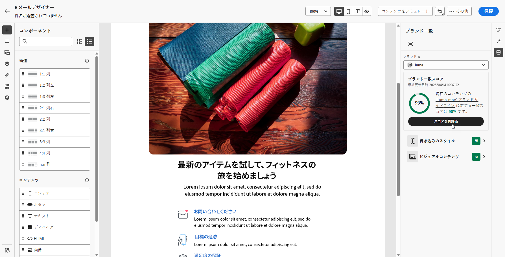
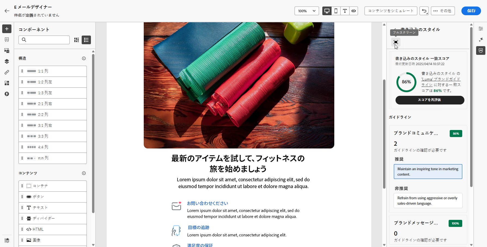
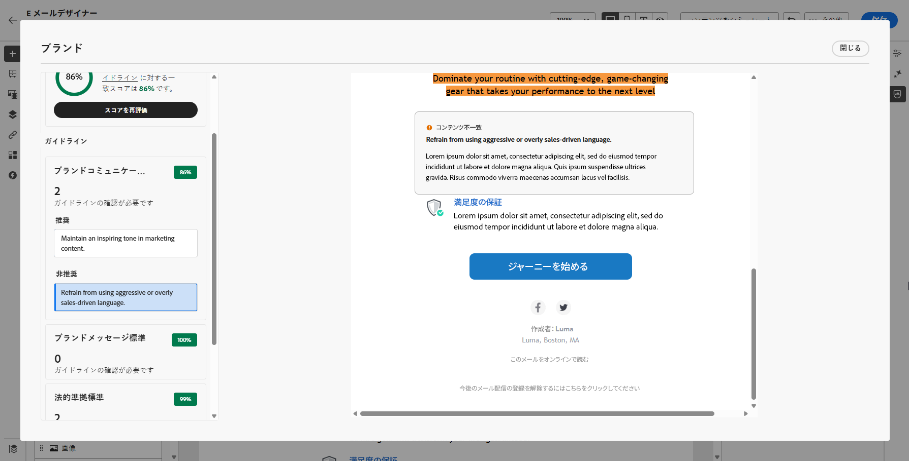

# ブランド一致 {#brands-score}

>[!CONTEXTUALHELP]
>id="ajo_brand_score"
>title="ブランド一致スコア"
>abstract="ブランド一致スコアは、コンテンツがブランドのガイドラインに準拠している程度を測定し、色、フォント、ロゴ、画像、書き込みのスタイルの一貫性を確保します。"

>[!CONTEXTUALHELP]
>id="ajo_brand_colors"
>title="色のスコア"
>abstract="色のスコア"

>[!CONTEXTUALHELP]
>id="ajo_brand_fonts"
>title="フォントのスコア"
>abstract="フォントのスコア"

>[!CONTEXTUALHELP]
>id="ajo_brand_logos"
>title="ロゴのスコア"
>abstract="ロゴのスコア"

>[!AVAILABILITY]
>
>Adobe Journey Optimizer で AI アシスタントを使用する前に、[ユーザー契約](https://www.adobe.com/jp/legal/licenses-terms/adobe-dx-gen-ai-user-guidelines.html){target="_blank"}に同意する必要があります。詳しくは、アドビ担当者にお問い合わせください。

ブランド一致機能は、ブランドガイドラインに準拠したコンテンツの作成、レビュー、管理に役立ちます。この機能を使用すると、メールキャンペーン全体のトーン、メッセージ、ビジュアルアイデンティティの一貫性を確保するだけでなく、コンテンツ公開前に品質チェックを行うことができます。

## ブランド一致を使用したコンテンツの検証 {#validate-content}

[ブランドを設定して公開](brands.md)したら、メールキャンペーン内でブランド一致スコアを直接評価し、コンテンツがブランドガイドラインに準拠していることを確認します。

1. [メールキャンペーン](../campaigns/create-campaign.md)を作成します。

1. E メールデザイナーで&#x200B;**[!UICONTROL ブランド一致]**&#x200B;メニューを開きます。

   コンテンツは、デフォルトのブランドに対して自動的に評価されます。[詳しくは、デフォルトのブランドの割り当て方法を参照してください](brands.md)。

   

1. 別のブランドを使用して評価するには、**[!UICONTROL ブランド]**&#x200B;ドロップダウンメニューからブランドを選択し、「**[!UICONTROL スコアを再評価]**」をクリックします。

   

1. **ブランド一致スコア**（高、中、低）を参照し、詳細なフィードバックを確認します。

1.  アイコンをクリックして、スコアの詳細なインサイトを表示します。

   

1. フラグ付けされたガイドラインを選択して、特定のフィードバックと提案を表示します。

   

1. レコメンデーションに基づいてコンテンツを編集し、ブランド一致を向上させます。

1. 変更した後にコンテンツを手動で再評価し、一致スコアを更新します。

## チュートリアルビデオ {#video}

次のビデオでは、独自のブランドを作成およびカスタマイズして、コミュニケーション全体で視覚的および言語的なアイデンティティを明確に定義する方法について説明します。

+++ こちらのビデオをご覧ください

>[!VIDEO](https://video.tv.adobe.com/v/3470547/?captions=jpn&learn=on)

+++
