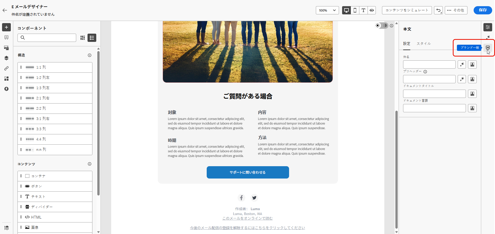
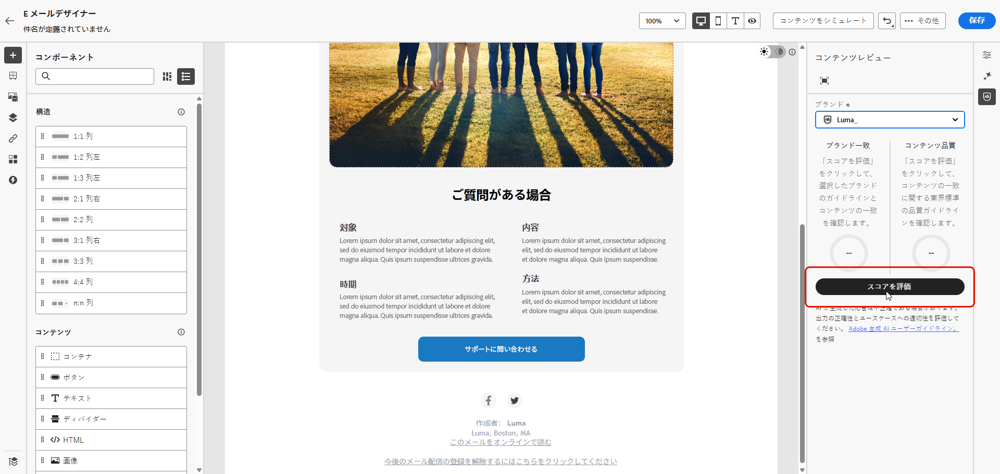
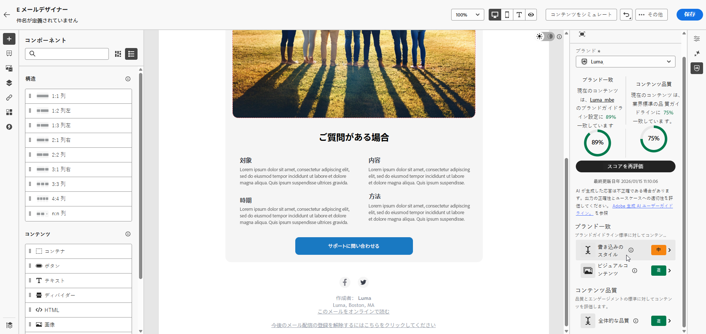
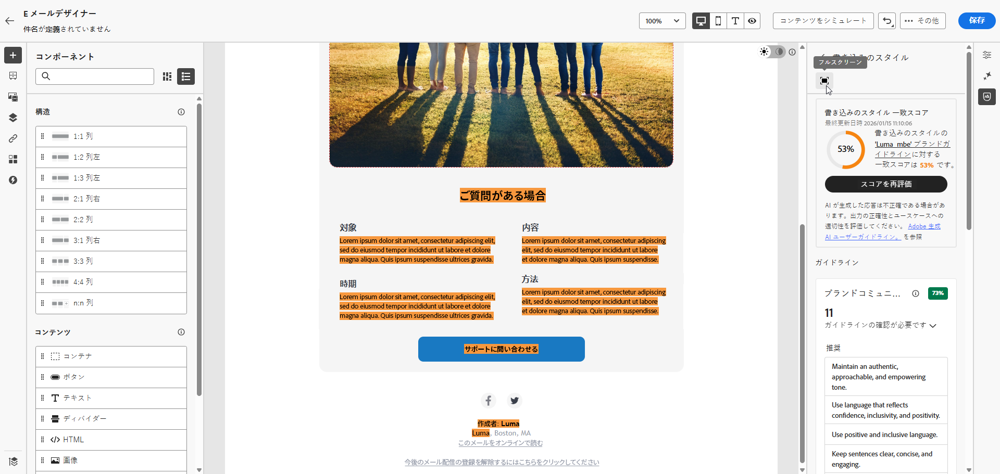
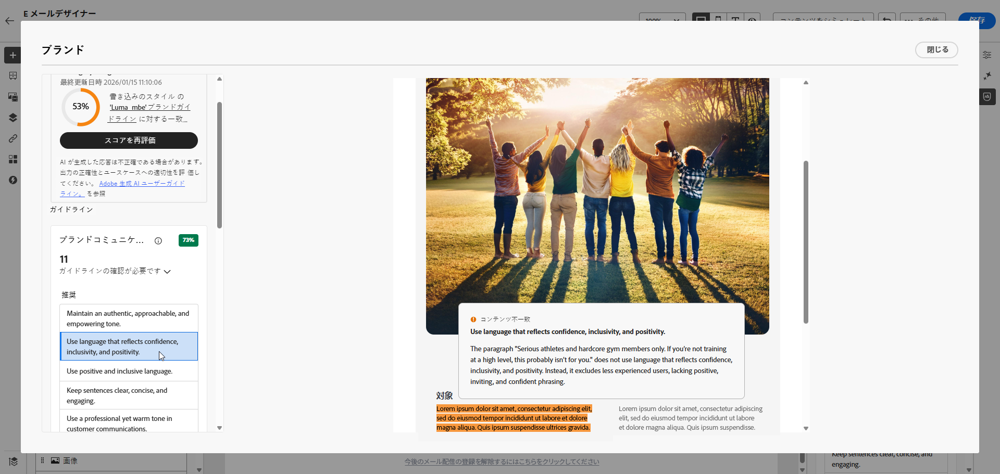
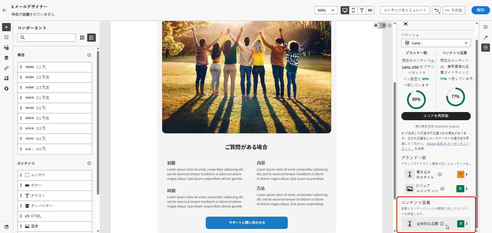
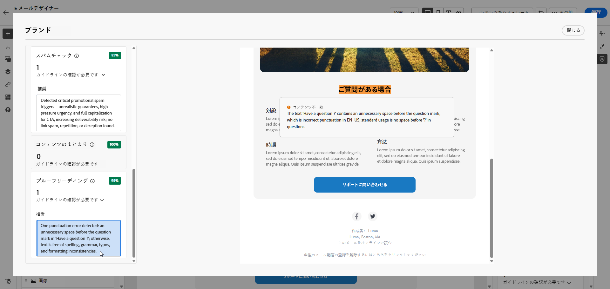

# ブランド一致 {#brands-score}

>[!BEGINSHADEBOX]

**このページ：**&#x200B;では、Adobe Journey Optimizerのブランド調整スコアを使用して、メールコンテンツをブランドガイドラインに照らし合わせて検証し、全体的なコンテンツ品質を評価する方法を説明します。

>[!ENDSHADEBOX]

>[!CONTEXTUALHELP]
>id="ajo_brand_score"
>title="ブランド一致スコア"
>abstract="ブランド一致スコアは、コンテンツがブランドのガイドラインに準拠している程度を測定し、色、フォント、ロゴ、画像、書き込みのスタイルの一貫性を確保します。"

>[!CONTEXTUALHELP]
>id="ajo_brand_colors"
>title="色のスコア"
>abstract="色のスコア"

>[!CONTEXTUALHELP]
>id="ajo_brand_fonts"
>title="フォントのスコア"
>abstract="フォントのスコア"

>[!CONTEXTUALHELP]
>id="ajo_brand_logos"
>title="ロゴのスコア"
>abstract="ロゴのスコア"

>[!AVAILABILITY]
>
>Adobe Journey Optimizer で AI アシスタントを使用する前に、[ユーザー契約](https://www.adobe.com/jp/legal/licenses-terms/adobe-dx-gen-ai-user-guidelines.html){target="_blank"}に同意する必要があります。 詳しくは、アドビ担当者にお問い合わせください。

ブランド一致機能は、ブランドガイドラインに準拠したコンテンツの作成、レビュー、管理に役立ちます。 この機能を使用すると、メールキャンペーン全体のトーン、メッセージ、ビジュアルアイデンティティの一貫性を確保するだけでなく、コンテンツ公開前に品質チェックを行うことができます。

## ブランド一致を使用したコンテンツの検証 {#validate-content}

[ブランドを設定して公開](brands.md)したら、メールキャンペーン内でブランド一致スコアを直接評価し、コンテンツがブランドガイドラインに準拠していることを確認します。

1. [メールキャンペーン](../campaigns/create-campaign.md)を作成します。

1. E メールデザイナーで&#x200B;**[!UICONTROL ブランド一致]**&#x200B;メニューを開きます。

   コンテンツは、デフォルトのブランドに対して自動的に評価されます。 [詳しくは、デフォルトのブランドの割り当て方法を参照してください](brands.md)。

   

1. 別のブランドを使用して評価するには、**[!UICONTROL ブランド]** ドロップダウンメニューからブランドを選択し、**[!UICONTROL スコアを評価]**&#x200B;をクリックします。

   

1. **[!UICONTROL ライティングスタイル]**&#x200B;または&#x200B;**[!UICONTROL ビジュアルコンテンツ]**&#x200B;を参照して、スコアに関する詳細なインサイトを確認します。

   

1.  アイコンをクリックして、スコアの詳細なインサイトを表示します。

   

1. フラグ付けされたガイドラインを選択して、特定のフィードバックと提案を表示します。 ブランドの整合性では、次のカテゴリが評価されます。

   * **[!UICONTROL 書き方]**:
      * **[!UICONTROL ブランドコミュニケーションスタイル]**：すべてのチャネルで一貫したブランドボイスを確保するために、個性と感情のトーンを定義します。
      * **[!UICONTROL ブランドメッセージ標準]**：効果的なマーケティングおよびプロモーションテキストの構造化および書式設定ルール。
      * **[!UICONTROL 法的コンプライアンス基準]**：すべてのコミュニケーションが、テキストの配置やコンプライアンス チェックリストを含む法的要件に準拠していることを確認します。

   * **[!UICONTROL ビジュアルコンテンツ]**:
      * **[!UICONTROL 写真基準]**：解像度、構図、照明、ファイル形式など、写真コンテンツの要件。
      * **[!UICONTROL イラスト標準]**：イラストのスタイルパラメーター、線の太さ、色の使用状況、ファイル形式の要件。
      * **[!UICONTROL アイコンの標準]**：グリッドシステム、線の太さ、均一性を考慮したサイズなど、アイコンのデザインに関する仕様。
      * **[!UICONTROL 使用ガイドライン]**：ブランドアイデンティティを維持するための、画像の選択、配置、およびコンテキストに関するベストプラクティス。

   

1. レコメンデーションに基づいてコンテンツを編集し、ブランド一致を向上させます。

1. 変更した後にコンテンツを手動で再評価し、一致スコアを更新します。

## コンテンツ品質の検証 {#validate-quality}

>[!NOTE]
>
>コンテンツの品質評価は、ブランドガイドラインとは独立しています。 ドロップダウンメニューでブランドを選択しても、そのブランドのガイドラインは品質チェックに適用されません。 ブランド選択は、ブランド調整スコアリングにのみ関連します。

ブランドの整合性に加えて、一般的なコンテンツの品質を評価し、ブランドガイドラインに依存せずに、読みやすさ、コンテンツの一貫性、有効性に関する潜在的な問題を特定できます。

コンテンツの品質を評価するには、次の手順に従います。

1. [メールキャンペーン](../campaigns/create-campaign.md)を作成します。

1. E メールデザイナーで&#x200B;**[!UICONTROL ブランド一致]**&#x200B;メニューを開きます。

   

1. 「**[!UICONTROL スコアを評価]**」をクリックして、ブランドの整合性とコンテンツ品質の両方のスコアを生成します。

   

1. 「**[!UICONTROL 全体的な品質]**」タブに移動して、コンテンツ品質に関するインサイトと推奨事項を確認します。

   

1. 詳細なインサイトを得るには アイコンをクリックすると、品質スコアの詳細なビューが表示されます。

   

1. フラグが設定されている項目を選択して、特定のフィードバックと改善に向けた実用的な提案を表示します。 スコアは、次のカテゴリに基づいています。

   * **[!UICONTROL CTAの効果]**:call-to-actionが読者に望ましい行動を起こすための動機付けをどの程度行っているかを評価します。
   * **[!UICONTROL 件名]**：明確さ、関連性、注目すべき品質を評価して、メールの開封を促進します。
   * **[!UICONTROL 読みやすさ]**：コンテンツがどの程度簡単で魅力的であるかを測定して、読者が理解できるようにします。
   * **[!UICONTROL スパムチェック]**：配信品質に影響を与える可能性のある一般的なスパムトリガーを特定します。
   * **[!UICONTROL コンテンツの一貫性]**：コンテンツがスムーズに流れ、トピックに沿ったものになります。
   * **[!UICONTROL 校正]**：スペル、文法、明瞭度の問題をチェックします。

   

1. レコメンデーションにもとづいてコンテンツを編集することで、読みやすさ、コンテンツの統一性、全体的な品質を向上させます。

1. 変更を加えた後、**[!UICONTROL スコアを再評価]**&#x200B;して、品質スコアを更新します。

## チュートリアルビデオ {#video}

次のビデオでは、独自のブランドを作成およびカスタマイズして、コミュニケーション全体で視覚的および言語的なアイデンティティを明確に定義する方法について説明します。

+++ こちらのビデオをご覧ください

>[!VIDEO](https://video.tv.adobe.com/v/3470547/?captions=jpn&learn=on)

+++
