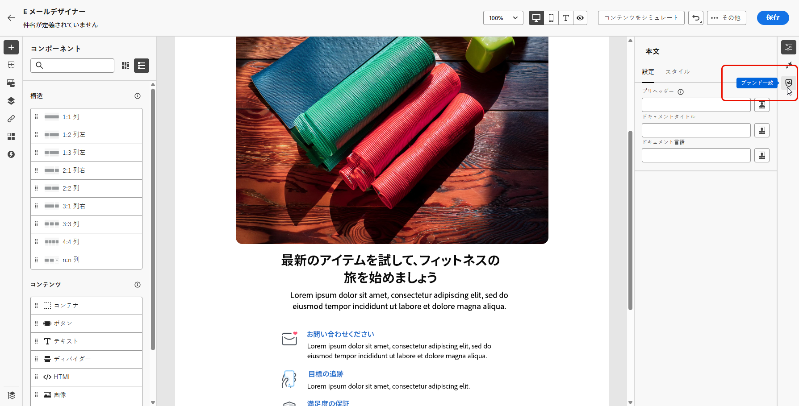

# ブランドの整合性（Beta）{#brands-score}

>[!CONTEXTUALHELP]
>id="ajo_brand_score"
>title="ブランドの整合性スコア"
>abstract="ブランドの整合性スコアは、コンテンツがブランドのガイドラインにどれだけ準拠しているかを測定し、色、フォント、ロゴ、画像、書き方の一貫性を確保します。"

>[!CONTEXTUALHELP]
>id="ajo_brand_colors"
>title="色のスコア"
>abstract="色のスコア"

>[!CONTEXTUALHELP]
>id="ajo_brand_fonts"
>title="フォントのスコア"
>abstract="フォントのスコア"

>[!CONTEXTUALHELP]
>id="ajo_brand_logos"
>title="ロゴのスコア"
>abstract="ロゴのスコア"

>[!AVAILABILITY]
>
>この機能は、Private Beta としてリリースされています。今後のリリースでは、すべてのお客様が段階的に利用できるようになる予定です。
>Adobe Journey Optimizerで AI アシスタントを使用するには、[ ユーザー使用許諾契約 ](https://www.adobe.com/jp/legal/licenses-terms/adobe-dx-gen-ai-user-guidelines.html){target="_blank"} に同意する必要があります。 詳しくは、アドビ担当者にお問い合わせください。

ブランドの整合機能は、ブランドガイドラインを遵守したコンテンツの作成、レビュー、管理を支援するために構築されています。 これにより、メールキャンペーン全体でトーン、メッセージ、視覚的 ID の一貫性が確保されると同時に、コンテンツが公開される前の品質チェックとしても機能します。

## ブランドとの整合性を持つコンテンツの検証 {#validate-content}

[ ブランドを設定して公開 ](brands.md) したら、メールキャンペーン内で直接ブランドのアラインメントスコアを評価し、コンテンツがブランドガイドラインに従っていることを確認します。

1. [ メールキャンペーン ](../campaigns/create-campaign.md) を作成します。

1. メールデザイナーで **[!UICONTROL ブランドの関連付け]** メニューを開きます。

   コンテンツは、デフォルトブランドに照らして自動的に評価されます。 [ デフォルトブランドの割り当て方法を学ぶ ](brands.md)。

   

1. 別のブランドを使用して評価するには、そのブランドを **[!UICONTROL ブランド]** ドロップダウンメニューから選択し、「**[!UICONTROL スコアを再評価]**」をクリックします。

   

1. **ブランド提携スコア** （高、Medium、低）を参照して、詳細なフィードバックを確認します。

1.  アイコンをクリックして、スコアに関するより多くのインサイトを表示します。

   

1. フラグの付いたガイドラインを選択して、特定のフィードバックと提案を表示します。

   

1. レコメンデーションに基づいてコンテンツを編集し、ブランドの整合性を向上させます。

1. 整合性スコアを更新するために変更を加えた後に、コンテンツを手動で再評価します。
