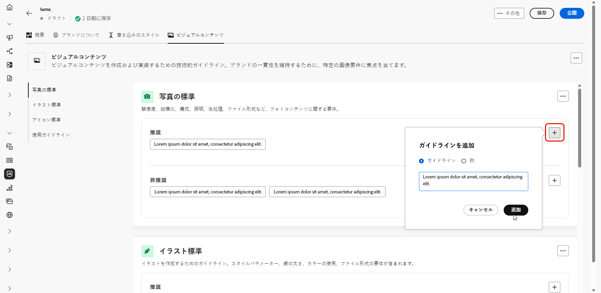

# ブランドの作成と管理 {#brands}

>[!CONTEXTUALHELP]
>id="ajo_brand_overview"
>title="ブランドの基本を学ぶ"
>abstract="独自のブランドを作成およびカスタマイズして、独自の視覚的および言語的アイデンティティを定義すると同時に、ブランドのスタイルや声に一致するコンテンツを簡単に生成できるようにします。"

>[!CONTEXTUALHELP]
>id="ajo_brand_ai_menu"
>title="ブランドの選択"
>abstract="ブランドを選択して、AI で生成されたすべてのコンテンツがブランドの仕様とガイドラインに合わせて調整されるようにします。"

>[!CONTEXTUALHELP]
>id="ajo_brand_score_overview"
>title="ブランドの選択"
>abstract="ブランドを選択して、一貫性とブランドの整合性を維持しながら、コンテンツが特定のガイドライン、標準、アイデンティティに合わせて作成されるようにします。"

>[!CONTEXTUALHELP]
>id="ajo_brand_score"
>title="ブランド一致スコア"
>abstract="ブランド一致スコアは、コンテンツがブランドのガイドラインに準拠している程度を測定し、色、フォント、ロゴ、画像、書き込みのスタイルの一貫性を確保します。"

>[!CONTEXTUALHELP]
>id="ajo_brand_colors"
>title="色のスコア"
>abstract="色のスコア"

>[!CONTEXTUALHELP]
>id="ajo_brand_fonts"
>title="フォントのスコア"
>abstract="フォントのスコア"

>[!CONTEXTUALHELP]
>id="ajo_brand_logos"
>title="ロゴのスコア"
>abstract="ロゴのスコア"

>[!CONTEXTUALHELP]
>id="ajo_brand_imagery"
>title="画像のスコア"
>abstract="画像のスコア"

>[!CONTEXTUALHELP]
>id="ajo_brand_writing_style"
>title="書き込みのスタイルのスコア"
>abstract="書き込みのスタイルのスコア"

>[!AVAILABILITY]
>
>この機能は、Private Beta としてリリースされています。今後のリリースでは、すべてのお客様が段階的に利用できるようになる予定です。

ブランドガイドラインは、ブランドの視覚的および言語的 ID を確立する詳細なルールと標準のセットです。すべてのマーケティングおよびコミュニケーションプラットフォーム全体で一貫したブランド表現を維持することを目的とした参照として機能します。

[!DNL Journey Optimizer] では、ブランドの詳細を手動で入力および整理することや、情報の自動抽出用にブランドガイドラインドキュメントをアップロードすることができるようになりました。

## ブランドへのアクセス {#generative-access}

[!DNL Adobe Journey Optimizer] の&#x200B;**[!UICONTROL ブランド]**&#x200B;メニューにアクセスするには、ユーザーに&#x200B;**[!UICONTROL ブランドキットの管理]**&#x200B;権限または **[!UICONTROL AI アシスタントを有効にする]**&#x200B;権限を付与する必要があります。[詳細情報](../administration/permissions.md)

+++  ブランド関連の権限を割り当てる方法について説明します。

1. **権限**&#x200B;付きの製品で、「**役割**」タブに移動し、目的の「**役割**」を選択します。

1. 「**編集**」をクリックして、権限を変更します。

1. **AI アシスタント**&#x200B;のリソースを追加し、ドロップダウンメニューから「**ブランドキットの管理**」または「**[!UICONTROL AI アシスタントを有効にする]**」を選択します。

   **[!UICONTROL AI アシスタントを有効にする]**&#x200B;権限では、**[!UICONTROL ブランド]**&#x200B;メニューへの読み取り専用アクセスのみが提供されます。

   {zoomable="yes"}

1. 「**保存**」をクリックして、変更を適用します。

   この役割に既に割り当てられているユーザーの権限は、自動的に更新されます。

1. この役割を新しいユーザーに割り当てるには、**役割**&#x200B;ダッシュボード内の「**ユーザー**」タブに移動し、「**ユーザーを追加**」をクリックします。

1. ユーザーの名前、メールアドレスを入力するか、リストから選択して、「**保存**」をクリックします。

1. まだユーザーを作成していない場合は、[このドキュメント](https://experienceleague.adobe.com/ja/docs/experience-platform/access-control/abac/permissions-ui/users)を参照してください。

+++

## ブランドの作成 {#create-brand-kit}

>[!CONTEXTUALHELP]
>id="ajo_brands_create"
>title="ブランドの作成"
>abstract="ブランド名を入力し、ブランドガイドラインファイルをアップロードします。このツールは重要な詳細を自動的に抽出するので、ブランドのアイデンティティの維持が容易になります。"

ブランドガイドラインを作成および管理するには、詳細を自分で入力するか、ブランドガイドラインドキュメントをアップロードして、情報を自動的に抽出します。

1. **[!UICONTROL ブランド]**&#x200B;メニューで、「**[!UICONTROL ブランドを作成]**」をクリックします。

   

1. ブランドの&#x200B;**[!UICONTROL 名前]**&#x200B;を入力します。

1. ファイルをドラッグ＆ドロップまたは選択し、ブランドガイドラインをアップロードして、関連するブランド情報を自動的に抽出します。「**[!UICONTROL ブランドを作成]**」をクリックします。

   これで、情報の抽出プロセスが開始されます。完了するまで数分かかる場合があります。

   

1. コンテンツとビジュアル作成標準が自動的に入力されるようになりました。様々なタブを参照して、必要に応じて情報を調整します。

1. 「**[!UICONTROL 書き込みのスタイル]**」タブで、 をクリックして、例を含むガイドラインや除外を追加します。

   

1. 「**[!UICONTROL ビジュアルコンテンツ]**」タブで、 をクリックして別のガイドラインや除外を追加します。

1. 正しい使用方法を示す画像を追加するには、「**[!UICONTROL 例]**」を選択し、「**[!UICONTROL 画像を選択]**」をクリックします。また、除外の例として、正しくない使用法を示す画像を追加することもできます。

   

1. 設定が完了したら、「**[!UICONTROL 保存]**」、「**[!UICONTROL 公開]**」の順にクリックして、ブランドガイドラインを AI アシスタントで使用できるようにします。

1. 公開したブランドの変更を行うには、「**[!UICONTROL ブランドを編集]**」をクリックします。

   >[!NOTE]
   >
   >これにより、編集モードで一時的なコピーが作成され、公開後にライブバージョンが置き換えられます。

   

1. **[!UICONTROL ブランド]**&#x200B;ダッシュボードから、 アイコンをクリックして詳細メニューを開き、次の操作を実行します。

   * ブランドを表示
   * 編集
   * 複製
   * 公開
   * 非公開
   * 削除

   

これで、AI アシスタントメニューの&#x200B;**[!UICONTROL ブランド]**&#x200B;ドロップダウンからブランドガイドラインにアクセスできるようになり、仕様に合わせたコンテンツとアセットを生成できます。[詳しくは、AI アシスタントを参照してください](gs-generative.md)。

