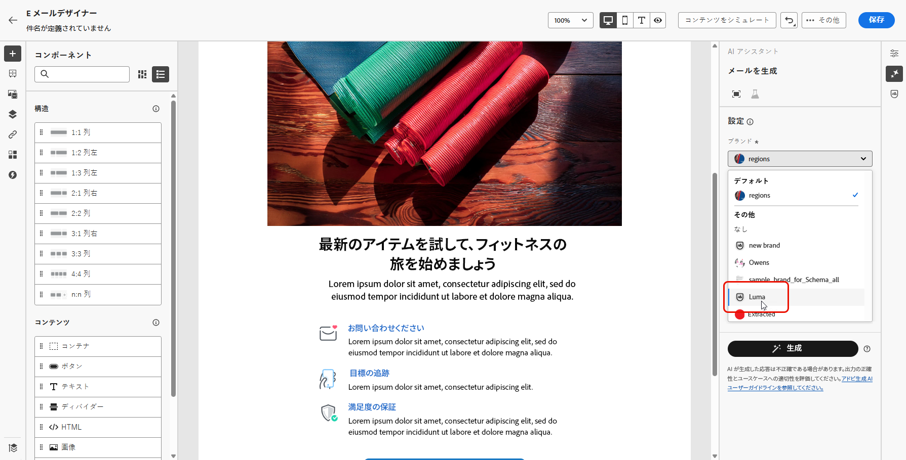

# ブランドの作成と管理 {#brands}

>[!CONTEXTUALHELP]
>id="ajo_brand_overview"
>title="ブランドの基本を学ぶ"
>abstract="独自のブランドを作成およびカスタマイズして、独自の視覚的および言語的アイデンティティを定義すると同時に、ブランドのスタイルや声に合ったコンテンツを簡単に生成できるようにします。"

>[!CONTEXTUALHELP]
>id="ajo_brand_ai_menu"
>title="ブランドを選択"
>abstract="ブランドを選択して、AI で生成されたすべてのコンテンツがブランドの仕様とガイドラインに合わせて調整されるようにします。"

>[!CONTEXTUALHELP]
>id="ajo_brand_score_overview"
>title="ブランドの選択"
>abstract="ブランドを選択して、コンテンツが特定のガイドライン、標準および ID に従って作成され、一貫性とブランドの整合性が維持されるようにします。"

>[!CONTEXTUALHELP]
>id="ajo_brand_score"
>title="ブランド調整スコア"
>abstract="ブランドの調整スコアは、コンテンツがブランドのガイドラインにどれだけ準拠しているかを測定し、色、フォント、ロゴ、画像、書き方の一貫性を確保します。"

>[!AVAILABILITY]
>
>この機能は、プライベートベータ版としてリリースされます。 今後のリリースで、すべてのお客様が段階的に利用できるようになります。

ブランドガイドラインは、ブランドの視覚的および言語的なアイデンティティを確立する詳細な一連のルールおよび基準です。 マーケティングプラットフォームとコミュニケーションプラットフォーム全体で一貫したブランド表現を維持するための参照として機能します。

[!DNL Journey Optimizer] では、ブランドの詳細を手動で入力および整理したり、自動情報抽出用にブランドガイドラインドキュメントをアップロードしたりできるようになりました。

## ブランドへのアクセス {#generative-access}

[!DNL Adobe Journey Optimizer] で **[!UICONTROL ブランド]** メニューにアクセスするには、ユーザーに **[!UICONTROL Managed Brand kit]** または **[!UICONTROL AI アシスタントを有効にする]** 権限を付与する必要があります。 [詳細情報](../administration/permissions.md)

+++  ブランド関連の権限の割り当て方法を学ぶ

1. **権限**&#x200B;付きの製品で、「**役割**」タブに移動し、目的の「**役割**」を選択します。

1. 「**編集**」をクリックして、権限を変更します。

1. **AI アシスタント** リソースを追加し、ドロップダウンメニューから **Managed Brand kit** または **[!UICONTROL AI アシスタントを有効にする]** を選択します。

   **[!UICONTROL Ai アシスタントを有効にする]** 権限では、**[!UICONTROL ブランド]** メニューへの読み取り専用アクセスのみが提供されることに注意してください。

   {zoomable="yes"}

1. 「**保存**」をクリックして、変更を適用します。

   この役割に既に割り当てられているユーザーの権限は、自動的に更新されます。

1. この役割を新しいユーザーに割り当てるには、**役割**&#x200B;ダッシュボード内の「**ユーザー**」タブに移動し、「**ユーザーを追加**」をクリックします。

1. ユーザーの名前、メールアドレスを入力するか、リストから選択して、「**保存**」をクリックします。

1. まだユーザーを作成していない場合は、[このドキュメント](https://experienceleague.adobe.com/ja/docs/experience-platform/access-control/abac/permissions-ui/users)を参照してください。

+++

## ブランドを作成 {#create-brand-kit}

>[!CONTEXTUALHELP]
>id="ajo_brands_create"
>title="ブランドを作成"
>abstract="ブランド名を入力し、ブランドガイドラインファイルをアップロードします。 このツールは重要な詳細を自動的に抽出するので、ブランドのアイデンティティを維持しやすくなります。"

ブランドガイドラインを作成および管理するには、詳細を自分で入力するか、ブランドガイドラインドキュメントをアップロードして、情報を自動的に抽出します。

1. **[!UICONTROL ブランド]** メニューで、「**[!UICONTROL ブランドを作成]**」をクリックします。

   

1. ブランドの **[!UICONTROL 名前]** を入力します。

1. ファイルをドラッグ&amp;ドロップまたは選択してブランドガイドラインをアップロードし、自動的に関連するブランド情報を抽出します。 **[!UICONTROL ブランドを作成]** をクリックします。

   情報の抽出プロセスが開始されます。 完了するまでに数分かかる場合があります。

   

1. コンテンツとビジュアル作成標準が自動的に入力されるようになりました。 様々なタブを参照して、必要に応じて情報を調整します。

1. 「**[!UICONTROL ライティングスタイル]**」タブで「」をクリックし、例を含むガイドラインや除外を追加します。

   

1. **[!UICONTROL ビジュアルコンテンツ]** タブで、 をクリックして、別のガイドラインまたは除外を追加します。

1. 正しい使用方法を示す画像を追加するには、「例 **[!UICONTROL を選択し]** 「**[!UICONTROL 画像を選択]**」をクリックします。 また、除外の例として、誤った使用法を示す画像を追加することもできます。

   

1. 設定が完了したら、**[!UICONTROL 保存]** をクリックしてから **[!UICONTROL 公開]** をクリックして、ブランドガイドラインを AI アシスタントで使用できるようにします。

1. 公開済みのブランドに変更を加えるには、「**[!UICONTROL ブランドを編集]**」をクリックします。

   >[!NOTE]
   >
   >これにより、編集モードで一時コピーが作成され、公開後にライブバージョンが置き換えられます。

   

1. **[!UICONTROL ブランド]** ダッシュボードで、 のアイコンをクリックして詳細メニューを開きます。

   * ブランドを表示
   * 編集
   * 複製
   * 公開
   * 非公開
   * 削除

   

ブランドガイドラインに AI アシスタントメニューの **[!UICONTROL ブランド]** ドロップダウンからアクセスできるようになり、仕様に合ったコンテンツとアセットを生成できるようになりました。 [ 詳しくは、AI アシスタントを参照してください ](gs-generative.md)

