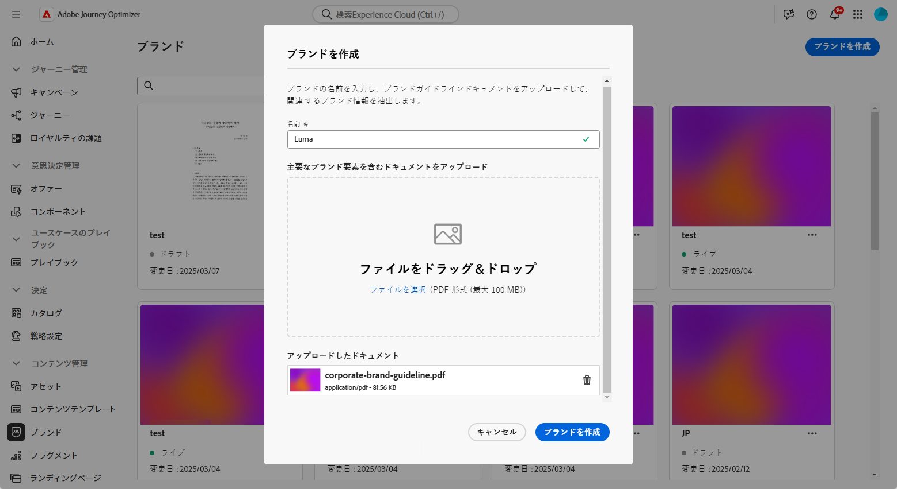
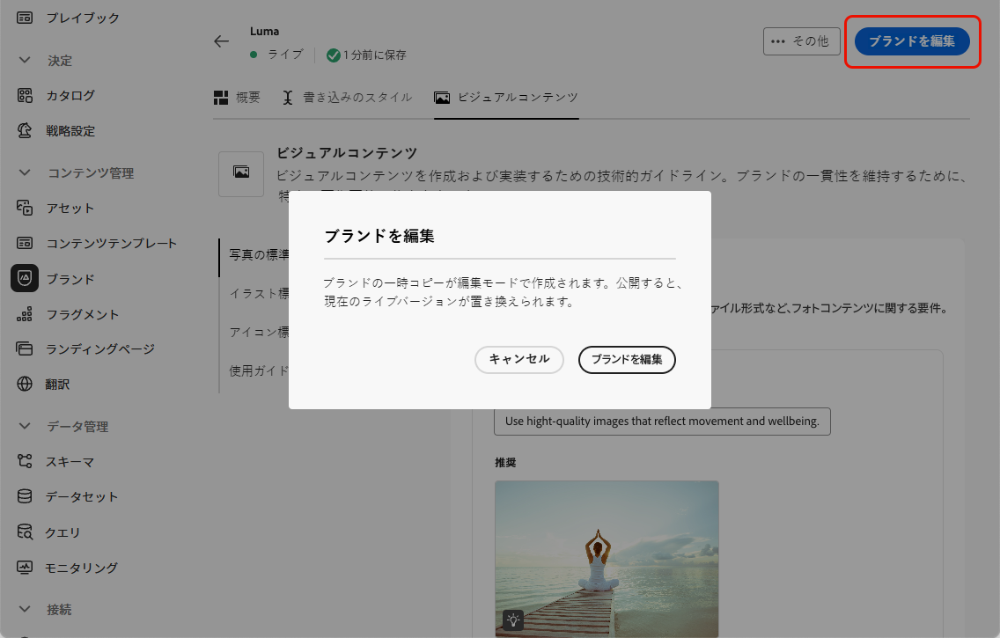
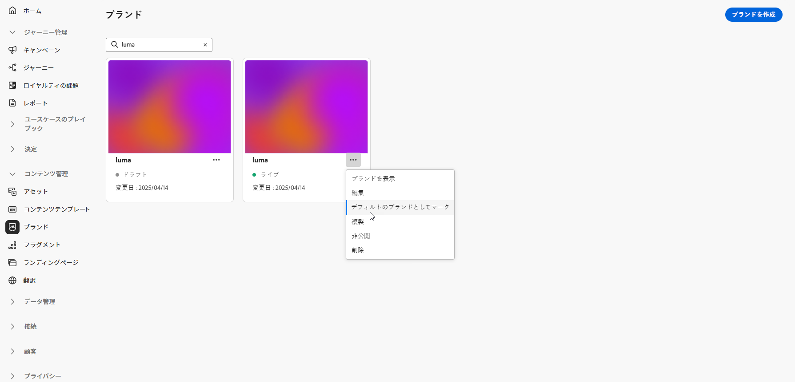
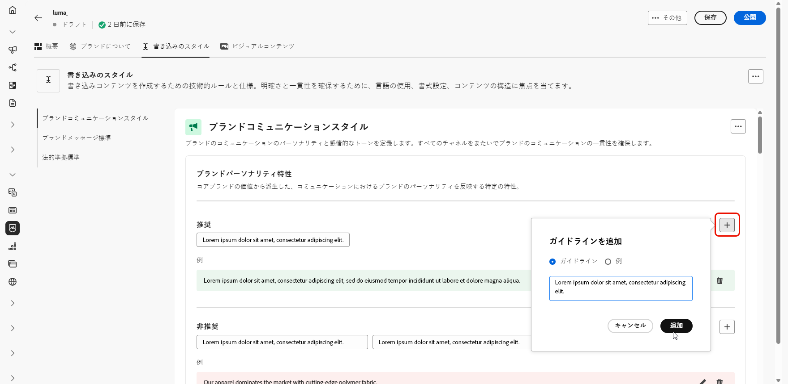

# ブランドの作成と管理 {#brands}

>[!CONTEXTUALHELP]
>id="ajo_brand_overview"
>title="ブランドの基本を学ぶ"
>abstract="独自のブランドを作成およびカスタマイズして、独自の視覚的および言語的アイデンティティを定義すると同時に、ブランドのスタイルや声に一致するコンテンツを簡単に生成できるようにします。"

>[!CONTEXTUALHELP]
>id="ajo_brand_ai_menu"
>title="ブランドの選択"
>abstract="ブランドを選択して、AI で生成されたすべてのコンテンツがブランドの仕様とガイドラインに合わせて調整されるようにします。"

>[!CONTEXTUALHELP]
>id="ajo_brand_score_overview"
>title="ブランドの選択"
>abstract="ブランドを選択して、一貫性とブランドの整合性を維持しながら、コンテンツが特定のガイドライン、標準、アイデンティティに合わせて作成されるようにします。"

>[!AVAILABILITY]
>
>この機能は、Private Beta としてリリースされています。今後のリリースでは、すべてのお客様が段階的に利用できるようになる予定です。
>Adobe Journey Optimizerで AI アシスタントを使用するには、[ ユーザー使用許諾契約 ](https://www.adobe.com/jp/legal/licenses-terms/adobe-dx-gen-ai-user-guidelines.html){target="_blank"} に同意する必要があります。 詳しくは、アドビ担当者にお問い合わせください。

ブランドガイドラインは、ブランドの視覚的および言語的 ID を確立する詳細なルールと標準のセットです。すべてのマーケティングおよびコミュニケーションプラットフォーム全体で一貫したブランド表現を維持することを目的とした参照として機能します。

[!DNL Journey Optimizer] では、ブランドの詳細を手動で入力および整理することや、情報の自動抽出用にブランドガイドラインドキュメントをアップロードすることができるようになりました。

## ブランドへのアクセス {#generative-access}

[!DNL Adobe Journey Optimizer] で **[!UICONTROL ブランド]** メニューにアクセスするには、ユーザーに **[!UICONTROL ブランドキットの管理]** または **[!UICONTROL AI アシスタントの有効化]** 権限を付与する必要があります。 [詳細情報](../administration/permissions.md)

+++  ブランド関連の権限を割り当てる方法について説明します。

1. **権限**&#x200B;付きの製品で、「**役割**」タブに移動し、目的の「**役割**」を選択します。

1. 「**編集**」をクリックして、権限を変更します。

1. **AI アシスタント** リソースを追加し、ドロップダウンメニューから **ブランドキットを管理** または **[!UICONTROL AI アシスタントを有効にする]** を選択します。

   **[!UICONTROL AI アシスタントを有効にする]**&#x200B;権限では、**[!UICONTROL ブランド]**&#x200B;メニューへの読み取り専用アクセスのみが提供されます。

   {zoomable="yes"}

1. 「**保存**」をクリックして、変更を適用します。

   この役割に既に割り当てられているユーザーの権限は、自動的に更新されます。

1. この役割を新しいユーザーに割り当てるには、**役割**&#x200B;ダッシュボード内の「**ユーザー**」タブに移動し、「**ユーザーを追加**」をクリックします。

1. ユーザーの名前、メールアドレスを入力するか、リストから選択して、「**保存**」をクリックします。

1. まだユーザーを作成していない場合は、[このドキュメント](https://experienceleague.adobe.com/ja/docs/experience-platform/access-control/abac/permissions-ui/users)を参照してください。

+++

## ブランドの作成と管理 {#create-brand-kit}

>[!CONTEXTUALHELP]
>id="ajo_brands_create"
>title="ブランドの作成"
>abstract="ブランド名を入力し、ブランドガイドラインファイルをアップロードします。このツールは重要な詳細を自動的に抽出するので、ブランドのアイデンティティの維持が容易になります。"

ブランドガイドラインを作成および管理するには、詳細を自分で入力するか、ブランドガイドラインドキュメントをアップロードして、情報を自動的に抽出します。

1. **[!UICONTROL ブランド]**&#x200B;メニューで、「**[!UICONTROL ブランドを作成]**」をクリックします。

   

1. ブランドの&#x200B;**[!UICONTROL 名前]**&#x200B;を入力します。

1. ファイルをドラッグ＆ドロップまたは選択し、ブランドガイドラインをアップロードして、関連するブランド情報を自動的に抽出します。「**[!UICONTROL ブランドを作成]**」をクリックします。

   これで、情報の抽出プロセスが開始されます。完了するまで数分かかる場合があります。

   

1. コンテンツとビジュアル作成標準が自動的に入力されるようになりました。様々なタブを参照して、必要に応じて情報を調整します。 [詳細情報](#personalize)

1. 各セクションまたはカテゴリの詳細メニューから、関連するブランド情報を自動的に抽出する参照を追加できます。

   既存のコンテンツを削除するには、「**[!UICONTROL セクションをクリア]**」または「**[!UICONTROL カテゴリをクリア]**」オプションを使用します。

   

1. 設定が完了したら、**[!UICONTROL 保存]**/**[!UICONTROL 公開]** をクリックして、ブランドガイドラインを AI アシスタントで使用できるようにします。

1. 公開したブランドの変更を行うには、「**[!UICONTROL ブランドを編集]**」をクリックします。

   >[!NOTE]
   >
   >これにより、編集モードで一時的なコピーが作成され、公開後にライブバージョンが置き換えられます。

   

1. **[!UICONTROL ブランド]**&#x200B;ダッシュボードから、 アイコンをクリックして詳細メニューを開き、次の操作を実行します。

   * ブランドを表示
   * 編集
   * 複製
   * 公開
   * 非公開
   * 削除

   

ブランドガイドラインに AI アシスタント メニューの **[!UICONTROL ブランド]** ドロップダウンからアクセスできるようになり、仕様に合ったコンテンツやアセットを生成できるようになりました。 [AI アシスタントの詳細 ](gs-generative.md)

### デフォルトブランドを設定 {#default-brand}

コンテンツの生成時およびキャンペーン作成時の調整スコアの計算時に自動的に適用されるデフォルトブランドを指定できます。

デフォルトブランドを設定するには、**[!UICONTROL ブランド]** ダッシュボードに移動します。 ア  ットアイコンをクリックし、「」をクリックして詳細メニューを開き、「**[!UICONTROL デフォルトブランドとしてマーク]**」を選択します。

## ブランドのパーソナライズ {#personalize}

### ブランドについて {#about-brand}

**[!UICONTROL ブランドについて]** タブを使用して、ブランドのコアアイデンティティを確立し、目的、個性、タグライン、その他の定義属性を概説します。

1. まず、**[!UICONTROL キーの詳細]** カテゴリに、ブランドの基本情報を入力します。

   * **[!UICONTROL ブランドキット名]**：ブランドキットの名前を入力します。

   * **[!UICONTROL 使用するタイミング]**：このブランドキットを適用するシナリオまたはコンテキストを指定します。

   * **[!UICONTROL ブランド名]**：ブランドの正式名称を入力します。

   * **[!UICONTROL ブランドの説明]**：このブランドが表すものの概要を提供します。

   * **[!UICONTROL デフォルトのタグライン]**：ブランドに関連付けられたプライマリのタグラインを追加します。

     

1. **[!UICONTROL 基本原則]** カテゴリで、ブランドの中核となる方向性と哲学を明確にします。

   * **[!UICONTROL 使命]**：ブランドの目的を詳しく説明します。

   * **[!UICONTROL ビジョン]**：長期目標または望ましい将来の状態を説明します。

   * **[!UICONTROL 市場での位置づけ]**：ブランドが市場でどのように位置づけられるかを説明します。

     

1. **[!UICONTROL コアブランド値]** カテゴリで  をクリックして、ブランドのコア値を追加し、詳細を入力します。

   * **[!UICONTROL 値]**：コアブランド値に名前を付けます。

   * **[!UICONTROL 説明]**：この値がブランドにもたらす意味を説明します。

   * **[!UICONTROL 行動]**：実際にこの値を反映する行動または態度の概要を示します。

   * **[!UICONTROL 臨床像]**：この値が実際のブランディングでどのように表現されるかの例を示します。

     

1. 必要に応じて、「 アイコンをクリックして、コアブランド値の 1 つを更新または削除します。

   

ブランドをさらにパーソナライズしたり、[ ブランドを公開 ](#create-brand-kit) したりできるようになりました。

### ライティングスタイル {#writing-style}

>[!CONTEXTUALHELP]
>id="ajo_brand_writing_style"
>title="文体整合性スコア"
>abstract="「文体」セクションで、言語、書式設定、構造の標準を定義することで、明確で一貫性のあるコンテンツを保証します。整合性スコアは高から低までの評価で、コンテンツがこれらのガイドラインにどのくらい適切に準拠しているかを示し、改善が必要な領域を強調します。"

**[!UICONTROL ライティングスタイル]** の節では、コンテンツを書く標準について概説し、すべての資料の明確さ、一貫性、一貫性を維持するために、言語、書式設定、構造をどのように使用すべきかを説明します。

+++ 使用可能なカテゴリと例

<table>
  <thead>
    <tr>
      <th>カテゴリ</th>
      <th>サブカテゴリ</th>
      <th>ガイドラインの例</th>
      <th>除外の例</th>
    </tr>
  </thead>
  <tbody>
    <tr>
      <td rowspan="4">コンテンツ作成基準</td>
      <td>ブランドメッセージの標準</td>
      <td>イノベーションとお客様第一のメッセージを強調します。</td>
      <td>製品の機能を過度に期待しないでください。</td>
    </tr>
    <tr>
      <td>タグラインの使用状況</td>
      <td>すべてのデジタルマーケティングアセットのロゴの下にタグラインを配置します。</td>
      <td>タグラインを変更または翻訳しないでください。</td>
    </tr>
    <tr>
      <td>コアメッセージ</td>
      <td>生産性の向上など、主なメリットを強調します。</td>
      <td>無関係な値の提案を使用しないでください。</td>
    </tr>
    <tr>
      <td>命名基準</td>
      <td>「ProScheduler」など、わかりやすい簡単な名前を使用します。</td>
      <td>複雑な用語や特殊文字を使用しないでください。</td>
    </tr>
    <tr>
      <td rowspan="5">ブランドコミュニケーションスタイル</td>
      <td>ブランドパーソナリティ特性</td>
      <td>フレンドリーで親しみやすいです。</td>
      <td>死なないでください。</td>
    </tr>
    <tr>
      <td>ライティングメカニクス</td>
      <td>文を短く、影響力のある状態に保ちます。</td>
      <td>過度の専門用語を使用しないでください。</td>
    </tr>
    <tr>
      <td>状況に応じた口調</td>
      <td>危機対応コミュニケーションでプロフェッショナルなトーンを維持します。</td>
      <td>サポートに関するコミュニケーションで軽蔑的な態度を取らない</td>
    </tr>
    <tr>
      <td>Word の選択ガイド</td>
      <td>「革新的」や「スマート」などの言葉を使用します。</td>
      <td>「安い」や「ハック」などの言葉は避けます。</td>
    </tr>
    <tr>
      <td>言語標準</td>
      <td>アメリカの英語の慣例に従いなさい。</td>
      <td>イギリスとアメリカのスペルを混ぜないでください。</td>
    </tr>
    <tr>
      <td rowspan="3">法令等遵守基準</td>
      <td>商標基準</td>
      <td>必ず™ 記号または® 記号を使用します。</td>
      <td>必要に応じて、法的記号を省略しないでください。</td>
    </tr>
    <tr>
      <td>著作権基準</td>
      <td>マーケティング資料に著作権表示を含める。</td>
      <td>許可なくサードパーティコンテンツを使用しないでください。</td>
    </tr>
    <tr>
      <td>免責基準</td>
      <td>免責事項をデジタルアセットに読みやすく表示します。</td>
      <td>非表示の領域で免責事項を非表示にしないでください。</td>
    </tr>
</table>

+++

 

**[!UICONTROL ライティングスタイル]** をパーソナライズするには：

1. **[!UICONTROL ライティングスタイル]** タブで、 をクリックして、ガイドライン、例外、除外を追加します。

1. ガイドライン、例外または除外を入力し、「**[!UICONTROL 追加]**」をクリックします。

   

1. 更新または削除するガイドラインまたは除外を 1 つ選択します。

1.  をクリックして例を編集するか、 アイコンをクリックして削除します。

   

ブランドをさらにパーソナライズしたり、[ ブランドを公開 ](#create-brand-kit) したりできるようになりました。

### 視覚的コンテンツ {#visual-content}

>[!CONTEXTUALHELP]
>id="ajo_brand_imagery"
>title="視覚的コンテンツ整合性スコア"
>abstract="視覚的コンテンツ整合性スコアは、コンテンツが設定されたブランドガイドラインにどのくらい適切に準拠しているかを示します。高から低までの評価により、一目で整合性を評価するのに役立ちます。異なるカテゴリを調べて、改善するべき領域を識別し、ブランドにそぐわない可能性のある要素を特定します。"

**[!UICONTROL ビジュアルコンテンツ]** セクションでは、画像とデザインの標準を定義し、統一された一貫性のあるブランド外観を維持するために必要な仕様について説明します。

+++ 使用可能なカテゴリと例

<table>
  <thead>
    <tr>
      <th>カテゴリ</th>
      <th>ガイドラインの例</th>
      <th>除外の例</th>
    </tr>
  </thead>
  <tbody>
    <tr>
      <td>写真撮影規格</td>
      <td>屋外での撮影には自然光を使用。</td>
      <td>過度に編集またはピクセル化された画像を避けます。</td>
    </tr>
    <tr>
      <td>イラストレーション規格</td>
      <td>クリーンでミニマルなスタイルを使用します。</td>
      <td>過度に複雑にならないようにします。</td>
    </tr>
    <tr>
      <td>アイコン標準</td>
      <td>一貫性のある 24px グリッドシステムを使用します。</td>
      <td>アイコンの寸法を混ぜたり、ストロークの太さに一貫性を持たせたり、グリッド規則から外したりしないでください。</td>
    </tr>
    <tr>
      <td>使用ガイドライン</td>
      <td>プロフェッショナルな環境で製品を使用して、実際の顧客を反映したライフスタイル画像を選択します。</td>
      <td>ブランドのトーンに矛盾する画像や、コンテキスト外に表示される画像を使用しないでください。</td>
    </tr>
</table>

+++

 

**[!UICONTROL ビジュアルコンテンツ]** をパーソナライズするには：

1. **[!UICONTROL ビジュアルコンテンツ]** タブで、「」をクリックして、ガイドライン、除外、例を追加します。

1. ガイドライン、除外または例を入力し、「**[!UICONTROL 追加]**」をクリックします。

   

1. 正しい使用方法を示す画像を追加するには、「**[!UICONTROL 例]**」を選択し、「**[!UICONTROL 画像を選択]**」をクリックします。また、除外の例として、正しくない使用法を示す画像を追加することもできます。

   

1. 更新または削除するガイドラインまたは除外を 1 つ選択します。

1. ガイドラインまたは除外を 1 つ選択して更新します。 icon をクリックして削除します。

   

ブランドをさらにパーソナライズしたり、[ ブランドを公開 ](#create-brand-kit) したりできるようになりました。
