# コンテンツ実験を作成 {#content-experiment}

>[!CONTEXTUALHELP]
>id="ajo_campaigns_content_experiment"
>title="コンテンツ実験"
>abstract="複数の処理を定義してオーディエンスに最適な組み合わせを決定するために、メッセージのコンテンツ、件名、送信者を変更することを選択できます。"

>[!NOTE]
>
>コンテンツ実験を開始する前に、レポート設定がカスタムデータセットに対応するよう設定されていることを確認します。詳しくは、[この節](reporting-configuration.md)を参照してください。

Journey Optimizer のコンテンツ実験を使用すると、複数の配信処理を定義して、ターゲットオーディエンスに最適なパフォーマンスを発揮する配信を測定できます。配信コンテンツ、件名または送信者を変更できます。関心のあるオーディエンスが各処理にランダムに割り当てられて、指定の指標に関して最も効果が高い処理が判断されます。

次の例では、配信ターゲットが 2 つのグループ（それぞれがターゲット母集団の 45％を表す）に分割されています。10％の除外グループは配信を受け取りません。

ターゲットオーディエンスの各ユーザーには、1 つのバージョンのメール（件名は次の 2 つのいずれか）が届きます。

* 1 つは、新しいコレクションと画像に関する 10％のオファーを直接プロモーションするものです。
* もう 1 つは、画像なしで 10％オフを指定せずに、特別なオファーを広告するだけのものです。

ここでの目標は、受信した実験に応じて、受信者がメールとやり取りするかどうかを確認することです。 そのため、このコンテンツ実験の主な目標指標として「**[!UICONTROL メール開封数]**」を選択します。

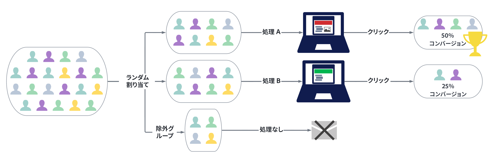

## コンテンツの作成 {#campaign-experiment}

1. まず、メール、SMS またはプッシュ通知を作成して設定します [campaign](../campaigns/create-campaign.md) または [ジャーニー](../building-journeys/journeys-message.md) ご要望に応じて。

   >[!AVAILABILITY]
   >
   >ジャーニーでの実験は、現在、一連の組織でのみ使用できます（使用制限あり）。 アクセスするには、アドビ担当者にお問い合わせください。

1. **[!UICONTROL コンテンツを編集]**&#x200B;ウィンドウから、処理 A のパーソナライズを開始します。

   この処理では、件名に特別なオファーを直接指定し、パーソナライゼーションを加えます。

   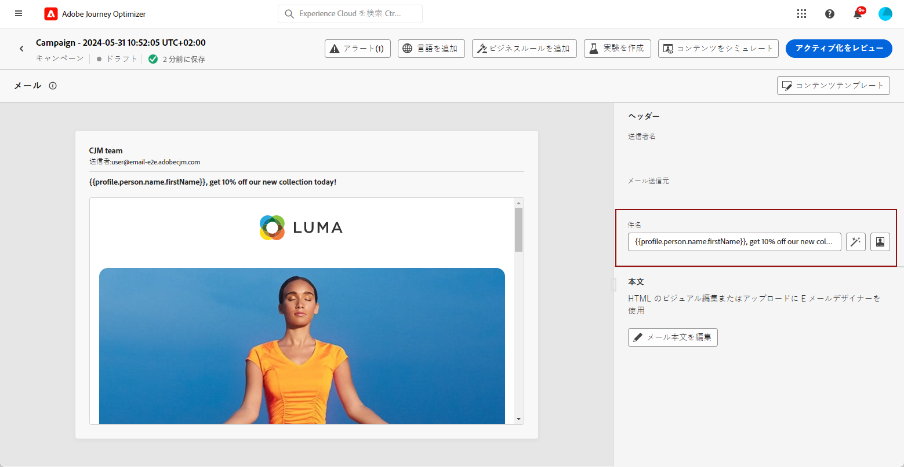

1. 元のコンテンツを作成または読み込み、必要に応じてパーソナライズします。

## コンテンツ実験の設定 {#configure-experiment}

>[!CONTEXTUALHELP]
>id="ajo_campaigns_content_experiment_dimension"
>title="ディメンション"
>abstract="特定のクリック数や、特定のページのビュー数など、実験で追跡する特定のディメンションを選択します。"

>[!CONTEXTUALHELP]
>id="ajo_campaigns_content_experiment_success_metric"
>title="成功指標"
>abstract="成功指標は、実験で最もパフォーマンスの高い処理を追跡および評価するために使用します。使用する前に、特定の指標に合わせてデータセットを設定してください。"

1. メッセージをパーソナライズしたら、キャンペーンの概要ページで「**[!UICONTROL 実験を作成]**」をクリックして、コンテンツ実験の設定を開始します。

   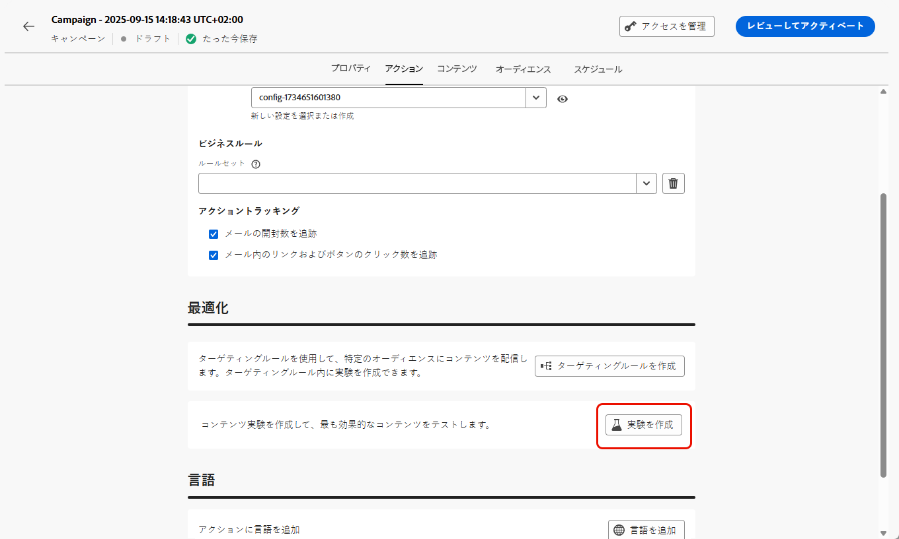

1. 実験に設定する&#x200B;**[!UICONTROL 成功指標]**&#x200B;を選択します。

   この実験では、「**[!UICONTROL メール開封数]**」を選択して、件名にプロモーションコードが含まれている場合にプロファイルがメールを開くかどうかをテストします。

   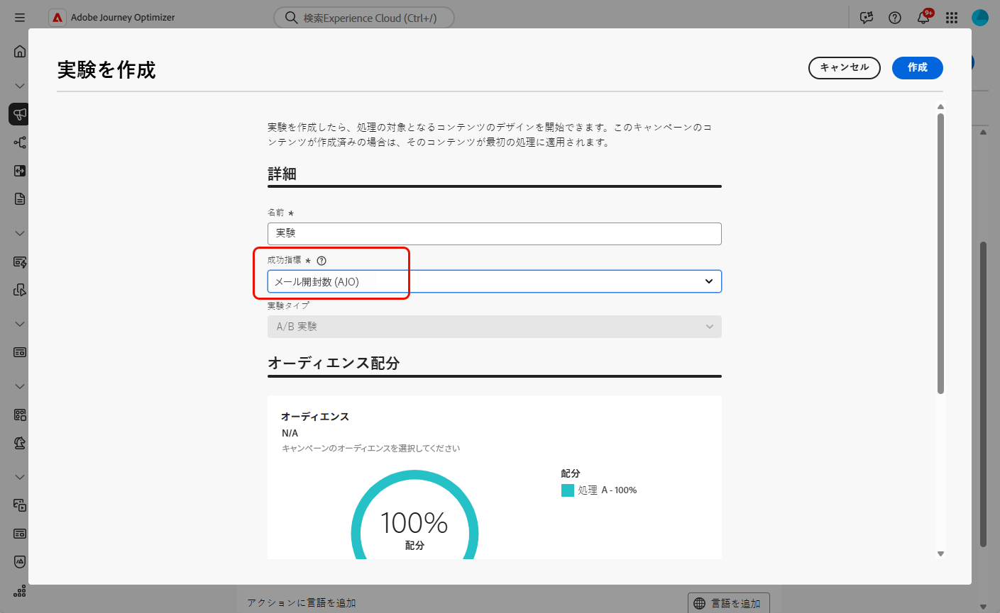

1. アプリ内または web チャネルを使用して実験をセットアップし、「**[!UICONTROL インバウンドクリック数]**」、「**[!UICONTROL ユニークインバウンドクリック数]**」、「**[!UICONTROL ページビュー数]**」、「**[!UICONTROL ユニークページビュー数]**」のいずれかの指標を選択する場合、**[!UICONTROL クリックアクション]**&#x200B;ドロップダウンで、特定のページのクリック数とビュー数を正確に追跡および監視できます。

   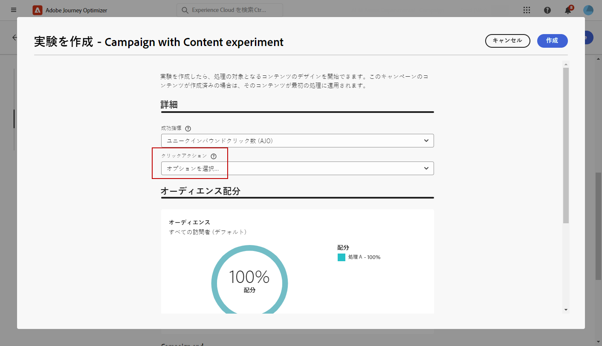

1. 「**[!UICONTROL 処理を追加]**」をクリックして、新しい処理を必要な数だけ作成します。

   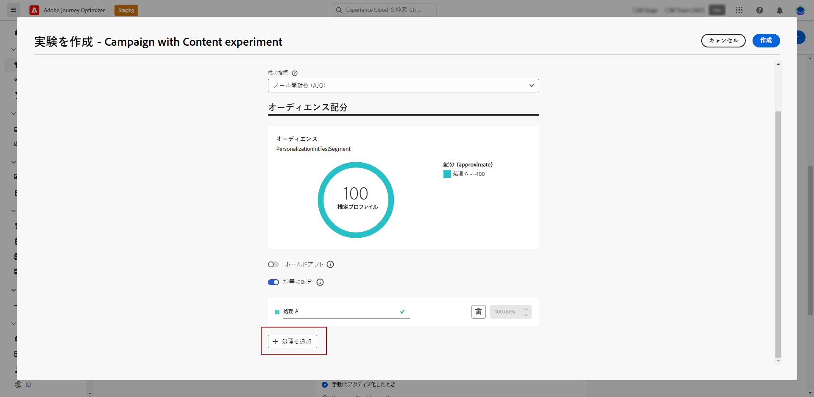

1. 処理の「**[!UICONTROL タイトル]**」を変更して、区別しやすくします。

1. 配信に&#x200B;**[!UICONTROL 除外]**&#x200B;グループを追加することを選択します。このグループは、このキャンペーンからコンテンツを受け取りません。

   切り替えバーをオンにすると、母集団の 10%が自動的に取得されます。必要に応じて、この割合を調整できます。

   >[!IMPORTANT]
   >
   >除外グループがコンテンツ実験のアクションで使用される場合、除外の割り当ては、その特定のアクションにのみ適用されます。 アクションが完了すると、除外グループのプロファイルはジャーニーパスを下って続行し、他のアクションからメッセージを受信できます。 したがって、後続のメッセージが、除外グループに含まれている可能性のあるプロファイルによるメッセージの受信に依存しないようにしてください。 このような場合は、除外する割り当てを削除する必要がある場合があります。

   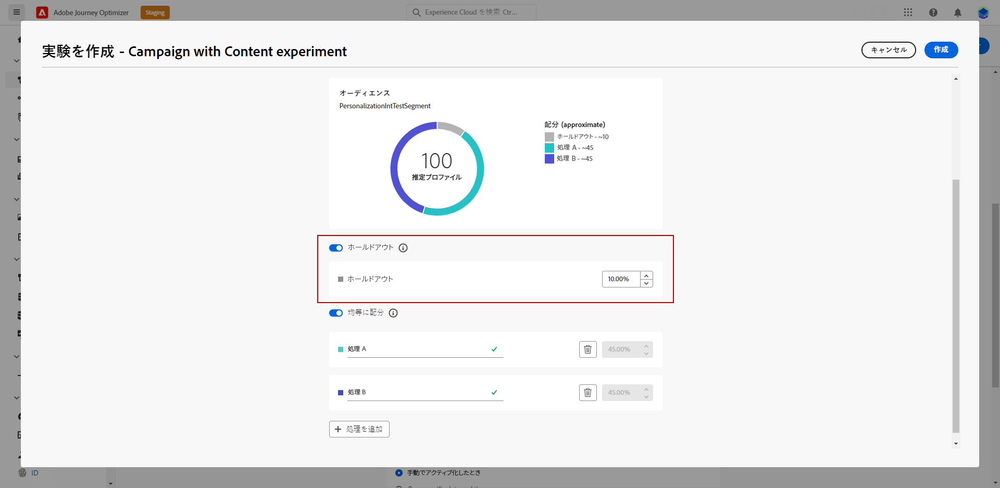

1. その後、各&#x200B;**[!UICONTROL 処理]**&#x200B;に正確な割合を割り当てるか、**[!UICONTROL 等しく分布]**&#x200B;切り替えバーをオンにするかを選択できます。

   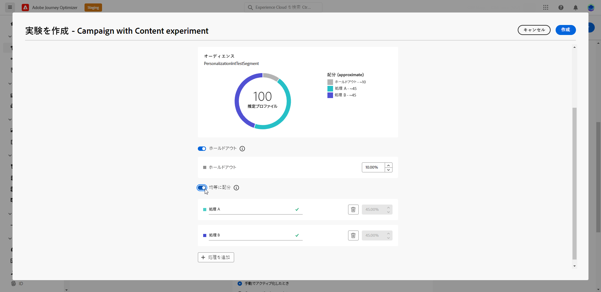

1. 設定が完了したら、「**[!UICONTROL 作成]**」をクリックします。

## 処理の設計 {#treatment-experiment}

1. **[!UICONTROL コンテンツを編集]**&#x200B;ウィンドウで、処理 B を選択してコンテンツを変更します。

   ここでは、「**[!UICONTROL 件名]**」でオファーを指定しないようにします。

   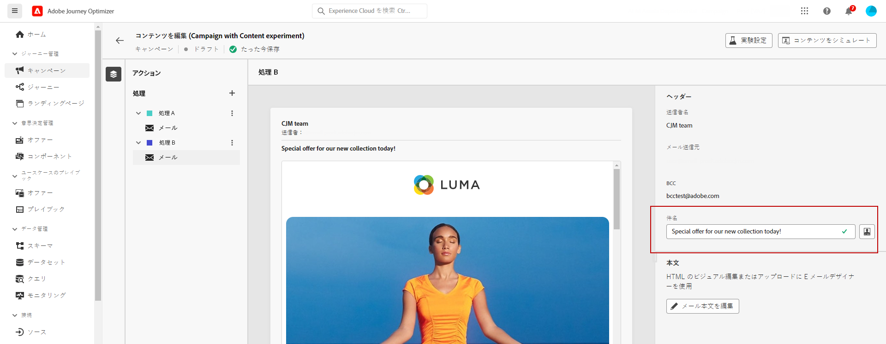

1. 「**[!UICONTROL メール本文を編集]**」をクリックして、処理 B をさらにパーソナライズします。

   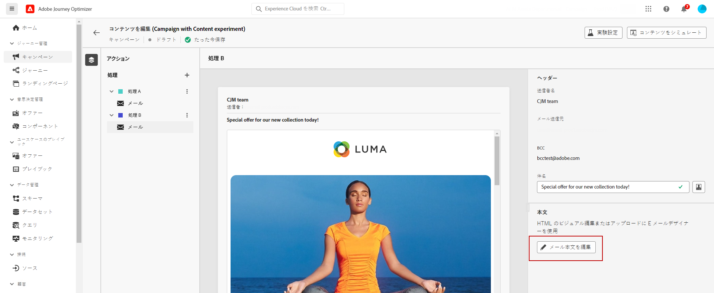

1. 処理を設計したら、「**[!UICONTROL その他のアクション]**」をクリックして、処理に関連するオプション（「**[!UICONTROL 名前変更]**」、「**[!UICONTROL 複製]**」および「**[!UICONTROL 削除]**」）にアクセスします。

   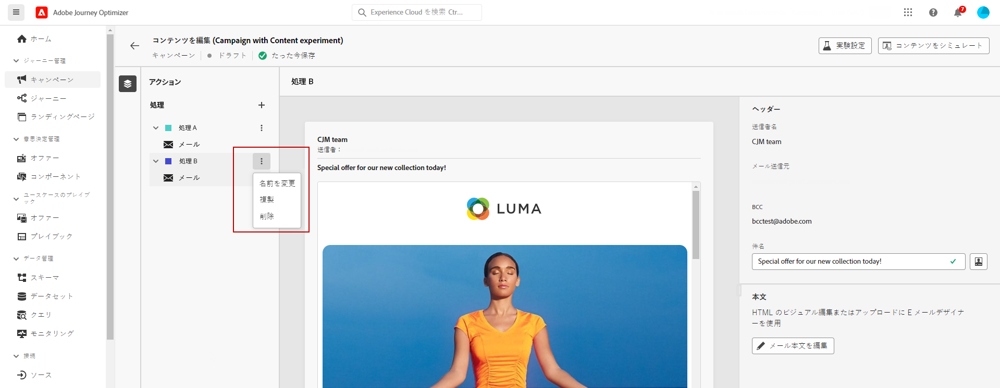

1. 必要に応じて、 **[!UICONTROL 実験の設定]**&#x200B;メニューにアクセスして、処理の設定を変更します。

   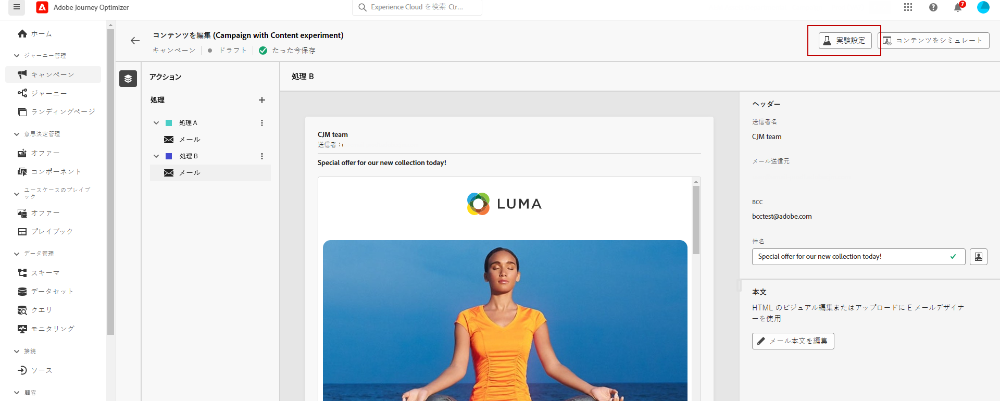

1. メッセージコンテンツを定義したら、「**[!UICONTROL コンテンツをシミュレート]**」ボタンをクリックして配信のレンダリングを制御したり、テストプロファイルでパーソナライズ設定を確認したります。[詳細情報](../content-management/preview-test.md)

実験を設定したら、レポートを使用して、問題なく配信できたかどうかを追跡できます。 [詳細情報](../reports/campaign-global-report.md#experimentation-report)
