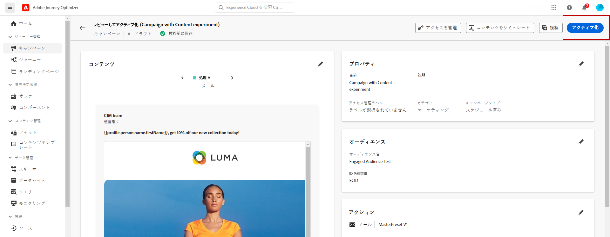
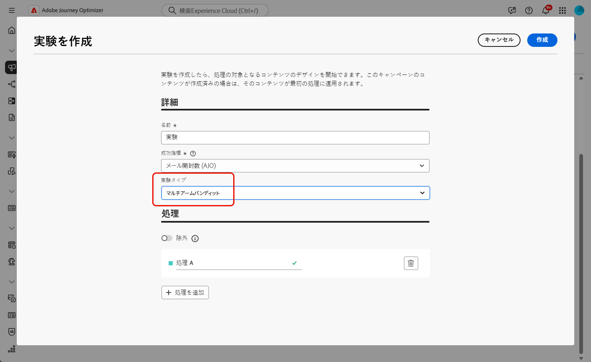
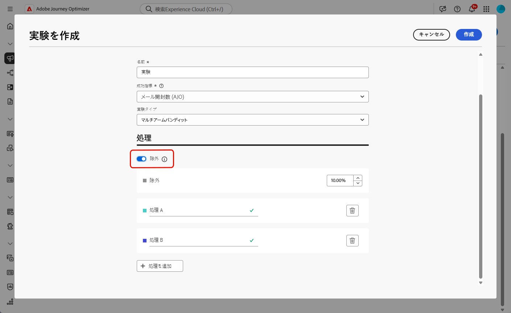
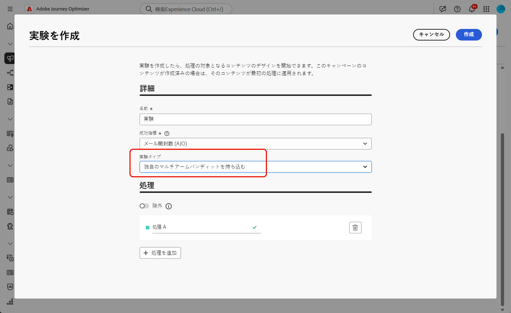
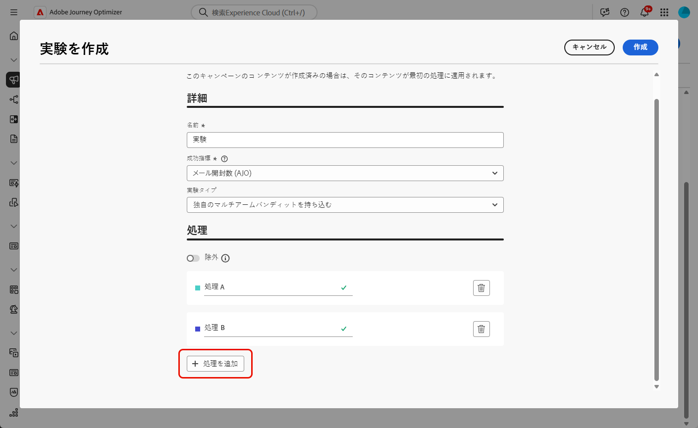
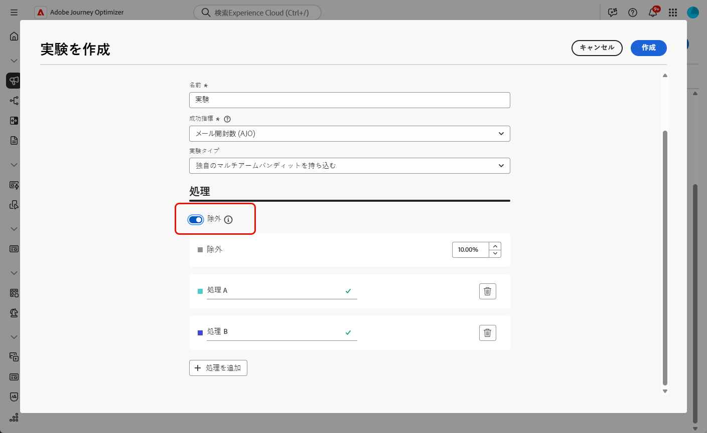
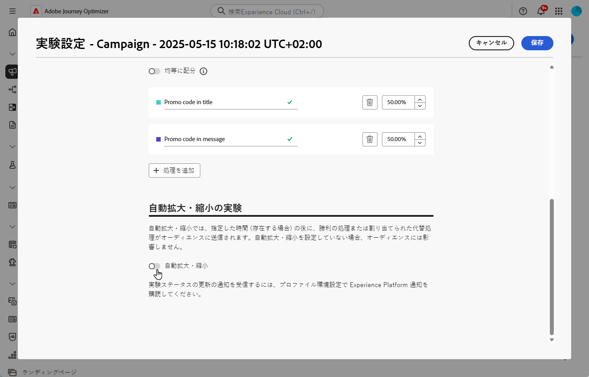
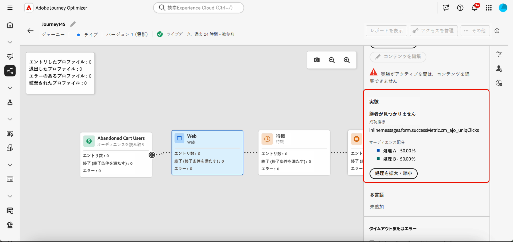
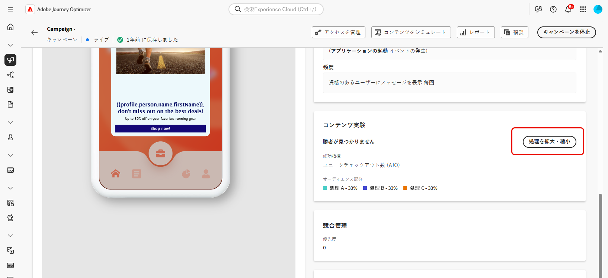
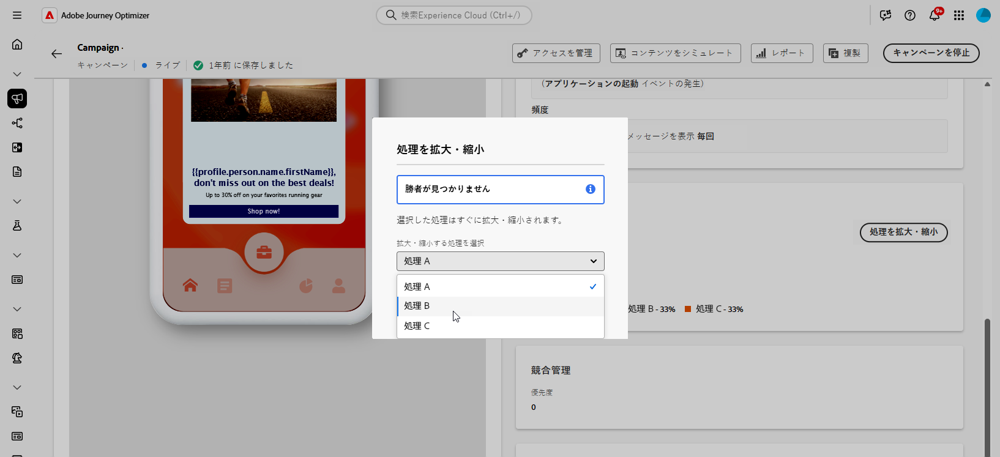

# コンテンツ実験を作成 {#content-experiment}

>[!CONTEXTUALHELP]
>id="ajo_campaigns_content_experiment"
>title="コンテンツ実験"
>abstract="メッセージのコンテンツまたは件名を変更することを選択して、複数の処理を定義してオーディエンスに最適な組み合わせを決定できます。"

>[!NOTE]
>
>コンテンツ実験を開始する前に、レポート設定がカスタムデータセットに対応するよう設定されていることを確認します。詳しくは、[この節](../reports/reporting-configuration.md)を参照してください。

Journey Optimizer のコンテンツ実験を使用すると、複数の配信処理を定義して、ターゲットオーディエンスに最適なパフォーマンスを発揮する配信を測定できます。配信コンテンツまたは件名を変更できます。関心のあるオーディエンスが各処理にランダムに割り当てられて、指定の指標に関して最も効果が高い処理が判断されます。

次の例では、配信ターゲットが 2 つのグループ（それぞれがターゲット母集団の 45％を表す）に分割されています。10％の除外グループは配信を受け取りません。

ターゲットオーディエンスの各ユーザーには、1 つのバージョンのメール（件名は次の 2 つのいずれか）が届きます。

* 1 つは、新しいコレクションと画像に関する 10％のオファーを直接プロモーションするものです。
* もう 1 つは、画像なしで 10％オフを指定せずに、特別なオファーを広告するだけのものです。

ここでの目標は、受信した実験に応じて、受信者がメールとやり取りするかどうかを確認することです。 そのため、このコンテンツ実験の主な目標指標として「**[!UICONTROL メール開封数]**」を選択します。

➡️コンテンツ実験を使用して、コードベースのエクスペリエンスチャネルで決定を比較する方法について詳しくは、[このユースケース](../experience-decisioning/experience-decisioning-uc.md)を参照してください。

## コンテンツの作成 {#campaign-experiment}

1. まず、要件に従って[キャンペーン](../campaigns/create-campaign.md)や[ジャーニー](../building-journeys/journeys-message.md)を作成し、設定します。

1. **[!UICONTROL コンテンツを編集]**&#x200B;ウィンドウから、処理 A のパーソナライズを開始します。

   この処理では、件名に特別なオファーを直接指定し、パーソナライゼーションを加えます。

   

1. 元のコンテンツを作成または読み込み、必要に応じてパーソナライズします。

## コンテンツ実験の設定 {#configure-experiment}

>[!CONTEXTUALHELP]
>id="ajo_campaigns_content_experiment_dimension"
>title="ディメンション"
>abstract="特定のクリック数や、特定のページのビュー数など、実験で追跡する特定のディメンションを選択します。"

>[!CONTEXTUALHELP]
>id="ajo_campaigns_content_experiment_success_metric"
>title="成功指標"
>abstract="成功指標は、実験で最もパフォーマンスの高い処理を追跡および評価するために使用します。使用する前に、特定の指標に合わせてデータセットを設定してください。"

コンテンツ実験では、次の 3 種類の実験から選択できます。

* **[!UICONTROL A/B 実験]**：テストの開始時に、処理間のトラフィック分割を定義します。 パフォーマンスは選択した主要指標に基づいて評価され、Experimentation Acceleratorは処理間の観測された上昇率をレポートします。

* **[!UICONTROL マルチアームバンディット]**：処理間のトラフィック分割は自動的に処理されます。 7 日ごとに、プライマリ指標のパフォーマンスが確認され、それに応じて重み付けが調整されます。 Experimentation Acceleratorのレポートでは、A/B テストとして、引き続き上昇率が表示されます。

* **[!UICONTROL 独自のマルチアームバンディットを用意]**：処理間のトラフィック分割は自動的に処理されます。 Experiment API を使用して割り当てをリアルタイムで調整することで、いつ、どのように変更するかを柔軟に決定できます。

➡️ [A/B 実験とマルチアームバンディット実験の違いの詳細 &#x200B;](mab-vs-ab.md)

>[!BEGINTABS]

>[!TAB A/B 実験 ]

1. メッセージをパーソナライズしたら、「**[!UICONTROL アクション]**」タブで **[!UICONTROL 実験を作成]** をクリックして、コンテンツ実験の設定を開始します。

   

1. 実験に設定する&#x200B;**[!UICONTROL 成功指標]**&#x200B;を選択します。

   この実験では、「**[!UICONTROL メール開封数]**」を選択して、件名にプロモーションコードが含まれている場合にプロファイルがメールを開くかどうかをテストします。

   

1. アプリ内チャネルまたは web チャネルを使用して実験を設定し、**[!UICONTROL インバウンドクリック数]**、**[!UICONTROL ユニークインバウンドクリック数]**、**[!UICONTROL ページビュー数]** または **[!UICONTROL ユニークページビュー数]** の指標を選択する場合、**[!UICONTROL ディメンション]** フィールドを使用すると、特定のページに対するクリック数とビュー数を正確に追跡および監視できます。

   

1. API トリガーキャンペーンを作成した場合は、「**[!UICONTROL 実験タイプ]**」ドロップダウンから **[!UICONTROL A/B 実験]** を選択します。

1. 「**[!UICONTROL 処理を追加]**」をクリックして、新しい処理を必要な数だけ作成します。

   

1. 処理の「**[!UICONTROL タイトル]**」を変更して、区別しやすくします。

1. 配信に&#x200B;**[!UICONTROL 除外]**&#x200B;グループを追加することを選択します。このグループは、このキャンペーンからコンテンツを受け取りません。

   切り替えバーをオンにすると、母集団の 10%が自動的に取得されます。必要に応じて、この割合を調整できます。

   >[!IMPORTANT]
   >
   >コンテンツ実験のアクションで除外グループを使用する場合、除外の割り当ては、その特定のアクションにのみ適用されます。アクションが完了すると、除外グループのプロファイルはジャーニーパスを引き続き移動し、他のアクションからのメッセージを受信できます。したがって、後続のメッセージが、除外グループ内にある可能性のあるプロファイルによるメッセージの受信に依存しないことを確認します。依存する場合は、除外する割り当てを削除する必要がある場合があります。

   

1. その後、各&#x200B;**[!UICONTROL 処理]**&#x200B;に正確な割合を割り当てるか、**[!UICONTROL 等しく分布]**&#x200B;切り替えバーをオンにするかを選択できます。

   

1. 自動スケール実験を有効にすると、実験の勝利バリエーションが自動的にロールアウトされます。[勝者をスケールする方法の詳細情報](#scale-winner)

   

1. 設定が完了したら、「**[!UICONTROL 作成]**」をクリックします。

>[!TAB  マルチアームバンディット ]

マルチアームバンディット実験は、次の場合にのみ使用できます。

* インバウンドチャネル
* 単一ジャーニー
* API トリガーキャンペーン（トランザクションと運用の両方）
* スケジュールが再度発生している場合のアウトバウンドチャネル

1. メッセージをパーソナライズしたら、「**[!UICONTROL アクション]**」タブで **[!UICONTROL 実験を作成]** をクリックして、コンテンツ実験の設定を開始します。

   

1. 実験に設定する&#x200B;**[!UICONTROL 成功指標]**&#x200B;を選択します。

   この実験では、「**[!UICONTROL メール開封数]**」を選択して、件名にプロモーションコードが含まれている場合にプロファイルがメールを開くかどうかをテストします。

   

1. API トリガーキャンペーンを作成した場合は、「**[!UICONTROL 実験タイプ]**」ドロップダウンから **[!UICONTROL マルチアームバンディット]** を選択します。

   

1. 「**[!UICONTROL 処理を追加]**」をクリックして、新しい処理を必要な数だけ作成します。

   

1. 処理の「**[!UICONTROL タイトル]**」を変更して、区別しやすくします。

1. 配信に&#x200B;**[!UICONTROL 除外]**&#x200B;グループを追加することを選択します。このグループは、このキャンペーンからコンテンツを受け取りません。

   切り替えバーをオンにすると、母集団の 10%が自動的に取得されます。必要に応じて、この割合を調整できます。

   >[!IMPORTANT]
   >
   >コンテンツ実験のアクションで除外グループを使用する場合、除外の割り当ては、その特定のアクションにのみ適用されます。アクションが完了すると、除外グループのプロファイルはジャーニーパスを引き続き移動し、他のアクションからのメッセージを受信できます。したがって、後続のメッセージが、除外グループ内にある可能性のあるプロファイルによるメッセージの受信に依存しないことを確認します。依存する場合は、除外する割り当てを削除する必要がある場合があります。

   

>[!TAB  マルチアームバンディットを持ち込む ]

独自のマルチアームバンディット実験は、次の場合にのみ使用できます。

* インバウンドチャネル
* 単一ジャーニー
* API トリガーキャンペーン（トランザクションと運用の両方）
* スケジュールが再度発生している場合のアウトバウンドチャネル

1. メッセージをパーソナライズしたら、「**[!UICONTROL アクション]**」タブで **[!UICONTROL 実験を作成]** をクリックして、コンテンツ実験の設定を開始します。

   

1. 実験に設定する&#x200B;**[!UICONTROL 成功指標]**&#x200B;を選択します。

   この実験では、「**[!UICONTROL メール開封数]**」を選択して、件名にプロモーションコードが含まれている場合にプロファイルがメールを開くかどうかをテストします。

   

1. API トリガーキャンペーンを作成した場合は、「**[!UICONTROL 実験タイプ]**」ドロップダウンから「**[!UICONTROL 独自のマルチアームバンディットを用意]**」を選択します。

   

1. 「**[!UICONTROL 処理を追加]**」をクリックして、新しい処理を必要な数だけ作成します。

   

1. 処理の「**[!UICONTROL タイトル]**」を変更して、区別しやすくします。

1. 配信に&#x200B;**[!UICONTROL 除外]**&#x200B;グループを追加することを選択します。このグループは、このキャンペーンからコンテンツを受け取りません。

   切り替えバーをオンにすると、母集団の 10%が自動的に取得されます。必要に応じて、この割合を調整できます。

   >[!IMPORTANT]
   >
   >コンテンツ実験のアクションで除外グループを使用する場合、除外の割り当ては、その特定のアクションにのみ適用されます。アクションが完了すると、除外グループのプロファイルはジャーニーパスを引き続き移動し、他のアクションからのメッセージを受信できます。したがって、後続のメッセージが、除外グループ内にある可能性のあるプロファイルによるメッセージの受信に依存しないことを確認します。依存する場合は、除外する割り当てを削除する必要がある場合があります。

   

>[!ENDTABS]

## 処理の設計 {#treatment-experiment}

1. **[!UICONTROL コンテンツを編集]**&#x200B;ウィンドウで、処理 B を選択してコンテンツを変更します。

   ここでは、「**[!UICONTROL 件名]**」でオファーを指定しないようにします。

   

1. 「**[!UICONTROL メール本文を編集]**」をクリックして、処理 B をさらにパーソナライズします。

   

1. 処理を設計したら、「**[!UICONTROL その他のアクション]**」をクリックして、処理に関連するオプション（「**[!UICONTROL 名前変更]**」、「**[!UICONTROL 複製]**」および「**[!UICONTROL 削除]**」）にアクセスします。

   

1. 必要に応じて、 **[!UICONTROL 実験の設定]**&#x200B;メニューにアクセスして、処理の設定を変更します。

   

1. メッセージコンテンツを定義したら、「**[!UICONTROL コンテンツをシミュレート]**」ボタンをクリックして配信のレンダリングを制御したり、テストプロファイルでパーソナライズ設定を確認したります。[詳細情報](../content-management/preview-test.md)

実験を設定したら、レポートを使用して、問題なく配信できたかどうかを追跡できます。[詳細情報](../reports/campaign-global-report-cja-experimentation.md)

## 勝者をスケール {#scale-winner}

>[!AVAILABILITY]
>
>「勝者をスケール」機能は現在、次のチャネルでサポートされています。
>
>* 任意のジャーニーやキャンペーンのインバウンドチャネル（例：web、アプリ内メッセージ、コードベースのエクスペリエンス）。
>* API トリガー済みトランザクションキャンペーンのアウトバウンドチャネル（例：メール、プッシュ通知、SMS）。

「勝者をスケール」を使用すると、実験の勝利バリエーションをすべてのオーディエンスに自動または手動でロールアウトできます。この機能により、勝者が決定したら、実験を常に監視することなく、そのリーチと効果を増幅できます。

次の 2 つのモードから選択できます。

* **自動スケーリング**：実験を作成する際に、勝利の処理をスケーリングするタイミングと条件、または勝者が現れない場合はフォールバックオプションを選択して、自動スケーリング設定を指定します。

* **手動スケーリング**：実験結果を手動で確認し、タイミングと決定を完全に制御しながら、勝利の処理のロールアウトを開始します。

### 自動スケーリング {#autoscaling}

自動スケーリングを使用すると、実験の結果に基づいて、勝利の処理またはフォールバックをロールアウトするタイミングについて、定義済みルールを設定できます。

自動スケーリングが行われると、手動スケーリングは使用できなくなります。

実験の自動スケールを有効にするには：

1. キャンペーンまたはジャーニーを設定し、必要に応じて実験を設定します。[詳細情報](#configure-experiment)

1. 実験を設定する際は、自動スケールオプションを有効にします。

   

1. 勝者のスケールを設定するタイミングを以下から選択します。

   * 勝者が見つかったらすぐに。
   * 選択した時間に実験がライブになった後。

自動スケール時間は、実験の終了日より前にスケジュールする必要があります。終了日以降の時間に設定すると、検証警告が表示され、キャンペーンまたはジャーニーは公開されません。

    ![] （assets/scale-winner-2.png） 

1. スケール時間で勝者が見つからない場合のフォールバック動作を以下から選択します。

   * スケジュールどおりに終了するまで引き続き実験する。
   * 指定した時間の経過後に代替処理をスケーリングする。

すべてのパラメーターが満たされると、勝利の処理または代替処理がオーディエンスに送信されます。

### 手動スケーリング {#manual-scaling}

手動スケーリングでは、実験結果を確認し、勝利の処理を独自のスケジュールで展開するタイミングを決定できます。

スケジュールされた自動拡大時間の前に勝者を手動でスケーリングすると、自動スケールはキャンセルされます。

実験の勝者を手動でスケーリングするには：

1. キャンペーンまたはジャーニーを設定し、必要に応じて実験を設定します。[詳細情報](#configure-experiment)

1. 勝者が特定されるか、統計的優位差が達成されるまで、実験を実行します。

1. キャンペーンダッシュボードを開くか、ジャーニーのチャネルアクティビティを選択します。

   **[!UICONTROL コンテンツ実験]**&#x200B;メニューで結果を確認し、最もパフォーマンスの高い処理を特定します。

   

1. 「**[!UICONTROL 処理をスケール]**」をクリックして、勝利の処理を残りのオーディエンスにプッシュします。

   

1. ドロップダウンメニューから拡大する処理を選択し、「**[!UICONTROL スケール]**」をクリックします。

   

処理のスケーリングには最大 1 時間かかる場合があります。手動スケーリングプロセスが完了すると、通知が届きます。

