# コンテンツ実験を作成 {#content-experiment}

>[!CONTEXTUALHELP]
>id="ajo_campaigns_content_experiment"
>title="コンテンツ実験"
>abstract="複数の処理を定義し、オーディエンスに最適な組み合わせを決定するために、メッセージの内容や件名を変更することを選択できます。"

>[!NOTE]
>
>コンテンツ実験を開始する前に、レポート設定がカスタムデータセットに設定されていることを確認してください。 詳しくは、[このセクション &#x200B;](../reports/reporting-configuration.md)を参照してください。

Journey Optimizer Content Experimentでは、複数の配信処理を定義して、どの配信処理がターゲットオーディエンスに対して最も効果的かを測定できます。 配信コンテンツや件名を変更できます。 関心のあるオーディエンスは、各処理にランダムに割り当てられ、指定された指標の観点からどの処理が最も効果的かを判断します。

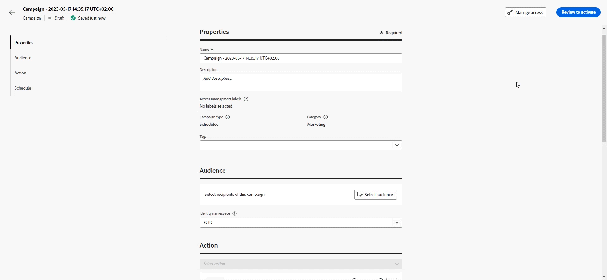

次の例では、配信ターゲットは、それぞれターゲット母集団の45%を表す2つのグループと、配信を受け取らない10%のホールドアウトグループに分割されています。

ターゲットオーディエンスの各人物は、件名が次のふたつのうちの1つである、1つのバージョンのメールを受け取ります。

* 1つは、新しいコレクションと画像で10% オファーを直接宣伝するものです。
* もう1つは、画像なしで10% オフを指定せずに特別なオファーのみを広告するものです。

ここでの目的は、受信した実験に応じて、受信者がメールを操作するかどうかを確認することです。 したがって、このコンテンツ実験の主な目標指標として&#x200B;**[!UICONTROL 電子メール開封数]**&#x200B;を選択します。

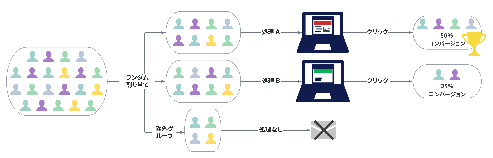

➡️ コンテンツ実験を使用して決定をコードベースのエクスペリエンスチャネルと比較する方法を、[このユースケース &#x200B;](../experience-decisioning/experience-decisioning-uc.md)で説明します。

## コンテンツの制作 {#campaign-experiment}

1. まず、要件に応じて[&#x200B; キャンペーン &#x200B;](../campaigns/create-campaign.md)または[&#x200B; ジャーニー](../building-journeys/journey-action.md)を作成して設定します。

1. **[!UICONTROL コンテンツを編集]** ウィンドウから、処理のパーソナライズを開始しますA.

   この処理では、件名に特別なオファーを直接指定し、パーソナライズを追加します。

   

1. 元のコンテンツを作成またはインポートし、必要に応じてパーソナライズできます。

## コンテンツ実験の設定 {#configure-experiment}

>[!CONTEXTUALHELP]
>id="ajo_campaigns_content_experiment_dimension"
>title="Dimension"
>abstract="特定のクリックや特定のページの表示など、実験のために追跡する特定のディメンションを選択します。"

>[!CONTEXTUALHELP]
>id="ajo_campaigns_content_experiment_success_metric"
>title="成功指標"
>abstract="成功指標は、実験で最もパフォーマンスの高い処理を追跡および評価するために使用されます。 特定の指標を使用する前に、必ずデータセットを設定してください。"

>[!AVAILABILITY]
>
>ダイレクトメールはホールドアウト機能をサポートしていますが、現在は処理をサポートしていません。

コンテンツ実験の場合は、次の3つのタイプから選択できます。

* **[!UICONTROL A/B実験]**: テスト開始時の処理間のトラフィック分割を定義します。 パフォーマンスは、選択した主要指標であるExperimentation Acceleratorに基づいて評価され、観察された処理間の上昇率を報告します。

* **[!UICONTROL マルチアームドバンディット]**：処理間のトラフィックの分割は自動的に処理されます。 7日ごとに、主要指標のパフォーマンスがレビューされ、それに応じて重みが調整されます。 Experimentation Acceleratorのレポートでは、A/B テストとして「上昇率」が引き続き表示されています。

* **[!UICONTROL 自分のマルチアームドバンディットを持ち込む]**：処理間のトラフィックの分割は自動的に処理されます。 Experiment APIを使用して割り当てをリアルタイムで調整することで、いつ、どのように変更すべきかを柔軟に判断できます。

➡️ [A/B実験とマルチアームドバンディット実験の違いに関する詳細情報](mab-vs-ab.md)

>[!BEGINTABS]

>[!TAB A/B実験]

1. メッセージがパーソナライズされたら、「**[!UICONTROL アクション]**」タブで「**[!UICONTROL 実験を作成]**」をクリックして、コンテンツ実験の設定を開始します。

   

1. 実験に設定する&#x200B;**[!UICONTROL 成功指標]**&#x200B;を選択します。

   この例では、**[!UICONTROL Email open]**&#x200B;を選択して、プロモーションコードが件名にある場合にプロファイルがメールを開くかどうかをテストします。

   

1. アプリ内またはWeb チャネルを使用して実験を設定し、**[!UICONTROL インバウンドクリック]**、**[!UICONTROL ユニークインバウンドクリック]**、**[!UICONTROL ページビュー]**、または&#x200B;**[!UICONTROL ユニークページビュー指標]**&#x200B;を選択すると、**[!UICONTROL ディメンション]** フィールドを使用して、特定のページでのクリックとビューを正確に追跡および監視できます。

   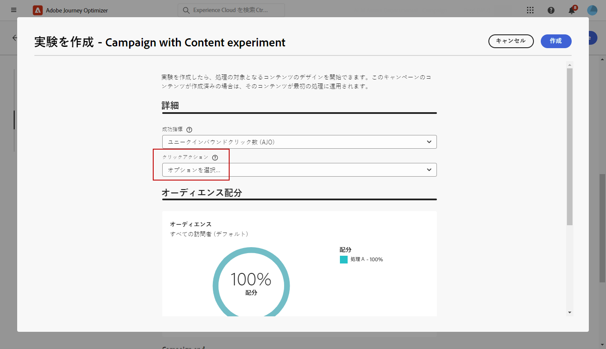

1. API トリガーのキャンペーンを作成した場合は、**[!UICONTROL 実験タイプ]** ドロップダウンから&#x200B;**[!UICONTROL A/B実験]**&#x200B;を選択します。

1. 「**[!UICONTROL 処理を追加]**」をクリックして、必要な数だけ新しい処理を作成します。

   

   >[!CAUTION]
   >
   >コードベースの実験を作成する場合は、次の制限事項に注意してください。
   >* **処理回数**:3 ～ 5回以上の処理を作成すると、パフォーマンスとインターフェイスの問題が発生する可能性があります。 処理を追加する際にエラーが発生した場合は、処理の数を減らすか、問題が解決されるまで段階的に追加してみてください。
   >* **予約済みキーワード**：決定ノードマッピングエラーを引き起こし、実験が正しく機能しない可能性があるため、治療名に「holdout」などの予約済みキーワードを使用しないでください。

1. 処理の&#x200B;**[!UICONTROL タイトル]**&#x200B;を変更して、より区別しやすくします。

1. 配信に&#x200B;**[!UICONTROL Holdout]** グループを追加することを選択します。 このグループはこのキャンペーンからコンテンツを受け取りません。

   トグルバーをオンにすると、母集団の10%が自動的に使用されるので、必要に応じてこの割合を調整できます。

   >[!IMPORTANT]
   >
   >コンテンツ実験のアクションでホールドアウトグループを使用する場合、ホールドアウト割り当てはその特定のアクションにのみ適用されます。 アクションが完了すると、ホールドアウトグループ内のプロファイルはジャーニーパスを続行し、他のアクションからメッセージを受信できます。 したがって、後続のメッセージが、ホールドアウトグループに含まれる可能性のあるプロファイルによるメッセージの受信に依存していないことを確認してください。 そのような場合は、ホールドアウトの割り当てを削除する必要があるかもしれません。

   

1. その後、各&#x200B;**[!UICONTROL 処理]**&#x200B;に正確な割合を割り当てるか、**[!UICONTROL 均等に分布]**&#x200B;の切り替えバーをオンにするかを選択できます。

   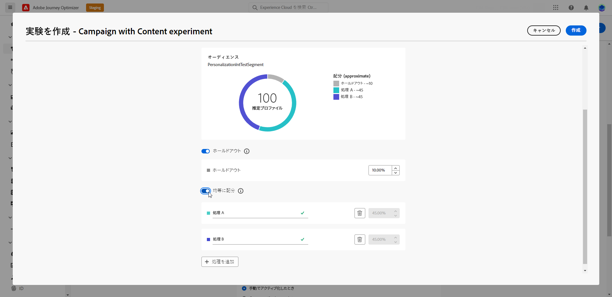

1. 自動スケール実験を有効にして、実験の勝者バリエーションを自動的にロールアウトします。 [勝者を拡大する方法について詳しく見る](#scale-winner)

   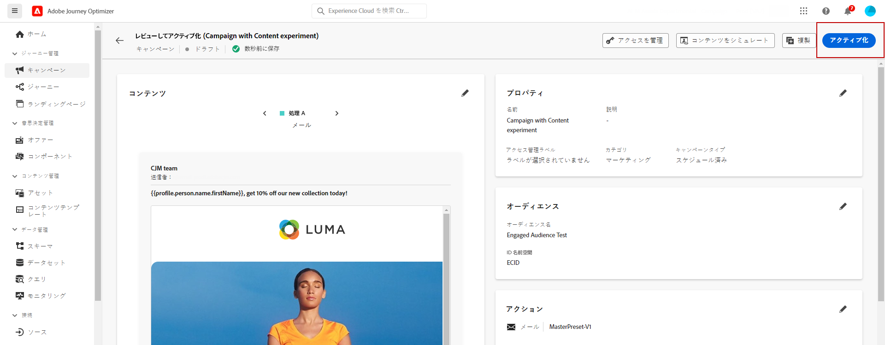

1. 設定が設定されたら、**[!UICONTROL 作成]**&#x200B;をクリックします。

>[!TAB  マルチアームドバンディット ]

マルチアームドバンディット実験は次の条件でのみ利用できます。

* インバウンドチャネル
* 単一ジャーニー
* API トリガーキャンペーン（トランザクションキャンペーンとオペレーショナルキャンペーンの両方）
* スケジュールが繰り返し発生している場合の送信チャネル

1. メッセージがパーソナライズされたら、「**[!UICONTROL アクション]**」タブで「**[!UICONTROL 実験を作成]**」をクリックして、コンテンツ実験の設定を開始します。

   

1. 実験に設定する&#x200B;**[!UICONTROL 成功指標]**&#x200B;を選択します。

   この例では、**[!UICONTROL Email open]**&#x200B;を選択して、プロモーションコードが件名にある場合にプロファイルがメールを開くかどうかをテストします。

   

1. API トリガーのキャンペーンを作成した場合は、**[!UICONTROL 実験タイプ]** ドロップダウンから&#x200B;**[!UICONTROL マルチアームドバンディット]**&#x200B;を選択します。

   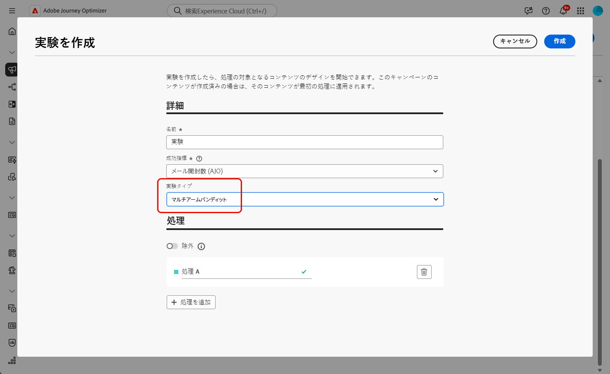

1. 「**[!UICONTROL 処理を追加]**」をクリックして、必要な数だけ新しい処理を作成します。

   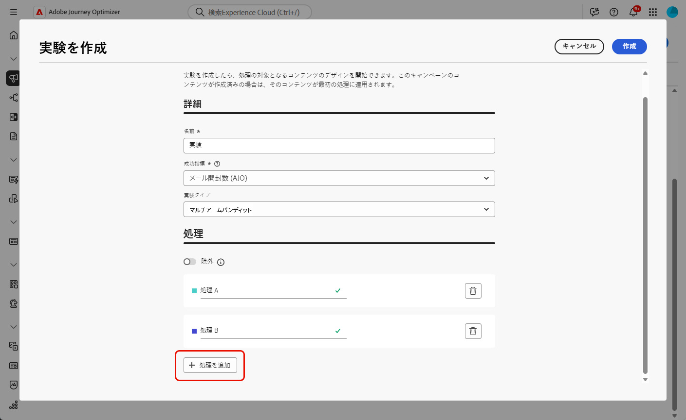

1. 処理の&#x200B;**[!UICONTROL タイトル]**&#x200B;を変更して、より区別しやすくします。

1. 配信に&#x200B;**[!UICONTROL Holdout]** グループを追加することを選択します。 このグループはこのキャンペーンからコンテンツを受け取りません。

   トグルバーをオンにすると、母集団の10%が自動的に使用されるので、必要に応じてこの割合を調整できます。

   >[!IMPORTANT]
   >
   >コンテンツ実験のアクションでホールドアウトグループを使用する場合、ホールドアウト割り当てはその特定のアクションにのみ適用されます。 アクションが完了すると、ホールドアウトグループ内のプロファイルはジャーニーパスを続行し、他のアクションからメッセージを受信できます。 したがって、後続のメッセージが、ホールドアウトグループに含まれる可能性のあるプロファイルによるメッセージの受信に依存していないことを確認してください。 そのような場合は、ホールドアウトの割り当てを削除する必要があるかもしれません。

   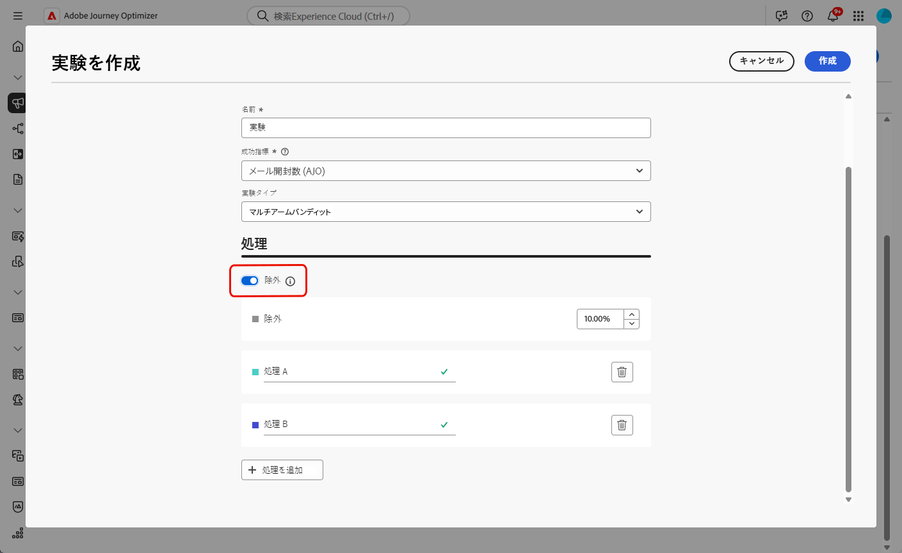

>[!TAB 自分のマルチアームドバンディットを持ち込む]

マルチアームドバンディット実験を自分で行うことは、次の条件でのみ可能です。

* インバウンドチャネル
* 単一ジャーニー
* API トリガーキャンペーン（トランザクションキャンペーンとオペレーショナルキャンペーンの両方）
* スケジュールが繰り返し発生している場合の送信チャネル

1. メッセージがパーソナライズされたら、「**[!UICONTROL アクション]**」タブで「**[!UICONTROL 実験を作成]**」をクリックして、コンテンツ実験の設定を開始します。

   

1. 実験に設定する&#x200B;**[!UICONTROL 成功指標]**&#x200B;を選択します。

   この例では、**[!UICONTROL Email open]**&#x200B;を選択して、プロモーションコードが件名にある場合にプロファイルがメールを開くかどうかをテストします。

   

1. API トリガーのキャンペーンを作成した場合は、**[!UICONTROL 実験タイプ]** ドロップダウンから&#x200B;**[!UICONTROL 自分のマルチアームドバンディットを取り込む]**&#x200B;を選択します。

   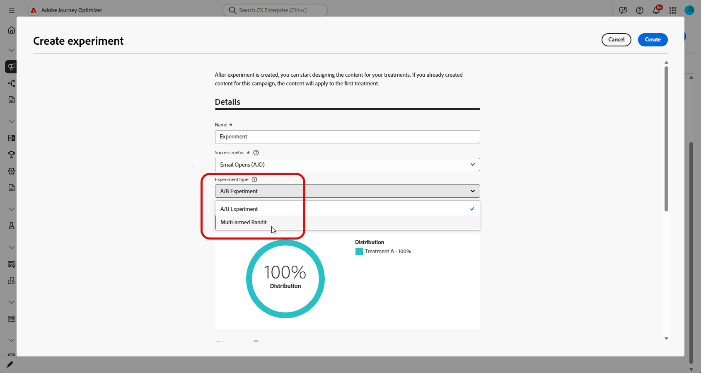

1. 「**[!UICONTROL 処理を追加]**」をクリックして、必要な数だけ新しい処理を作成します。

   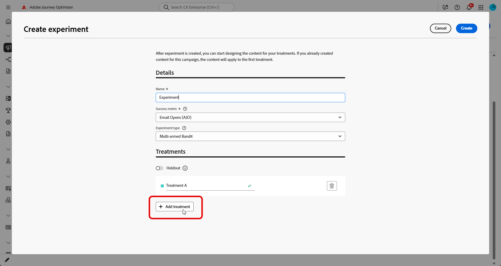

1. 処理の&#x200B;**[!UICONTROL タイトル]**&#x200B;を変更して、より区別しやすくします。

1. 配信に&#x200B;**[!UICONTROL Holdout]** グループを追加することを選択します。 このグループはこのキャンペーンからコンテンツを受け取りません。

   トグルバーをオンにすると、母集団の10%が自動的に使用されるので、必要に応じてこの割合を調整できます。

   >[!IMPORTANT]
   >
   >コンテンツ実験のアクションでホールドアウトグループを使用する場合、ホールドアウト割り当てはその特定のアクションにのみ適用されます。 アクションが完了すると、ホールドアウトグループ内のプロファイルはジャーニーパスを続行し、他のアクションからメッセージを受信できます。 したがって、後続のメッセージが、ホールドアウトグループに含まれる可能性のあるプロファイルによるメッセージの受信に依存していないことを確認してください。 そのような場合は、ホールドアウトの割り当てを削除する必要があるかもしれません。

   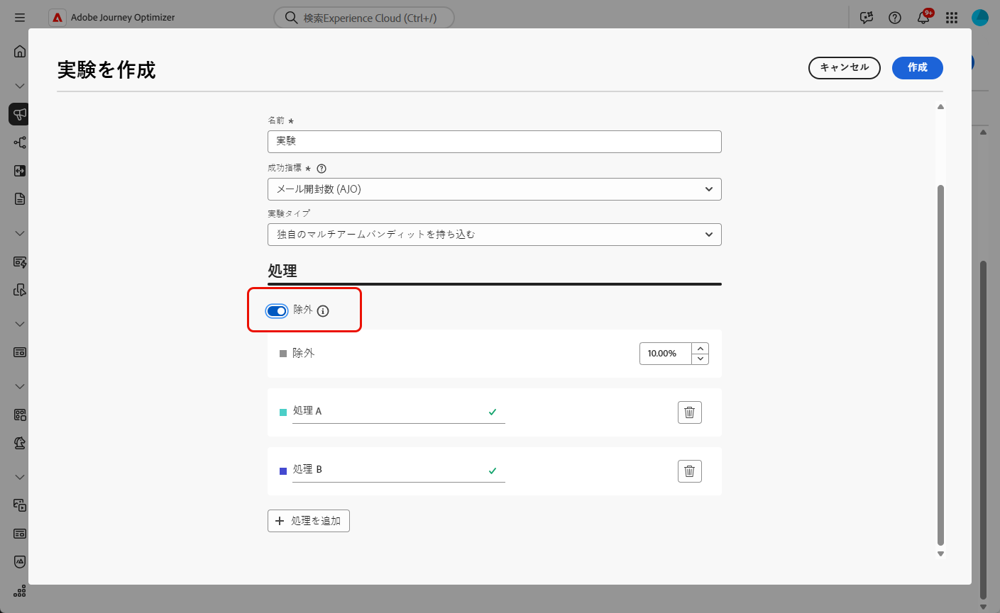

>[!ENDTABS]

## 処理の設計 {#treatment-experiment}

1. 「**[!UICONTROL コンテンツを編集]**」ウィンドウで、処理Bを選択してコンテンツを変更します。

   ここでは、**[!UICONTROL 件名]**&#x200B;でオファーを指定しないことを選択します。

   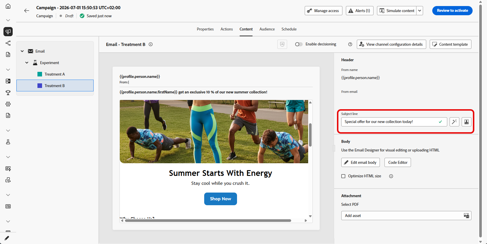

1. 「**[!UICONTROL メール本文を編集]**」をクリックして、処理をさらにパーソナライズします。

   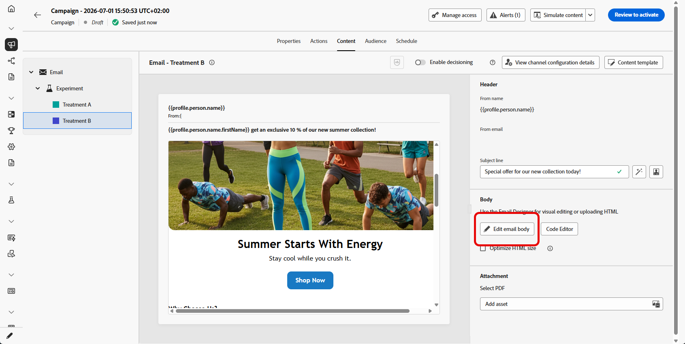

1. 処理をデザインしたら、**[!UICONTROL その他のアクション]**&#x200B;をクリックして、処理に関連するオプションにアクセスします。**[!UICONTROL 名前変更]**、**[!UICONTROL 重複]**、**[!UICONTROL 削除]**。

   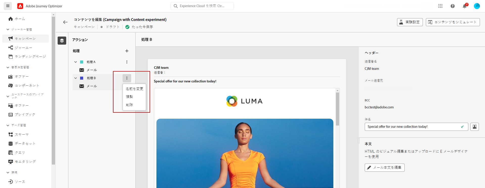

1. 必要に応じて、**[!UICONTROL 実験の設定]** メニューにアクセスして、処理の設定を変更します。

   

1. メッセージコンテンツを定義したら、「**[!UICONTROL コンテンツをシミュレート]**」ボタンをクリックして、配信のレンダリングを制御し、テストプロファイルでパーソナライゼーション設定を確認します。 [詳細情報](../content-management/preview-test.md)

テストの設定が完了したら、レポートを使用して配信の成功を追跡できます。 [詳細情報](../reports/campaign-global-report-cja-experimentation.md)

## 勝者を拡大 {#scale-winner}

>[!AVAILABILITY]
>
>「勝者を拡大・縮小」機能は、現在、次のチャネルでサポートされています。
>
>* あらゆるジャーニーやキャンペーンのインバウンドチャネル（例：web、アプリ内メッセージ、コードベースのエクスペリエンス）
>* API トリガーによるトランザクションキャンペーンのアウトバウンドチャネル（電子メール、プッシュ通知、SMSなど）。

Scale the Winnerを使用すると、テストの勝者バリエーションをオーディエンス全体に自動的または手動でロールアウトできます。 この機能により、勝者を決定した後は、実験を常に監視することなく、そのリーチと効果を拡大することができます。

次の2つのモードから選択できます。

* **自動スケーリング**：勝者が表示されない場合は、勝者の処理またはフォールバックオプションをスケーリングするタイミングと条件を選択して、テストを作成するときに自動スケーリング設定を設定します。

* **手動スケーリング**：実験結果を手動で確認し、勝者の処理のロールアウトを開始して、タイミングと決定を完全に制御します。

### 自動スケーリング {#autoscaling}

自動スケーリングでは、実験の結果に基づいて、勝者の処理またはフォールバックをロールアウトするタイミングに関する定義済みのルールを設定できます。

自動スケーリングが実行されると、手動スケーリングは使用できなくなります。

実験の自動拡大・縮小を有効にするには：

1. キャンペーンやジャーニーを設定し、必要に応じてテストを設定します。 [詳細情報](#configure-experiment)

1. 実験の設定時に自動スケーリングオプションを有効にします。

   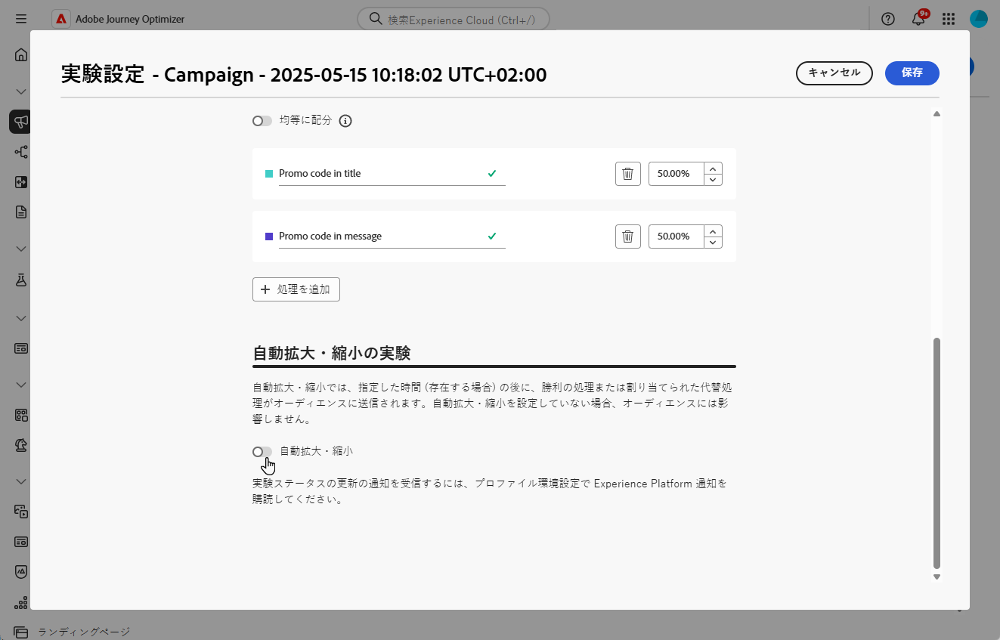

1. 勝者を拡大・縮小するタイミングを選択します。

   * 勝者が見つかるとすぐに。
   * 選択した時間の実験が開始された後。

   自動スケール時間は、実験の終了日より前にスケジュールする必要があります。 終了日の後の時間に設定されている場合、検証警告が表示され、キャンペーンまたはジャーニーは公開されません。

   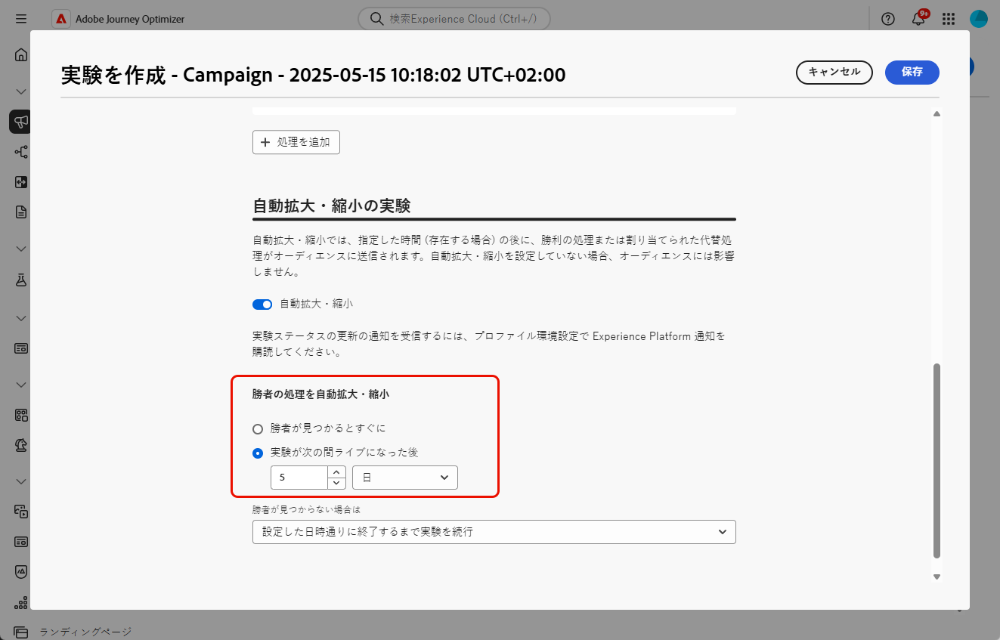

1. スケールタイムで勝者が見つからない場合は、フォールバック動作を選択します。

   * 実験は予定どおりに終わりまで続けてください。
   * 指定した時間が経過した後に代替処理を拡大します。

すべてのパラメーターが満たされると、勝者または代替処理がオーディエンスに送信されます。

### 手動スケーリング {#manual-scaling}

手動スケーリングでは、実験結果を確認し、自分のスケジュールで勝者の処理を実行するタイミングを決定できます。

スケジュールされた自動スケール時間の前に勝者を手動でスケールすると、自動スケールはキャンセルされます。

実験の勝者を手動で拡大/縮小するには：

1. キャンペーンやジャーニーを設定し、必要に応じてテストを設定します。 [詳細情報](#configure-experiment)

1. 勝者が特定されるか、統計的有意性が達成されるまで、実験を実行します。

1. キャンペーンダッシュボードを開くか、ジャーニーのチャネルアクティビティを選択します。

   **[!UICONTROL コンテンツ実験]** メニューの結果を確認して、最もパフォーマンスの高い処理を特定します。

   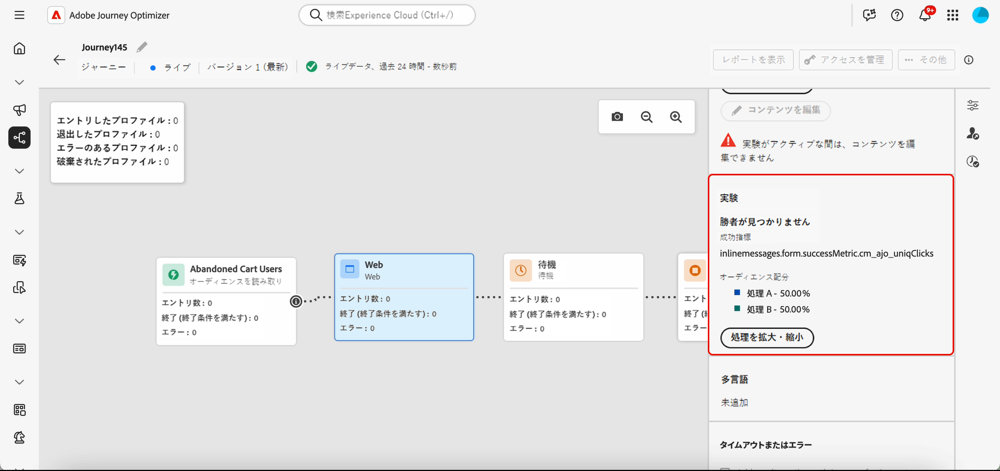

1. 「**[!UICONTROL 処理を拡大]**」をクリックして、勝者の処理を他のオーディエンスにプッシュします。

   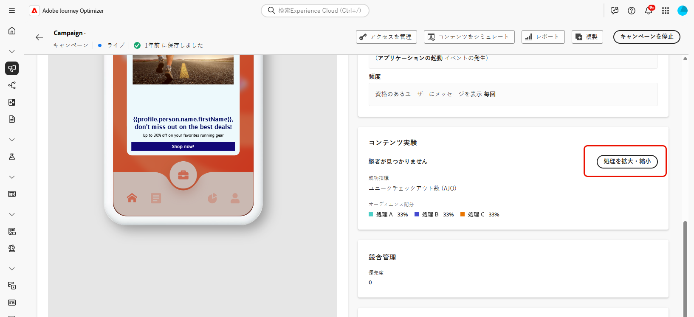

1. ドロップダウンメニューから拡大/縮小する処理を選択し、**[!UICONTROL 拡大/縮小]**&#x200B;をクリックします。

   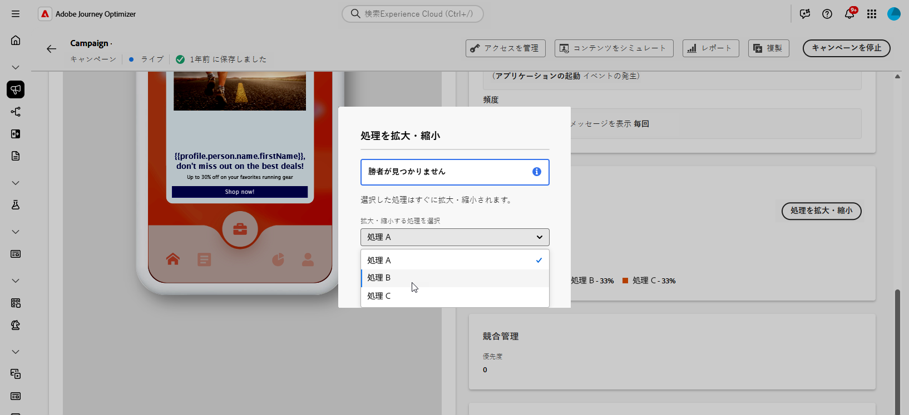

処理の拡張には最大1時間かかる場合があります。 手動による拡大縮小プロセスが終了すると、通知が届きます。

