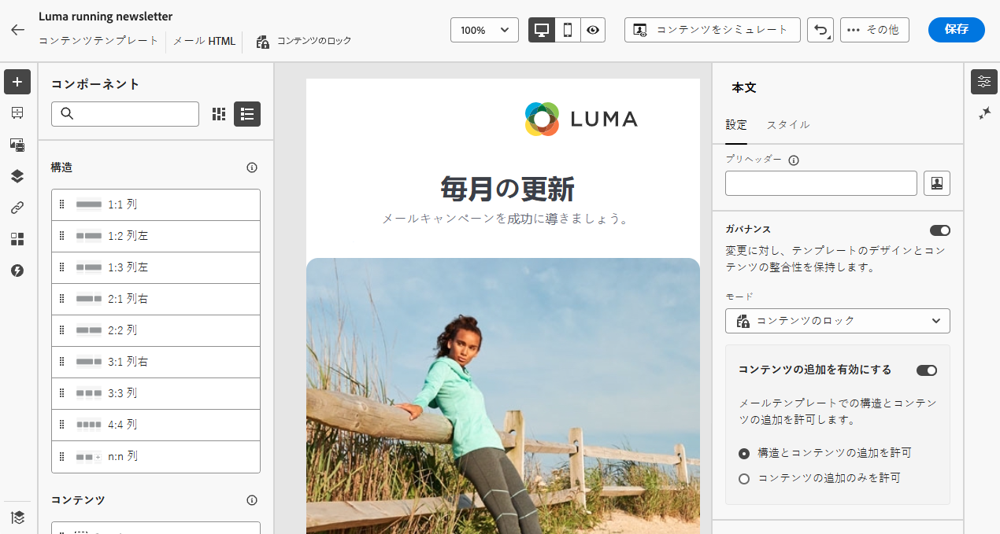
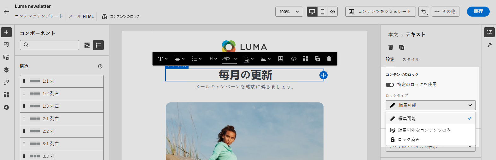
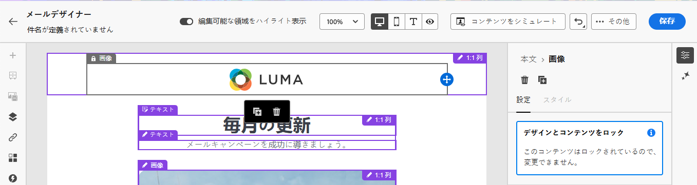
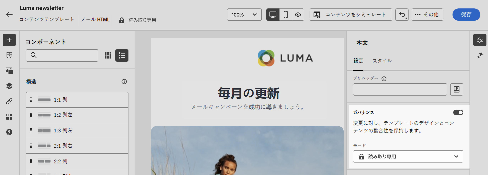
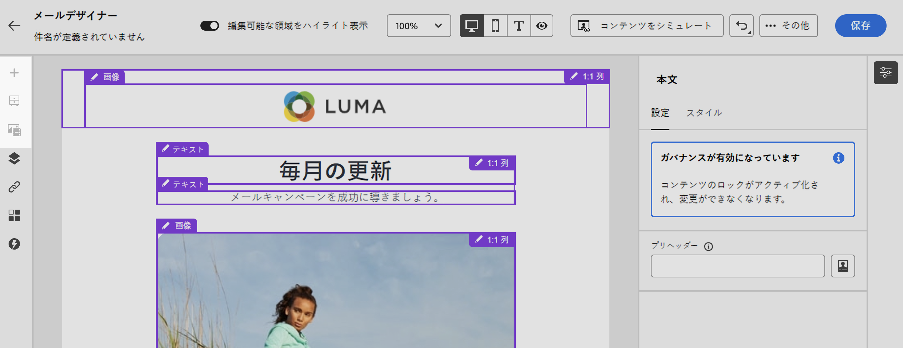
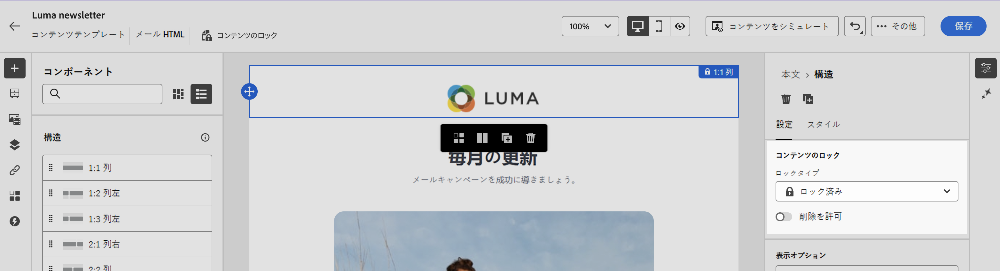

# メールテンプレートのコンテンツのロック {#lock-content-email-templates}

>[!CONTEXTUALHELP]
>id="ajo_locking_governance"
>title="ガバナンス"
>abstract="ガバナンスをオンに切り替えて、テンプレート全体をロックするか、特定の構造とコンポーネントをロックして、テンプレート内のコンテンツをロックします。これにより、意図しない編集や削除を防ぎ、テンプレートのカスタマイズをより細かく制御して、メールキャンペーンの効率と信頼性を向上させることができます。"

>[!CONTEXTUALHELP]
>id="ajo_locking_mode"
>title="モード"
>abstract="テンプレートに必要なロックモードを選択します。**コンテンツのロック**&#x200B;を使用すると、テンプレート内のコンテンツの特定のセクションをロックできます。**読み取り専用**&#x200B;を使用すると、テンプレートのコンテンツ全体をロックして、変更を防ぐことができます。"

>[!CONTEXTUALHELP]
>id="ajo_locking_content_addition"
>title="コンテンツ追加を有効にする"
>abstract="このオプションをオンに切り替えて、ユーザーによるテンプレートの操作方法をさらに定義します。「**構造とコンテンツの追加を許可**」を選択すると、ユーザーは既存の構造間に構造を追加することや、編集可能な構造内にコンテンツコンポーネントまたはフラグメントを追加することができます。「**コンテンツの追加のみを許可**」では、ユーザーは構造を追加または複製することなく、編集可能な構造内にコンテンツコンポーネントまたはフラグメントを追加できます。"

>[!CONTEXTUALHELP]
>id="ajo_email_locking_activated"
>title="ガバナンスが有効になりました"
>abstract="コンテンツのロックがアクティブ化され、変更ができなくなります。"

>[!CONTEXTUALHELP]
>id="ajo_email_locking_read_only"
>title="読み取り専用"
>abstract="このコンテンツは読み取り専用で、変更できません。"

Journey Optimizerを使用すると、テンプレート全体または特定の構造やコンポーネントをロックすることで、メールテンプレートのコンテンツをロックできます。 これにより、意図しない編集や削除を防ぎ、テンプレートのカスタマイズをより細かく制御して、メールキャンペーンの効率と信頼性を向上させることができます。

>[!IMPORTANT]
>
>コンテンツのロックは作成者にとってエディターレベルの機能であり、API を通じて読み込まれたり作成されたりしたときに、コンテンツが編集されないことを保証するものではありません。

コンテンツのロックは、**構造** レベルまたは **コンポーネント** レベルのいずれかで適用できます。 テンプレート内のコンテンツをロックする際に、構造およびコンポーネントレベルで適用される主な原則を次に示します。

* 構造がロックされている場合：

   * その構造内のすべてのコンテンツも、デフォルトでロックされます。
   * 構造にコンテンツを追加することはできません。
   * デフォルトでは、構造を削除できません。 「削除を許可」オプションを有効にすることで、この制限を上書きできます。
   * ロックされた構造内の個々のコンテンツコンポーネントは、編集可能として設定できます。

* 構造が編集可能な場合（構造がロックされていない場合）:

   * 個々のコンテンツコンポーネントは、その構造内でロックできます。
   * デフォルトでは、ロックされている場合や「編集可能コンテンツのロックのみ」が選択されている場合、コンポーネントを削除することはできません。 「削除を許可」オプションを有効にすることで、この制限を上書きできます。

>[!AVAILABILITY]
>
>コンテンツテンプレートを作成する権限を持つユーザーは、コンテンツのロックを有効にできます。

## メールテンプレートのロック {#define}

### コンテンツのロックを有効にする {#enable}

新しいテンプレートを作成する場合でも、既存のテンプレートを編集する場合でも、メールDesignerで直接メールテンプレートのコンテンツロックを有効にできます。 次の手順に従います。

1. メールテンプレートを開くか作成し、メールDesignerのコンテンツ編集画面にアクセスします。

1. 右側の **[!UICONTROL 本文]** パネルで、「**[!UICONTROL ガバナンス]**」オプションをオンに切り替えます。

1. **[!UICONTROL モード]** ドロップダウンリストから、テンプレートに必要なロックモードを選択します。

   * **[!UICONTROL コンテンツのロック]**：テンプレート内のコンテンツの特定のセクションをロックします。 デフォルトでは、すべての構造とコンポーネントが編集可能になります。 その後、個々の要素を選択的にロックできます。
   * **[!UICONTROL 読み取り専用]**：テンプレートのコンテンツ全体をロックして、変更を防ぎます。

   

1. **[!UICONTROL コンテンツのロック]** モードを選択した場合は、ユーザーによるテンプレートの操作方法をさらに定義できます。 **[!UICONTROL コンテンツ編集を有効にする]** オプションをオンにして、次のいずれかを選択します。

   * **[!UICONTROL 構造とコンテンツの追加を許可]**：ユーザーは、既存の構造間に構造を追加し、編集可能な構造内にコンテンツコンポーネントまたはフラグメントを追加できます。

   * **[!UICONTROL コンテンツの追加のみを許可]**：ユーザーは、編集可能な構造内でコンテンツコンポーネントやフラグメントを追加できますが、構造を追加または複製することはできません。

1. ロックモードを選択した後、「コンテンツのロック **[!UICONTROL モードを選択した場合にロックする構造やコンポーネントを定義でき]** す。

   * [構造をロックする方法を学ぶ](#lock-structures)
   * [コンポーネントのロック方法を学ぶ](#lock-components)

   **[!UICONTROL 読み取り専用]** モードを選択した場合は、通常どおり、テンプレートの最終処理と保存を続行できます。

テンプレートの本文を選択することで、テンプレートを設計する際にいつでも **[!UICONTROL ガバナンス]** 設定を調整できます。 これを行うには、右側のパネルの上部にあるナビゲーションレールの **[!UICONTROL 本文]** リンクをクリックします。

### 構造をロック {#lock-structures}

>[!CONTEXTUALHELP]
>id="ajo_locking_structure"
>title="構造でのコンテンツのロック"
>abstract="テンプレート内の構造をロックするには、**ロックタイプ**&#x200B;ドロップダウンから「**ロック済み**」を選択します。デフォルトでは、ユーザーはロックされた構造を削除できません。「**[!UICONTROL 削除を許可]**」オプションを有効にすると、この制限を上書きできます。"

テンプレート内の構造をロックするには：

1. ロックする構造を選択します。

1. 「**[!UICONTROL ロックタイプ]**」ドロップダウンリストで「**[!UICONTROL ロック済み]**」を選択します。

   

   >[!NOTE]
   >
   >デフォルトでは、ユーザーはロックされた構造を削除できません。「**[!UICONTROL 削除を許可]**」オプションを有効にすると、この制限を上書きできます。

構造をロックした後は、その中にコンテンツコンポーネントやフラグメントを複製または追加することはできません。 ロックされた構造内のすべてのコンポーネントも、デフォルトでロックされます。 ロックされた構造内でコンポーネントを編集可能にするには：

1. ロックを解除するコンポーネントを選択します。

1. **[!UICONTROL 特定のロックを使用]** オプションをオンにします。

1. 「**[!UICONTROL ロックタイプ]**」ドロップダウンリストで「**[!UICONTROL 編集可能]**」を選択します。 スタイルのロック中にコンテンツの編集を許可するには、「**[!UICONTROL 編集可能なコンテンツのみ]**」を選択します。 [ コンポーネントのロック方法については、こちらを参照してください ](#lock-components)

   

### コンポーネントをロック {#lock-components}

>[!CONTEXTUALHELP]
>id="ajo_locking_component"
>title="コンポーネントで特定のロックを使用"
>abstract="テンプレート内のコンポーネントをロックするには、「**特定のロックを使用**」オプションをオンに切り替えます。**[!UICONTROL ロックタイプ]**&#x200B;ドロップダウンリストから、優先するロックオプションを選択します。「**編集可能なコンテンツのロックのみ**」では、ユーザーはコンポーネントのスタイルをロックできますが、コンテンツの編集は許可されます。一方、「**ロック済み**」では、コンポーネントのコンテンツとスタイルの両方が完全にロックされます。"

構造内の特定のコンポーネントをロックするには：

1. コンポーネントを選択し、右側のパネルにある **[!UICONTROL 特定のロックを使用]** オプションを有効にします。

1. **[!UICONTROL ロックタイプ]** ドロップダウンリストから、希望するロックオプションを選択します。

   

   * **[!UICONTROL 編集可能なコンテンツのロックのみ]**：コンポーネントのスタイルをロックしますが、コンテンツ編集は可能です。
   * **[!UICONTROL ロック済み]**：コンポーネントのコンテンツとスタイルの両方を完全にロックします。

   >[!NOTE]
   >
   >**[!UICONTROL 編集可能]** ロックタイプを使用すると、ロックされた構造内でもコンポーネントを編集できます。 [ 構造をロックする方法を学ぶ ](#lock-structures)

1. デフォルトでは、ユーザーはロックされたコンポーネントを削除できません。 「**[!UICONTROL 削除を許可]**」オプションをアクティブ化すると、削除を有効にすることができます。

### ロックされているコンテンツの特定 {#identify}

テンプレート内のロックされている構造やコンポーネントを簡単に識別するには、左側のメニューにある **[!UICONTROL ナビゲーションツリー]** を使用します。 このメニューでは、すべてのテンプレート要素の概要が視覚的に表示され、ロックされた項目はロックアイコン、編集可能な項目は鉛筆アイコンでハイライト表示されます。

以下の例では、テンプレート本文に対してガバナンスが有効になっています。 *構造 2* は編集可能な *コンポーネント 1* でロックされ、*構造 3* は完全にロックされています。

## ロックされたコンテンツを含むテンプレートを使用 {#use}

>[!CONTEXTUALHELP]
>id="ajo_email_editable_areas"
>title="編集可能な領域をハイライト表示"
>abstract="テンプレートに適用されたロックのタイプに応じて、テンプレートの構造とコンポーネントに対して様々なアクションを実行できます。テンプレート内のすべての編集可能な領域をすばやく識別するには、「**[!UICONTROL 編集可能な領域をハイライト表示]**」オプションをオンに切り替えます。"

コンテンツがロックされたテンプレートを使用すると、右側のパネルに **[!UICONTROL ガバナンスが有効]** というメッセージが表示されます。

テンプレートに適用されたロックのタイプに応じて、テンプレートの構造とコンポーネントに対して様々なアクションを実行できます。テンプレート内のすべての編集可能な領域をすばやく識別するには、「**[!UICONTROL 編集可能な領域をハイライト表示]**」オプションをオンに切り替えます。

例えば、以下のテンプレートでは、ロックされている上部の画像を除くすべての領域が編集可能です。つまり、編集または削除はできません。

適用可能な各種ロックについて詳しくは、次の節を参照してください。

* [構造をロック](#lock-structures)
* [コンポーネントをロック](#lock-components)

以下に、設定されている、メールの編集と関連するコンテンツのロック設定の例を示します。

| コンテンツのロックタイプ | テンプレート設定 | メールのエディション |
| ------- | ------- | ------- |
| 読み取り専用コンテンツテンプレート | {zoomable="yes"} | {zoomable="yes"} |
| 完全なコンテンツは編集可能ですが、ユーザーは構造やコンポーネントを追加できません | {zoomable="yes"} | {zoomable="yes"} |
| 削除できないロックされた構造 | {zoomable="yes"} | {zoomable="yes"} |
| スタイルがロックされたコンポーネントで、削除できないもの。 ユーザーは、コンテンツのみを変更できます。 | {zoomable="yes"} | {zoomable="yes"} |
| ロックされた構造内の編集可能コンポーネント。 | {zoomable="yes"} | {zoomable="yes"} |
