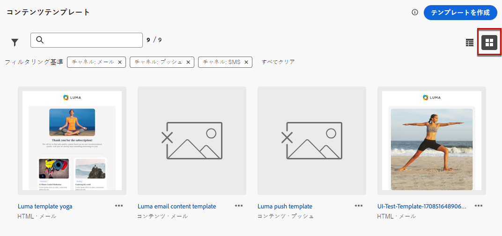
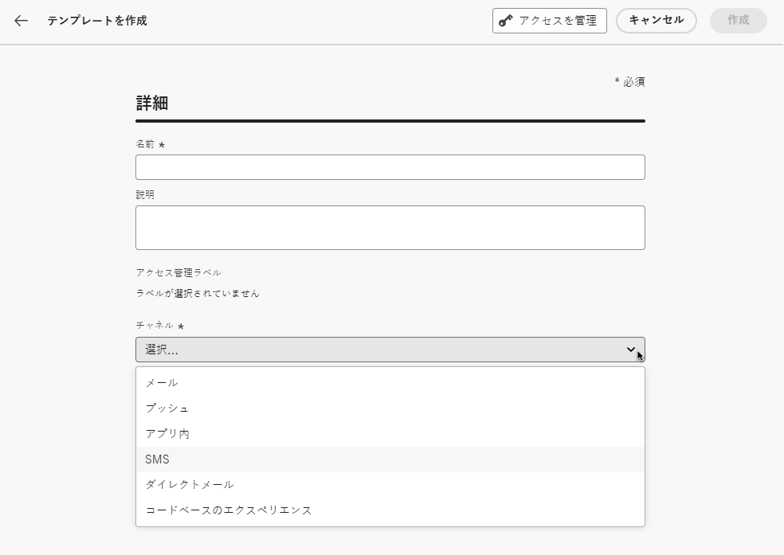
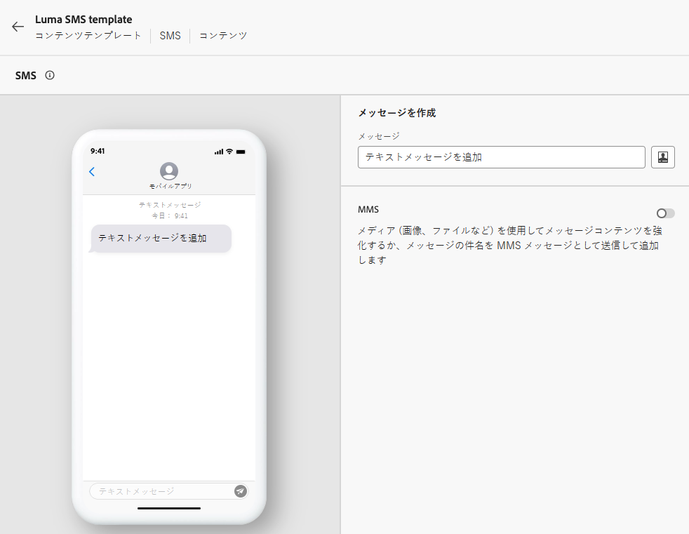
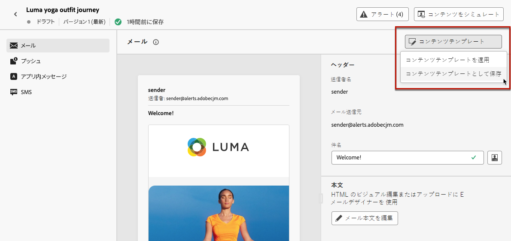

# コンテンツテンプレートの操作 {#content-templates}

高速で改善された設計プロセスを実現するために、スタンドアロンテンプレートを作成して、[!DNL Journey Optimizer] キャンペーンやジャーニー全体でカスタムコンテンツを簡単に再利用できます。

この機能により、コンテンツ指向のユーザーは、キャンペーンやジャーニーの外部でテンプレートを操作できます。それから、マーケティングユーザーは、これらのスタンドアロンコンテンツテンプレートを自分のジャーニーやキャンペーン内で再利用、調整できます。

<!---->

>[!NOTE]
>
>現在、Web チャネルではコンテンツテンプレートを使用できません。

例えば、会社内のユーザーはコンテンツのみを担当しているので、キャンペーンやジャーニーにはアクセスできません。ただし、このユーザーがメールテンプレートを作成し、組織のマーケターはすべてのメールの出発点としてそのメールテンプレートを使用できます。

また、API を使用して、コンテンツテンプレートを作成および管理することもできます。詳しくは、[Journey Optimizer API ドキュメント](https://developer.adobe.com/journey-optimizer-apis/references/content/){target="_blank"}を参照してください。

➡️ [テンプレートの作成および使用方法については、このビデオをご覧ください](#video-templates)

>[!CAUTION]
>
>コンテンツテンプレートを作成、編集、削除するには、**[!DNL Content Library Manager]** 製品プロファイルに含まれる&#x200B;**[!DNL Manage library items]** 権限を付与されている必要があります。[詳細情報](../administration/ootb-product-profiles.md#content-library-manager)

## テンプレートへのアクセスと管理 {#access-manage-templates}

コンテンツテンプレートリストにアクセスするには、左のメニューで&#x200B;**[!UICONTROL コンテンツ管理]**／**[!UICONTROL コンテンツテンプレート]**&#x200B;を選択します。

現在のサンドボックスで作成されたすべてのテンプレート ( ジャーニーまたは **[!UICONTROL テンプレートとして保存]** オプション ( **[!UICONTROL コンテンツテンプレート]** メニュー — が表示されます。 [テンプレートの作成方法を説明します](#create-content-templates)

コンテンツテンプレートの並べ替え基準を次に示します。
* タイプ
* チャネル
* 作成日または変更日
* タグ — [タグの詳細を説明します](../start/search-filter-categorize.md#tags)

自分で作成または変更した項目のみを表示するように選択することもできます。

<!--Select the **[!UICONTROL Grid view]** mode to display each template as a thumbnail. 

>[!NOTE]
>
>Currently proper thumbnails can only be generated for HTML-type email content templates.

When you update a content, you may have to wait a few seconds before the changes are reflected in the thumbnail.

-->

* テンプレートコンテンツを編集するには、リストから目的の項目をクリックし、「**[!UICONTROL コンテンツを編集]**」を選択します。

  

* テンプレートを削除するには、 **[!UICONTROL その他のアクション]** ボタンをクリックし、「 **[!UICONTROL 削除]**.

  

>[!NOTE]
>
>テンプレートを編集または削除しても、このテンプレートを使用して作成されたコンテンツを含むキャンペーンまたはジャーニーは影響を受けません。

## コンテンツテンプレートの作成 {#create-content-templates}

>[!CONTEXTUALHELP]
>id="ajo_create_template"
>title="独自のコンテンツテンプレートを定義"
>abstract="スタンドアロンのカスタムテンプレートをゼロから作成して、複数のジャーニーやキャンペーンでコンテンツを再利用できるようにします。"

コンテンツテンプレートを作成する方法は 2 つあります。

* 左パネルの「**[!UICONTROL コンテンツテンプレート]**」メニューを使用して、ゼロからコンテンツテンプレートを作成する。[方法についてはこちらを参照](#create-template-from-scratch)

* キャンペーンまたはジャーニー内でコンテンツをデザインする際は、コンテンツをテンプレートとして保存します。 [方法についてはこちらを参照](#save-as-template)

保存すると、コンテンツテンプレートをキャンペーンやジャーニーで使用できるようになります。 最初から作成した場合も、以前のコンテンツから作成した場合も、 [!DNL Journey Optimizer]. [方法についてはこちらを参照](#use-content-templates)

>[!NOTE]
>
>* コンテンツテンプレートに加えられた変更は、ライブかドラフトかに関わらず、キャンペーンやジャーニーには反映されません。
>
>* 同様に、キャンペーンやジャーニーでテンプレートを使用する場合、キャンペーンやジャーニーのコンテンツにを編集しても、以前に使用したコンテンツテンプレートには影響しません。

### テンプレートをゼロから作成 {#create-template-from-scratch}

コンテンツテンプレートをゼロから作成するには、次の手順に従います。

1. **[!UICONTROL コンテンツ管理]**／**[!UICONTROL コンテンツテンプレート]**&#x200B;の左側のメニューからコンテンツテンプレートリストにアクセスします。

1. 「**[!UICONTROL テンプレートの作成]**」を選択します。

1. テンプレートの詳細を入力し、目的のチャネルを選択します。

   

   >[!NOTE]
   >
   >現在、Web を除くすべてのチャネルを使用できます。

1. を選択します。 **[!UICONTROL タイプ]** 選択したチャネル用に選択します。

   

   * の場合 **[!UICONTROL 電子メール]**&#x200B;を選択した場合、 **[!UICONTROL コンテンツ]**&#x200B;に値を入力する場合、 [件名](../email/create-email.md#define-email-content) をテンプレートの一部として使用します。 次を選択した場合、 **[!UICONTROL HTML]**&#x200B;に含まれている場合、E メール本文のコンテンツのみを定義できます。

   * の場合 **[!UICONTROL SMS]**, **[!UICONTROL プッシュ]**, **[!UICONTROL アプリ内]** および **[!UICONTROL ダイレクトメール]**&#x200B;の場合、現在のチャネルではデフォルトのタイプのみを使用できます。 選択する必要があります。

1. 「**[!UICONTROL タグ]**」フィールドから Adobe Experience Platform タグを選択または作成してテンプレートを分類し、検索の向上を図ります。[詳細情報](../start/search-filter-categorize.md#tags)

1. カスタムまたはコアのデータ使用状況ラベルをテンプレートに割り当てるには、「 **[!UICONTROL アクセスを管理]**. [オブジェクトレベルのアクセス制御（OLAC）についての詳細はこちらを参照してください](../administration/object-based-access.md)。

1. クリック **[!UICONTROL 作成]** また、選択したチャネルに従って、ジャーニーやキャンペーン内のコンテンツと同じ方法で、必要に応じてコンテンツをデザインします。

   

   様々なチャネル用のコンテンツを作成する方法については、次の節を参照してください。
   * [E メールコンテンツの定義](../email/get-started-email-design.md)
   * [プッシュコンテンツの定義](../push/design-push.md)
   * [SMS コンテンツの定義](../sms/create-sms.md#sms-content)
   * [ダイレクトメールのコンテンツを定義](../direct-mail/create-direct-mail.md)
   * [アプリ内コンテンツの定義](../in-app/design-in-app.md)

1. 以下を作成する場合、 **[!UICONTROL 電子メール]** テンプレート **[!UICONTROL HTML]** 「 」と入力すると、コンテンツをテストできます。 [方法についてはこちらを参照](#test-template)

1. テンプレートの準備が整ったら、「**[!UICONTROL 保存]**」をクリックします。

1. テンプレート名の横の矢印をクリックして、 **[!UICONTROL 詳細]** 画面。

   

これで、内でコンテンツを作成する際に、このテンプレートを使用する準備が整いました。 [!DNL Journey Optimizer]. [方法についてはこちらを参照](#use-content-templates)

### テンプレートとして保存 {#save-as-template}

>[!CONTEXTUALHELP]
>id="ajo_messages_depecrated_inventory"
>title="メッセージの移行方法を説明します。"
>abstract="2022年7月25日（PT）より、メッセージメニューが表示されなくなり、ジャーニーから直接メッセージが作成されます。 従来のメッセージをジャーニーで再利用する場合は、それらをテンプレートとして保存する必要があります。"

キャンペーンまたはジャーニーでコンテンツをデザインする際に、後で再利用できるようにコンテンツを保存できます。 それには、次の手順に従います。

1. メッセージから **[!UICONTROL コンテンツを編集]** 画面で、 **[!UICONTROL コンテンツテンプレート]** 」ボタンをクリックします。

1. ドロップダウンメニューから「**[!UICONTROL コンテンツテンプレートとして保存]**」を選択します。

   

   次の場合、 [E メールデザイナー](../email/get-started-email-design.md)の場合は、このオプションを **[!UICONTROL その他]** 」ドロップダウンリストを使用できます。

   

1. このテンプレートの名前と説明を追加します。

   

   >[!NOTE]
   >
   >現在のチャネルとタイプは自動的に入力され、編集できません。 電子メールテンプレートの場合： [E メールデザイナー](../email/get-started-email-design.md)、 **[!UICONTROL HTML]** 「 」と入力すると、自動的に選択されます。

1. 「**タグ**」フィールドから Adobe Experience Platform タグを選択または作成して、テンプレートを分類します。[詳細情報](../start/search-filter-categorize.md#tags)

1. カスタムまたはコアのデータ使用状況ラベルをテンプレートに割り当てるには、「 **[!UICONTROL アクセスを管理]**. [詳細情報](../administration/object-based-access.md)。

1. 「**[!UICONTROL 保存]**」をクリックします。

1. テンプレートは&#x200B;**[!UICONTROL コンテンツテンプレート]**&#x200B;リストに保存され、[!DNL Journey Optimizer] 専用メニューからアクセスできます。このテンプレートは、そのリストの他の項目と同様に、アクセス、編集、削除できるスタンドアロンのコンテンツテンプレートになります。[詳細情報](#access-manage-templates)

これで、 [!DNL Journey Optimizer]. [方法についてはこちらを参照](#use-content-templates)

>[!NOTE]
>
>その新しいテンプレートに対する変更は、元のコンテンツには反映されません。 同様に、そのコンテンツ内で元のコンテンツを編集した場合、新しいテンプレートは変更されません。

## E メールコンテンツテンプレートのテスト {#test-template}

一部の E メールテンプレートのレンダリングを、最初から作成したものか、既存のコンテンツから作成したものかに関わらずテストできます。 これを行うには、以下の手順に従います。

>[!CAUTION]
>
>現在、テスト中のコンテンツテンプレートは次の場合にのみ使用できます： **[!UICONTROL 電子メール]** テンプレート **[!UICONTROL HTML]** タイプ。

1. でコンテンツテンプレートリストにアクセスする **[!UICONTROL コンテンツ管理]** > **[!UICONTROL コンテンツテンプレート]** メニューを開き、任意のメールテンプレートを選択します。

1. **[!UICONTROL テンプレートのプロパティ]**&#x200B;から「**[!UICONTROL コンテンツを編集]**」をクリックします。

1. クリック **[!UICONTROL コンテンツをシミュレート]** をクリックし、レンダリングを確認するテストプロファイルを選択します。 [詳細情報](../content-management/preview-test.md)

   

1. ジャーニーやキャンペーンで使用する前に、コンテンツをテストするための配達確認を送信し、一部の内部ユーザーから承認を得ることができます。

   * これを行うには、「**[!UICONTROL 配達確認を送信]**」ボタンをクリックし、[この節](../content-management/proofs.md)で説明されている手順に従います。

   * 配達確認を送信する前に、コンテンツのテストに使用する[メールサーフェス](../configuration/channel-surfaces.md)を選択する必要があります。

     

>[!CAUTION]
>
>現在、メールコンテンツテンプレートをテストする際の追跡はサポートされていません。つまり、テンプレートから送信される配達確認で、イベント、UTM パラメーター、ランディングページリンクの追跡が有効になりません。追跡をテストするには、メールで[コンテンツテンプレートを使用](../email/use-email-templates.md)し、[配達確認を送信](../content-management/preview-test.md#send-proofs)します。

## コンテンツテンプレートの使用 {#use-content-templates}

で任意のチャネル（Web を除く）のコンテンツを作成する場合 [!DNL Journey Optimizer]カスタムテンプレートを使用する場合は、次のいずれかの方法で使用できます。

* 「**[!UICONTROL コンテンツテンプレート]**」メニューを使用してゼロから作成する。[詳細情報](#create-template-from-scratch)

* ジャーニーまたはキャンペーンの既存のコンテンツから、 **[!UICONTROL コンテンツテンプレートとして保存]** オプション。 [詳細情報](#save-as-template)

これらのテンプレートの 1 つを使用してコンテンツの作成を開始するには、次の手順に従います。

1. 選択後にキャンペーンかジャーニーのどちらに含まれるか **[!UICONTROL コンテンツを編集]**&#x200B;をクリックし、 **[!UICONTROL コンテンツテンプレート]** 」ボタンをクリックします。

1. 選択 **[!UICONTROL コンテンツテンプレートの適用]**.

   

1. リストから目的のテンプレートを選択します。選択したチャネルおよび/またはタイプと互換性のあるテンプレートのみが表示されます。

   

   >[!NOTE]
   >
   >この画面から、専用のボタンを使用して新しいテンプレートを作成することもできます。新しいタブが開きます。

1. クリック **[!UICONTROL 確認]**. テンプレートがコンテンツに適用されます。

1. 必要に応じて、引き続きコンテンツを編集します。

>[!NOTE]
>
>を使用してコンテンツテンプレートから E メールのデザインを開始するには [E メールデザイナー](../email/get-started-email-design.md)を使用する場合は、 [この節](../email/use-email-templates.md).

## チュートリアルビデオ {#video-templates}

[!DNL Journey Optimizer] でコンテンツテンプレートを作成、編集、使用する方法について説明します。

>[!VIDEO](https://video.tv.adobe.com/v/3413743/?quality=12)
