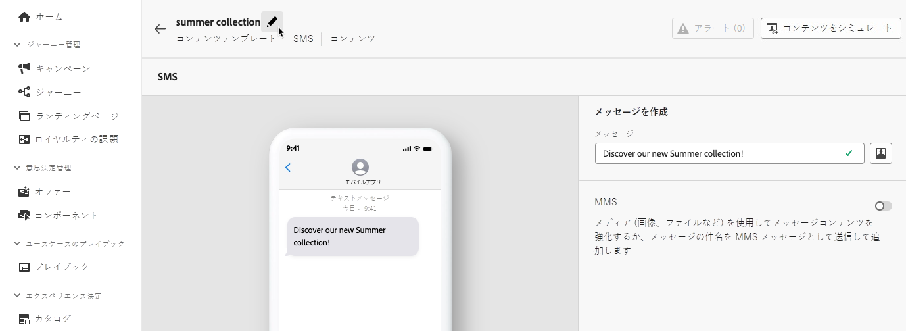
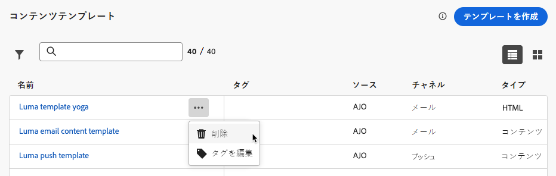
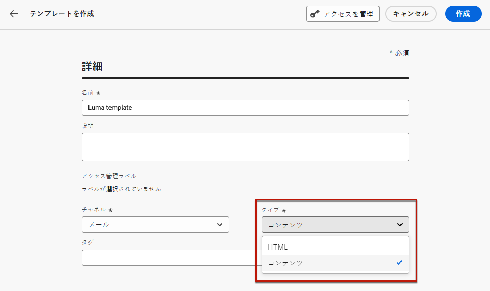
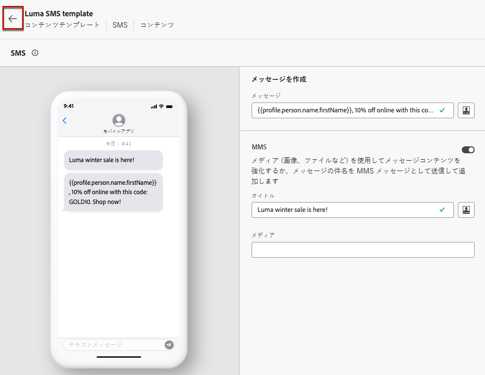

# コンテンツテンプレートの操作 {#content-templates}

高速で改善された設計プロセスを実現するために、スタンドアロンテンプレートを作成して、[!DNL Journey Optimizer] キャンペーンやジャーニー全体でカスタムコンテンツを簡単に再利用できます。

この機能により、コンテンツ指向のユーザーは、キャンペーンやジャーニーの外部でテンプレートを操作できます。それから、マーケティングユーザーは、これらのスタンドアロンコンテンツテンプレートを自分のジャーニーやキャンペーン内で再利用、調整できます。

<!---->

>[!NOTE]
>
>現在、web チャネルではコンテンツテンプレートは使用できません。

例えば、会社内のユーザーはコンテンツのみを担当しているので、キャンペーンやジャーニーにはアクセスできません。ただし、このユーザーがメールテンプレートを作成し、組織のマーケターはすべてのメールの出発点としてそのメールテンプレートを使用できます。

また、API を使用して、コンテンツテンプレートを作成および管理することもできます。詳しくは、[Journey Optimizer API ドキュメント](https://developer.adobe.com/journey-optimizer-apis/references/content/){target="_blank"}を参照してください。

➡️ [テンプレートの作成および使用方法については、このビデオをご覧ください](#video-templates)

>[!CAUTION]
>
>コンテンツテンプレートを作成、編集、削除するには、**[!DNL Content Library Manager]** 製品プロファイルに含まれる&#x200B;**[!DNL Manage library items]** 権限を付与されている必要があります。[詳細情報](../administration/ootb-product-profiles.md#content-library-manager)

## テンプレートへのアクセスと管理 {#access-manage-templates}

コンテンツテンプレートリストにアクセスするには、左のメニューで&#x200B;**[!UICONTROL コンテンツ管理]**／**[!UICONTROL コンテンツテンプレート]**&#x200B;を選択します。

現在のサンドボックスで（「**[!UICONTROL テンプレートとして保存]**」オプションを使ったジャーニーやキャンペーンまたは&#x200B;**[!UICONTROL コンテンツテンプレート]**&#x200B;メニューから）作成されたすべてのテンプレートが表示されます。[詳しくは、テンプレートの作成方法を参照してください](#create-content-templates)

コンテンツテンプレートの並べ替え基準を次に示します。
* タイプ
* チャネル
* 作成日または変更日
* タグ - [詳しくは、タグを参照してください](../start/search-filter-categorize.md#tags)

また、自分が作成または変更した項目のみを表示するように選択することもできます。

* テンプレートコンテンツを編集するには、リストから目的の項目をクリックし、「**[!UICONTROL コンテンツを編集]**」を選択します。

  

* テンプレートを削除するには、目的のテンプレートの横にある「**[!UICONTROL その他のアクション]**」ボタンを選択し、「**[!UICONTROL 削除]**」を選択します。

  

>[!NOTE]
>
>テンプレートを編集または削除しても、このテンプレートを使用して作成されたコンテンツを含むキャンペーンやジャーニーは影響を受けません。

### テンプレートをサムネールとして表示 {#template-thumbnails}

各テンプレートをサムネールとして表示するには、**[!UICONTROL グリッド表示]**&#x200B;モードを選択します。

>[!AVAILABILITY]
>
>この機能は、少数の顧客向けに限定提供（LA）でリリースされています。

>[!NOTE]
>
>現在、適切なサムネールは HTML タイプのメールコンテンツテンプレートに対してのみ生成できます。

コンテンツを更新する場合、変更がサムネールに反映されるまでに数秒待つ必要がある場合があります。

## コンテンツテンプレートの作成 {#create-content-templates}

>[!CONTEXTUALHELP]
>id="ajo_create_template"
>title="独自のコンテンツテンプレートを定義"
>abstract="スタンドアロンのカスタムテンプレートをゼロから作成して、複数のジャーニーやキャンペーンでコンテンツを再利用できるようにします。"

コンテンツテンプレートを作成する方法は 2 つあります。

* 左パネルの「**[!UICONTROL コンテンツテンプレート]**」メニューを使用して、ゼロからコンテンツテンプレートを作成する。[方法についてはこちらを参照](#create-template-from-scratch)

* キャンペーンまたはジャーニー内でコンテンツをデザインする際に、テンプレートとして保存する。[方法についてはこちらを参照](#save-as-template)

保存すると、コンテンツテンプレートをキャンペーンやジャーニーで使用できるようになります。 ゼロから作成した場合でも、以前のコンテンツから作成した場合でも、[!DNL Journey Optimizer] 内でコンテンツを作成する際にこのテンプレートを使用できるようになりました。[方法についてはこちらを参照](#use-content-templates)

>[!NOTE]
>
>* コンテンツテンプレートに加えられた変更は、ライブかドラフトかに関わらず、キャンペーンやジャーニーには反映されません。
>
>* 同様に、キャンペーンやジャーニーでテンプレートを使用する場合、キャンペーンやジャーニーのコンテンツにを編集しても、以前に使用したコンテンツテンプレートには影響しません。

### テンプレートをゼロから作成 {#create-template-from-scratch}

コンテンツテンプレートをゼロから作成するには、次の手順に従います。

1. **[!UICONTROL コンテンツ管理]**／**[!UICONTROL コンテンツテンプレート]**&#x200B;の左側のメニューからコンテンツテンプレートリストにアクセスします。

1. 「**[!UICONTROL テンプレートの作成]**」を選択します。

1. テンプレートの詳細を入力し、目的のチャネルを選択します。

   

   >[!NOTE]
   >
   >現在、web を除くすべてのチャネルを使用できます。

1. 選択したチャネルの&#x200B;**[!UICONTROL タイプ]**&#x200B;を選択します。

   

   * **[!UICONTROL メール]**&#x200B;の場合、「**[!UICONTROL コンテンツ]**」を選択すると、[件名](../email/create-email.md#define-email-content)をテンプレートの一部として定義できます。「**[!UICONTROL HTML]**」を選択すると、メール本文のコンテンツのみを定義できます。

   * **[!UICONTROL SMS]**、**[!UICONTROL プッシュ]**、**[!UICONTROL アプリ内]**&#x200B;および&#x200B;**[!UICONTROL ダイレクトメール]**&#x200B;の場合、現在のチャネルに使用できるのはデフォルトのタイプのみですが、選択は行う必要があります。

1. 「**[!UICONTROL タグ]**」フィールドから Adobe Experience Platform タグを選択または作成してテンプレートを分類し、検索の向上を図ります。[詳細情報](../start/search-filter-categorize.md#tags)

1. テンプレートにカスタムまたはコアのデータ使用ラベルを割り当てるには、「**[!UICONTROL アクセスを管理]**」を選択します。[オブジェクトレベルのアクセス制御（OLAC）についての詳細はこちらを参照してください](../administration/object-based-access.md)。

1. 「**[!UICONTROL 作成]**」をクリックし、選択したチャネルに従って、ジャーニーやキャンペーン内のコンテンツと同じ方法で、必要に応じてコンテンツをデザインします。

   

   様々なチャネル用のコンテンツを作成する方法については、次の節を参照してください。
   * [メールコンテンツの定義](../email/get-started-email-design.md)
   * [プッシュコンテンツの定義](../push/design-push.md)
   * [SMS コンテンツの定義](../sms/create-sms.md#sms-content)
   * [ダイレクトメールコンテンツの定義](../direct-mail/create-direct-mail.md)
   * [アプリ内コンテンツの定義](../in-app/design-in-app.md)

1. **[!UICONTROL HTML]** タイプで&#x200B;**[!UICONTROL メール]**&#x200B;テンプレートを作成している場合は、コンテンツをテストできます。[方法についてはこちらを参照](#test-template)

1. テンプレートの準備が整ったら、「**[!UICONTROL 保存]**」をクリックします。

1. テンプレート名の横にある矢印をクリックして&#x200B;**[!UICONTROL 詳細]**&#x200B;画面に戻ります。

   

このテンプレートを、[!DNL Journey Optimizer] 内でコンテンツを作成する際に使用できるようになりました。[方法についてはこちらを参照](#use-content-templates)

### テンプレートとして保存 {#save-as-template}

>[!CONTEXTUALHELP]
>id="ajo_messages_depecrated_inventory"
>title="メッセージの移行方法を説明します。"
>abstract="2022年7月25日（PT）より、メッセージメニューが表示されなくなり、ジャーニーから直接メッセージが作成されます。 従来のメッセージをジャーニーで再利用する場合は、それらをテンプレートとして保存する必要があります。"

キャンペーンやジャーニーでコンテンツをデザインする際、保存しておくと、後で再利用できます。それには、次の手順に従います。

1. メッセージの&#x200B;**[!UICONTROL コンテンツを編集]**&#x200B;画面で、「**[!UICONTROL コンテンツテンプレート]**」ボタンをクリックします。

1. ドロップダウンメニューから「**[!UICONTROL コンテンツテンプレートとして保存]**」を選択します。

   

   [メールデザイナー](../email/get-started-email-design.md)を使用している場合は、画面右上の&#x200B;**[!UICONTROL その他]**&#x200B;ドロップダウンリストからこのオプションを選択することもできます。

   

1. このテンプレートの名前と説明を追加します。

   

   >[!NOTE]
   >
   >現在のチャネルとタイプは自動的に入力され、編集できません。[メールデザイナー](../email/get-started-email-design.md)から作成したメールテンプレートの場合、**[!UICONTROL HTML]** タイプが自動的に選択されます。

1. 「**タグ**」フィールドから Adobe Experience Platform タグを選択または作成して、テンプレートを分類します。[詳細情報](../start/search-filter-categorize.md#tags)

1. テンプレートにカスタムまたはコアのデータ使用ラベルを割り当てるには、「**[!UICONTROL アクセスを管理]**」を選択します。[詳細情報](../administration/object-based-access.md)。

1. 「**[!UICONTROL 保存]**」をクリックします。

1. テンプレートは&#x200B;**[!UICONTROL コンテンツテンプレート]**&#x200B;リストに保存され、[!DNL Journey Optimizer] 専用メニューからアクセスできます。このテンプレートは、そのリストの他の項目と同様に、アクセス、編集、削除できるスタンドアロンのコンテンツテンプレートになります。[詳細情報](#access-manage-templates)

[!DNL Journey Optimizer] 内でコンテンツを作成する際に、このテンプレートを使用できるようになりました。[方法についてはこちらを参照](#use-content-templates)

>[!NOTE]
>
>その新しいテンプレートに対する変更は、送信元のコンテンツには生成されません。同様に、そのコンテンツ内で元のコンテンツを編集しても、新しいテンプレートは変更されません。

## メールコンテンツテンプレートのテスト {#test-template}

ゼロから作成した場合でも、既存のコンテンツから作成した場合でも、一部のメールテンプレートのレンダリングをテストできます。これを行うには、以下の手順に従います。

>[!CAUTION]
>
>現在テスト中のコンテンツテンプレートは、**[!UICONTROL HTML]** タイプの&#x200B;**[!UICONTROL メール]**&#x200B;テンプレートでのみ使用できます。

1. **[!UICONTROL コンテンツ管理]**／**[!UICONTROL コンテンツテンプレート]**&#x200B;メニューからコンテンツテンプレートリストにアクセスし、任意のメールテンプレートを選択します。

1. **[!UICONTROL テンプレートプロパティ]**&#x200B;から「**[!UICONTROL コンテンツを編集]**」をクリックします。

1. 「**[!UICONTROL コンテンツをシミュレート]**」をクリックし、テストプロファイルを選択して、レンダリングを確認します。[詳細情報](../content-management/preview-test.md)

   

1. ジャーニーやキャンペーンで使用する前に、コンテンツをテストするための配達確認を送信し、一部の内部ユーザーから承認を得ることができます。

   * これを行うには、「**[!UICONTROL 配達確認を送信]**」ボタンをクリックし、[この節](../content-management/proofs.md)で説明されている手順に従います。

   * 配達確認を送信する前に、コンテンツのテストに使用する[メールサーフェス](../configuration/channel-surfaces.md)を選択する必要があります。

     

>[!CAUTION]
>
>現在、メールコンテンツテンプレートをテストする際の追跡はサポートされていません。つまり、テンプレートから送信される配達確認で、イベント、UTM パラメーター、ランディングページリンクの追跡が有効になりません。追跡をテストするには、メールで[コンテンツテンプレートを使用](../email/use-email-templates.md)し、[配達確認を送信](../content-management/preview-test.md#send-proofs)します。

## コンテンツテンプレートの使用 {#use-content-templates}

[!DNL Journey Optimizer] で任意のチャネル（web を除く）のコンテンツを作成する際、次のいずれかのカスタムテンプレートを使用できます。

* 「**[!UICONTROL コンテンツテンプレート]**」メニューを使用してゼロから作成する。[詳細情報](#create-template-from-scratch)

* 「**[!UICONTROL コンテンツテンプレートとして保存]**」オプションを使用して、ジャーニーまたはキャンペーンのメールから保存する。[詳細情報](#save-as-template)

これらのテンプレートの 1 つを使用してコンテンツの作成を開始するには、次の手順に従います。

1. キャンペーンまたはジャーニーのいずれかで、「**[!UICONTROL コンテンツを編集]**」を選択した後、「**[!UICONTROL コンテンツテンプレート]**」ボタンをクリックします。

1. 「**[!UICONTROL コンテンツテンプレートを適用]**」を選択します。

   

1. リストから目的のテンプレートを選択します。選択したチャネルやタイプと互換性のあるテンプレートのみが表示されます。

   

   >[!NOTE]
   >
   >この画面から、新しいタブが開く専用のボタンを使用して、新しいテンプレートを作成することもできます。

1. 「**[!UICONTROL 確認]**」をクリックします。テンプレートがコンテンツに適用されます。

1. 必要に応じて、引き続きコンテンツを編集します。

>[!NOTE]
>
>[メールデザイナー](../email/get-started-email-design.md)を使用してコンテンツテンプレートからメールのデザインを開始するには、[この節](../email/use-email-templates.md)で説明する手順に従います。

## チュートリアルビデオ {#video-templates}

[!DNL Journey Optimizer] でコンテンツテンプレートを作成、編集、使用する方法について説明します。

>[!VIDEO](https://video.tv.adobe.com/v/3413743/?quality=12)
