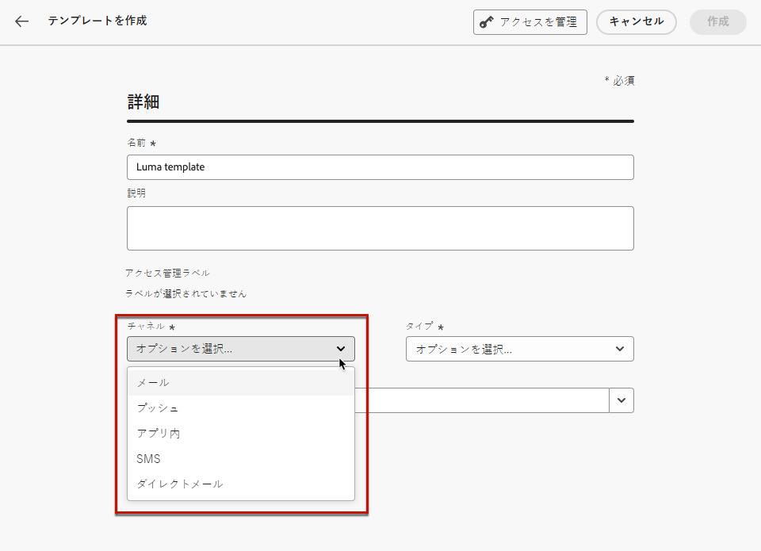
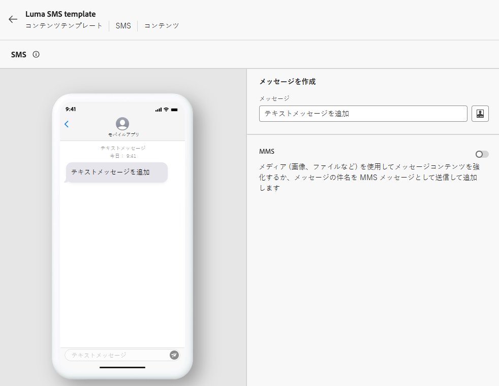
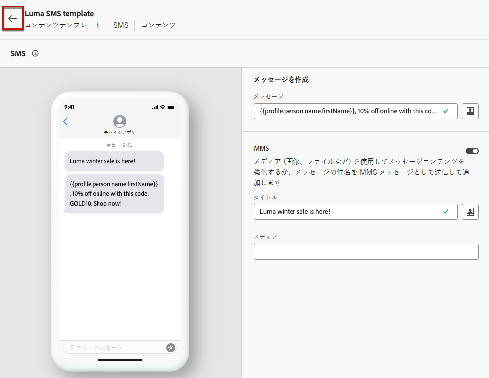
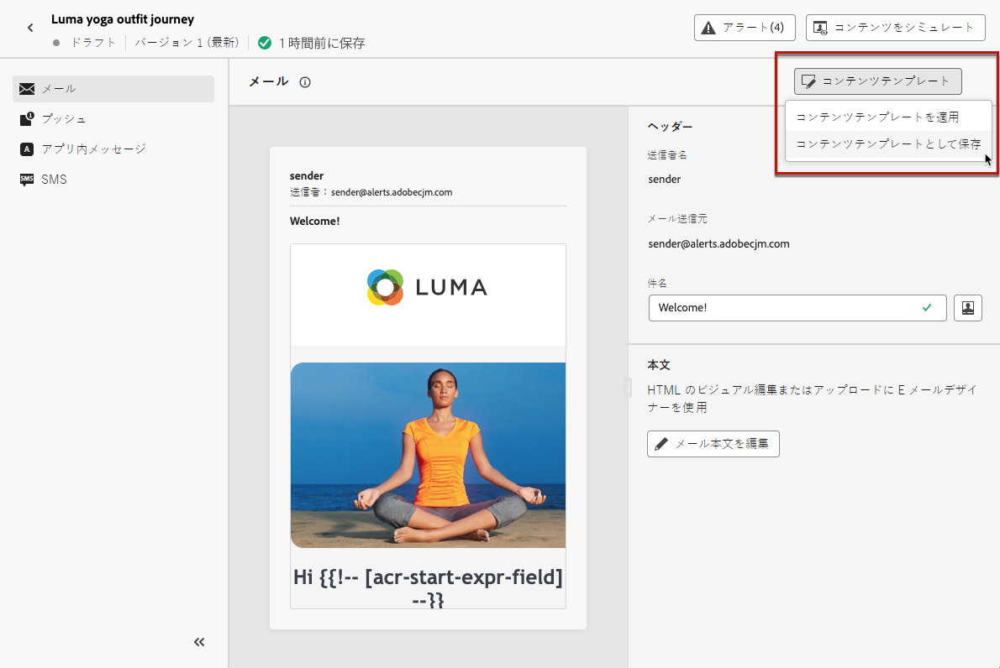
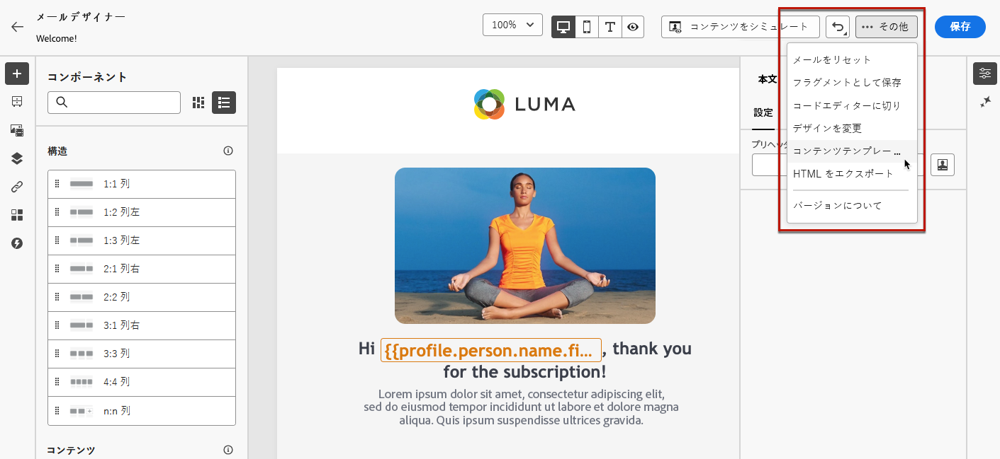
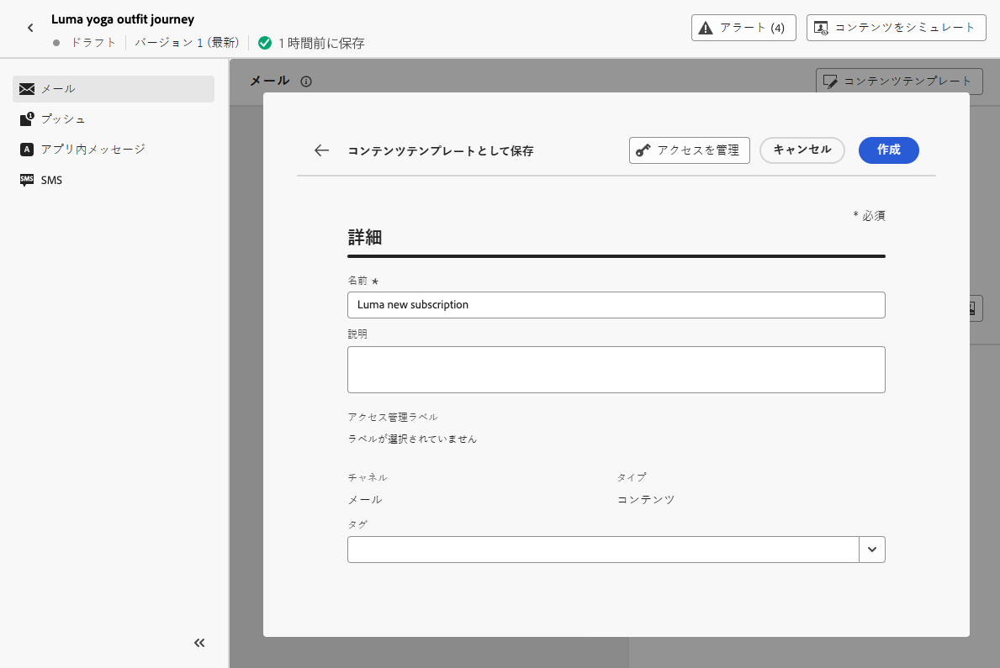

# コンテンツテンプレートの作成 {#create-content-templates}

>[!CONTEXTUALHELP]
>id="ajo_create_template"
>title="独自のコンテンツテンプレートを定義"
>abstract="スタンドアロンのカスタムテンプレートをゼロから作成し、複数のジャーニーやキャンペーンをまたいでコンテンツを再利用できるようにします。"

コンテンツテンプレートを作成するには、次の2つの方法があります。

* 左パネル **[!UICONTROL コンテンツテンプレート]** メニューを使用して、コンテンツテンプレートをゼロから作成します。 [方法を学ぶ](#create-template-from-scratch)

* キャンペーンやジャーニー内でコンテンツを設計する場合は、テンプレートとして保存します。 [方法を学ぶ](#save-as-template)

保存すると、コンテンツテンプレートをキャンペーンやジャーニーで使用できるようになります。 ゼロから作成する場合でも、以前のコンテンツから作成する場合でも、このテンプレートを使用して[!DNL Journey Optimizer]内の任意のコンテンツを作成できます。 [方法を学ぶ](#use-content-templates)

>[!NOTE]
>
>* コンテンツテンプレートに対して行われた変更は、ライブでもドラフトでも、キャンペーンやジャーニーには反映されません。
>
>* 同様に、テンプレートがキャンペーンまたはジャーニーで使用される場合、キャンペーンおよびジャーニーのコンテンツに対して行われた編集は、以前に使用されたコンテンツテンプレートには影響しません。

## テンプレートをゼロから作成 {#create-template-from-scratch}

>[!NOTE]
>
>2025年3月以降、HTML タイプのコンテンツテンプレートは非推奨（廃止予定）になりました。 [!DNL Journey Optimizer]で以前に作成した既存のHTML コンテンツテンプレートは、引き続き使用できます。

コンテンツテンプレートをゼロから作成するには、次の手順に従います。

1. 左メニューの&#x200B;**[!UICONTROL コンテンツ管理]**/**[!UICONTROL コンテンツテンプレート]**&#x200B;からコンテンツテンプレートリストにアクセスします。

1. 「**[!UICONTROL テンプレートを作成]**」を選択します。

1. テンプレートの詳細を入力し、目的のチャネルを選択します。

   

   >[!NOTE]
   >
   >現在、Webを除くすべてのチャネルを利用できます。

1. 「**[!UICONTROL タグ]**」フィールドからAdobe Experience Platform タグを選択または作成して、検索を向上させるためにテンプレートを分類します。 [詳細情報](../start/search-filter-categorize.md#tags)

1. カスタムまたはコアのデータ使用ラベルをテンプレートに割り当てるには、**[!UICONTROL アクセスの管理]**&#x200B;を選択します。 [&#x200B; オブジェクトレベルのアクセス制御（OLAC）の詳細](../administration/object-based-access.md)です。

1. 「**[!UICONTROL 作成]**」をクリックし、選択したチャネルに従って、ジャーニーまたはキャンペーン内の任意のコンテンツと同じように、必要に応じてコンテンツをデザインします。

   

   様々なチャネル用のコンテンツを作成する方法については、次の節を参照してください。
   * [メールコンテンツの定義](../email/get-started-email-design.md)
   * [プッシュコンテンツを定義](../push/design-push.md)
   * [SMS コンテンツの定義](../sms/create-sms.md#sms-content)
   * [ダイレクトメールコンテンツの定義](../direct-mail/create-direct-mail.md)
   * [アプリ内コンテンツの定義](../in-app/design-in-app.md)
   * [Web コンテンツの定義](../web/create-web.md#edit-web-content)
   * [コードベースのエクスペリエンスコンテンツの定義](../code-based/create-code-based.md)

     >[!NOTE]
     >
     >コードベースのエクスペリエンスコンテンツテンプレートに決定ポリシーを追加できます。 [詳細情報](../experience-decisioning/create-decision.md#create-decision)

1. コンテンツをテストしましょう。 [方法を学ぶ](#test-template)

1. テンプレートの準備ができたら、**[!UICONTROL 保存]**&#x200B;をクリックします。

1. テンプレート名の横にある矢印をクリックして、**[!UICONTROL 詳細]**&#x200B;画面に戻ります。

   

このテンプレートは、[!DNL Journey Optimizer]内の任意のコンテンツを構築する際に使用できるようになりました。 [方法を学ぶ](#use-content-templates)

>[!NOTE]
>
>メールコンテンツテンプレートを作成する際には、コンテンツにテーマを適用することで、ブランドやデザインに合った特定のスタイルをすばやく適用できます。 [詳細情報](../email/apply-email-themes.md)

## コンテンツをコンテンツテンプレートとして保存 {#save-as-template}

キャンペーンやジャーニー内のコンテンツをデザインするときは、後で再利用するために保存できます。 これを行うには、次の手順に従います。

1. メッセージ **[!UICONTROL コンテンツを編集]**&#x200B;画面で、「**[!UICONTROL コンテンツテンプレート]**」ボタンをクリックします。

1. ドロップダウンメニューから「**[!UICONTROL コンテンツテンプレートとして保存]**」を選択します。

   

   [電子メール Designer](../email/get-started-email-design.md)を利用している場合は、画面の右上隅にある&#x200B;**[!UICONTROL 詳細]** ドロップダウンリストからこのオプションを選択することもできます。

   

1. このテンプレートの名前と説明を追加します。

   

   >[!NOTE]
   >
   >現在のチャンネルは自動的に入力され、編集できません。

1. 「**タグ**」フィールドからAdobe Experience Platform タグを選択または作成して、テンプレートを分類します。 [詳細情報](../start/search-filter-categorize.md#tags)

1. カスタムまたはコアのデータ使用ラベルをテンプレートに割り当てるには、**[!UICONTROL アクセスの管理]**&#x200B;を選択します。 [詳細情報](../administration/object-based-access.md)。

1. **[!UICONTROL 保存]**&#x200B;をクリックします。

1. テンプレートは&#x200B;**[!UICONTROL コンテンツテンプレート]** リストに保存され、[!DNL Journey Optimizer]専用メニューからアクセスできます。 このテンプレートは、そのリストの他の項目と同様にアクセス、編集、削除できるスタンドアロンのコンテンツテンプレートになります。 [詳細情報](#access-manage-templates)

[!DNL Journey Optimizer]内の任意のコンテンツを作成する際にこのテンプレートを使用できるようになりました。 [方法を学ぶ](#use-content-templates)

>[!NOTE]
>
>新しいテンプレートに対する変更は、元のコンテンツには反映されません。 同様に、元のコンテンツを編集しても、新しいテンプレートは変更されません。

